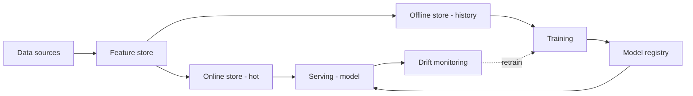
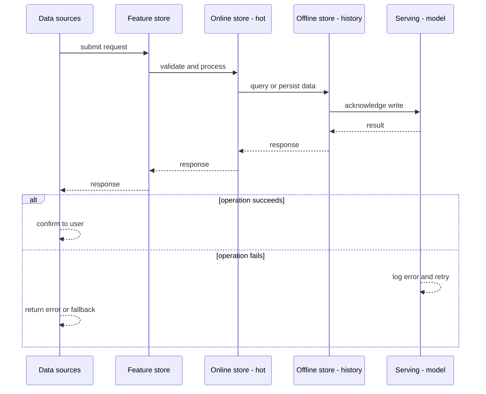
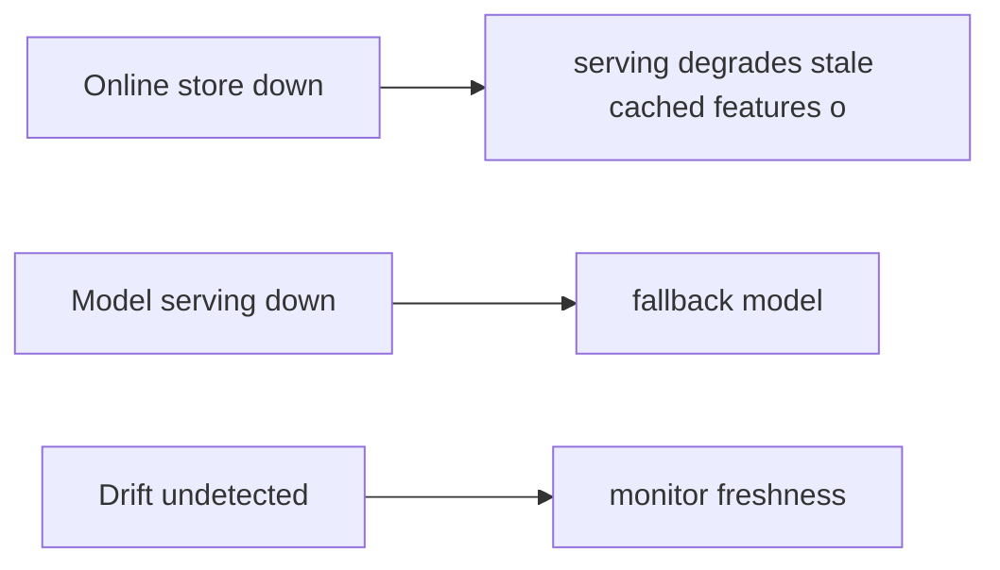
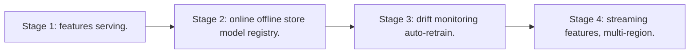

# Case Study: Feature Store / Model-Serving

> **Tier:** extreme · **Status:** complete · Original numbers and diagrams.

## 1. Problem statement
Provide consistent features for training and serving and serve models at low latency — the data backbone of an ML platform (expanded from the Level 10 chapter). This is a extreme-tier system design challenge because it must handle GPU-bound inference at scale while ensuring no single point of failure. The design must be production-grade: observable, debuggable, reversible, and able to survive component failures without data loss or cascading outages.

## 2. Scope
In (v1): offline + online feature store, model registry, low-latency serving, monitoring. Out: auto-retraining (stage).

For Feature Store / Model-Serving, these boundaries keep the first version focused on the core user value. Adding more features would dilute the design and delay shipping. Each excluded item is a scaling stage — a candidate for the next iteration once the baseline is proven.

## 3. Functional requirements
- Serve consistent features for training and online inference.
- Version models; serve at low latency.
- Monitor drift; trigger retrain.

For Feature Store / Model-Serving, these requirements drive specific architectural decisions: the read-write ratio determines the caching strategy, the durability target sets the replication mode, and the idempotency requirement shapes the API contract.

## 4. Non-functional requirements
- Online feature read p99 < 50 ms.
- Train/serve consistency (no skew).
- Availability 99.9%.

For Feature Store / Model-Serving, each non-functional target constrains a specific component: the latency SLO bounds the number of synchronous hops, the availability target forces redundancy across availability zones, and the cost ceiling limits the replication factor and storage tier.

## 5. Explicit assumptions
1. 100M entities, 1k features. [assumption] 2. Models retrained hourly. [assumption] 3. Serving 100k req/s. [constraint]

For Feature Store / Model-Serving, if these assumptions are off by an order of magnitude, the architecture must adapt: 10x traffic may require earlier sharding, a different read-write ratio changes the caching strategy, and a higher peak multiplier demands more headroom.

## 6. Traffic estimation
Online feature reads dominate serving; offline reads for training (batch).

To derive the request rate: divide the daily volume by 86,400 seconds to get the average rate, then multiply by 5-10x for peak. The read-to-write ratio determines whether the system is cache-dominated (read-heavy) or write-path-dominated (write-heavy). For Feature Store / Model-Serving, this ratio shapes the entire storage and replication strategy.

## 7. Storage estimation
Feature values (offline history + online hot); models (artifacts).

For Feature Store / Model-Serving, storage growth is projected from the daily write volume and retention policy. Index overhead and compression factors are accounted for in the total.

## 8. Bandwidth estimation
Feature fetch per inference; small but latency-critical.

Bandwidth is request rate multiplied by average payload size for ingress, and response rate multiplied by response size for egress. CDN and edge caching reduce origin egress. Compression reduces bandwidth by 50-80 percent where applicable. For Feature Store / Model-Serving, bandwidth may or may not be the binding constraint — compare it against compute and storage to find out.

## 9. API design
| Method | Path | Request | Response |
|--------|------|---------|----------|
| GET /features/:entity |
| features |
| POST |/predict | features/model | prediction |

## 10. Data model
features(entity, feature, value, ts) — online (hot) + offline (history); models(version, artifact, metrics).

For Feature Store / Model-Serving, the data model follows the access pattern. The primary lookup determines the partition key; secondary lookups determine indexes. Denormalization is used selectively on hot read paths.

## 11. High-level architecture

## 12. Request flow
Sources compute features into the store (online hot + offline history). Training reads offline; serving reads online (same definitions -> no skew). Models versioned, served; drift monitoring triggers retraining.

## 13. Component responsibilities
Feature store (online + offline), model registry, serving, drift monitoring, training.

For Feature Store / Model-Serving, each component has one job. The gateway authenticates and routes. Services are stateless and scale horizontally. The data tier is the stateful core that scales by sharding.

## 14. Database selection
Online: low-latency KV (hot features). Offline: columnar/lake for history. Model registry: artifact store. Rejected: separate training/serving feature code (skew).

For Feature Store / Model-Serving, the database was chosen by access pattern, not familiarity. The rejected alternatives were wrong for this workload, not bad in general.

## 15. Caching strategy
Hot entity features in memory; model in serving memory; common predictions cached.

For Feature Store / Model-Serving, the cache strategy matches the staleness tolerance. Cache-aside for most data, write-through where read-after-write matters, stampede protection on hot keys.

## 16. Partitioning strategy
Feature store by entity id; serving scaled by QPS; offline by feature/time.

For Feature Store / Model-Serving, the partition key balances query locality with even load distribution. Sharding strategy matters because a poor key creates hot spots under real traffic patterns.

## 17. Replication strategy
Online store replicated for availability; offline durable; models versioned + replicated.

For Feature Store / Model-Serving, replication mode is split: synchronous where durability is critical, asynchronous elsewhere for throughput. RF=3 tolerates one failure. Failover is tested regularly.

## 18. Consistency model
Online near-real-time; offline immutable history; train/serve use the same feature definitions (consistency by construction).

For Feature Store / Model-Serving, the consistency level is the weakest users accept. Read-your-writes is provided where needed. Eventual consistency is bounded and monitored, not unbounded and silent.

## 19. Failure scenarios
Online store down -> serving degrades (stale/cached features or refuse). Model serving down -> fallback model. Drift undetected -> monitor freshness.

## 20. Reliability strategy
SLI feature latency, model availability; SPO 99.9%. Fallback model. Chaos: kill online store, assert cached-feature fallback.

For Feature Store / Model-Serving, the SLO makes reliability measurable. The error budget balances feature velocity with stability. Chaos testing validates that resilience claims hold under real failures.

## 21. Security considerations
Per-entity isolation; PII in features redacted; model IP protection; audit predictions.

For Feature Store / Model-Serving, security layers TLS, encryption at rest, RBAC, PII redaction, and audit. The policy gateway is fail-closed for AI-augmented operations.

## 22. Observability strategy
Feature latency, train/serve consistency checks, drift metrics, model freshness, serving p99.

For Feature Store / Model-Serving, observability combines logs, metrics, and traces with correlation IDs. Golden signals drive the first dashboard. Alerts fire on burn rate, not raw thresholds.

## 23. Cost considerations
Online store (memory) + offline (lake) + serving. Right-size online to hot entities; compute features once.

For Feature Store / Model-Serving, cost is driven by the binding resource. Caching, tiering, batching, and right-sizing are the levers. Cost per request is tracked and alerted on.

## 24. Scaling stages
Stage 1: features + serving. -> Stage 2: online/offline store + model registry. -> Stage 3: drift monitoring + auto-retrain. -> Stage 4: streaming features, multi-region.

## 25. Trade-offs
Online (latency) vs offline (history) consistency — same definitions reconcile. Caching (cost) vs freshness. Retrain frequency (freshness) vs cost.

For Feature Store / Model-Serving, each trade-off lists what was chosen, what was rejected, and why. This makes the design defensible in review — every decision has documented reasoning.

## 26. Alternative designs
Recompute features per query (slow, skew). No versioning (silent drift). Single store for train+serve (wrong access patterns).

For Feature Store / Model-Serving, the alternatives are real architectures that work under different constraints. They were rejected for this workload's specific requirements, not because they are bad designs.

## 27. Interview discussion points
Clarify feature scale, latency, skew. Surface the dual store, consistency-by-definition, versioning, drift.

For Feature Store / Model-Serving in an interview: clarify scope first, surface the read-write ratio, design the hot path deeply, discuss failures, and offer an alternative. Weak candidates skip failure modes.

## 28. Original Mermaid diagrams
Standalone sources under `diagrams/case-studies/feature-store-model-serving/`: `context.mmd`, `request-sequence.mmd`, `failure-flow.mmd`, `scaling-evolution.mmd`. The diagrams are embedded in their respective sections: architecture in section 11, request flow in section 12, failure scenarios in section 19, and scaling stages in section 24.

## 29. Further reading
ML/feature stores: Level 10; model serving: LLM-inference case; streams: Level 10. Sources: `S-VECTORDB` `S-RAG`.

## 30. Practical exercises

1. Guarantee train/serve consistency. 2. Online at 100k req/s < 50 ms. 3. Drift-triggered retrain. 4. Feature backfill for a new model. 5. Streaming features with low lag.

---
Previous: Internet of Things platform · Next: LLM inference platform

