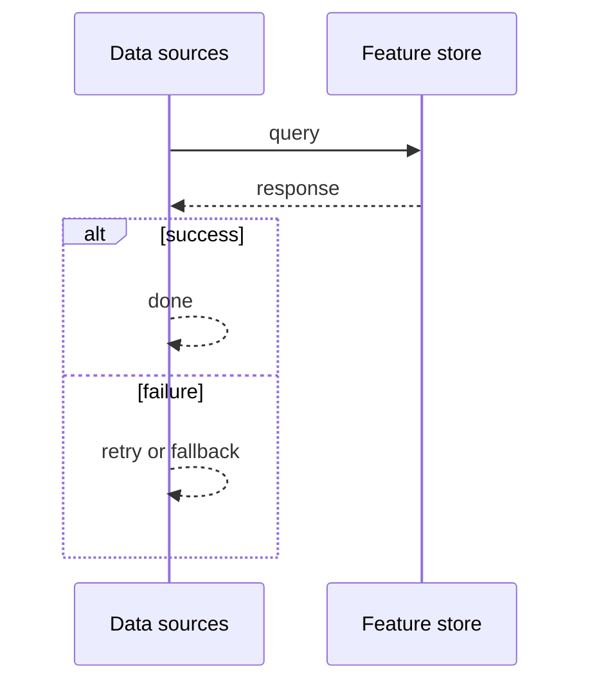
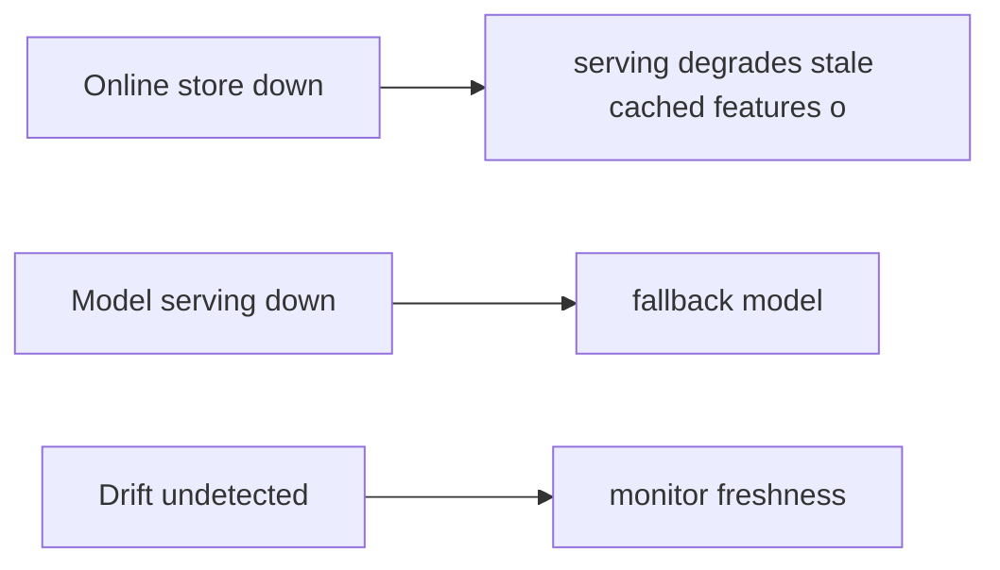

# Case Study: Feature Store / Model-Serving

> **Tier:** extreme · **Status:** complete · Original numbers and diagrams.

## 1. Problem statement

Provide consistent features for training and serving and serve models at low latency — the data backbone of an ML platform (expanded from the Level 10 chapter).


## 2. Scope

In (v1): offline + online feature store, model registry, low-latency serving, monitoring. Out: auto-retraining (stage).


## 3. Functional requirements

- Serve consistent features for training and online inference.
- Version models; serve at low latency.
- Monitor drift; trigger retrain.


## 4. Non-functional requirements

- Online feature read p99 < 50 ms.
- Train/serve consistency (no skew).
- Availability 99.9%.


## 5. Explicit assumptions

1. 100M entities, 1k features. [assumption] 2. Models retrained hourly. [assumption] 3. Serving 100k req/s. [constraint]


## 6. Traffic estimation

Online feature reads dominate serving; offline reads for training (batch).


## 7. Storage estimation

Feature values (offline history + online hot); models (artifacts).


## 8. Bandwidth estimation

Feature fetch per inference; small but latency-critical.


## 9. API design

| GET /features/:entity |
| features |
| POST |/predict | features/model | prediction |


## 10. Data model

features(entity, feature, value, ts) — online (hot) + offline (history); models(version, artifact, metrics).


## 11. High-level architecture

```mermaid
%% created-for: system-design-mastery
flowchart LR
  Sources[Data sources] --> FS[Feature store]
  FS --> Online[Online store (hot)]
  FS --> Offline[Offline store (history)]
  Online --> Serve[Serving (model)]
  Offline --> Train[Training]
  Train --> Reg[Model registry] --> Serve
  Serve --> Mon[Drift monitoring] -.retrain.-> Train
```


## 12. Request flow
Sources compute features into the store (online hot + offline history). Training reads offline; serving reads online (same definitions -> no skew). Models versioned, served; drift monitoring triggers retraining.




## 13. Component responsibilities

Feature store (online + offline), model registry, serving, drift monitoring, training.


## 14. Database selection

Online: low-latency KV (hot features). Offline: columnar/lake for history. Model registry: artifact store. Rejected: separate training/serving feature code (skew).


## 15. Caching strategy

Hot entity features in memory; model in serving memory; common predictions cached.


## 16. Partitioning strategy

Feature store by entity id; serving scaled by QPS; offline by feature/time.


## 17. Replication strategy

Online store replicated for availability; offline durable; models versioned + replicated.


## 18. Consistency model

Online near-real-time; offline immutable history; train/serve use the same feature definitions (consistency by construction).


## 19. Failure scenarios
Online store down -> serving degrades (stale/cached features or refuse). Model serving down -> fallback model. Drift undetected -> monitor freshness.




## 20. Reliability strategy

SLI feature latency, model availability; SPO 99.9%. Fallback model. Chaos: kill online store, assert cached-feature fallback.


## 21. Security considerations

Per-entity isolation; PII in features redacted; model IP protection; audit predictions.


## 22. Observability strategy

Feature latency, train/serve consistency checks, drift metrics, model freshness, serving p99.


## 23. Cost considerations

Online store (memory) + offline (lake) + serving. Right-size online to hot entities; compute features once.


## 24. Scaling stages

Stage 1: features + serving. -> Stage 2: online/offline store + model registry. -> Stage 3: drift monitoring + auto-retrain. -> Stage 4: streaming features, multi-region.


## 25. Trade-offs

Online (latency) vs offline (history) consistency — same definitions reconcile. Caching (cost) vs freshness. Retrain frequency (freshness) vs cost.


## 26. Alternative designs

Recompute features per query (slow, skew). No versioning (silent drift). Single store for train+serve (wrong access patterns).


## 27. Interview discussion points

Clarify feature scale, latency, skew. Surface the dual store, consistency-by-definition, versioning, drift.


## 28. Original Mermaid diagrams
Standalone sources under `diagrams/case-studies/feature-store-model-serving/`: `context.mmd`, `request-sequence.mmd`, `failure-flow.mmd`, `scaling-evolution.mmd`. The diagrams are embedded in their respective sections: architecture in section 11, request flow in section 12, failure scenarios in section 19, and scaling stages in section 24.

## 29. Further reading

ML/feature stores: Level 10; model serving: LLM-inference case; streams: Level 10.


## 30. Practical exercises

1. Guarantee train/serve consistency. 2. Online at 100k req/s < 50 ms. 3. Drift-triggered retrain. 4. Feature backfill for a new model. 5. Streaming features with low lag.


---
Previous: Internet of Things platform · Next: LLM inference platform

