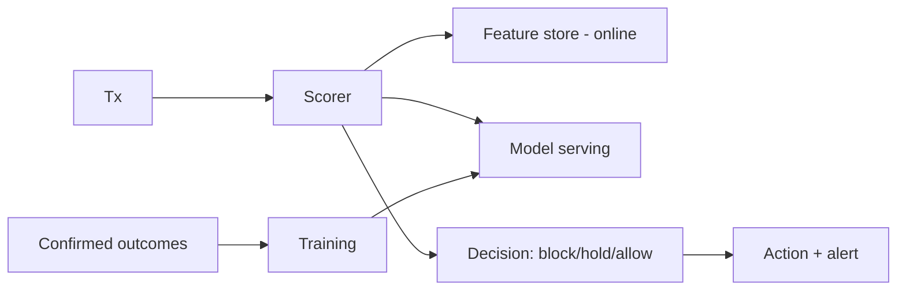
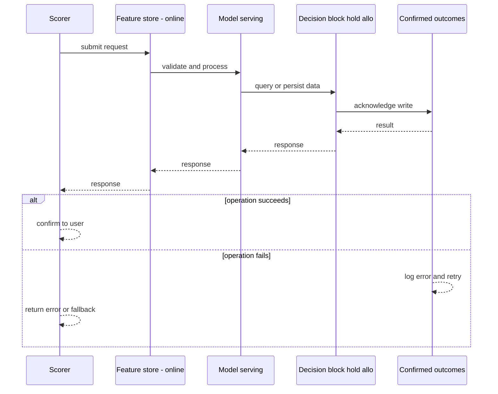
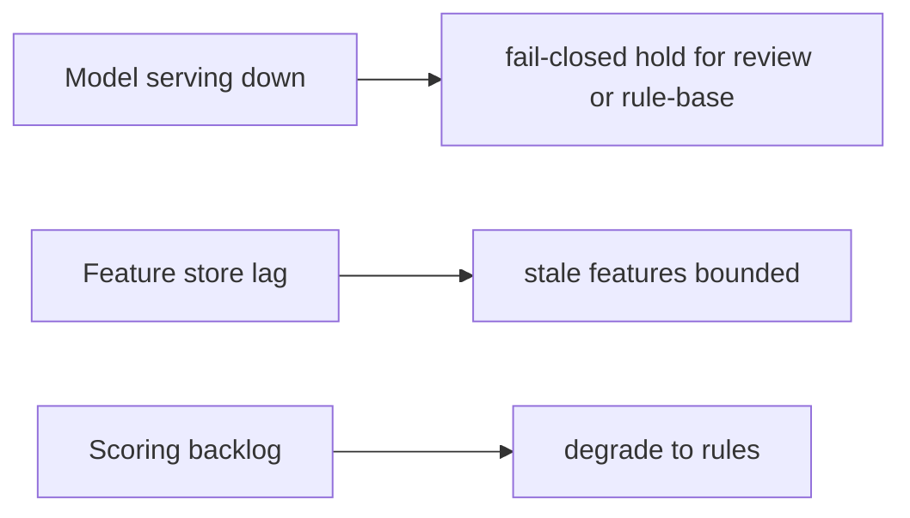
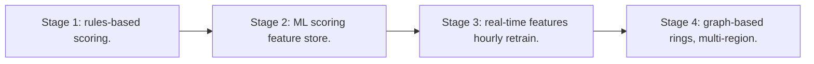

# Case Study: Fraud-Detection System

> **Tier:** extreme · **Status:** complete · Original numbers and diagrams.

## 1. Problem statement
Score every transaction in real time for fraud, block/alert high-risk ones, and learn from outcomes — a low-latency stream + ML pipeline with strict false-positive cost. This is a extreme-tier system design challenge because it must handle high availability under peak load while ensuring no single point of failure. The design must be production-grade: observable, debuggable, reversible, and able to survive component failures without data loss or cascading outages.

## 2. Scope
In (v1): real-time scoring, block/hold/review decisions, feedback loop, model retraining. Out: graph-based rings (stage).

For Fraud-Detection System, these boundaries keep the first version focused on the core user value. Adding more features would dilute the design and delay shipping. Each excluded item is a scaling stage — a candidate for the next iteration once the baseline is proven.

## 3. Functional requirements
- Score each event in real time.
- Decide block/hold/allow.
- Learn from confirmed outcomes.
- Retrain models.

For Fraud-Detection System, these requirements drive specific architectural decisions: the read-write ratio determines the caching strategy, the durability target sets the replication mode, and the idempotency requirement shapes the API contract.

## 4. Non-functional requirements
- Decision latency < 200 ms (must precede settlement).
- Low false-positive rate (blocking good tx is costly).
- Availability 99.95%.

For Fraud-Detection System, each non-functional target constrains a specific component: the latency SLO bounds the number of synchronous hops, the availability target forces redundancy across availability zones, and the cost ceiling limits the replication factor and storage tier.

## 5. Explicit assumptions
1. 1M tx/s peak. [assumption] 2. Features from recent history + entity graph. [assumption] 3. Models retrained hourly. [constraint]

For Fraud-Detection System, if these assumptions are off by an order of magnitude, the architecture must adapt: 10x traffic may require earlier sharding, a different read-write ratio changes the caching strategy, and a higher peak multiplier demands more headroom.

## 6. Traffic estimation
1M tx/s scoring; the decision must return before the transaction proceeds.

To derive the request rate: divide the daily volume by 86,400 seconds to get the average rate, then multiply by 5-10x for peak. The read-to-write ratio determines whether the system is cache-dominated (read-heavy) or write-path-dominated (write-heavy). For Fraud-Detection System, this ratio shapes the entire storage and replication strategy.

## 7. Storage estimation
Entity features + interaction history + model artifacts. Features hot; history for training.

For Fraud-Detection System, storage growth is projected from the daily write volume and retention policy. Index overhead and compression factors are accounted for in the total.

## 8. Bandwidth estimation
Feature fetch per tx; small but latency-critical.

Bandwidth is request rate multiplied by average payload size for ingress, and response rate multiplied by response size for egress. CDN and edge caching reduce origin egress. Compression reduces bandwidth by 50-80 percent where applicable. For Fraud-Detection System, bandwidth may or may not be the binding constraint — compare it against compute and storage to find out.

## 9. API design
| Method | Path | Request | Response |
|--------|------|---------|----------|
| POST /score | event | score + decision |

## 10. Data model
entities(id, features, recent history); events(id, entity, ts, features, score, outcome); models(version).

For Fraud-Detection System, the data model follows the access pattern. The primary lookup determines the partition key; secondary lookups determine indexes. Denormalization is used selectively on hot read paths.

## 11. High-level architecture

## 12. Request flow
Event -> scorer fetches entity features -> model scores -> decision (block/hold/allow) -> action; confirmed outcomes flow back to retrain.

## 13. Component responsibilities
Scorer, feature store (online), model serving, decision engine, feedback loop, training.

For Fraud-Detection System, each component has one job. The gateway authenticates and routes. Services are stateless and scale horizontally. The data tier is the stateful core that scales by sharding.

## 14. Database selection
Online feature store (low-latency); event store (stream) for outcomes; model registry. Rejected: per-call cold feature compute (too slow).

For Fraud-Detection System, the database was chosen by access pattern, not familiarity. The rejected alternatives were wrong for this workload, not bad in general.

## 15. Caching strategy
Hot entity features in memory; recent history cache; model in serving memory.

For Fraud-Detection System, the cache strategy matches the staleness tolerance. Cache-aside for most data, write-through where read-after-write matters, stampede protection on hot keys.

## 16. Partitioning strategy
Feature store by entity id; scorer scaled by tx rate; events partitioned by entity for history locality.

For Fraud-Detection System, the partition key balances query locality with even load distribution. Sharding strategy matters because a poor key creates hot spots under real traffic patterns.

## 17. Replication strategy
Features + models replicated for availability; events retained (stream) for retraining; idempotent scoring.

For Fraud-Detection System, replication mode is split: synchronous where durability is critical, asynchronous elsewhere for throughput. RF=3 tolerates one failure. Failover is tested regularly.

## 18. Consistency model
Features near-real-time; a decision uses the latest available features. Outcomes feed the next training cycle (eventual).

For Fraud-Detection System, the consistency level is the weakest users accept. Read-your-writes is provided where needed. Eventual consistency is bounded and monitored, not unbounded and silent.

## 19. Failure scenarios
Model serving down -> fail-closed (hold for review) or rule-based fallback (never silently allow). Feature store lag -> stale features (bounded). Scoring backlog -> degrade to rules.

## 20. Reliability strategy
SLI decision latency, model availability; SLO 99.95%. Fallback to rules on model failure. Chaos: kill model serving, assert rule-based fallback (not silent allow).

For Fraud-Detection System, the SLO makes reliability measurable. The error budget balances feature velocity with stability. Chaos testing validates that resilience claims hold under real failures.

## 21. Security considerations
PII handling; model IP protection; audit decisions; explainability for regulators.

For Fraud-Detection System, security layers TLS, encryption at rest, RBAC, PII redaction, and audit. The policy gateway is fail-closed for AI-augmented operations.

## 22. Observability strategy
Decision latency, block/hold/allow rates, false-positive feedback, model freshness, feature staleness, fallback rate.

For Fraud-Detection System, observability combines logs, metrics, and traces with correlation IDs. Golden signals drive the first dashboard. Alerts fire on burn rate, not raw thresholds.

## 23. Cost considerations
Online feature store (memory) + model serving + training. Feature precomputation cuts scoring cost.

For Fraud-Detection System, cost is driven by the binding resource. Caching, tiering, batching, and right-sizing are the levers. Cost per request is tracked and alerted on.

## 24. Scaling stages
Stage 1: rules-based scoring. -> Stage 2: ML scoring + feature store. -> Stage 3: real-time features + hourly retrain. -> Stage 4: graph-based rings, multi-region.

## 25. Trade-offs
Latency (must precede settlement) vs model complexity. False-positive (customer harm) vs false-negative (fraud loss). Fail-closed (safe) vs fail-open (friction).

For Fraud-Detection System, each trade-off lists what was chosen, what was rejected, and why. This makes the design defensible in review — every decision has documented reasoning.

## 26. Alternative designs
Batch scoring (too late — fraud already settled). Always-allow (fraud loss). Always-block (all customers blocked).

For Fraud-Detection System, the alternatives are real architectures that work under different constraints. They were rejected for this workload's specific requirements, not because they are bad designs.

## 27. Interview discussion points
Clarify latency vs settlement, false-positive cost. Surface real-time scoring, feature store, feedback loop, safe fallback.

For Fraud-Detection System in an interview: clarify scope first, surface the read-write ratio, design the hot path deeply, discuss failures, and offer an alternative. Weak candidates skip failure modes.

## 28. Original Mermaid diagrams
Standalone sources under `diagrams/case-studies/fraud-detection/`: `context.mmd`, `request-sequence.mmd`, `failure-flow.mmd`, `scaling-evolution.mmd`. The diagrams are embedded in their respective sections: architecture in section 11, request flow in section 12, failure scenarios in section 19, and scaling stages in section 24.

## 29. Further reading
Streams: Level 10; ML/feature stores: Level 10; delivery: Level 4. Sources: `S-CHASH` `S-DYNAMO`.

## 30. Practical exercises

1. Fail-closed fallback design. 2. Feature freshness vs latency. 3. Retrain without blocking scoring. 4. Graph-based ring detection (stage 4). 5. Explain a blocked transaction to a regulator.

---
Previous: Stock-trading platform · Next: Advertisement platform

