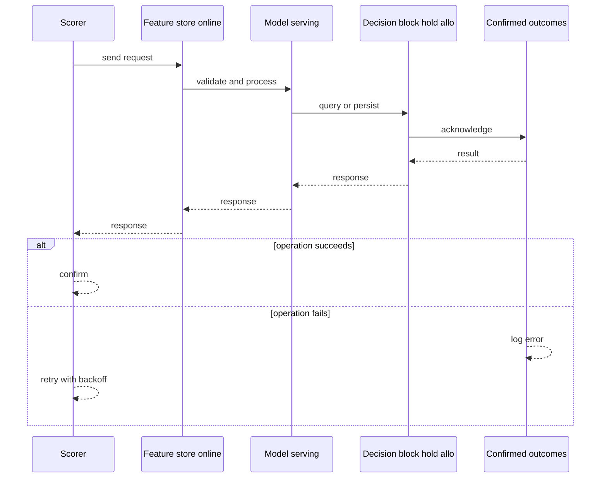
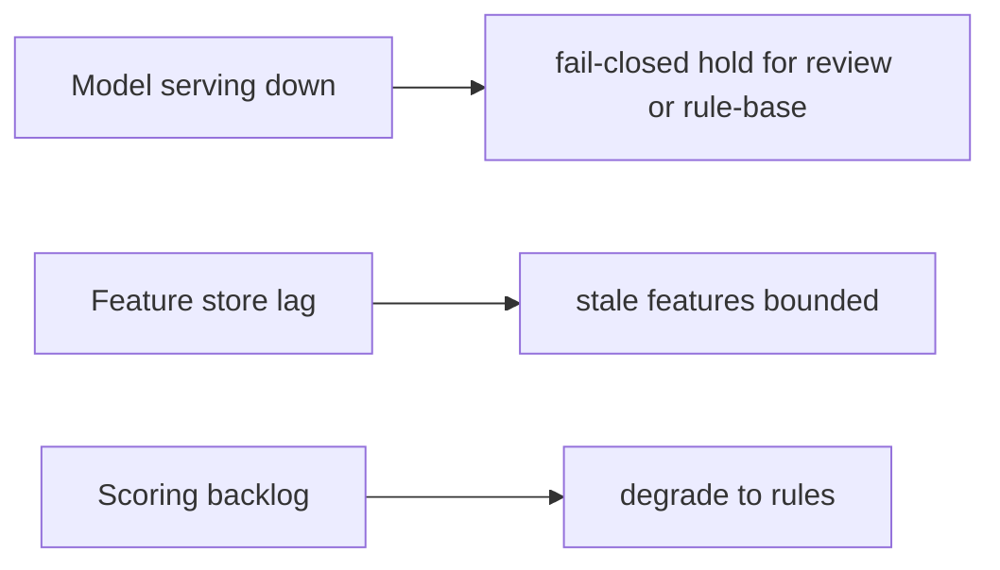
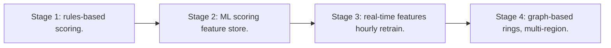

# Case Study: Fraud-Detection System

> **Tier:** extreme · **Status:** complete · Original numbers and diagrams.

## 1. Problem statement

Score every transaction in real time for fraud, block/alert high-risk ones, and learn from outcomes — a low-latency stream + ML pipeline with strict false-positive cost.

## 2. Scope

In (v1): real-time scoring, block/hold/review decisions, feedback loop, model retraining. Out: graph-based rings (stage).

## 3. Functional requirements

- Score each event in real time.
- Decide block/hold/allow.
- Learn from confirmed outcomes.
- Retrain models.

## 4. Non-functional requirements

- Decision latency < 200 ms (must precede settlement).
- Low false-positive rate (blocking good tx is costly).
- Availability 99.95%.

## 5. Explicit assumptions

1. 1M tx/s peak. [assumption] 2. Features from recent history + entity graph. [assumption] 3. Models retrained hourly. [constraint]

## 6. Traffic estimation
1M tx/s scoring; the decision must return before the transaction proceeds.

## 7. Storage estimation

Entity features + interaction history + model artifacts. Features hot; history for training.

## 8. Bandwidth estimation
Feature fetch per tx; small but latency-critical.

## 9. API design
| Method | Path | Request | Response |
|--------|------|---------|----------|
| POST /score | event | score + decision |

## 10. Data model

entities(id, features, recent history); events(id, entity, ts, features, score, outcome); models(version).

## 11. High-level architecture

```mermaid
%% created-for: system-design-mastery
flowchart LR
  Tx --> Score[Scorer]
  Score --> Feat[Feature store (online)]
  Score --> Model[Model serving]
  Score --> Dec[Decision: block/hold/allow]
  Outcomes[Confirmed outcomes] --> Train[Training] --> Model
  Dec --> Action[Action + alert]
```

## 12. Request flow
Event -> scorer fetches entity features -> model scores -> decision (block/hold/allow) -> action; confirmed outcomes flow back to retrain.



## 13. Component responsibilities

Scorer, feature store (online), model serving, decision engine, feedback loop, training.

## 14. Database selection

Online feature store (low-latency); event store (stream) for outcomes; model registry. Rejected: per-call cold feature compute (too slow).

## 15. Caching strategy

Hot entity features in memory; recent history cache; model in serving memory.

## 16. Partitioning strategy

Feature store by entity id; scorer scaled by tx rate; events partitioned by entity for history locality.

## 17. Replication strategy

Features + models replicated for availability; events retained (stream) for retraining; idempotent scoring.

## 18. Consistency model

Features near-real-time; a decision uses the latest available features. Outcomes feed the next training cycle (eventual).

## 19. Failure scenarios
Model serving down -> fail-closed (hold for review) or rule-based fallback (never silently allow). Feature store lag -> stale features (bounded). Scoring backlog -> degrade to rules.



## 20. Reliability strategy

SLI decision latency, model availability; SLO 99.95%. Fallback to rules on model failure. Chaos: kill model serving, assert rule-based fallback (not silent allow).

## 21. Security considerations

PII handling; model IP protection; audit decisions; explainability for regulators.

## 22. Observability strategy

Decision latency, block/hold/allow rates, false-positive feedback, model freshness, feature staleness, fallback rate.

## 23. Cost considerations

Online feature store (memory) + model serving + training. Feature precomputation cuts scoring cost.

## 24. Scaling stages
Stage 1: rules-based scoring. -> Stage 2: ML scoring + feature store. -> Stage 3: real-time features + hourly retrain. -> Stage 4: graph-based rings, multi-region.



## 25. Trade-offs

Latency (must precede settlement) vs model complexity. False-positive (customer harm) vs false-negative (fraud loss). Fail-closed (safe) vs fail-open (friction).

## 26. Alternative designs

Batch scoring (too late — fraud already settled). Always-allow (fraud loss). Always-block (all customers blocked).

## 27. Interview discussion points

Clarify latency vs settlement, false-positive cost. Surface real-time scoring, feature store, feedback loop, safe fallback.

## 28. Original Mermaid diagrams
Standalone sources under `diagrams/case-studies/fraud-detection/`: `context.mmd`, `request-sequence.mmd`, `failure-flow.mmd`, `scaling-evolution.mmd`. The diagrams are embedded in their respective sections: architecture in section 11, request flow in section 12, failure scenarios in section 19, and scaling stages in section 24.

## 29. Further reading
Streams: Level 10; ML/feature stores: Level 10; delivery: Level 4. Sources: `S-CHASH` `S-DYNAMO`.

## 30. Practical exercises

1. Fail-closed fallback design. 2. Feature freshness vs latency. 3. Retrain without blocking scoring. 4. Graph-based ring detection (stage 4). 5. Explain a blocked transaction to a regulator.

---
Previous: Stock-trading platform · Next: Advertisement platform

