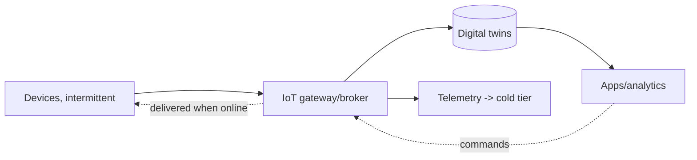
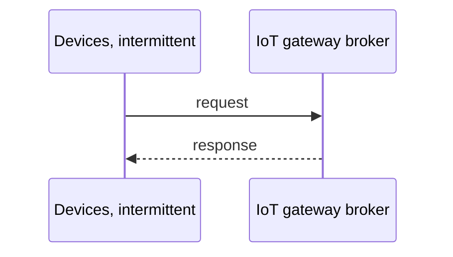
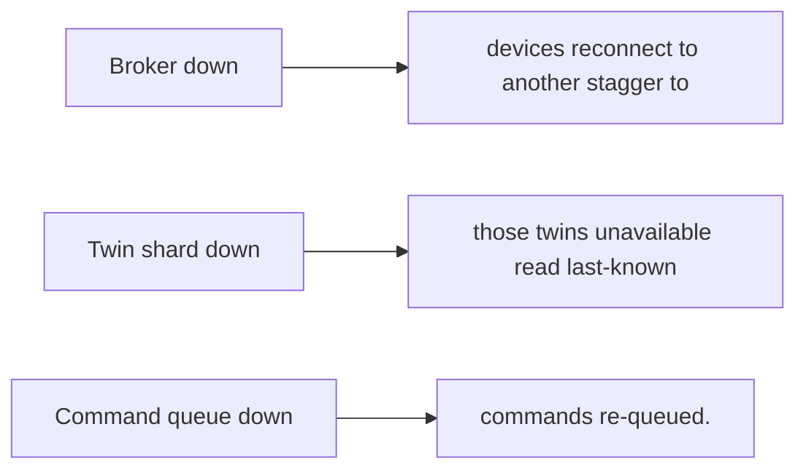
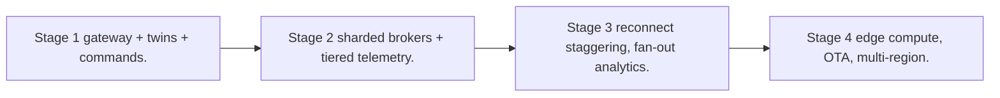

# Case Study: Internet of Things Platform

> **Tier:** extreme · **Status:** beta · Original numbers and diagrams.

## 11. High-level architecture

## 28. Original Mermaid diagrams

Standalone sources under `diagrams/case-studies/iot-platform/`: `context.mmd`, `request-sequence.mmd`, `failure-flow.mmd`, `scaling-evolution.mmd`. Additional diagrams for this case study:

## 1. Problem statement

Ingest telemetry from billions of intermittently-connected devices, maintain per-device digital twins, and support bidirectional commands at fleet scale.

## 2. Scope

In (v1): device ingest (intermittent), digital-twin state, command delivery, fan-out analytics. Out: edge compute, OTA (stage).

## 3. Functional requirements

- Ingest telemetry from devices (intermittent). - Maintain a digital twin per device. - Deliver commands with acknowledged delivery. - Fan-out analytics.

## 4. Non-functional requirements

- Handle billions of devices, intermittent connectivity. - Twin update near-real-time. - Command delivery when device reconnects.

## 5. Explicit assumptions

1. 1B devices, ~1 telemetry/min when online. [assumption] 2. ~30 percent online at once. [assumption] 3. Commands queued for offline devices. [constraint]

## 6. Traffic estimation

Reconnect storms; per-device small messages at massive fleet scale.

## 7. Storage estimation

Per-device twin state + telemetry history; PB over time, tiered cold.

## 8. Bandwidth estimation

Telemetry ingress large in aggregate; commands small.

## 9. API design

device MQTT/HTTP for telemetry + commands; app API to query twins / send commands.

## 10. Data model

devices(id, twin state, last_seen); telemetry(device, ts, metrics); commands(device, queued commands).

## 12. Request flow

Devices connect (when online), push telemetry -> gateway updates the twin + stores telemetry -> apps query twins / send commands -> commands queued and delivered on reconnect; telemetry tiered cold.

## 13. Component responsibilities

Device gateway/broker, twin store, telemetry store, command queue, fan-out analytics.

## 14. Database selection

Twin store: per-device KV (fast); telemetry: time-series/object tiered; command queue per device. Rejected: per-device connections in a single broker (can't scale).

## 15. Caching strategy

Hot twins cached; recent telemetry cached; gateway coalesces messages.

## 16. Partitioning strategy

Twin store sharded by device id; brokers sharded by device for connection affinity; telemetry by (device, time).

## 17. Replication strategy

Twins replicated (availability); telemetry durable (object/tiered); commands durable until acked.

## 18. Consistency model

Twin eventually consistent with telemetry (lag seconds). Commands delivered at-least-once; idempotent device actions.

## 19. Failure scenarios

Broker down -> devices reconnect to another (stagger to avoid storm). Twin shard down -> those twins unavailable (read last-known). Command queue down -> commands re-queued.

## 20. Reliability strategy

SLI twin freshness, command delivery; SPO 99.9%. Staggered reconnect. Chaos: kill a broker, assert reconnect without a storm.

## 21. Security considerations

Device identity/cert (mTLS); per-device auth; telemetry PII; command authorization; OTA integrity.

## 22. Observability strategy

Connected devices, telemetry rate, twin freshness, command delivery latency, reconnect rate, backlog.

## 23. Cost considerations

Telemetry storage (PB) + brokers (connections). Tier cold; coalesce messages; size brokers to connections.

## 24. Scaling stages

Stage 1: gateway + twins + commands. -> Stage 2: sharded brokers + tiered telemetry. -> Stage 3: reconnect staggering, fan-out analytics. -> Stage 4: edge compute, OTA, multi-region.

## 25. Trade-offs

Intermittent design (queue commands) vs low-latency assumption. Twin freshness vs cost. Sharded brokers (connection scale) vs failover complexity.

## 26. Alternative designs

Assume always-on devices (wrong). Single broker (can't scale). Sync commands (fail on offline).

## 27. Interview discussion points

Clarify device count, online percent, command latency, retention. Surface intermittent design, twins, reconnect storms.

## 29. Further reading

IoT/edge: Level 10; time-series: Level 3; reconnect/thundering-herd: Level 6.

## 30. Practical exercises

1. Stagger a reconnect storm. 2. Command delivery to offline devices. 3. Twin at 1B devices. 4. Telemetry tiering cost. 5. OTA rollout at fleet scale.

---
Previous: RAG platform · Next: Feature store / model-serving
