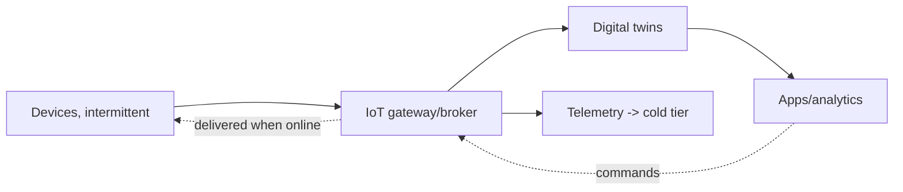
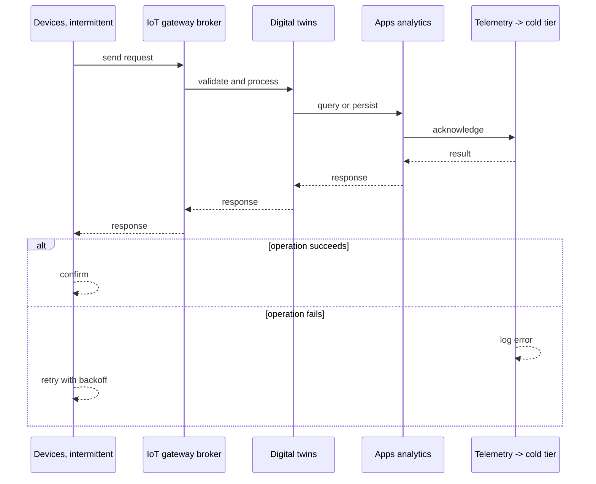
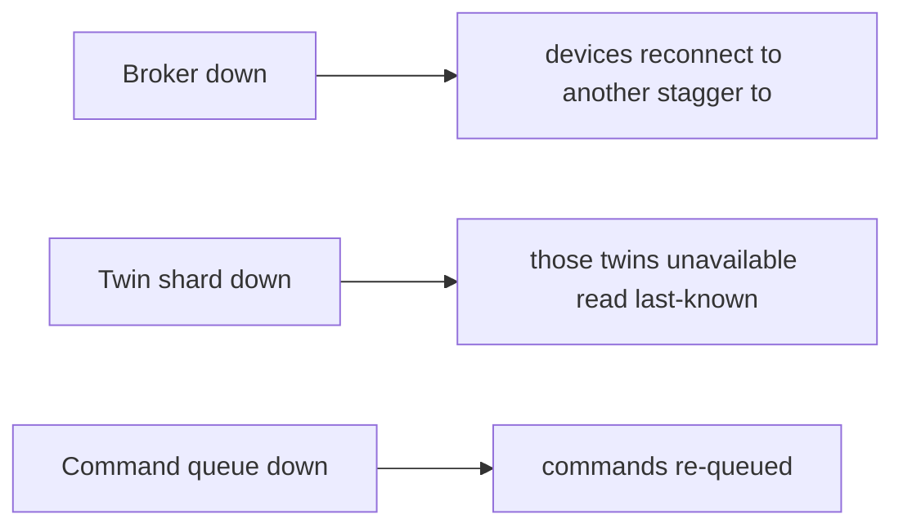
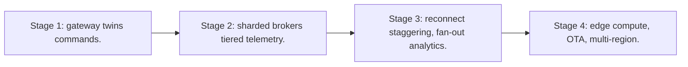

# Case Study: Internet of Things Platform

> **Tier:** extreme · **Status:** complete · Original numbers and diagrams.

## 1. Problem statement
Ingest telemetry from billions of intermittently-connected devices, maintain per-device digital twins, and support bidirectional commands at fleet scale. This is a extreme-tier system design challenge because it must handle high availability under peak load while ensuring no single point of failure. The design must be production-grade: observable, debuggable, reversible, and able to survive component failures without data loss or cascading outages.

## 2. Scope
In (v1): device ingest (intermittent), digital-twin state, command delivery, fan-out analytics. Out: edge compute, OTA (stage).

For Internet of Things Platform, these boundaries keep the first version focused on the core user value. Adding more features would dilute the design and delay shipping. Each excluded item is a scaling stage — a candidate for the next iteration once the baseline is proven.

## 3. Functional requirements
- Ingest telemetry from devices (intermittent).
- Maintain a digital twin per device.
- Deliver commands with acknowledged delivery.
- Fan-out analytics.

For Internet of Things Platform, these requirements drive specific architectural decisions: the read-write ratio determines the caching strategy, the durability target sets the replication mode, and the idempotency requirement shapes the API contract.

## 4. Non-functional requirements
- Handle billions of devices, intermittent connectivity.
- Twin update near-real-time.
- Command delivery when device reconnects.

For Internet of Things Platform, each non-functional target constrains a specific component: the latency SLO bounds the number of synchronous hops, the availability target forces redundancy across availability zones, and the cost ceiling limits the replication factor and storage tier.

## 5. Explicit assumptions
1. 1B devices, ~1 telemetry/min when online. [assumption] 2. ~30 percent online at once. [assumption] 3. Commands queued for offline devices. [constraint]

For Internet of Things Platform, if these assumptions are off by an order of magnitude, the architecture must adapt: 10x traffic may require earlier sharding, a different read-write ratio changes the caching strategy, and a higher peak multiplier demands more headroom.

## 6. Traffic estimation
Reconnect storms; per-device small messages at massive fleet scale.

To derive the request rate: divide the daily volume by 86,400 seconds to get the average rate, then multiply by 5-10x for peak. The read-to-write ratio determines whether the system is cache-dominated (read-heavy) or write-path-dominated (write-heavy). For Internet of Things Platform, this ratio shapes the entire storage and replication strategy.

## 7. Storage estimation
Per-device twin state + telemetry history; PB over time, tiered cold.

For Internet of Things Platform, storage growth is projected from the daily write volume and retention policy. Index overhead and compression factors are accounted for in the total.

## 8. Bandwidth estimation
Telemetry ingress large in aggregate; commands small.

Bandwidth is request rate multiplied by average payload size for ingress, and response rate multiplied by response size for egress. CDN and edge caching reduce origin egress. Compression reduces bandwidth by 50-80 percent where applicable. For Internet of Things Platform, bandwidth may or may not be the binding constraint — compare it against compute and storage to find out.

## 9. API design

device MQTT/HTTP for telemetry + commands; app API to query twins / send commands.

## 10. Data model
devices(id, twin state, last_seen); telemetry(device, ts, metrics); commands(device, queued commands).

For Internet of Things Platform, the data model follows the access pattern. The primary lookup determines the partition key; secondary lookups determine indexes. Denormalization is used selectively on hot read paths.

## 11. High-level architecture

## 12. Request flow
Devices connect (when online), push telemetry -> gateway updates the twin + stores telemetry -> apps query twins / send commands -> commands queued and delivered on reconnect; telemetry tiered cold.

## 13. Component responsibilities
Device gateway/broker, twin store, telemetry store, command queue, fan-out analytics.

For Internet of Things Platform, each component has one job. The gateway authenticates and routes. Services are stateless and scale horizontally. The data tier is the stateful core that scales by sharding.

## 14. Database selection
Twin store: per-device KV (fast); telemetry: time-series/object tiered; command queue per device. Rejected: per-device connections in a single broker (can't scale).

For Internet of Things Platform, the database was chosen by access pattern, not familiarity. The rejected alternatives were wrong for this workload, not bad in general.

## 15. Caching strategy
Hot twins cached; recent telemetry cached; gateway coalesces messages.

For Internet of Things Platform, the cache strategy matches the staleness tolerance. Cache-aside for most data, write-through where read-after-write matters, stampede protection on hot keys.

## 16. Partitioning strategy
Twin store sharded by device id; brokers sharded by device for connection affinity; telemetry by (device, time).

For Internet of Things Platform, the partition key balances query locality with even load distribution. Sharding strategy matters because a poor key creates hot spots under real traffic patterns.

## 17. Replication strategy
Twins replicated (availability); telemetry durable (object/tiered); commands durable until acked.

For Internet of Things Platform, replication mode is split: synchronous where durability is critical, asynchronous elsewhere for throughput. RF=3 tolerates one failure. Failover is tested regularly.

## 18. Consistency model
Twin eventually consistent with telemetry (lag seconds). Commands delivered at-least-once; idempotent device actions.

For Internet of Things Platform, the consistency level is the weakest users accept. Read-your-writes is provided where needed. Eventual consistency is bounded and monitored, not unbounded and silent.

## 19. Failure scenarios
Broker down -> devices reconnect to another (stagger to avoid storm). Twin shard down -> those twins unavailable (read last-known). Command queue down -> commands re-queued.

## 20. Reliability strategy
SLI twin freshness, command delivery; SPO 99.9%. Staggered reconnect. Chaos: kill a broker, assert reconnect without a storm.

For Internet of Things Platform, the SLO makes reliability measurable. The error budget balances feature velocity with stability. Chaos testing validates that resilience claims hold under real failures.

## 21. Security considerations
Device identity/cert (mTLS); per-device auth; telemetry PII; command authorization; OTA integrity.

For Internet of Things Platform, security layers TLS, encryption at rest, RBAC, PII redaction, and audit. The policy gateway is fail-closed for AI-augmented operations.

## 22. Observability strategy
Connected devices, telemetry rate, twin freshness, command delivery latency, reconnect rate, backlog.

For Internet of Things Platform, observability combines logs, metrics, and traces with correlation IDs. Golden signals drive the first dashboard. Alerts fire on burn rate, not raw thresholds.

## 23. Cost considerations
Telemetry storage (PB) + brokers (connections). Tier cold; coalesce messages; size brokers to connections.

For Internet of Things Platform, cost is driven by the binding resource. Caching, tiering, batching, and right-sizing are the levers. Cost per request is tracked and alerted on.

## 24. Scaling stages
Stage 1: gateway + twins + commands. -> Stage 2: sharded brokers + tiered telemetry. -> Stage 3: reconnect staggering, fan-out analytics. -> Stage 4: edge compute, OTA, multi-region.

## 25. Trade-offs
Intermittent design (queue commands) vs low-latency assumption. Twin freshness vs cost. Sharded brokers (connection scale) vs failover complexity.

For Internet of Things Platform, each trade-off lists what was chosen, what was rejected, and why. This makes the design defensible in review — every decision has documented reasoning.

## 26. Alternative designs
Assume always-on devices (wrong). Single broker (can't scale). Sync commands (fail on offline).

For Internet of Things Platform, the alternatives are real architectures that work under different constraints. They were rejected for this workload's specific requirements, not because they are bad designs.

## 27. Interview discussion points
Clarify device count, online percent, command latency, retention. Surface intermittent design, twins, reconnect storms.

For Internet of Things Platform in an interview: clarify scope first, surface the read-write ratio, design the hot path deeply, discuss failures, and offer an alternative. Weak candidates skip failure modes.

## 28. Original Mermaid diagrams
Standalone sources under `diagrams/case-studies/iot-platform/`: `context.mmd`, `request-sequence.mmd`, `failure-flow.mmd`, `scaling-evolution.mmd`. The diagrams are embedded in their respective sections: architecture in section 11, request flow in section 12, failure scenarios in section 19, and scaling stages in section 24.

## 29. Further reading
IoT/edge: Level 10; time-series: Level 3; reconnect/thundering-herd: Level 6. Sources: `S-CHASH` `S-DYNAMO`.

## 30. Practical exercises

1. Stagger a reconnect storm. 2. Command delivery to offline devices. 3. Twin at 1B devices. 4. Telemetry tiering cost. 5. OTA rollout at fleet scale.

---
Previous: RAG platform · Next: Feature store / model-serving

