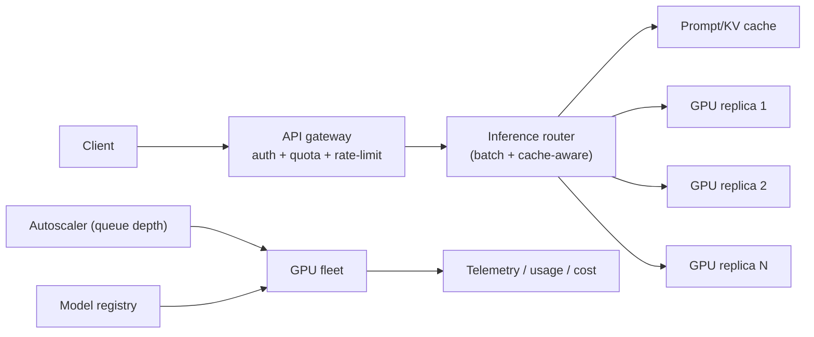
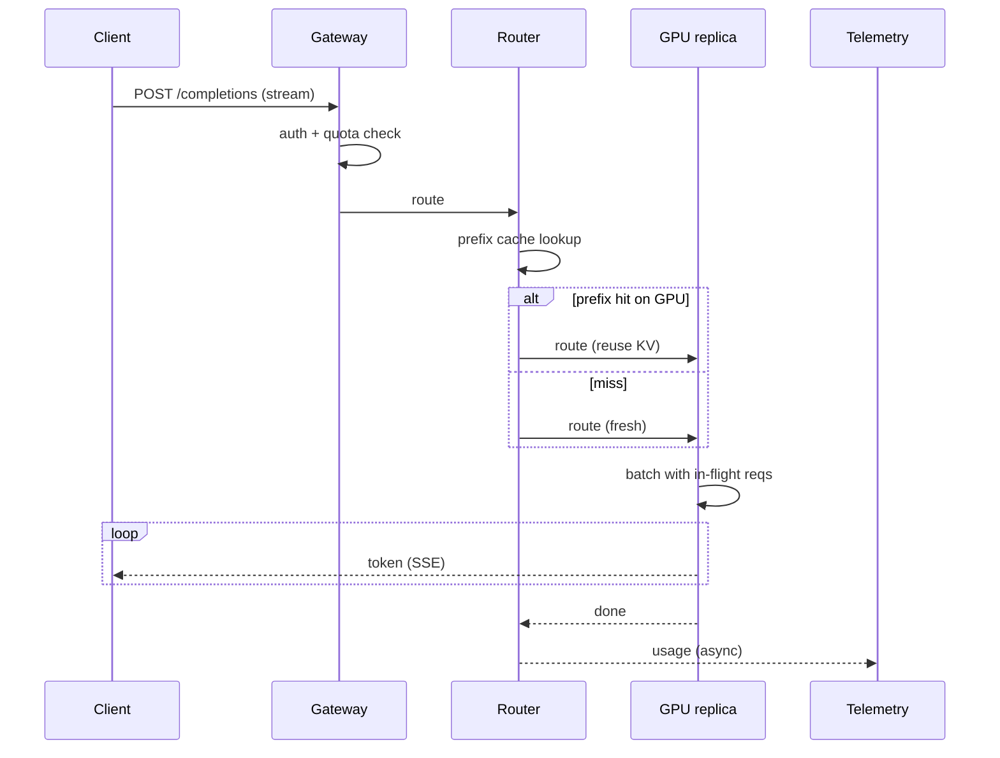
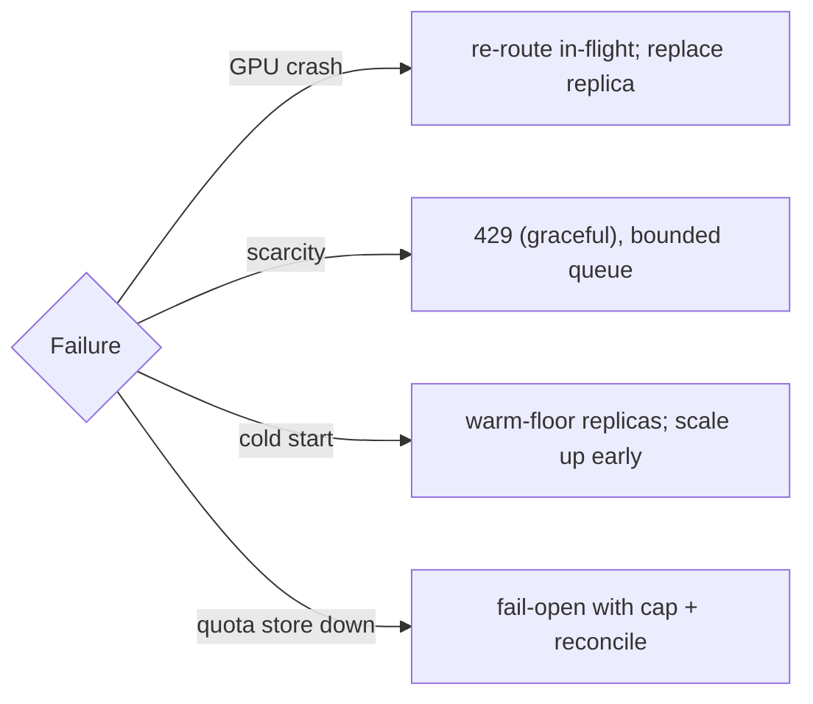
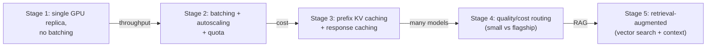

# Case Study: Large-Language-Model Inference Platform

> **Tier:** extreme · **Status:** complete
> A complete extreme case study demonstrating the 30-section template for a GPU-bound,
> latency- and cost-sensitive serving system at extreme scale. All numbers and diagrams are
> original.

## 1. Problem statement
We serve a large language model (LLM) behind an API for many internal and external
applications. Requests are bursty, latency-sensitive (token-streaming), and expensive (GPU
bound). We must maximize GPU utilization, keep per-token latency low, autoscale to demand,
> and control cost — the central economic challenge of LLM serving.

## 2. Scope
**In (v1):** a single flagship model served via a streaming completion API; batching;
autoscaling; usage quotas; basic prompt caching.
**Out (v1):** multi-model routing by quality/cost, fine-tuning hosting, RAG orchestration
(these are referenced as scaling stages; RAG retrieval is in the vector-search case study's
domain).

## 3. Functional requirements
- The platform **shall** accept a prompt and stream generated tokens back.
- The platform **shall** batch concurrent requests to maximize GPU throughput.
- The platform **shall** autoscale GPU replicas with demand and scale to a floor (not zero,
  to bound cold start).
- The platform **shall** enforce per-tenant quotas and return 429 when exceeded.
- The platform **shall** cache repeated prompts/contexts where safe.

## 4. Non-functional requirements
- First-token latency < 1 s p95; inter-token latency < 50 ms p95.
- Availability 99.9% for the API; best-effort during GPU scarcity (graceful 429, not 5xx).
- Cost is the binding constraint: GPU-seconds dominate; utilization must stay high.
- Throughput: tokens/sec/GPU maximized via batching; cluster serves millions of
  tokens/sec.

## 5. Explicit assumptions
1. Flagship model ~ 70B params; one inference replica = one GPU serving it. [constraint]
2. Batching up to ~32 concurrent requests per GPU before latency suffers. [assumption]
3. Demand: 200 requests/s avg, 2,000/s peak; average 800 output tokens/request. [assumption]
4. GPU can produce ~6,000 tokens/s aggregated (batched). [assumption]
5. Cold start of a replica ~60–120 s (model load). [constraint]

## 6. Traffic estimation
- 200 req/s avg × 800 tokens = 160k tokens/s; peak 1.6M tokens/s.
- Per GPU ~6,000 tokens/s → ~27 GPUs avg, ~270 GPUs peak. (These are illustrative.)
- Read-only inference; no writes except telemetry/quota. Request path is GPU-bound.

## 7. Storage estimation
- Model weights: ~140 GB per replica (loaded into GPU memory). Stored once in object
  storage; each replica loads it.
- Prompt cache: KV-cache reuse for shared prefixes; sized in GPU/cluster memory, GBs.
- Telemetry/quota: small, in a fast store.

## 8. Bandwidth estimation
- Input/output text is small (~KBs/request); bandwidth is trivial vs GPU compute. The
  binding resource is GPU compute, not network.

## 9. API design
| Method | Path | Request | Response |
|--------|------|---------|----------|
| POST | /v1/completions | prompt, max_tokens, stream, tenant | SSE token stream |
| GET | /v1/usage/:tenant | — | tokens used / quota |
Requests carry an idempotency key (for billing/dedup of retries) and a tenant token.

## 10. Data model
- `usage(tenant, window, tokens, cost)` for quota/billing.
- `prompt_cache(context_hash) -> prefix KV state` (in cluster memory / a cache tier).
- `models(name, version, weights_uri, config)` registry.
State is minimal and external; the GPU replicas are stateless compute.

## 11. High-level architecture

## 12. Request flow
1. Client posts a completion request (SSE stream).
2. Gateway authenticates, checks quota, rate-limits.
3. Router hashes the prompt prefix; if a KV cache hit exists on a replica, route there to
   reuse it (prefix caching).
4. Otherwise route to a replica with capacity; the replica **batches** the request with
   in-flight ones and streams tokens.
5. Usage is recorded asynchronously for quota/billing.

## 13. Component responsibilities
- **API gateway**: auth, per-tenant quota, rate limiting (token-bucket, Level 2).
- **Inference router**: batch-aware + cache-aware routing; the brain of utilization.
- **GPU replicas**: serve the model, batch requests, expose KV-cache for prefix reuse.
- **Autoscaler**: scale replicas on queue depth / request rate, with a non-zero floor.
- **Prompt/KV cache**: reuse shared prefixes (system prompts) to skip recompute.
- **Model registry**: versioned weights; canary new versions.

## 14. Database selection
**Chosen: minimal external state.** Quota/usage in a fast KV/counter store; model weights in
object storage; KV-cache in cluster memory. The "database" is the GPU memory; we keep
durable state tiny. **Rejected: storing conversation history in the platform** — that's the
client's job (statelessness keeps replicas fungible).

## 15. Caching strategy
- **Prompt/KV prefix caching**: shared system prompts or long contexts produce KV state
  once, reused across requests with the same prefix — a major latency/cost win.
- **Response caching**: cache identical (prompt, params) completions where deterministic
  enough, keyed by a hash; honor non-determinism settings.
- **Tiering**: hot prefixes in GPU memory; warm ones in a host/cluster cache.

## 16. Partitioning strategy
Inference is stateless; "partitioning" is **routing**: batch-aware (group requests that fit
one GPU's batch) and cache-aware (send prefix-sharing requests to the same replica).
There's no per-key data sharding; the GPU fleet is a pool sized by demand.

## 17. Replication strategy
Replicas are **stateless** (KV-cache is a performance cache, not durability); any replica
can serve any request. The fleet is "replicated" by autoscaling. No leader/follower;
failover = re-route to another replica (and, if needed, scale up).

## 18. Consistency model
- **Inference**: a single request is processed by one replica (no cross-replica state).
- **Quota**: usage counters are eventually consistent across replicas; a brief
  over-shoot under burst is acceptable (bill the surplus, don't block).
- **Cache**: prefix cache is best-effort; a miss recomputes — correctness never depends on
  the cache.

## 19. Failure scenarios
| Failure | Response |
|---------|---------|
| GPU replica crashes | Router re-routes in-flight requests; autoscaler replaces it |
| GPU scarcity (no capacity) | Return 429 (graceful), not 5xx; queue with bounded wait |
| Model-load cold start | Floor of warm replicas; autoscale up before capacity runs out |
| Router/batch node down | Stateless; another router takes over |
| Quota store down | Fail-open with a cap, reconcile on recovery |

## 20. Reliability strategy
- SLI: first-token latency, inter-token latency, 429 vs 5xx rate; SLO 99.9% availability.
- Stateless replicas + autoscaling; a floor of warm replicas bounds cold-start.
- Overload protection: queue with bounded wait, then 429 (never let GPU latency collapse).
- Chaos: kill a replica and assert re-routing; simulate GPU scarcity and assert graceful 429.

## 21. Security considerations
- Per-tenant auth and quota (token + tenant_id derived from auth, Level 7).
- Prompt/PII handling: don't log full prompts; redact; tenant isolation of cached state.
- Model weights are IP — protect in storage and in memory; restrict replica access.
- Rate limiting per tenant to prevent abuse/cost runaway.
- Audit access for billing and abuse investigation.

## 22. Observability strategy
- Golden signals on the API: request rate, latency (first/inter-token), errors (429/5xx),
  saturation (GPU utilization, queue depth, batch fill).
- **Cost telemetry**: tokens/sec/GPU, $/token, utilization — cost is a first-class metric
  here (Level 8).
- Per-replica batch fill and KV-cache hit ratio (the utilization levers).
- Alerts: utilization drop (cost), latency rise, 429 spike, replica churn.

## 23. Cost considerations
- GPU-seconds dominate cost; **utilization is the lever**: batching raises tokens/sec/GPU,
  prefix caching skips recompute, and right-sized batching balances latency vs throughput.
- Keep a floor (not zero) only large enough to bound cold-start; scale to zero off-peak if
  cold start is acceptable to the SLA.
- Right-size the model for the workload (smaller/cheaper models where they suffice —
  routing by quality/cost, a scaling stage).

## 24. Scaling stages

## 25. Trade-offs
| Decision | Chosen | Rejected | Reason |
|----------|--------|----------|--------|
| Serving | stateless GPU replicas | sticky session state | fungible replicas, easy autoscaling |
| Throughput | continuous batching | one request at a time | tokens/sec/GPU is the cost lever |
| Latency | batch with cap | unbounded batch | bound inter-token latency |
| Caching | prefix KV cache | recompute each request | skip redundant compute (cost) |
| Scarcity | graceful 429 | queue forever | protect latency and cost |

## 26. Alternative designs
- **Sticky routing**: always route a user to the same replica (max cache reuse) but loses
  fungibility and load-balancing; rejected for bursty, fungible workloads.
- **Dedicated GPUs per tenant**: strong isolation but terrible utilization; rejected except
  for regulated tenants (a scaling stage).
- **Scale to zero off-peak**: max cost savings but cold-start violates the latency SLO on
  wake; only if cold start is acceptable.

## 27. Interview discussion points
- Clarify: latency SLA, burstiness, cost constraints, multi-model? These reshape the design.
- The key ambiguity is the latency-vs-throughput (batching) trade and cost; surface it
  early.
- Depth cue: a strong candidate discusses continuous batching, prefix/KV caching,
  utilization as the cost lever, graceful 429 under scarcity, and autoscaling floors.
- Watch for: serving one request at a time (kills throughput/utilization), or scaling to
  zero with a latency SLO.

## 28. Original Mermaid diagrams
Standalone sources under `diagrams/case-studies/llm-inference/`: `context.mmd`, `request-sequence.mmd`, `failure-flow.mmd`, `scaling-evolution.mmd`. The diagrams are embedded in their respective sections: architecture in section 11, request flow in section 12, failure scenarios in section 19, and scaling stages in section 24.

## 29. Further reading
GPU clusters/batch: this level · vector search/RAG: this level · rate limiting: Level 2/5
(rate_limiter.py) · cost observability: Level 8. Sources: `S-VECTORDB` `S-RAG`.

## 30. Practical exercises
1. Re-estimate at 20k req/s peak. How many GPUs, and what changes about batching?
2. Add multi-model quality/cost routing: how does the router decide, and what's the cost
   win?
3. Design the autoscaler's floor and scale-up logic to bound cold-start under a 10× spike.
4. A prefix cache hit rate drops. What's the cost impact, and how do you find why?
5. Add RAG: where does retrieval fit in the request flow, and what's the new latency?

---
Previous: [Video-streaming](../advanced/video-streaming.md) · Next: (next extreme case study)

