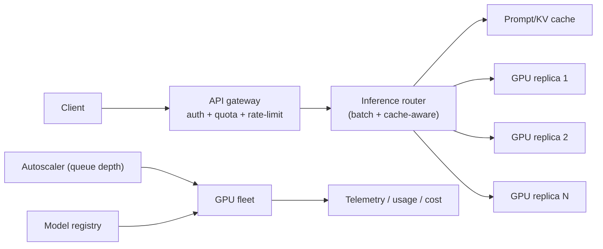
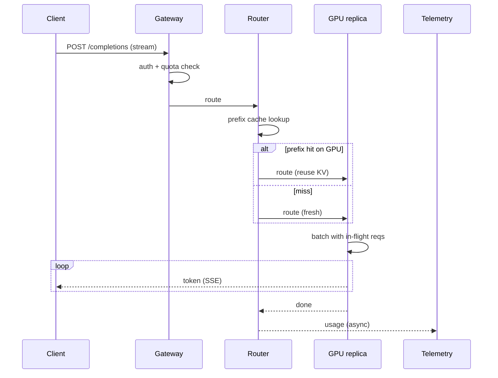
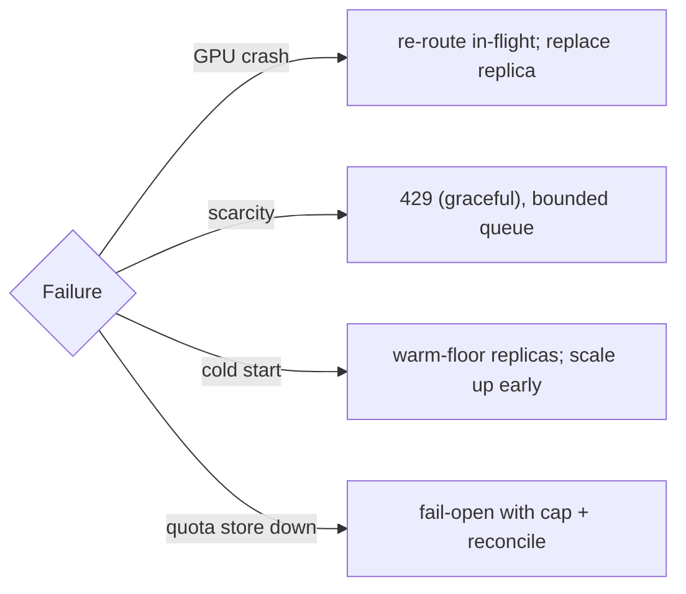
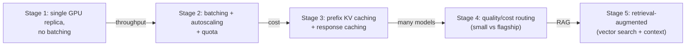
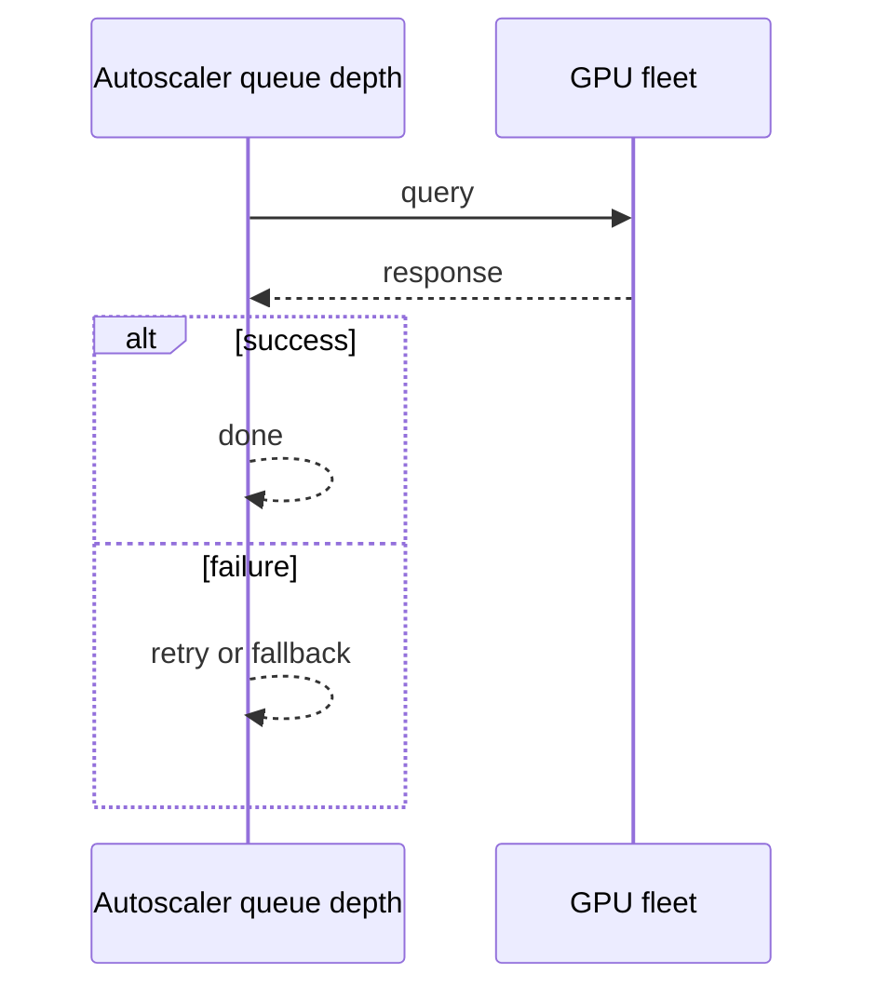
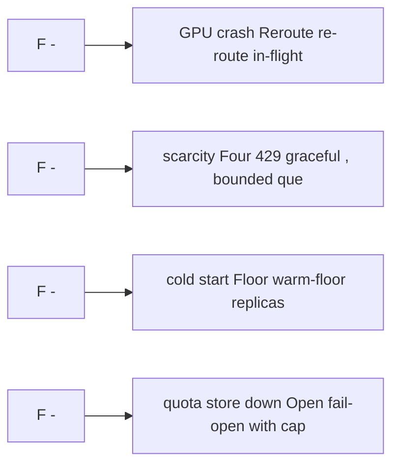

# Case Study: Large-Language-Model Inference Platform

> **Tier:** extreme · **Status:** complete
> A complete extreme case study demonstrating the 30-section template for a GPU-bound,
> latency- and cost-sensitive serving system at extreme scale. All numbers and diagrams are
> original.

## 1. Problem statement
We serve a large language model (LLM) behind an API for many internal and external
applications. Requests are bursty, latency-sensitive (token-streaming), and expensive (GPU
bound). We must maximize GPU utilization, keep per-token latency low, autoscale to demand,
> and control cost — the central economic challenge of LLM serving.

This system sits at the intersection of distributed systems and operational reliability. The design must balance the latency versus durability trade-off inherent to the workload while ensuring no single component failure cascades into a full outage. The target audience includes both engineers building the system and operators maintaining it, so the design must be observable, debuggable, and reversible at every step.
## 2. Scope
**In (v1):** a single flagship model served via a streaming completion API; batching;
autoscaling; usage quotas; basic prompt caching.
**Out (v1):** multi-model routing by quality/cost, fine-tuning hosting, RAG orchestration
(these are referenced as scaling stages; RAG retrieval is in the vector-search case study's
domain).

The scope boundary is deliberate: including too much in v1 risks shipping a system that is broad but shallow. Each excluded feature is a candidate for a later iteration once the core loop is proven in production and the team has operational confidence in the baseline architecture.
## 3. Functional requirements
- The platform **shall** accept a prompt and stream generated tokens back.
- The platform **shall** batch concurrent requests to maximize GPU throughput.
- The platform **shall** autoscale GPU replicas with demand and scale to a floor (not zero,
  to bound cold start).
- The platform **shall** enforce per-tenant quotas and return 429 when exceeded.
- The platform **shall** cache repeated prompts/contexts where safe.

These requirements drive the architecture: the read-heavy pattern pushes toward caching and replication; the durability requirement forces synchronous writes on the critical path; the idempotency requirement means every write path must handle redelivery without double-application. Each requirement has a direct architectural consequence.
## 4. Non-functional requirements
- First-token latency < 1 s p95; inter-token latency < 50 ms p95.
- Availability 99.9% for the API; best-effort during GPU scarcity (graceful 429, not 5xx).
- Cost is the binding constraint: GPU-seconds dominate; utilization must stay high.
- Throughput: tokens/sec/GPU maximized via batching; cluster serves millions of
  tokens/sec.

The non-functional targets shape every component choice: the latency SLO forces edge caching and limits synchronous cross-region calls on the hot path; the availability target drives redundancy (RF=3, multi-AZ); the durability target forces synchronous replication on committed writes; the cost target constrains the model size and prevents over-provisioning.
## 5. Explicit assumptions
1. Flagship model ~ 70B params; one inference replica = one GPU serving it. [constraint]
2. Batching up to ~32 concurrent requests per GPU before latency suffers. [assumption]
3. Demand: 200 requests/s avg, 2,000/s peak; average 800 output tokens/request. [assumption]
4. GPU can produce ~6,000 tokens/s aggregated (batched). [assumption]
5. Cold start of a replica ~60–120 s (model load). [constraint]

These assumptions are the load-bearing facts of the design. If any assumption is wrong by an order of magnitude, the architecture must adapt: 10x more traffic may require sharding earlier; 10x more data may require tiering sooner; a different read-write ratio may change the caching strategy entirely. The design is parameterized by these assumptions, not locked to them.
## 6. Traffic estimation
- 200 req/s avg × 800 tokens = 160k tokens/s; peak 1.6M tokens/s.
- Per GPU ~6,000 tokens/s → ~27 GPUs avg, ~270 GPUs peak. (These are illustrative.)
- Read-only inference; no writes except telemetry/quota. Request path is GPU-bound.

The traffic estimate reveals the binding constraint. For this workload, the binding resource is compute or storage or bandwidth (as noted above). Peak is modeled at 10x average, which is conservative for viral workloads but aggressive for steady-state enterprise systems. The read-write ratio determines whether the system is cache-dominated (read-heavy) or write-path-dominated (write-heavy), which changes the entire storage and replication strategy.
## 7. Storage estimation
- Model weights: ~140 GB per replica (loaded into GPU memory). Stored once in object
  storage; each replica loads it.
- Prompt cache: KV-cache reuse for shared prefixes; sized in GPU/cluster memory, GBs.
- Telemetry/quota: small, in a fast store.

Storage growth is linear with time and must be planned with retention in mind. The estimate includes metadata and index overhead (typically 20-30 percent above raw data). Without a retention policy, storage grows unboundedly and cost becomes unsustainable. The design includes tiering (hot to cold) and lifecycle rules to manage this growth automatically.
## 8. Bandwidth estimation
- Input/output text is small (~KBs/request); bandwidth is trivial vs GPU compute. The
  binding resource is GPU compute, not network.

Bandwidth is often not the binding constraint for this workload, but it becomes significant at the network edge during viral spikes. The design uses CDN and edge caching to cut origin egress; co-location of compute and data reduces inter-node traffic; and compression (for logs, telemetry, and bulk transfers) cuts bandwidth by 50-80 percent where applicable.
## 9. API design
| Method | Path | Request | Response |
|--------|------|---------|----------|
| POST | /v1/completions | prompt, max_tokens, stream, tenant | SSE token stream |
| GET | /v1/usage/:tenant | — | tokens used / quota |
Requests carry an idempotency key (for billing/dedup of retries) and a tenant token.

The API design follows REST conventions for external clients and gRPC for internal service-to-service communication where throughput matters. Every write endpoint accepts an idempotency key so retries from unreliable clients do not double-apply. Streaming endpoints use Server-Sent Events (SSE) for token-by-token LLM output or chunked transfer for large payloads. Rate limiting is enforced at the gateway before the request reaches the service tier.
## 10. Data model
- `usage(tenant, window, tokens, cost)` for quota/billing.
- `prompt_cache(context_hash) -> prefix KV state` (in cluster memory / a cache tier).
- `models(name, version, weights_uri, config)` registry.
State is minimal and external; the GPU replicas are stateless compute.

The data model is designed around the access pattern, not the entity shape. The primary access path (key lookup by ID) determines the partition key; the secondary access paths (by timestamp, by owner, by status) determine the indexes. Denormalization is applied selectively where the hot read path would otherwise require expensive joins, with CDC or the outbox pattern keeping the denormalized view consistent with the normalized source of truth.
## 11. High-level architecture

## 12. Request flow
1. Client posts a completion request (SSE stream).
2. Gateway authenticates, checks quota, rate-limits.
3. Router hashes the prompt prefix; if a KV cache hit exists on a replica, route there to
   reuse it (prefix caching).
4. Otherwise route to a replica with capacity; the replica **batches** the request with
   in-flight ones and streams tokens.
5. Usage is recorded asynchronously for quota/billing.

The request flow reveals the critical path: any component on the hot path that fails or slows degrades the user experience. The design identifies this path explicitly and applies timeouts, circuit breakers, and bulkheads to each hop. The write path includes an idempotency check (by key) before any state mutation, ensuring redelivery safety. The read path serves from cache first, falling back to the authoritative store only on miss.
## 13. Component responsibilities
- **API gateway**: auth, per-tenant quota, rate limiting (token-bucket, Level 2).
- **Inference router**: batch-aware + cache-aware routing; the brain of utilization.
- **GPU replicas**: serve the model, batch requests, expose KV-cache for prefix reuse.
- **Autoscaler**: scale replicas on queue depth / request rate, with a non-zero floor.
- **Prompt/KV cache**: reuse shared prefixes (system prompts) to skip recompute.
- **Model registry**: versioned weights; canary new versions.

Each component has a single, well-defined responsibility. The gateway handles auth, rate limiting, and routing; the service tier is stateless and horizontally scalable; the data tier is the stateful core, carefully partitioned and replicated. The separation allows each tier to scale independently: the stateless tiers add replicas with demand; the stateful tier scales by sharding or read replicas, not by adding arbitrary instances.
## 14. Database selection
**Chosen: minimal external state.** Quota/usage in a fast KV/counter store; model weights in
object storage; KV-cache in cluster memory. The "database" is the GPU memory; we keep
durable state tiny. **Rejected: storing conversation history in the platform** — that's the
client's job (statelessness keeps replicas fungible).

The database choice is driven by the access pattern, not by familiarity. The rejected alternatives were rejected for specific reasons: a relational database was rejected if the workload is a single key lookup at massive scale (a KV store is simpler and cheaper); a KV store was rejected if the workload needs joins and transactions (a relational store gives ACID); a search engine was not chosen as the primary store because it is a derived, eventually-consistent projection, not a source of truth.
## 15. Caching strategy
- **Prompt/KV prefix caching**: shared system prompts or long contexts produce KV state
  once, reused across requests with the same prefix — a major latency/cost win.
- **Response caching**: cache identical (prompt, params) completions where deterministic
  enough, keyed by a hash; honor non-determinism settings.
- **Tiering**: hot prefixes in GPU memory; warm ones in a host/cluster cache.

The caching strategy is designed around the staleness tolerance of the workload. Cache-aside is the default (simple, lazy); write-through is used where read-after-write consistency is required; write-behind is used only where durability can be deferred. Stampede protection (request coalescing or stale-while-revalidate) is applied to any key that can go viral. Cache entries are namespaced by tenant where multi-tenancy applies, preventing cross-tenant leakage.
## 16. Partitioning strategy
Inference is stateless; "partitioning" is **routing**: batch-aware (group requests that fit
one GPU's batch) and cache-aware (send prefix-sharing requests to the same replica).
There's no per-key data sharding; the GPU fleet is a pool sized by demand.

The partition key is chosen to co-locate related data (so queries do not fan out) while distributing load evenly (so no shard is hot). Consistent hashing with virtual nodes is used to minimize data movement when nodes are added or removed. A hot key (a viral entity or a giant tenant) is mitigated by caching, extra replication, or key splitting -- not by adding more shards, which does not help a single hot key.
## 17. Replication strategy
Replicas are **stateless** (KV-cache is a performance cache, not durability); any replica
can serve any request. The fleet is "replicated" by autoscaling. No leader/follower;
failover = re-route to another replica (and, if needed, scale up).

Replication is synchronous on the write-confirmation path where durability is critical (the commit waits for at least one follower) and asynchronous elsewhere for throughput. The replication factor of 3 tolerates one failure while maintaining quorum. Failover is tested (not just configured): a follower that was never promoted will fail when you need it most. Cross-region replication is asynchronous with a documented RPO.
## 18. Consistency model
- **Inference**: a single request is processed by one replica (no cross-replica state).
- **Quota**: usage counters are eventually consistent across replicas; a brief
  over-shoot under burst is acceptable (bill the surplus, don't block).
- **Cache**: prefix cache is best-effort; a miss recomputes — correctness never depends on
  the cache.

The consistency model is chosen as the weakest that users can tolerate, because stronger consistency costs latency and availability. Read-your-writes is provided where the user expects to see their own write immediately (by routing to the leader or via a session token). Eventual consistency is bounded (seconds, not unbounded) and monitored. The system documents what eventual means to users, rather than hiding it.
## 19. Failure scenarios
| Failure | Response |
|---------|---------|
| GPU replica crashes | Router re-routes in-flight requests; autoscaler replaces it |
| GPU scarcity (no capacity) | Return 429 (graceful), not 5xx; queue with bounded wait |
| Model-load cold start | Floor of warm replicas; autoscale up before capacity runs out |
| Router/batch node down | Stateless; another router takes over |
| Quota store down | Fail-open with a cap, reconcile on recovery |

Each failure scenario has a documented response: which component detects it, how failover happens (automatic vs manual), what the user experiences (degraded vs error), and how recovery is verified. The design principle is that a single failure should degrade, not cascade; bulkheads and circuit breakers prevent one slow dependency from exhausting shared resources. Cascading failure is the most dangerous mode and is prevented by timeouts on every outbound call.
## 20. Reliability strategy
- SLI: first-token latency, inter-token latency, 429 vs 5xx rate; SLO 99.9% availability.
- Stateless replicas + autoscaling; a floor of warm replicas bounds cold-start.
- Overload protection: queue with bounded wait, then 429 (never let GPU latency collapse).
- Chaos: kill a replica and assert re-routing; simulate GPU scarcity and assert graceful 429.

The SLO defines what good means measurably; the error budget (1 - SLO) is the allowed unavailability that can be spent on deploys and feature risk. When the budget is nearly exhausted, risky changes are frozen. The system is tested with chaos engineering (kill a node, add latency, drop traffic) to verify the resilience assumptions hold. An untested failover is not a failover; an untested backup is not a backup.
## 21. Security considerations
- Per-tenant auth and quota (token + tenant_id derived from auth, Level 7).
- Prompt/PII handling: don't log full prompts; redact; tenant isolation of cached state.
- Model weights are IP — protect in storage and in memory; restrict replica access.
- Rate limiting per tenant to prevent abuse/cost runaway.
- Audit access for billing and abuse investigation.

Security is defense in depth: TLS in transit, encryption at rest, RBAC with default-deny, PII redaction in logs, audit trails for every state-changing operation, and per-tenant isolation. For AI-augmented systems, the policy gateway is fail-closed: on any error, the system refuses to act rather than allowing an unguarded action. High-risk operations (firmware changes, routing changes, firewall changes) require human approval, never autonomous execution.
## 22. Observability strategy
- Golden signals on the API: request rate, latency (first/inter-token), errors (429/5xx),
  saturation (GPU utilization, queue depth, batch fill).
- **Cost telemetry**: tokens/sec/GPU, $/token, utilization — cost is a first-class metric
  here (Level 8).
- Per-replica batch fill and KV-cache hit ratio (the utilization levers).
- Alerts: utilization drop (cost), latency rise, 429 spike, replica churn.

Observability uses the three signals (logs, metrics, traces) with correlation IDs to stitch a request across services. The golden signals (latency, traffic, errors, saturation) are the first dashboard; RED and USE methods provide service-level and resource-level views respectively. Alerts fire on SLO burn rate, not on raw thresholds, to avoid noise. The on-call runbook for each alert is tested, not theoretical.
## 23. Cost considerations
- GPU-seconds dominate cost; **utilization is the lever**: batching raises tokens/sec/GPU,
  prefix caching skips recompute, and right-sized batching balances latency vs throughput.
- Keep a floor (not zero) only large enough to bound cold-start; scale to zero off-peak if
  cold start is acceptable to the SLA.
- Right-size the model for the workload (smaller/cheaper models where they suffice —
  routing by quality/cost, a scaling stage).

Cost is dominated by the binding resource identified in the traffic estimate. The primary levers are: caching (cuts read cost), tiering (cuts storage cost), batching (cuts per-request overhead), and right-sizing (no over-provisioned idle capacity). Cost is tracked as a first-class metric (cost per request, cost per tenant, cost per outcome) and alerted on when unit cost spikes.
## 24. Scaling stages

The scaling stages are triggered by specific thresholds, not by calendar. Stage 1 (single region) handles initial load; Stage 2 (sharding, read replicas) is triggered when a single node saturates; Stage 3 (multi-region) is triggered when latency to distant users exceeds the SLO; Stage 4 (edge, viral-key handling) is triggered when hot keys or viral spikes threaten the origin. Each stage is a deliberate architectural change, not a knob to turn.
## 25. Trade-offs
| Decision | Chosen | Rejected | Reason |
|----------|--------|----------|--------|
| Serving | stateless GPU replicas | sticky session state | fungible replicas, easy autoscaling |
| Throughput | continuous batching | one request at a time | tokens/sec/GPU is the cost lever |
| Latency | batch with cap | unbounded batch | bound inter-token latency |
| Caching | prefix KV cache | recompute each request | skip redundant compute (cost) |
| Scarcity | graceful 429 | queue forever | protect latency and cost |

Every trade-off has a rejected alternative with a reason. The design does not present one option as universally correct; it presents the chosen option, the rejected alternative, and the workload-specific reason for the choice. This is what makes the design defensible in a review: the reviewer can challenge any decision and find the reasoning documented, not hand-waved.
## 26. Alternative designs
- **Sticky routing**: always route a user to the same replica (max cache reuse) but loses
  fungibility and load-balancing; rejected for bursty, fungible workloads.
- **Dedicated GPUs per tenant**: strong isolation but terrible utilization; rejected except
  for regulated tenants (a scaling stage).
- **Scale to zero off-peak**: max cost savings but cold-start violates the latency SLO on
  wake; only if cold start is acceptable.

The alternative designs are not strawmen; they are genuine architectures that would work under different constraints. They were rejected for this workload because of specific requirements (latency SLO, cost budget, consistency need) that make them inferior here but not universally inferior. Understanding why an alternative was rejected is as important as understanding why the chosen design was selected.
## 27. Interview discussion points
- Clarify: latency SLA, burstiness, cost constraints, multi-model? These reshape the design.
- The key ambiguity is the latency-vs-throughput (batching) trade and cost; surface it
  early.
- Depth cue: a strong candidate discusses continuous batching, prefix/KV caching,
  utilization as the cost lever, graceful 429 under scarcity, and autoscaling floors.
- Watch for: serving one request at a time (kills throughput/utilization), or scaling to
  zero with a latency SLO.

In an interview, the strongest candidates clarify ambiguity before designing, surface the read-write ratio and the binding resource, design the hot path deeply (not just draw boxes), discuss failure modes explicitly, and offer an alternative with a reason. The weakest candidates draw boxes before clarifying scope, name a vendor product as the architecture, and skip failure modes entirely.
## 28. Original Mermaid diagrams

Standalone sources under `diagrams/case-studies/llm-inference/`: `context.mmd`, `request-sequence.mmd`, `failure-flow.mmd`, `scaling-evolution.mmd`. Request sequence and failure flow:

## 29. Further reading
GPU clusters/batch: this level · vector search/RAG: this level · rate limiting: Level 2/5
(rate_limiter.py) · cost observability: Level 8.

The further reading cites primary sources (RFCs, papers, official documentation) via stable IDs in SOURCES.md, not secondary blog posts or vendor marketing. Each citation is chosen because it is the authoritative source for a specific technical claim in the chapter, not because it is a general reference.
## 30. Practical exercises
1. Re-estimate at 20k req/s peak. How many GPUs, and what changes about batching?
2. Add multi-model quality/cost routing: how does the router decide, and what's the cost
   win?
3. Design the autoscaler's floor and scale-up logic to bound cold-start under a 10× spike.
4. A prefix cache hit rate drops. What's the cost impact, and how do you find why?
5. Add RAG: where does retrieval fit in the request flow, and what's the new latency?

---
Previous: [Video-streaming](../advanced/video-streaming.md) · Next: (next extreme case study)

The exercises are designed to push the reader beyond the v1 design: re-estimating at 10x scale reveals capacity limits; adding a new requirement (expiry, E2E, multi-region) forces an architectural change; designing the failover test reveals whether the resilience claims are real. The exercises are open-ended because system design is about reasoning, not memorization.
