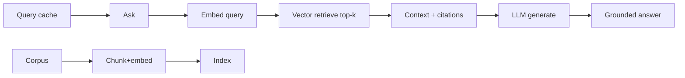
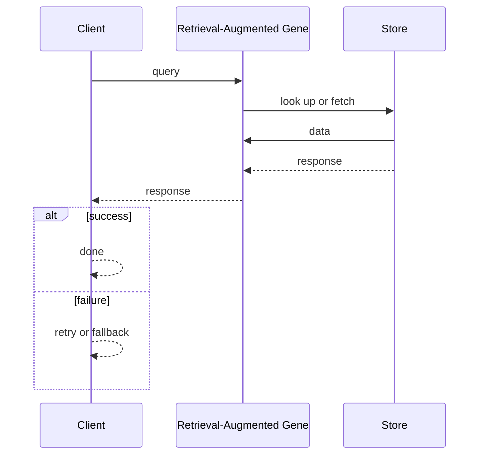
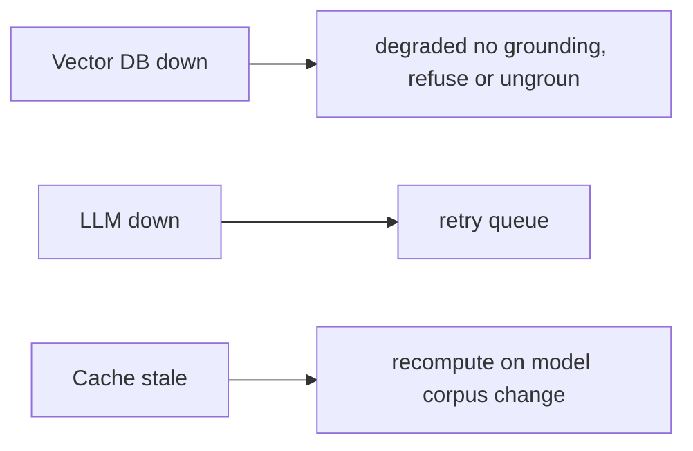

# Case Study: Retrieval-Augmented Generation Platform

> **Tier:** extreme · **Status:** complete · Original numbers and diagrams.

## 11. High-level architecture

## 28. Original Mermaid diagrams

Standalone sources under `diagrams/case-studies/rag-platform/`: `context.mmd`, `request-sequence.mmd`, `failure-flow.mmd`, `scaling-evolution.mmd`. Request sequence and failure flow:

## 1. Problem statement

Answer questions grounded in a private corpus by retrieving relevant context and generating with an LLM — orchestration of retrieval + generation with caching and grounding.

## 2. Scope

In (v1): ingest/chunk/embed a corpus, query retrieve+generate, citations, caching. Out: agentic multi-step, tool use (stage).

## 3. Functional requirements

- Ingest a corpus (chunk + embed + index).
- On query, retrieve top-k relevant chunks.
- Generate a grounded answer with citations.
- Cache repeated queries.

## 4. Non-functional requirements

- Answer p99 < 3 s.
- Grounding (cite sources; minimize hallucination).
- Availability 99.9%.

## 5. Explicit assumptions

1. 10M documents, ~1k chunks each = 10B chunks. [assumption] 2. Top-k = 5-10. [assumption] 3. Embedding model versioned. [constraint]

## 6. Traffic estimation

Queries moderate; ingest batch/stream. Generation latency dominates the user path.

## 7. Storage estimation

10B chunks x ~1 KB = ~10 TB vectors + index; corpus in object storage.

## 8. Bandwidth estimation

Retrieval small; generation streamed tokens to client.

## 9. API design

| POST /ask | question | streamed answer + citations |
| POST |/ingest | docs | ack

## 10. Data model

chunks(id, doc, text, embedding, metadata); vector index; queries(query_hash -> cached answer).

## 12. Request flow

Query embeds -> vector retrieve top-k chunks -> assemble context -> LLM generates with citations -> stream answer. Repeated queries served from cache. Ingest chunks+embeds+indexes.

## 13. Component responsibilities

Ingest (chunk/embed), vector DB, retrieval, LLM serving, query cache, citation assembly.

## 14. Database selection

Vector DB for retrieval (see vector-database case); object storage for corpus; cache for queries. Rejected: re-embed every query (cost).

## 15. Caching strategy

Query-answer cache (hash); embedding cache; context cache for shared prefixes.

## 16. Partitioning strategy

Vector index sharded (see vector DB); queries routed by hash to cache shards.

## 17. Replication strategy

Vector index + cache replicated; corpus durable; embeddings versioned.

## 18. Consistency model

Retrieval eventually consistent with ingest (a new doc appears after indexing). Cached answers versioned to corpus/model changes.

## 19. Failure scenarios

Vector DB down -> degraded (no grounding, refuse or ungrounded with disclaimer). LLM down -> retry/queue. Cache stale -> recompute on model/corpus change.

## 20. Reliability strategy

SLI answer latency, grounding quality; SPO 99.9%. Refuse-on-no-context fallback. Chaos: kill retrieval, assert graceful refusal not hallucination.

## 21. Security considerations

Per-tenant corpus isolation; don't ground on unauthorized chunks; PII redaction; audit queries.

## 22. Observability strategy

Answer p99, retrieval recall, citation rate, cache hit, hallucination flags, model/corpus version.

## 23. Cost considerations

Vector index (memory) + LLM generation (compute) dominate. Caching + retrieval filtering cut LLM calls.

## 24. Scaling stages

Stage 1: ingest + retrieve + generate. -> Stage 2: caching + citations + filtering. -> Stage 3: hybrid search, re-ranking. -> Stage 4: agentic multi-step, multi-region.

## 25. Trade-offs

Retrieval depth (grounding) vs latency/cost. Cache (cost) vs freshness. Strict grounding (fewer hallucinations) vs answer coverage.

## 26. Alternative designs

No retrieval (hallucination). Re-embed every query (cost). Ungrounded refusal (poor UX).

## 27. Interview discussion points

Clarify corpus scale, latency, grounding. Surface retrieve+generate, citations, caching, graceful degradation.

## 29. Further reading

Vector search/RAG: Level 10; LLM serving: LLM-inference case; caching: Level 2.

## 30. Practical exercises

1. Re-rank retrieved chunks for relevance. 2. Cite sources reliably. 3. Re-embed on model change without downtime. 4. Refuse-on-no-context fallback. 5. Hybrid keyword+vector search.

---
Previous: Vector database · Next: Internet of Things platform

