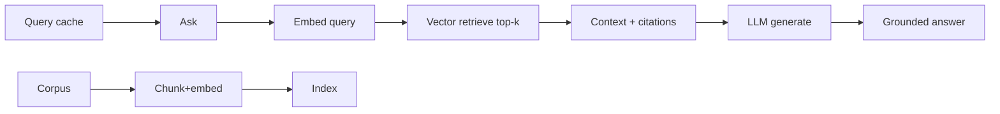
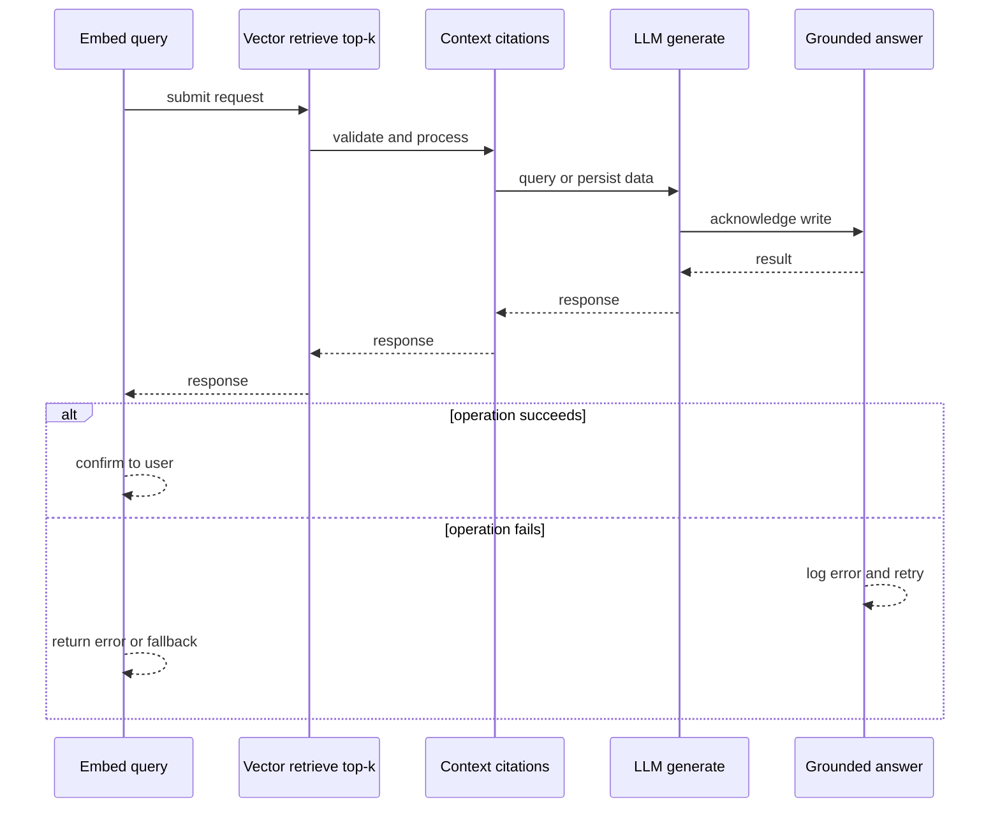
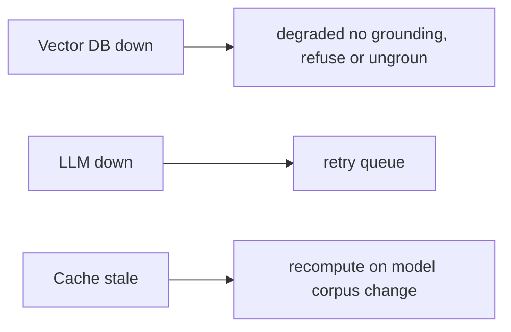
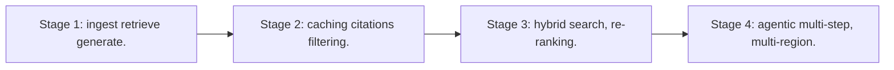

# Case Study: Retrieval-Augmented Generation Platform

> **Tier:** extreme · **Status:** complete · Original numbers and diagrams.

## 1. Problem statement
Answer questions grounded in a private corpus by retrieving relevant context and generating with an LLM — orchestration of retrieval + generation with caching and grounding. This is a extreme-tier system design challenge because it must handle high availability under peak load while ensuring no single point of failure. The design must be production-grade: observable, debuggable, reversible, and able to survive component failures without data loss or cascading outages.

## 2. Scope
In (v1): ingest/chunk/embed a corpus, query retrieve+generate, citations, caching. Out: agentic multi-step, tool use (stage).

For Retrieval-Augmented Generation Platform, these boundaries keep the first version focused on the core user value. Adding more features would dilute the design and delay shipping. Each excluded item is a scaling stage — a candidate for the next iteration once the baseline is proven.

## 3. Functional requirements
- Ingest a corpus (chunk + embed + index).
- On query, retrieve top-k relevant chunks.
- Generate a grounded answer with citations.
- Cache repeated queries.

For Retrieval-Augmented Generation Platform, these requirements drive specific architectural decisions: the read-write ratio determines the caching strategy, the durability target sets the replication mode, and the idempotency requirement shapes the API contract.

## 4. Non-functional requirements
- Answer p99 < 3 s.
- Grounding (cite sources; minimize hallucination).
- Availability 99.9%.

For Retrieval-Augmented Generation Platform, each non-functional target constrains a specific component: the latency SLO bounds the number of synchronous hops, the availability target forces redundancy across availability zones, and the cost ceiling limits the replication factor and storage tier.

## 5. Explicit assumptions
1. 10M documents, ~1k chunks each = 10B chunks. [assumption] 2. Top-k = 5-10. [assumption] 3. Embedding model versioned. [constraint]

For Retrieval-Augmented Generation Platform, if these assumptions are off by an order of magnitude, the architecture must adapt: 10x traffic may require earlier sharding, a different read-write ratio changes the caching strategy, and a higher peak multiplier demands more headroom.

## 6. Traffic estimation
Queries moderate; ingest batch/stream. Generation latency dominates the user path.

To derive the request rate: divide the daily volume by 86,400 seconds to get the average rate, then multiply by 5-10x for peak. The read-to-write ratio determines whether the system is cache-dominated (read-heavy) or write-path-dominated (write-heavy). For Retrieval-Augmented Generation Platform, this ratio shapes the entire storage and replication strategy.

## 7. Storage estimation
10B chunks x ~1 KB = ~10 TB vectors + index; corpus in object storage.

For Retrieval-Augmented Generation Platform, storage growth is projected from the daily write volume and retention policy. Index overhead and compression factors are accounted for in the total.

## 8. Bandwidth estimation
Retrieval small; generation streamed tokens to client.

Bandwidth is request rate multiplied by average payload size for ingress, and response rate multiplied by response size for egress. CDN and edge caching reduce origin egress. Compression reduces bandwidth by 50-80 percent where applicable. For Retrieval-Augmented Generation Platform, bandwidth may or may not be the binding constraint — compare it against compute and storage to find out.

## 9. API design
| Method | Path | Request | Response |
|--------|------|---------|----------|
| POST /ask | question | streamed answer + citations |
| POST |/ingest | docs | ack

## 10. Data model
chunks(id, doc, text, embedding, metadata); vector index; queries(query_hash -> cached answer).

For Retrieval-Augmented Generation Platform, the data model follows the access pattern. The primary lookup determines the partition key; secondary lookups determine indexes. Denormalization is used selectively on hot read paths.

## 11. High-level architecture

## 12. Request flow
Query embeds -> vector retrieve top-k chunks -> assemble context -> LLM generates with citations -> stream answer. Repeated queries served from cache. Ingest chunks+embeds+indexes.

## 13. Component responsibilities
Ingest (chunk/embed), vector DB, retrieval, LLM serving, query cache, citation assembly.

For Retrieval-Augmented Generation Platform, each component has one job. The gateway authenticates and routes. Services are stateless and scale horizontally. The data tier is the stateful core that scales by sharding.

## 14. Database selection
Vector DB for retrieval (see vector-database case); object storage for corpus; cache for queries. Rejected: re-embed every query (cost).

For Retrieval-Augmented Generation Platform, the database was chosen by access pattern, not familiarity. The rejected alternatives were wrong for this workload, not bad in general.

## 15. Caching strategy
Query-answer cache (hash); embedding cache; context cache for shared prefixes.

For Retrieval-Augmented Generation Platform, the cache strategy matches the staleness tolerance. Cache-aside for most data, write-through where read-after-write matters, stampede protection on hot keys.

## 16. Partitioning strategy
Vector index sharded (see vector DB); queries routed by hash to cache shards.

For Retrieval-Augmented Generation Platform, the partition key balances query locality with even load distribution. Sharding strategy matters because a poor key creates hot spots under real traffic patterns.

## 17. Replication strategy
Vector index + cache replicated; corpus durable; embeddings versioned.

For Retrieval-Augmented Generation Platform, replication mode is split: synchronous where durability is critical, asynchronous elsewhere for throughput. RF=3 tolerates one failure. Failover is tested regularly.

## 18. Consistency model
Retrieval eventually consistent with ingest (a new doc appears after indexing). Cached answers versioned to corpus/model changes.

For Retrieval-Augmented Generation Platform, the consistency level is the weakest users accept. Read-your-writes is provided where needed. Eventual consistency is bounded and monitored, not unbounded and silent.

## 19. Failure scenarios
Vector DB down -> degraded (no grounding, refuse or ungrounded with disclaimer). LLM down -> retry/queue. Cache stale -> recompute on model/corpus change.

## 20. Reliability strategy
SLI answer latency, grounding quality; SPO 99.9%. Refuse-on-no-context fallback. Chaos: kill retrieval, assert graceful refusal not hallucination.

For Retrieval-Augmented Generation Platform, the SLO makes reliability measurable. The error budget balances feature velocity with stability. Chaos testing validates that resilience claims hold under real failures.

## 21. Security considerations
Per-tenant corpus isolation; don't ground on unauthorized chunks; PII redaction; audit queries.

For Retrieval-Augmented Generation Platform, security layers TLS, encryption at rest, RBAC, PII redaction, and audit. The policy gateway is fail-closed for AI-augmented operations.

## 22. Observability strategy
Answer p99, retrieval recall, citation rate, cache hit, hallucination flags, model/corpus version.

For Retrieval-Augmented Generation Platform, observability combines logs, metrics, and traces with correlation IDs. Golden signals drive the first dashboard. Alerts fire on burn rate, not raw thresholds.

## 23. Cost considerations
Vector index (memory) + LLM generation (compute) dominate. Caching + retrieval filtering cut LLM calls.

For Retrieval-Augmented Generation Platform, cost is driven by the binding resource. Caching, tiering, batching, and right-sizing are the levers. Cost per request is tracked and alerted on.

## 24. Scaling stages
Stage 1: ingest + retrieve + generate. -> Stage 2: caching + citations + filtering. -> Stage 3: hybrid search, re-ranking. -> Stage 4: agentic multi-step, multi-region.

## 25. Trade-offs
Retrieval depth (grounding) vs latency/cost. Cache (cost) vs freshness. Strict grounding (fewer hallucinations) vs answer coverage.

For Retrieval-Augmented Generation Platform, each trade-off lists what was chosen, what was rejected, and why. This makes the design defensible in review — every decision has documented reasoning.

## 26. Alternative designs
No retrieval (hallucination). Re-embed every query (cost). Ungrounded refusal (poor UX).

For Retrieval-Augmented Generation Platform, the alternatives are real architectures that work under different constraints. They were rejected for this workload's specific requirements, not because they are bad designs.

## 27. Interview discussion points
Clarify corpus scale, latency, grounding. Surface retrieve+generate, citations, caching, graceful degradation.

For Retrieval-Augmented Generation Platform in an interview: clarify scope first, surface the read-write ratio, design the hot path deeply, discuss failures, and offer an alternative. Weak candidates skip failure modes.

## 28. Original Mermaid diagrams
Standalone sources under `diagrams/case-studies/rag-platform/`: `context.mmd`, `request-sequence.mmd`, `failure-flow.mmd`, `scaling-evolution.mmd`. The diagrams are embedded in their respective sections: architecture in section 11, request flow in section 12, failure scenarios in section 19, and scaling stages in section 24.

## 29. Further reading
Vector search/RAG: Level 10; LLM serving: LLM-inference case; caching: Level 2. Sources: `S-CHASH` `S-DYNAMO`.

## 30. Practical exercises

1. Re-rank retrieved chunks for relevance. 2. Cite sources reliably. 3. Re-embed on model change without downtime. 4. Refuse-on-no-context fallback. 5. Hybrid keyword+vector search.

---
Previous: Vector database · Next: Internet of Things platform

