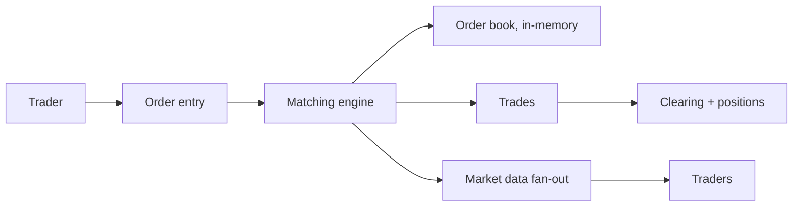
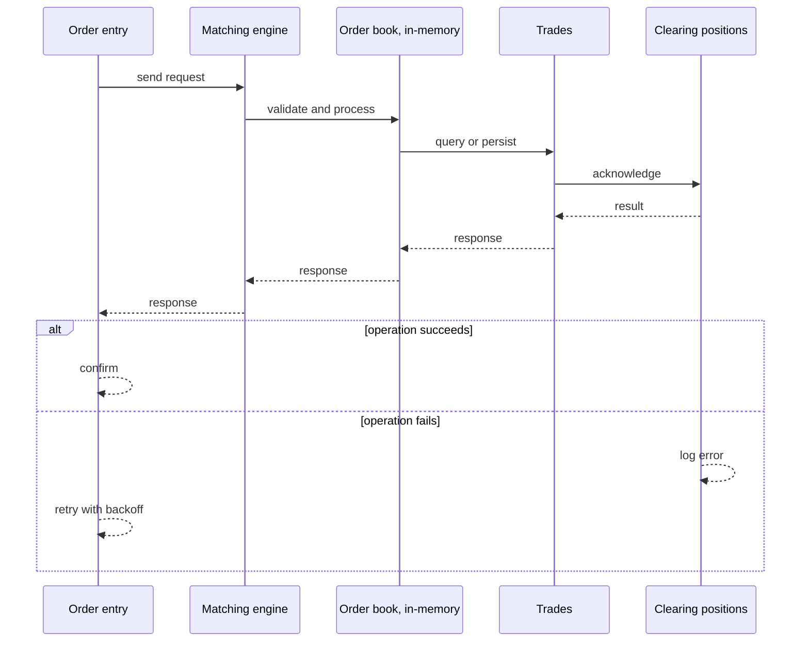
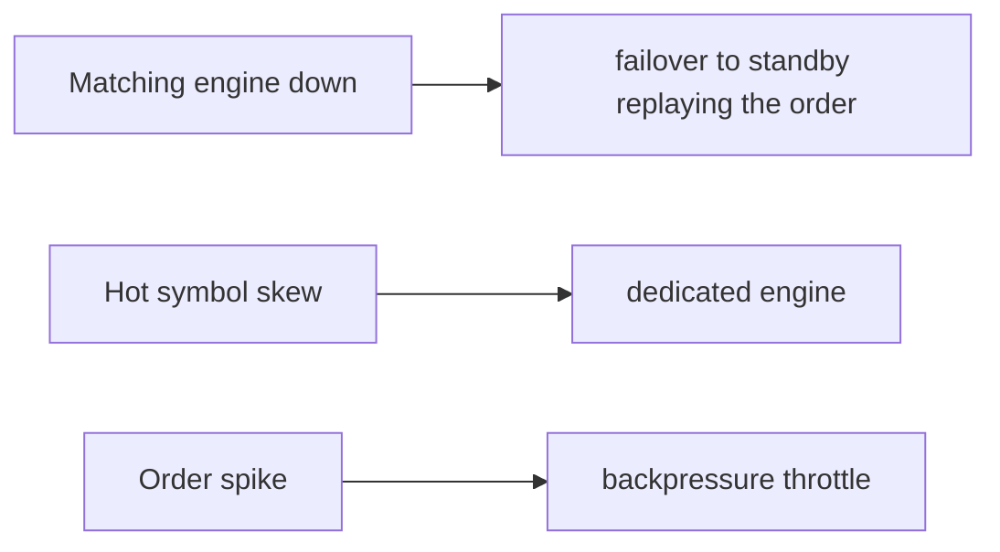
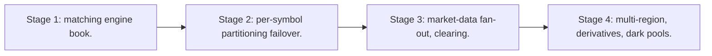

# Case Study: Stock-Trading Platform

> **Tier:** extreme · **Status:** complete · Original numbers and diagrams.

## 1. Problem statement
Match buy/sell orders in real time with an order book, execute, and clear — ultra-low-latency matching with strict price-time ordering and no double-execution. This is a extreme-tier system design challenge because it must handle high availability under peak load while ensuring no single point of failure. The design must be production-grade: observable, debuggable, reversible, and able to survive component failures without data loss or cascading outages.

## 2. Scope
In (v1): order entry, order book matching, trades, clearing. Out: derivatives, dark pools (stage).

For Stock-Trading Platform, these boundaries keep the first version focused on the core user value. Adding more features would dilute the design and delay shipping. Each excluded item is a scaling stage — a candidate for the next iteration once the baseline is proven.

## 3. Functional requirements
- Accept buy/sell orders.
- Match in price-time priority (order book).
- Execute trades; update positions/balances.
- Cancel/modify orders.

For Stock-Trading Platform, these requirements drive specific architectural decisions: the read-write ratio determines the caching strategy, the durability target sets the replication mode, and the idempotency requirement shapes the API contract.

## 4. Non-functional requirements
- Matching p99 < 1 ms.
- Strict price-time ordering (fairness).
- No double-execution.
- Availability 99.99% (market hours).

For Stock-Trading Platform, each non-functional target constrains a specific component: the latency SLO bounds the number of synchronous hops, the availability target forces redundancy across availability zones, and the cost ceiling limits the replication factor and storage tier.

## 5. Explicit assumptions
1. 1M orders/day/symbol, 10k symbols. [assumption] 2. Hot symbols concentrated. [assumption] 3. Market-hours spikes. [constraint]

For Stock-Trading Platform, if these assumptions are off by an order of magnitude, the architecture must adapt: 10x traffic may require earlier sharding, a different read-write ratio changes the caching strategy, and a higher peak multiplier demands more headroom.

## 6. Traffic estimation
Bursty at open/close; hot symbols dominate; matching is the latency path.

To derive the request rate: divide the daily volume by 86,400 seconds to get the average rate, then multiply by 5-10x for peak. The read-to-write ratio determines whether the system is cache-dominated (read-heavy) or write-path-dominated (write-heavy). For Stock-Trading Platform, this ratio shapes the entire storage and replication strategy.

## 7. Storage estimation
Order book (in-memory) + order/trade history (durable). Positions/balances.

For Stock-Trading Platform, storage growth is projected from the daily write volume and retention policy. Index overhead and compression factors are accounted for in the total.

## 8. Bandwidth estimation
Order stream small; market-data fan-out to clients is the bandwidth.

Bandwidth is request rate multiplied by average payload size for ingress, and response rate multiplied by response size for egress. CDN and edge caching reduce origin egress. Compression reduces bandwidth by 50-80 percent where applicable. For Stock-Trading Platform, bandwidth may or may not be the binding constraint — compare it against compute and storage to find out.

## 9. API design
| Method | Path | Request | Response |
|--------|------|---------|----------|
| POST /orders | side, price, qty | order id |
| WS |/market/:sym | | quotes/trades |

## 10. Data model
order_book(symbol, bids, asks by price-time); orders(id, sym, side, price, qty, status); trades(id, buy, sell, price, qty, ts).

For Stock-Trading Platform, the data model follows the access pattern. The primary lookup determines the partition key; secondary lookups determine indexes. Denormalization is used selectively on hot read paths.

## 11. High-level architecture

## 12. Request flow
Order -> matching engine matches against the book in price-time priority -> trade executed -> positions/balances updated -> market data fanned out.

## 13. Component responsibilities
Order entry, matching engine, order book (in-memory), clearing, market-data fan-out.

For Stock-Trading Platform, each component has one job. The gateway authenticates and routes. Services are stateless and scale horizontally. The data tier is the stateful core that scales by sharding.

## 14. Database selection
Order book in-memory (matching state); orders/trades durable (append-only); positions strongly consistent. Rejected: DB-backed book (too slow).

For Stock-Trading Platform, the database was chosen by access pattern, not familiarity. The rejected alternatives were wrong for this workload, not bad in general.

## 15. Caching strategy
Order book in memory; hot symbols pinned to a matching engine. Market data cached/CDN.

For Stock-Trading Platform, the cache strategy matches the staleness tolerance. Cache-aside for most data, write-through where read-after-write matters, stampede protection on hot keys.

## 16. Partitioning strategy
Per symbol (a symbol's book on one matching engine); hot symbols on dedicated engines; market data fanned out regionally.

For Stock-Trading Platform, the partition key balances query locality with even load distribution. Sharding strategy matters because a poor key creates hot spots under real traffic patterns.

## 17. Replication strategy
Order book in-memory with a fast durable log (replicated) for recovery; trades durable (RF=3); a matching-engine loss fails over to a standby replaying the log.

For Stock-Trading Platform, replication mode is split: synchronous where durability is critical, asynchronous elsewhere for throughput. RF=3 tolerates one failure. Failover is tested regularly.

## 18. Consistency model
Strict price-time priority per symbol (matching determinism). Trades idempotent by trade id; no double-execution.

For Stock-Trading Platform, the consistency level is the weakest users accept. Read-your-writes is provided where needed. Eventual consistency is bounded and monitored, not unbounded and silent.

## 19. Failure scenarios
Matching engine down -> failover to standby replaying the order log; brief pause, no loss. Hot symbol skew -> dedicated engine. Order spike -> backpressure (throttle).

## 20. Reliability strategy
SLI match p99, double-exec (0); SLO 99.99% market hours. Failover + log replay. Chaos: kill a matching engine, assert recovery with no lost orders.

For Stock-Trading Platform, the SLO makes reliability measurable. The error budget balances feature velocity with stability. Chaos testing validates that resilience claims hold under real failures.

## 21. Security considerations
Strong auth; per-account authorization; market-abuse surveillance; no front-running; audit.

For Stock-Trading Platform, security layers TLS, encryption at rest, RBAC, PII redaction, and audit. The policy gateway is fail-closed for AI-augmented operations.

## 22. Observability strategy
Match p99/p999 latency, order/trade rates, book depth, failover time, market-data fan-out lag.

For Stock-Trading Platform, observability combines logs, metrics, and traces with correlation IDs. Golden signals drive the first dashboard. Alerts fire on burn rate, not raw thresholds.

## 23. Cost considerations
Ultra-low-latency infra (co-location, dedicated engines) dominates. Hot-symbol engines sized to spikes.

For Stock-Trading Platform, cost is driven by the binding resource. Caching, tiering, batching, and right-sizing are the levers. Cost per request is tracked and alerted on.

## 24. Scaling stages
Stage 1: matching engine + book. -> Stage 2: per-symbol partitioning + failover. -> Stage 3: market-data fan-out, clearing. -> Stage 4: multi-region, derivatives, dark pools.

## 25. Trade-offs
In-memory book (latency) vs durability (log). Per-symbol (locality) vs hot-symbol skew. Failover (availability) vs replay latency.

For Stock-Trading Platform, each trade-off lists what was chosen, what was rejected, and why. This makes the design defensible in review — every decision has documented reasoning.

## 26. Alternative designs
DB-backed book (too slow). Single global engine (latency, SPOF). No failover (loss on engine crash).

For Stock-Trading Platform, the alternatives are real architectures that work under different constraints. They were rejected for this workload's specific requirements, not because they are bad designs.

## 27. Interview discussion points
Clarify latency SLA, ordering fairness, hot symbols. Surface in-memory book + log + failover + price-time priority.

For Stock-Trading Platform in an interview: clarify scope first, surface the read-write ratio, design the hot path deeply, discuss failures, and offer an alternative. Weak candidates skip failure modes.

## 28. Original Mermaid diagrams
Standalone sources under `diagrams/case-studies/stock-trading/`: `context.mmd`, `request-sequence.mmd`, `failure-flow.mmd`, `scaling-evolution.mmd`. The diagrams are embedded in their respective sections: architecture in section 11, request flow in section 12, failure scenarios in section 19, and scaling stages in section 24.

## 29. Further reading
Order books/matching: domain; consensus: Level 4; real-time: Level 10. Sources: `S-CHASH` `S-DYNAMO`.

## 30. Practical exercises

1. Failover with no lost orders. 2. Hot-symbol dedicated engine. 3. Market-data fan-out at 1M clients. 4. Order spike throttle without unfairness. 5. Cross-listing arbitrage latency.

---
Previous: Banking ledger · Next: Fraud-detection system

