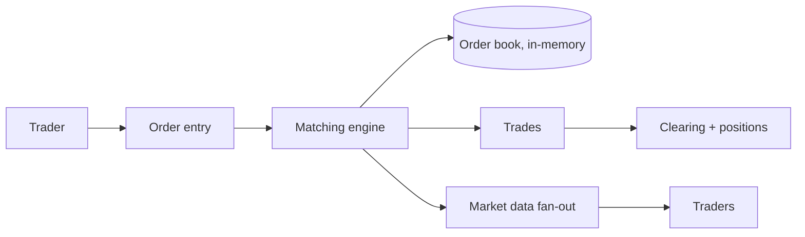
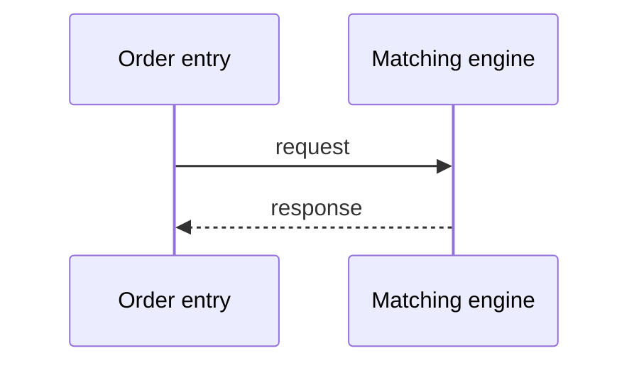
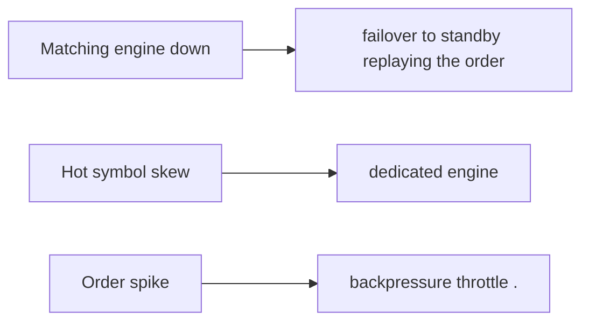
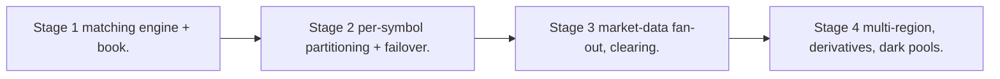

# Case Study: Stock-Trading Platform

> **Tier:** extreme · **Status:** draft · Original numbers and diagrams.

## 11. High-level architecture

## 28. Original Mermaid diagrams

Standalone sources under `diagrams/case-studies/stock-trading/`: `context.mmd`, `request-sequence.mmd`, `failure-flow.mmd`, `scaling-evolution.mmd`. Additional diagrams for this case study:

## 1. Problem statement

Match buy/sell orders in real time with an order book, execute, and clear — ultra-low-latency matching with strict price-time ordering and no double-execution.

## 2. Scope

In (v1): order entry, order book matching, trades, clearing. Out: derivatives, dark pools (stage).

## 3. Functional requirements

- Accept buy/sell orders. - Match in price-time priority (order book). - Execute trades; update positions/balances. - Cancel/modify orders.

## 4. Non-functional requirements

- Matching p99 < 1 ms. - Strict price-time ordering (fairness). - No double-execution. - Availability 99.99% (market hours).

## 5. Explicit assumptions

1. 1M orders/day/symbol, 10k symbols. [assumption] 2. Hot symbols concentrated. [assumption] 3. Market-hours spikes. [constraint]

## 6. Traffic estimation

Bursty at open/close; hot symbols dominate; matching is the latency path.

## 7. Storage estimation

Order book (in-memory) + order/trade history (durable). Positions/balances.

## 8. Bandwidth estimation

Order stream small; market-data fan-out to clients is the bandwidth.

## 9. API design

| POST /orders | side, price, qty | order id | | WS /market/:sym | | quotes/trades |

## 10. Data model

order_book(symbol, bids, asks by price-time); orders(id, sym, side, price, qty, status); trades(id, buy, sell, price, qty, ts).

## 12. Request flow

Order -> matching engine matches against the book in price-time priority -> trade executed -> positions/balances updated -> market data fanned out.

## 13. Component responsibilities

Order entry, matching engine, order book (in-memory), clearing, market-data fan-out.

## 14. Database selection

Order book in-memory (matching state); orders/trades durable (append-only); positions strongly consistent. Rejected: DB-backed book (too slow).

## 15. Caching strategy

Order book in memory; hot symbols pinned to a matching engine. Market data cached/CDN.

## 16. Partitioning strategy

Per symbol (a symbol's book on one matching engine); hot symbols on dedicated engines; market data fanned out regionally.

## 17. Replication strategy

Order book in-memory with a fast durable log (replicated) for recovery; trades durable (RF=3); a matching-engine loss fails over to a standby replaying the log.

## 18. Consistency model

Strict price-time priority per symbol (matching determinism). Trades idempotent by trade id; no double-execution.

## 19. Failure scenarios

Matching engine down -> failover to standby replaying the order log; brief pause, no loss. Hot symbol skew -> dedicated engine. Order spike -> backpressure (throttle).

## 20. Reliability strategy

SLI match p99, double-exec (0); SLO 99.99% market hours. Failover + log replay. Chaos: kill a matching engine, assert recovery with no lost orders.

## 21. Security considerations

Strong auth; per-account authorization; market-abuse surveillance; no front-running; audit.

## 22. Observability strategy

Match p99/p999 latency, order/trade rates, book depth, failover time, market-data fan-out lag.

## 23. Cost considerations

Ultra-low-latency infra (co-location, dedicated engines) dominates. Hot-symbol engines sized to spikes.

## 24. Scaling stages

Stage 1: matching engine + book. -> Stage 2: per-symbol partitioning + failover. -> Stage 3: market-data fan-out, clearing. -> Stage 4: multi-region, derivatives, dark pools.

## 25. Trade-offs

In-memory book (latency) vs durability (log). Per-symbol (locality) vs hot-symbol skew. Failover (availability) vs replay latency.

## 26. Alternative designs

DB-backed book (too slow). Single global engine (latency, SPOF). No failover (loss on engine crash).

## 27. Interview discussion points

Clarify latency SLA, ordering fairness, hot symbols. Surface in-memory book + log + failover + price-time priority.

## 29. Further reading

Order books/matching: domain; consensus: Level 4; real-time: Level 10.

## 30. Practical exercises

1. Failover with no lost orders. 2. Hot-symbol dedicated engine. 3. Market-data fan-out at 1M clients. 4. Order spike throttle without unfairness. 5. Cross-listing arbitrage latency.

---
Previous: Banking ledger · Next: Fraud-detection system
