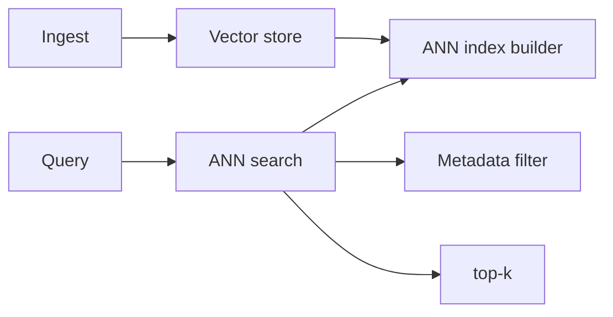
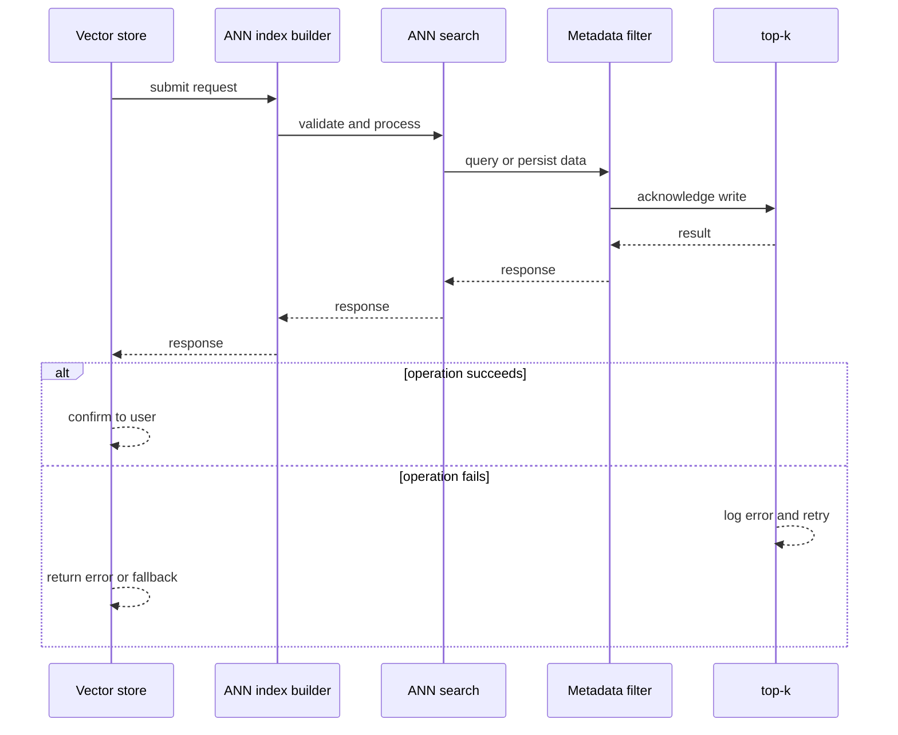
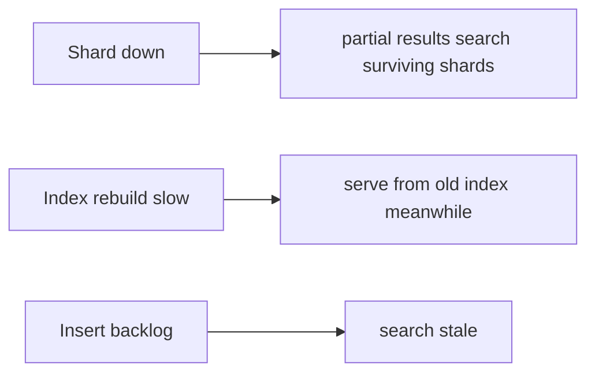
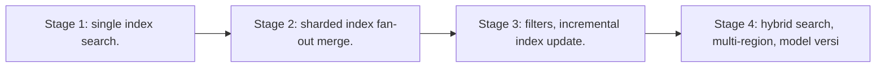

# Case Study: Vector Database

> **Tier:** extreme · **Status:** complete · Original numbers and diagrams.

## 1. Problem statement
Store billions of embeddings and answer approximate nearest-neighbor queries at low latency — the substrate for semantic search and RAG. This is a extreme-tier system design challenge because it must handle high availability under peak load while ensuring no single point of failure. The design must be production-grade: observable, debuggable, reversible, and able to survive component failures without data loss or cascading outages.

## 2. Scope
In (v1): insert vectors, ANN search with metadata filters, index build/update, versioning. Out: hybrid (keyword+vector) full pipeline (RAG case).

For Vector Database, these boundaries keep the first version focused on the core user value. Adding more features would dilute the design and delay shipping. Each excluded item is a scaling stage — a candidate for the next iteration once the baseline is proven.

## 3. Functional requirements
- Insert vectors with metadata.
- ANN search top-k by similarity.
- Filter by metadata.
- Rebuild/update the index.

For Vector Database, these requirements drive specific architectural decisions: the read-write ratio determines the caching strategy, the durability target sets the replication mode, and the idempotency requirement shapes the API contract.

## 4. Non-functional requirements
- Search p99 < 100 ms at billion scale.
- Recall tuned per workload.
- Index update without full rebuild (where possible).

For Vector Database, each non-functional target constrains a specific component: the latency SLO bounds the number of synchronous hops, the availability target forces redundancy across availability zones, and the cost ceiling limits the replication factor and storage tier.

## 5. Explicit assumptions
1. 1B vectors, 768-dim (~3 KB). [assumption] 2. Search top-10 with filters. [assumption] 3. Index HNSW/IVF. [constraint]

For Vector Database, if these assumptions are off by an order of magnitude, the architecture must adapt: 10x traffic may require earlier sharding, a different read-write ratio changes the caching strategy, and a higher peak multiplier demands more headroom.

## 6. Traffic estimation
Search-heavy; inserts steady. Search latency dominates design.

To derive the request rate: divide the daily volume by 86,400 seconds to get the average rate, then multiply by 5-10x for peak. The read-to-write ratio determines whether the system is cache-dominated (read-heavy) or write-path-dominated (write-heavy). For Vector Database, this ratio shapes the entire storage and replication strategy.

## 7. Storage estimation
1B x 3 KB = ~3 TB vectors + index overhead; in-memory or fast SSD.

For Vector Database, storage growth is projected from the daily write volume and retention policy. Index overhead and compression factors are accounted for in the total.

## 8. Bandwidth estimation
Search responses small (top-k ids); ingest steady.

Bandwidth is request rate multiplied by average payload size for ingress, and response rate multiplied by response size for egress. CDN and edge caching reduce origin egress. Compression reduces bandwidth by 50-80 percent where applicable. For Vector Database, bandwidth may or may not be the binding constraint — compare it against compute and storage to find out.

## 9. API design
| Method | Path | Request | Response |
|--------|------|---------|----------|
| POST /vectors | vec, meta | id |
| GET |/search | vec, filters, k | top-k ids |

## 10. Data model
vectors(id, embedding, metadata); index (HNSW/IVF/PQ) per shard; metadata index for filters.

For Vector Database, the data model follows the access pattern. The primary lookup determines the partition key; secondary lookups determine indexes. Denormalization is used selectively on hot read paths.

## 11. High-level architecture

## 12. Request flow
Insert stores vector + metadata; index builder updates the ANN index. Search: ANN retrieves candidates, metadata filter prunes, return top-k.

## 13. Component responsibilities
Vector store, index builder, ANN search, metadata filter.

For Vector Database, each component has one job. The gateway authenticates and routes. Services are stateless and scale horizontally. The data tier is the stateful core that scales by sharding.

## 14. Database selection
Vector store optimized for ANN (HNSW/IVF) + a metadata index; in-memory or fast SSD for latency. Rejected: exact NN (intractable at scale).

For Vector Database, the database was chosen by access pattern, not familiarity. The rejected alternatives were wrong for this workload, not bad in general.

## 15. Caching strategy
Hot queries cached; popular vectors/pages resident in memory.

For Vector Database, the cache strategy matches the staleness tolerance. Cache-aside for most data, write-through where read-after-write matters, stampede protection on hot keys.

## 16. Partitioning strategy
Index sharded by vector partition; search fans out to shards, merges top-k. Metadata index co-located.

For Vector Database, the partition key balances query locality with even load distribution. Sharding strategy matters because a poor key creates hot spots under real traffic patterns.

## 17. Replication strategy
Index + vectors replicated for availability; inserts eventually indexed; search eventually consistent with inserts.

For Vector Database, replication mode is split: synchronous where durability is critical, asynchronous elsewhere for throughput. RF=3 tolerates one failure. Failover is tested regularly.

## 18. Consistency model
Search may not see very recent inserts (index lag) — eventually consistent. Vector versions managed for model changes.

For Vector Database, the consistency level is the weakest users accept. Read-your-writes is provided where needed. Eventual consistency is bounded and monitored, not unbounded and silent.

## 19. Failure scenarios
Shard down -> partial results (search surviving shards + alert). Index rebuild slow -> serve from old index meanwhile. Insert backlog -> search stale.

## 20. Reliability strategy
SLI search latency, recall; SPO 99.9%. Partial-results fallback. Chaos: kill a shard, assert partial search not failure.

For Vector Database, the SLO makes reliability measurable. The error budget balances feature velocity with stability. Chaos testing validates that resilience claims hold under real failures.

## 21. Security considerations
Per-tenant vector isolation; metadata PII; access control; don't leak embeddings.

For Vector Database, security layers TLS, encryption at rest, RBAC, PII redaction, and audit. The policy gateway is fail-closed for AI-augmented operations.

## 22. Observability strategy
Search p99, recall@k, index freshness, insert lag, shard skew, query rate.

For Vector Database, observability combines logs, metrics, and traces with correlation IDs. Golden signals drive the first dashboard. Alerts fire on burn rate, not raw thresholds.

## 23. Cost considerations
Memory (index) dominates; PQ/compression cuts it; shard for scale. Recall tuning trades cost.

For Vector Database, cost is driven by the binding resource. Caching, tiering, batching, and right-sizing are the levers. Cost per request is tracked and alerted on.

## 24. Scaling stages
Stage 1: single index + search. -> Stage 2: sharded index + fan-out merge. -> Stage 3: filters, incremental index update. -> Stage 4: hybrid search, multi-region, model versioning.

## 25. Trade-offs
ANN speed vs recall (tune index). In-memory (latency) vs cost. Incremental update (freshness) vs rebuild (recall). Sharding (scale) vs fan-out latency.

For Vector Database, each trade-off lists what was chosen, what was rejected, and why. This makes the design defensible in review — every decision has documented reasoning.

## 26. Alternative designs
Exact NN (intractable). A single unsharded index (can't scale). No metadata filter (post-filter slow).

For Vector Database, the alternatives are real architectures that work under different constraints. They were rejected for this workload's specific requirements, not because they are bad designs.

## 27. Interview discussion points
Clarify scale, recall, filters, latency. Surface ANN index, sharding + fan-out merge, recall/cost tuning.

For Vector Database in an interview: clarify scope first, surface the read-write ratio, design the hot path deeply, discuss failures, and offer an alternative. Weak candidates skip failure modes.

## 28. Original Mermaid diagrams
Standalone sources under `diagrams/case-studies/vector-database/`: `context.mmd`, `request-sequence.mmd`, `failure-flow.mmd`, `scaling-evolution.mmd`. The diagrams are embedded in their respective sections: architecture in section 11, request flow in section 12, failure scenarios in section 19, and scaling stages in section 24.

## 29. Further reading

Vector DB: S-VECTORDB; sharding: Level 3; RAG: Level 10.

## 30. Practical exercises

1. Rebuild index without downtime. 2. Tune recall vs latency. 3. Metadata filters with ANN. 4. Model change re-embedding. 5. Billion-scale sharding.

---
Previous: Data lake · Next: RAG platform

