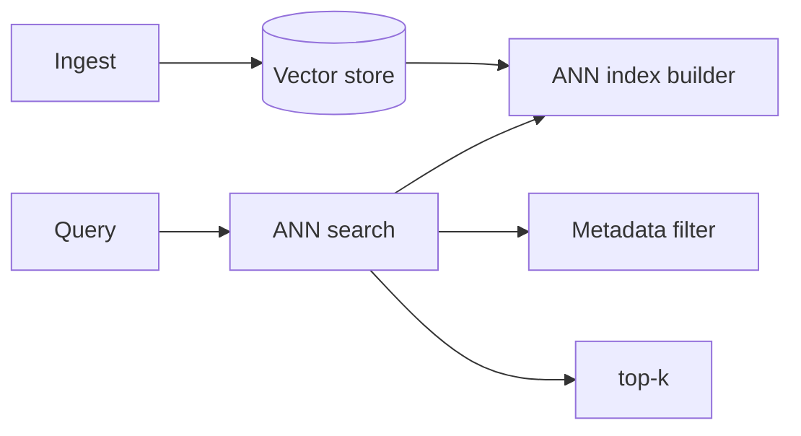
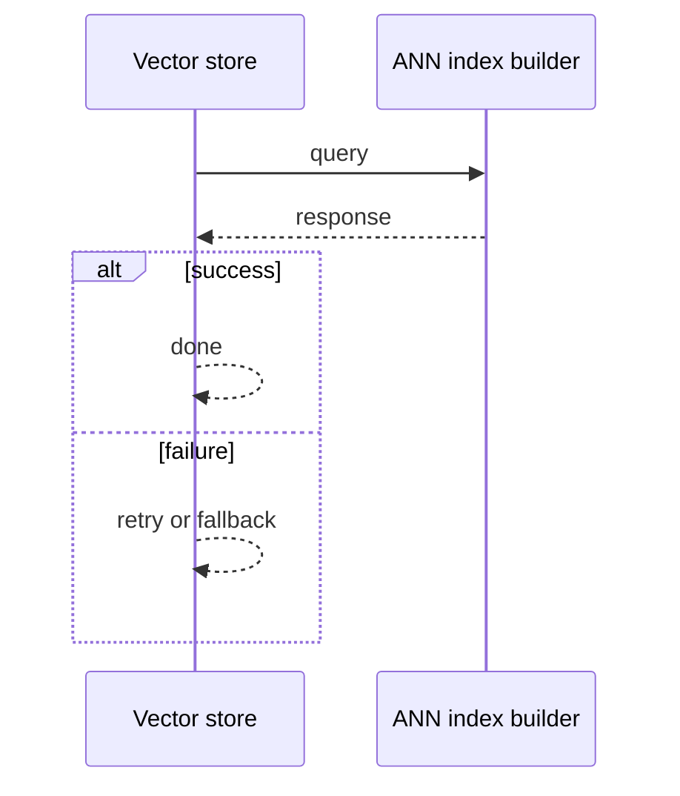
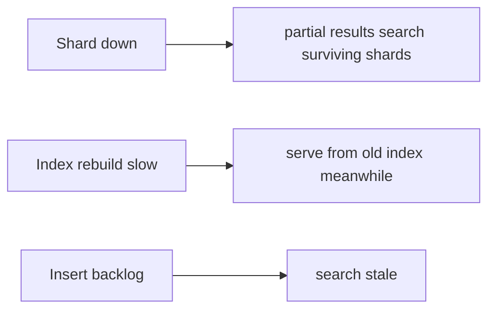

# Case Study: Vector Database

> **Tier:** extreme · **Status:** complete · Original numbers and diagrams.

## 1. Problem statement

Store billions of embeddings and answer approximate nearest-neighbor queries at low latency — the substrate for semantic search and RAG.

## 2. Scope

In (v1): insert vectors, ANN search with metadata filters, index build/update, versioning. Out: hybrid (keyword+vector) full pipeline (RAG case).

## 3. Functional requirements

- Insert vectors with metadata.
- ANN search top-k by similarity.
- Filter by metadata.
- Rebuild/update the index.

## 4. Non-functional requirements

- Search p99 < 100 ms at billion scale.
- Recall tuned per workload.
- Index update without full rebuild (where possible).

## 5. Explicit assumptions

1. 1B vectors, 768-dim (~3 KB). [assumption] 2. Search top-10 with filters. [assumption] 3. Index HNSW/IVF. [constraint]

## 6. Traffic estimation

Search-heavy; inserts steady. Search latency dominates design.

## 7. Storage estimation

1B x 3 KB = ~3 TB vectors + index overhead; in-memory or fast SSD.

## 8. Bandwidth estimation

Search responses small (top-k ids); ingest steady.

## 9. API design

| POST /vectors | vec, meta | id |
| GET |/search | vec, filters, k | top-k ids |

## 10. Data model

vectors(id, embedding, metadata); index (HNSW/IVF/PQ) per shard; metadata index for filters.

## 11. High-level architecture

## 12. Request flow
Insert stores vector + metadata; index builder updates the ANN index. Search: ANN retrieves candidates, metadata filter prunes, return top-k.

## 13. Component responsibilities

Vector store, index builder, ANN search, metadata filter.

## 14. Database selection

Vector store optimized for ANN (HNSW/IVF) + a metadata index; in-memory or fast SSD for latency. Rejected: exact NN (intractable at scale).

## 15. Caching strategy

Hot queries cached; popular vectors/pages resident in memory.

## 16. Partitioning strategy

Index sharded by vector partition; search fans out to shards, merges top-k. Metadata index co-located.

## 17. Replication strategy

Index + vectors replicated for availability; inserts eventually indexed; search eventually consistent with inserts.

## 18. Consistency model

Search may not see very recent inserts (index lag) — eventually consistent. Vector versions managed for model changes.

## 19. Failure scenarios
Shard down -> partial results (search surviving shards + alert). Index rebuild slow -> serve from old index meanwhile. Insert backlog -> search stale.

## 20. Reliability strategy

SLI search latency, recall; SPO 99.9%. Partial-results fallback. Chaos: kill a shard, assert partial search not failure.

## 21. Security considerations

Per-tenant vector isolation; metadata PII; access control; don't leak embeddings.

## 22. Observability strategy

Search p99, recall@k, index freshness, insert lag, shard skew, query rate.

## 23. Cost considerations

Memory (index) dominates; PQ/compression cuts it; shard for scale. Recall tuning trades cost.

## 24. Scaling stages

Stage 1: single index + search. -> Stage 2: sharded index + fan-out merge. -> Stage 3: filters, incremental index update. -> Stage 4: hybrid search, multi-region, model versioning.

## 25. Trade-offs

ANN speed vs recall (tune index). In-memory (latency) vs cost. Incremental update (freshness) vs rebuild (recall). Sharding (scale) vs fan-out latency.

## 26. Alternative designs

Exact NN (intractable). A single unsharded index (can't scale). No metadata filter (post-filter slow).

## 27. Interview discussion points

Clarify scale, recall, filters, latency. Surface ANN index, sharding + fan-out merge, recall/cost tuning.

## 28. Original Mermaid diagrams
Standalone sources under `diagrams/case-studies/vector-database/`: `context.mmd`, `request-sequence.mmd`, `failure-flow.mmd`, `scaling-evolution.mmd`. The diagrams are embedded in their respective sections: architecture in section 11, request flow in section 12, failure scenarios in section 19, and scaling stages in section 24.

## 29. Further reading

Vector DB: S-VECTORDB; sharding: Level 3; RAG: Level 10.

## 30. Practical exercises

1. Rebuild index without downtime. 2. Tune recall vs latency. 3. Metadata filters with ANN. 4. Model change re-embedding. 5. Billion-scale sharding.

---
Previous: Data lake · Next: RAG platform

