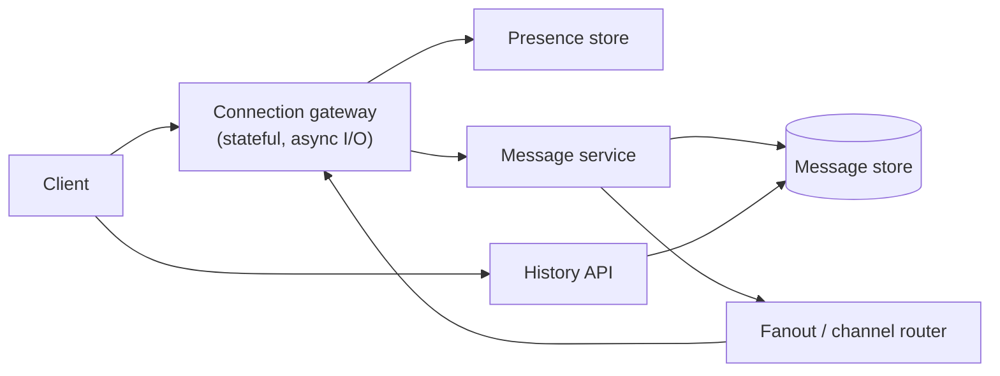
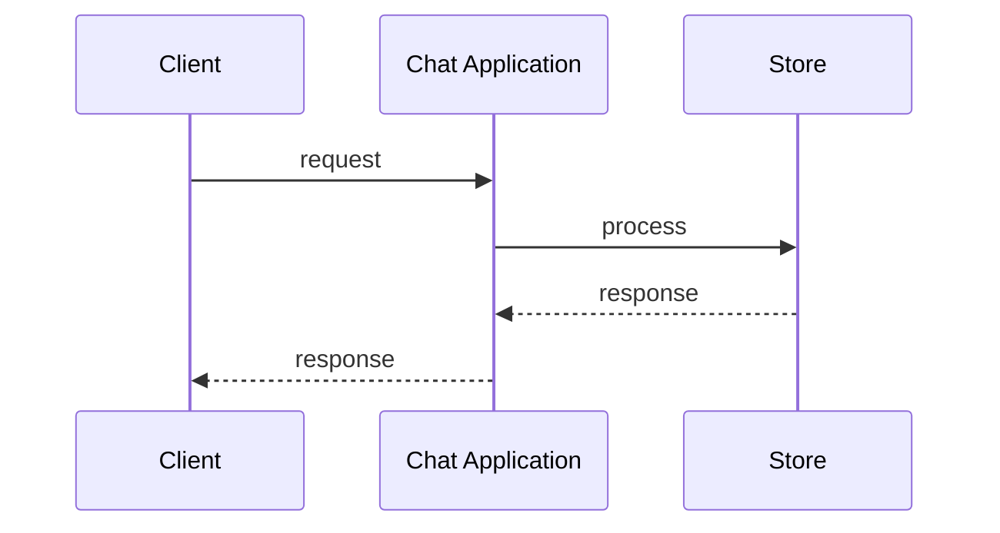
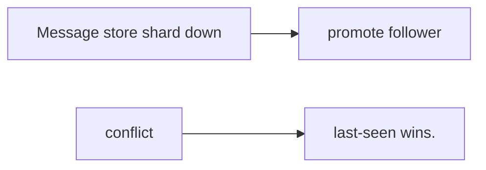
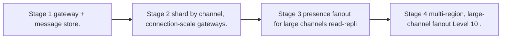

# Case Study: Chat Application

> **Tier:** intermediate · **Status:** draft · Original numbers and diagrams.

## 1. Problem statement
Real-time 1:1 and group chat: low-latency message delivery, online presence, message
history, and delivery/read receipts. A connection-stateful, latency-sensitive system.

## 2. Scope
**In (v1):** 1:1 and small-group chat, presence, history, delivery/read receipts. **Out:**
voice/video, end-to-end encryption, large-channel fanout (noted as stage).

## 3. Functional requirements
- Send/receive messages in real time. - Show presence (online/offline). - Persist history
and load on demand. - Delivery/read receipts.

## 4. Non-functional requirements
- Message delivery latency < 200 ms p99. - Availability 99.9%. - Connection-scale: hold
millions of concurrent connections.

## 5. Explicit assumptions
1. 10M DAU, 50 messages/user/day = 500M/day. [assumption] 2. Avg connection held 20 min;
peak 2M concurrent connections. [assumption] 3. Messages ~200 B. [assumption]

## 6. Traffic estimation
- 500M/day ≈ 5,800 msg/s avg, ~58k/s peak. Connection-keepalive load dominates compute.

## 7. Storage estimation
- 500M × 200 B = 100 GB/day; retain 1 year ≈ 36 TB. Hot recent history in cache.

## 8. Bandwidth estimation
- 5,800 msg/s × ~200 B ≈ 1.2 MB/s avg; peak ~12 MB/s — modest; the challenge is connection
fan-out, not bytes.

## 9. API design
WebSocket for delivery; REST for history (`GET /messages/:channel?before=`); REST for
send. Presence via the connection layer.

## 10. Data model
`messages(id, channel_id, sender, body, ts, status)`; `channels(id, type, members)`;
`presence(user_id, status, last_seen)`. History keyed/sorted by (channel, ts).

## 11. High-level architecture

## 12. Request flow
Send: client → gateway → message service → persist → fanout routes to each recipient's
gateway → pushed over their socket. Receipts flow back the same path. History loaded via
REST on scroll.

## 13. Component responsibilities
Connection gateway: hold connections (stateful, async). Message service: persist + fanout.
Presence store: who's online. History API: paginated reads.

## 14. Database selection
Message store: a sharded store keyed by channel, ordered by ts (Cassandra/Scylla-like or
sharded KV with ts index) — write-heavy, time-ordered. Presence: a fast in-memory store.
Rejected: a single DB (can't hold millions of connections / write rate).

## 15. Caching strategy
Recent messages per channel cached (the common "open a chat" read). Presence cached in
memory; fall back to store.

## 16. Partitioning strategy
Messages sharded by `channel_id` (co-locates a channel's history). Connection gateway
sharded by `user_id` so a user's socket lives on one node (affinity) — failover re-binds.

## 17. Replication strategy
Messages RF=3 for durability; presence ephemeral, replicated for availability. Gateway
nodes stateless-ish except held connections; reconnect on failure (client retries).

## 18. Consistency model
Within a channel: messages ordered by server-assigned monotonic ID (total order per
channel). Cross-device: eventual (a second device may lag). Presence is eventually
consistent.

## 19. Failure scenarios
Gateway node loss: clients reconnect to another; in-flight messages redelivered (at-least
-once + client dedup by id). Message store shard down → promote follower. Presence
conflict → last-seen wins.

## 20. Reliability strategy
SLI delivery latency, delivery success; SLO 99.9%. At-least-once + idempotent sends.
Connection-level heartbeats to detect dead connections. Chaos: kill a gateway, assert
reconnect + redelivery.

## 21. Security considerations
Per-channel authorization; TLS on sockets; rate-limit sends per user; redact PII in logs;
content moderation hooks.

## 22. Observability strategy
Active connections, msg delivery latency, delivery success, presence store latency,
reconnect rate. Alert on connection drops and delivery latency.

## 23. Cost considerations
Connections (memory) + history storage dominate. Keep presence in-memory cheap; tier old
history to cold storage.

## 24. Scaling stages
Stage 1: gateway + message store. → Stage 2: shard by channel, connection-scale gateways.
→ Stage 3: presence fanout for large channels (read-replica presence). → Stage 4:
multi-region, large-channel fanout (Level 10).

## 25. Trade-offs
Connection-stateful gateway (unavoidable) vs stateless ideal. Total order per channel vs
global order (per-channel is cheaper). At-least-once + dedup vs exactly-once.

## 26. Alternative designs
Polling (rejected: latency + battery). A single global message bus (rejected: can't scale
to millions of connections). CRDT for offline edits (for richer clients; stage 4).

## 27. Interview discussion points
Clarify 1:1 vs group, scale, latency, offline behavior. Surface connection-statefulness,
fan-out, ordering, and at-least-once.

## 28. Original Mermaid diagrams

Standalone sources under `diagrams/case-studies/chat-application/`: `context.mmd`, `request-sequence.mmd`, `failure-flow.mmd`, `scaling-evolution.mmd`. Additional diagrams for this case study:

## 29. Further reading
Async I/O: Level 0; queues/fanout: Level 2; ordering/dedup: Level 4.

## 30. Practical exercises
1. Add group chat with 1k-member channels — fanout strategy? 2. Offline messages: store &
deliver on reconnect. 3. End-to-end encryption: key exchange design. 4. Reconnect storm on
a gateway restart — mitigation. 5. Re-estimate at 100M DAU.

---
Previous: [Notification platform](../beginner/notification-platform.md) · Next: [Social-media feed](social-media-feed.md)
