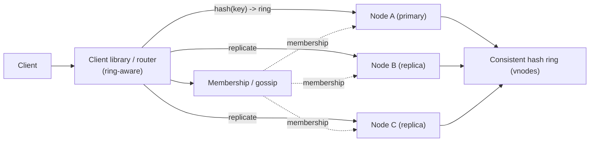
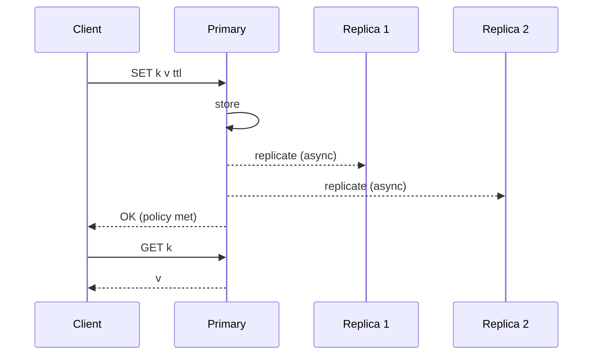
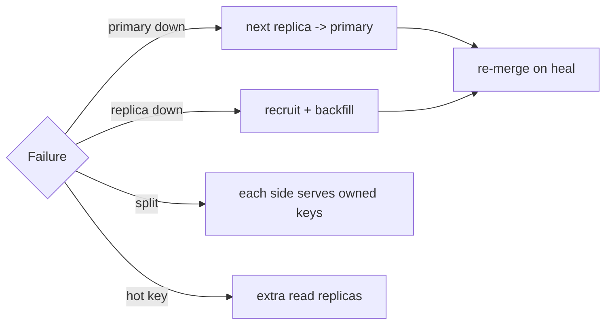
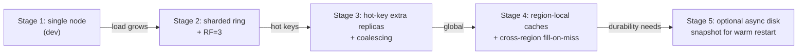
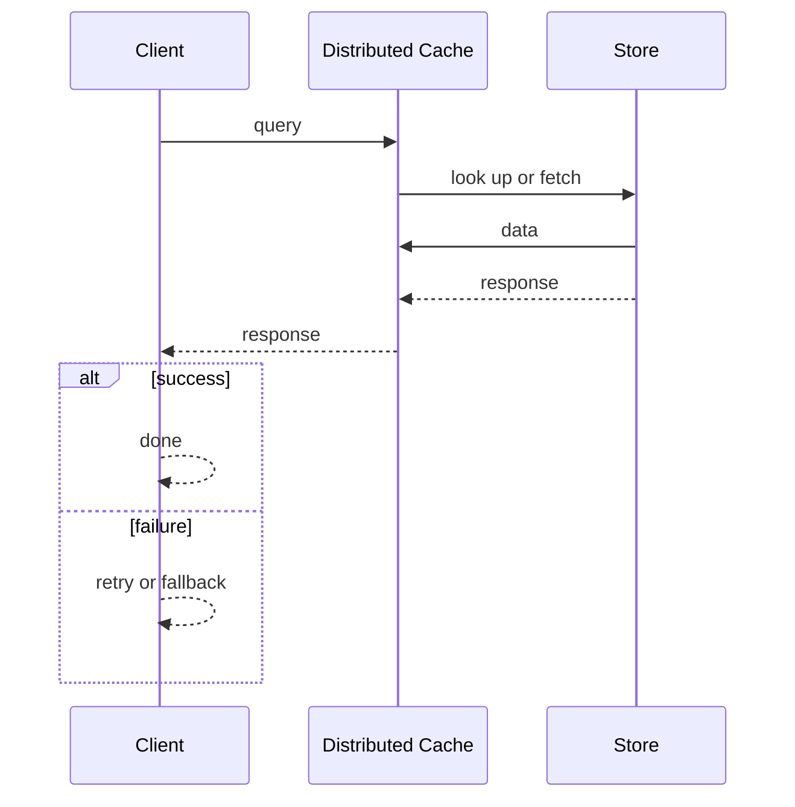
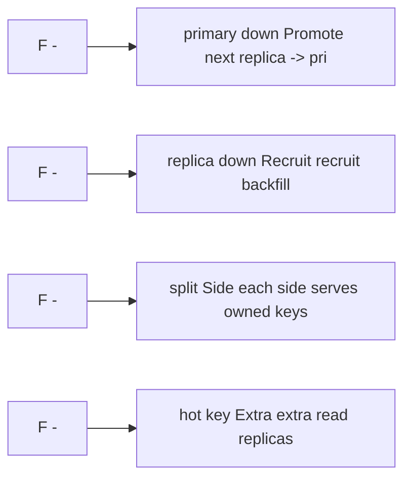

# Case Study: Distributed Cache

> **Tier:** intermediate · **Status:** complete
> A complete intermediate case study demonstrating the 30-section template for a stateful,
> consistency-sensitive system. All numbers and diagrams are original.

## 1. Problem statement
Many applications need a fast, shared, in-memory cache to offload hot reads from a
database. We need a **distributed cache** that behaves like one logical key-value store
across many nodes: O(1)-ish gets/sets, automatic partitioning, replication for failover,
and graceful handling of node loss and hot keys.

## 2. Scope
**In (v1):** `GET`, `SET` (with TTL), `DELETE`; partitioning across nodes; per-key
replication; node join/leave with minimal key movement; basic eviction (LRU).
**Out (v1):** multi-region, transactions across keys, persistent disk durability beyond
replication, rich data structures (sets/maps) — noted as scaling stages.

## 3. Functional requirements
- The cache **shall** store a value under a key with an optional TTL.
- The cache **shall** return the value for a `GET` or indicate a miss.
- The cache **shall** evict entries on TTL expiry or under memory pressure (LRU).
- The cache **shall** survive the loss of one node per key without data loss.
- The cache **shall** rebalance when nodes join or leave, moving only the affected keys.

## 4. Non-functional requirements
- Read latency p99 < 2 ms (in-memory); p99.9 < 10 ms even under a rebalance.
- Availability 99.9% per shard; the cluster degrades (some misses) rather than fails hard.
- Throughput: ~100k ops/s per node; horizontally scalable by adding nodes.
- Consistency: per-key linearizability via a primary owner; eventual consistency across
  replicas (bounded staleness < replication lag).

## 5. Explicit assumptions
1. ~10,000 keys/second average read rate per shard; 1k/s writes. [assumption] (read-heavy)
2. Average value 4 KB; working set 50 GB across the cluster. [assumption]
3. Up to 100 nodes; one-node failure per replica group is the design failure. [assumption]
4. Hot keys: a single key can drive 1–5% of traffic; must not melt one node. [constraint]
5. Replication factor 3 per key (primary + 2 replicas). [constraint]

## 6. Traffic estimation
- 100 nodes × 100k ops/s = **10M ops/s cluster** at full scale.
- Reads ~90% → 9M reads/s; writes ~1M writes/s.
- Per-node: ~90k reads/s + 10k writes/s. Read:write ≈ 9:1, read-heavy.

## 7. Storage estimation
- Working set 50 GB across 100 nodes → ~500 MB/node hot data + replicas (×3) → ~1.5 GB/node.
- In-memory only; far below node RAM. Headroom is for *peak* working set growth, not average.

## 8. Bandwidth estimation
- 9M reads/s × 4 KB ≈ 36 GB/s egress cluster-wide; per node ~360 MB/s — manageable on 10 GbE.
- Writes 1M/s × 4 KB ≈ 4 GB/s ingress cluster-wide. Network is comfortable at this scale.

## 9. API design
| Method | Path/Op | Request | Response | Idempotent |
|--------|---------|---------|----------|:---------:|
| GET | `key` | — | value or `MISS` | yes |
| SET | `key ttl value` | — | `OK` | yes (last-write-wins) |
| DELETE | `key` | — | `OK`/`MISS` | yes |
| STATS | node/cluster | — | op counts, memory, evictions | yes |

## 10. Data model
A flat key→value map partitioned across nodes. No schema; values are opaque bytes. Each node
owns a contiguous range of a **consistent hash ring** (with vnodes for balance). Per key, a
**primary owner** (the first node clockwise) plus the next two nodes are **replicas**.

## 11. High-level architecture

## 12. Request flow
**GET:**
1. Client hashes the key onto the ring and routes to the **primary owner**.
2. Primary serves from memory; on miss returns `MISS` (we do not consult the DB — that's the
   caller's job; we are a cache).
3. For higher availability, a read can go to a replica (accepting staleness), but the default
   is primary for read-your-writes.

**SET:**
1. Client routes to the primary owner.
2. Primary writes locally, replicates to the 2 replicas (async by default for latency;
   sync option for stronger durability).
3. Primary acks once replication policy is satisfied.

## 13. Component responsibilities
- **Client library/router**: ring-aware routing; retries on miss/failure; local membership
  cache.
- **Cache node**: stores its key range in memory; LRU eviction; TTL expiry; serves reads.
- **Consistent hash ring + vnodes**: maps keys to owners; minimizes movement on membership
  change.
- **Gossip/membership**: spreads join/leave/failure; detects dead nodes.
- **Replication**: per-key primary→replicas; configurable sync/async.

## 14. Database selection
**Chosen: in-memory per-node store (Redis-like or custom).** The "database" here is memory
itself; durability is via replication, not disk (we are a cache, not a source of truth).
- **Rejected: a single big Redis**: becomes a SPOF and bottleneck; we want horizontal scale.
- **Rejected: disk-backed store**: defeats the latency goal. The DB behind us is the source
  of truth, not the cache.

## 15. Caching strategy
We *are* the cache; internally:
- **LRU eviction** under memory pressure; **TTL expiry** by time.
- **Stampede protection**: on a hot miss, request **coalescing** (one fetch, others wait) —
  the client library or node serializes a single "load-from-DB" per key.
- **Hot-key offloading**: a key driving >X% of a node's traffic is **replicated to extra
  nodes** (read replicas) so no single node absorbs it.

## 16. Partitioning strategy
Consistent hashing on the key with vnodes (see `consistent_hashing.py`). Adding a node
moves only the keys near its ring position (~keys/N), not the whole keyspace. Vnodes
spread load so a new node doesn't dump all its keys onto one neighbor. Hot keys are handled
by extra replication, not by re-sharding (sharding can't fix a single hot key).

## 17. Replication strategy
- **Primary-replica (leaderless-ish), async** by default: primary owns writes, fans to 2
  replicas. RF=3 tolerates one node loss with two survivors.
- **Sync option** for keys needing stronger durability (wait for ≥1 replica ack).
- **Failover**: if the primary dies, the next replica in the ring becomes primary; the
  ring is rebalanced so a new replica is recruited.

## 18. Consistency model
- **Per-key linearizability** through the primary: a `SET` then `GET` routed to the primary
  always sees the latest value.
- **Replica reads** are eventually consistent (bounded by replication lag); used for
  read scale and hot-key offloading, accepting staleness.
- **Read-your-writes**: default to primary reads for the owning client; replica reads are
  opt-in per call (tunable consistency).

## 19. Failure scenarios
| Failure | Response |
|---------|---------|
| Primary down | Promote next replica to primary; recruit a new replica; rebalance. |
| Replica down | Recruit another node as replica; backfill from primary. |
| Network split | Each side serves owned keys; writes to keys whose primary is on the other side fail over to a replica (with a risk of brief divergence, resolved by primary re-merge on heal). |
| Hot key | Extra read replicas for that key; coalescing on misses. |
| Rebalance storm | Throttle key migration; serve from old owner until moved. |

## 20. Reliability strategy
- SLI: get/set success rate, latency p99; SLO 99.9% availability, p99 < 2 ms.
- RF=3 tolerates one node loss per key; stateless clients retry to replicas on failure.
- Backpressure: node caps concurrent ops; rejects with `OVERLOADED` rather than melting.
- Chaos: kill a node and assert the cluster keeps serving (some misses, no outage).
- Graceful degradation: on a miss or failure, return `MISS` so callers fall back to the DB
  rather than the cache failing the request.

## 21. Security considerations
- Authenticate clients (mTLS / shared token) — a cache is often on a trusted net but should
  not be open.
- Per-tenant quotas and keyspace prefixing to prevent cross-tenant access and noisy-neighbor
  eviction.
- No sensitive data in logs; values are opaque bytes.
- Rate limiting per client to prevent cache-flooding DoS.

## 22. Observability strategy
- Golden signals per node: ops/s, latency, errors (`OVERLOADED`/timeouts), saturation (memory
  utilization, eviction rate).
- Cluster metrics: hit ratio, hot-key ranking, rebalance throughput, replication lag.
- Tracing: per-request correlation ID through client→primary→replicas.
- Alerts: hit-ratio drop, eviction spike, replication-lag, node flapping.

## 23. Cost considerations
- Memory is the dominant cost; size each node to its working set + headroom + replicas.
- Egress is small (values are small); cost is RAM, not bandwidth.
- Avoid over-replication of cold keys; tune RF and eviction to keep only the hot working set.

## 24. Scaling stages

## 25. Trade-offs
| Decision | Chosen | Rejected | Reason |
|----------|--------|----------|--------|
| Partitioning | consistent hashing + vnodes | fixed ranges | minimal movement; balances uneven nodes |
| Replication | async primary-replica, RF=3 | sync everywhere | latency; sync reserved for keys needing durability |
| Read consistency | primary default, replica opt-in | always primary | balance read scale vs read-your-writes |
| Durability | replication only | disk WAL | we're a cache; DB is source of truth |
| Eviction | LRU + TTL | no eviction | memory is finite; unbounded = OOM |

## 26. Alternative designs
- **Client-side caching (no cluster)**: each app caches locally. Rejected: no sharing across
  instances; huge memory waste; coherence problems.
- **Memcached-style: no replication, just sharding**: simpler, but a node loss evicts its
  keys (a thundering herd to the DB). We add replication to avoid that cliff.
- **A single managed Redis cluster**: fine operationally; rejected here because we're
  designing the mechanics to teach partitioning/replication/failover.

## 27. Interview discussion points
- Clarify: is this a cache (DB is source of truth) or a store (we own durability)? That
  changes everything.
- The key ambiguity is the read:write ratio and hot-key behavior; surface it early.
- Depth cue: a strong candidate discusses consistent hashing + vnodes, RF vs availability,
  hot-key mitigation, and the stampede problem.
- Watch for: jumping to a single Redis without discussing sharding/failover/hot keys.

## 28. Original Mermaid diagrams

Standalone sources under `diagrams/case-studies/distributed-cache/`: `context.mmd`, `request-sequence.mmd`, `failure-flow.mmd`, `scaling-evolution.mmd`. Request sequence and failure flow:

## 29. Further reading
Consistent hashing: S-CHASH · Dynamo: S-DYNAMO · Redis: S-REDIS · gossip: S-GOSSSIP ·
consistent_hashing.py simulation in `examples/`.

## 30. Practical exercises
1. Re-estimate at 1B keys with 80 GB working set. How many nodes and replicas?
2. Add a requirement: values up to 1 MB. How do large values change eviction and network?
3. Design the failover test proving a primary loss causes no data loss and <1 s of misses.
4. A single key drives 10% of traffic. Walk through every mitigation and its limits.
5. Add multi-region: what changes about consistency, fill-on-miss, and egress cost?

---
Previous: [URL shortener](../beginner/url-shortener.md) · Next: (next intermediate case study)

