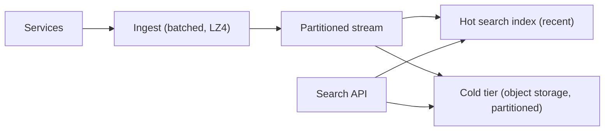
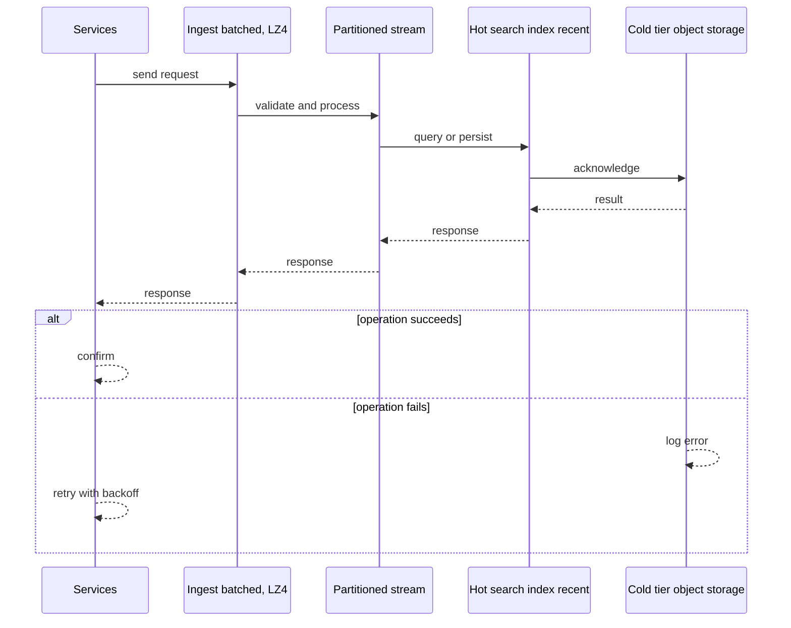
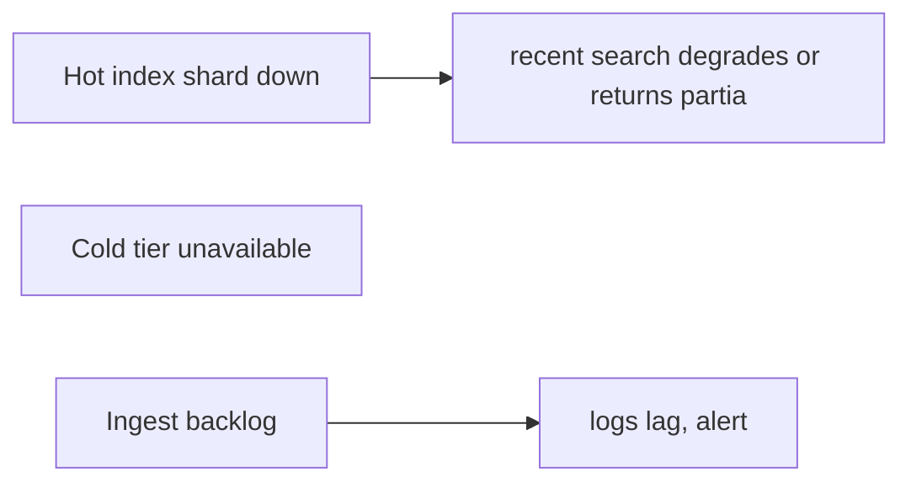
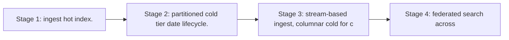

# Case Study: Logging Platform

> **Tier:** intermediate · **Status:** complete · Original numbers and diagrams.

## 1. Problem statement
Ingest, store, and query logs from many services at high event rates, with retention and
search. Write-heavy, append-only, tiered storage.

## 2. Scope
**In (v1):** ingest (batched), store, search recent logs, retention/tiering. **Out:**
metrics/traces (separate; observability chapter), alerting UI.

## 3. Functional requirements
- Ingest structured logs from services (batched).
- Store with retention.
- Search recent
logs by service/severity/text/time. - Tier old logs to cold storage.

## 4. Non-functional requirements
- Ingest throughput: millions of events/s. - Search latency p99 < 2 s (recent window).
- Durability 11 nines (via replication + cold tier).

## 5. Explicit assumptions
1. 1M events/s peak, avg ~500 B each. [assumption] 2. Retain 7 days hot, 1 year cold.
[constraint] 3. ~95% of queries touch the last 24h. [assumption]

## 6. Traffic estimation
- 1M/s ingest = 500 MB/s ingress. Queries far fewer but scan large windows.

## 7. Storage estimation
- 1M/s × 500 B × 86400 ≈ 43 TB/day hot; 7 days ≈ 300 TB hot; 1 year cold ≈ 15 PB (object
storage, compressed).

## 8. Bandwidth estimation
- Ingress 500 MB/s sustained; queries scan GBs–TBs. Ingest bandwidth is significant.

## 9. API design
| Method | Path | Request | Response |
|--------|------|---------|----------|
| POST | /ingest (batch) | [events] | ack |
| GET | /search | query, time window | results |

## 10. Data model
Events partitioned by `(service, ts)`, stored as compressed columnar/batched objects for
cold, and in a hot search index for recent. Fields: service, severity, ts, message, attrs.

## 11. High-level architecture

## 12. Request flow
Ingest: services batch logs → ingest compresses → stream → hot index (recent) + cold tier
(partitioned objects). Search: route by time window to hot index (recent) or cold (old,
slower); merge results.

## 13. Component responsibilities
Ingest: batch + compress. Stream: partition by service/ts. Hot index: searchable recent.
Cold tier: cheap durable retention. Search API: route + merge.

## 14. Database selection
Hot: a search/OLAP store (Elasticsearch/OpenSearch or a columnar store) for recent queries.
Cold: object storage partitioned by date, queried via a scan engine. Rejected: one hot
index for a year (cost); pure object (slow recent search).

## 15. Caching strategy
Cache common queries (by service/severity/window). Hot shards cached in memory; cold queries
scan object storage.

## 16. Partitioning strategy
Partition by `(service, date)` so a query touches one partition slice; cold storage
partitioned by date for cheap scans and lifecycle (delete/tier whole days).

## 17. Replication strategy
Hot index RF=3; cold tier uses object storage durability. Ingest at-least-once; dedup by
event id where needed.

## 18. Consistency model
Recent logs: near-real-time (seconds of lag). Cold tier: immutable once written. Search is
eventually consistent with ingest.

## 19. Failure scenarios
Hot index shard down → recent search degrades or returns partial. Cold tier unavailable →
old queries fail (not the hot path). Ingest backlog → logs lag, alert.

## 20. Reliability strategy
SLI ingest success, search latency; SLO 99.9% ingest. Backpressure on ingest backlog; DLQ
for undeliverable batches. Chaos: kill a hot shard, assert partial-but-serving recent
search.

## 21. Security considerations
Redact secrets/PII at ingest (don't store them); per-tenant log isolation; access control on
search; retention/deletion for compliance.

## 22. Observability strategy
Ingest rate, ingest backlog/lag, hot index size, cold tier growth, search latency by
window, query rate. Alert on ingest lag and hot-index saturation.

## 23. Cost considerations
Cold tier (object storage) is cheap; hot index is expensive → keep hot window minimal (7
days). Compress; partition by date for clean lifecycle.

## 24. Scaling stages
Stage 1: ingest + hot index. → Stage 2: partitioned cold tier + date lifecycle. → Stage 3:
stream-based ingest, columnar cold for cheap scans. → Stage 4: federated search across
hot+cold, sampling for huge scans.

## 25. Trade-offs
Hot window size (cost vs search speed). Partition by date (clean lifecycle, scan-friendly)
vs by hash (better load balance, harder retention). Compress (saves storage, CPU).

## 26. Alternative designs
All-hot for a year (cost explosion). Pure object no index (slow recent search). One big
index unpartitioned (can't scale ingest/search).

## 27. Interview discussion points
Clarify ingest rate, retention, query patterns. Surface write-heaviness, tiering, and
partition-by-date for lifecycle — the cost levers.

## 28. Original Mermaid diagrams
Standalone sources under `diagrams/case-studies/logging-platform/`: `context.mmd`, `request-sequence.mmd`, `failure-flow.mmd`, `scaling-evolution.mmd`. The diagrams are embedded in their respective sections: architecture in section 11, request flow in section 12, failure scenarios in section 19, and scaling stages in section 24.

## 29. Further reading
Search engines: Level 2; tiering/lifecycle: Level 3; streams: Level 10; logs/metrics/traces:
Level 8. Sources: `S-CHASH` `S-DYNAMO`.

## 30. Practical exercises
1. Re-estimate with 5-year retention — cold tier size and cost. 2. Add structured field
search — index trade-offs. 3. Design ingest backpressure without dropping logs. 4. A query
scans a year — how to make it affordable (sampling/summary). 5. Add alerting on log
patterns.

---
Previous: [Search autocomplete](search-autocomplete.md) · Next: (next intermediate case study)

