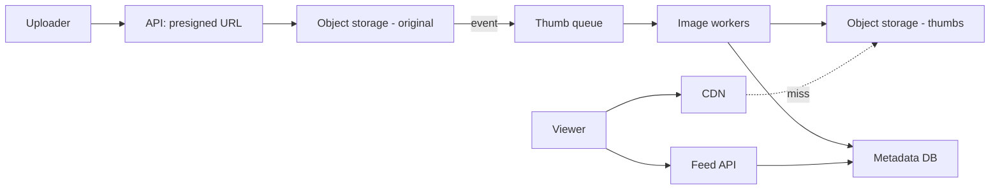
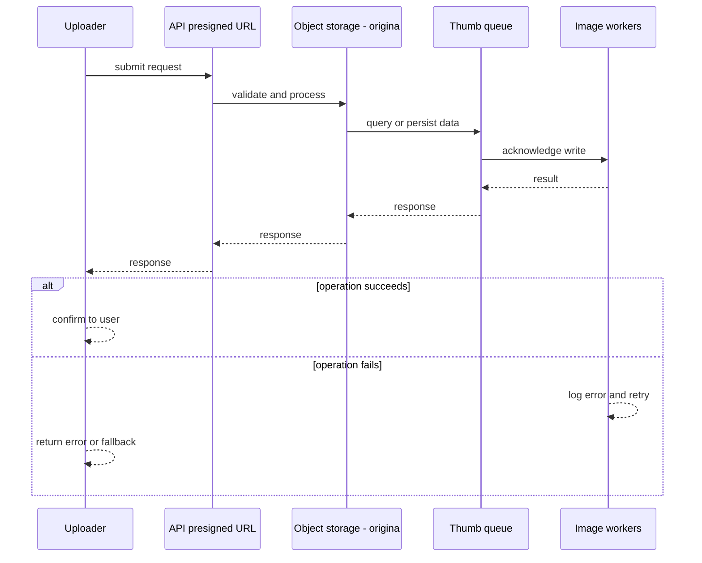
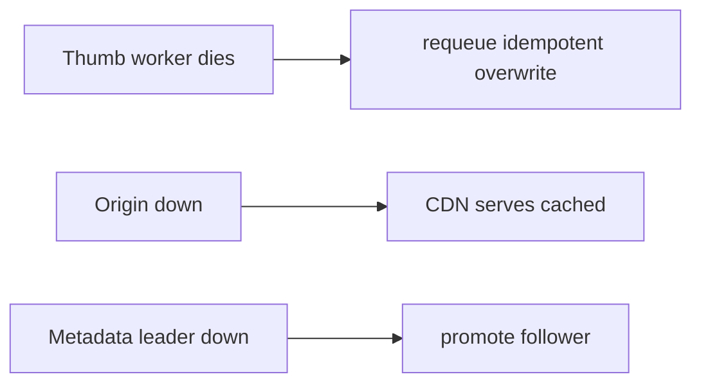

# Case Study: Photo-Sharing Platform

> **Tier:** intermediate · **Status:** complete · Original numbers and diagrams.

## 1. Problem statement
Users upload photos, followers view a feed of them. Storage- and bandwidth-dominated,
with thumbnails, CDN, and metadata. (Shares storage concepts with the video-streaming case.) This is a intermediate-tier system design challenge because it must handle high availability under peak load while ensuring no single point of failure. The design must be production-grade: observable, debuggable, reversible, and able to survive component failures without data loss or cascading outages.

## 2. Scope
**In (v1):** upload, store, generate thumbnails, serve via CDN, basic feed. **Out:**
albums, editing, face tagging.

For Photo-Sharing Platform, these boundaries keep the first version focused on the core user value. Adding more features would dilute the design and delay shipping. Each excluded item is a scaling stage — a candidate for the next iteration once the baseline is proven.

## 3. Functional requirements
- Upload a photo, store durably, generate thumbnails. - Serve originals and thumbnails at
scale. - Show a feed of a user's/followed photos.

For Photo-Sharing Platform, these requirements drive specific architectural decisions: the read-write ratio determines the caching strategy, the durability target sets the replication mode, and the idempotency requirement shapes the API contract.

## 4. Non-functional requirements
- Upload durable (11 nines).
- Thumbnail/serve p99 < 200 ms (CDN).
- Bandwidth-dominated:
egress is the binding cost.

For Photo-Sharing Platform, each non-functional target constrains a specific component: the latency SLO bounds the number of synchronous hops, the availability target forces redundancy across availability zones, and the cost ceiling limits the replication factor and storage tier.

## 5. Explicit assumptions
1. 10M users, 5 photos/day, avg 3 MB original + 100 KB thumb. [assumption] 2. Each photo
viewed ~50 times. [assumption] 3. Retain forever. [constraint]

For Photo-Sharing Platform, if these assumptions are off by an order of magnitude, the architecture must adapt: 10x traffic may require earlier sharding, a different read-write ratio changes the caching strategy, and a higher peak multiplier demands more headroom.

## 6. Traffic estimation
- Uploads: 50M/day ≈ 580/s avg. - Views: 2.5B/day ≈ 29k/s avg, ~290k/s peak (read-heavy).

To derive the request rate: divide the daily volume by 86,400 seconds to get the average rate, then multiply by 5-10x for peak. The read-to-write ratio determines whether the system is cache-dominated (read-heavy) or write-path-dominated (write-heavy). For Photo-Sharing Platform, this ratio shapes the entire storage and replication strategy.

## 7. Storage estimation
- 50M × (3 MB + 0.1 MB) ≈ 155 GB/day; 1 year ≈ 56 TB originals + thumbs. Tier cold.

For Photo-Sharing Platform, storage growth is projected from the daily write volume and retention policy. Index overhead and compression factors are accounted for in the total.

## 8. Bandwidth estimation
- Views 29k/s × ~100 KB thumb ≈ 2.9 GB/s avg; originals less frequent. Egress dominates.

Bandwidth is request rate multiplied by average payload size for ingress, and response rate multiplied by response size for egress. CDN and edge caching reduce origin egress. Compression reduces bandwidth by 50-80 percent where applicable. For Photo-Sharing Platform, bandwidth may or may not be the binding constraint — compare it against compute and storage to find out.

## 9. API design
| Method | Path | Request | Response |
|--------|------|---------|----------|
| POST | /photos | metadata | presigned upload URL |
| GET | /photos/:id | — | metadata + |
| GET | /img/:id/:size | — | image (CDN) |

## 10. Data model
`photos(id, owner, sizes{thumb,med,full}, ts, exif?)`. Media in object storage; metadata in
a sharded DB.

For Photo-Sharing Platform, the data model follows the access pattern. The primary lookup determines the partition key; secondary lookups determine indexes. Denormalization is used selectively on hot read paths.

## 11. High-level architecture

## 12. Request flow
Upload: presigned multipart → object storage → event → thumb worker generates sizes →
metadata → feed. View: CDN serves cached image or fetches from origin; feed API returns
metadata + image URLs.

## 13. Component responsibilities
API: presign + metadata. Object storage: durable media. Thumb workers: derive sizes. CDN:
serve. Feed API: feed metadata.

For Photo-Sharing Platform, each component has one job. The gateway authenticates and routes. Services are stateless and scale horizontally. The data tier is the stateful core that scales by sharding.

## 14. Database selection
Object storage for images (blobs); sharded KV/relational for metadata keyed by photo id.
Rejected: DB for images (wrong access pattern, cost).

For Photo-Sharing Platform, the database was chosen by access pattern, not familiarity. The rejected alternatives were wrong for this workload, not bad in general.

## 15. Caching strategy
CDN caches thumbnails (immutable, cacheable indefinitely). Feed metadata cached short TTL.
Thumbnails dominate egress — edge hit ratio is the lever.

For Photo-Sharing Platform, the cache strategy matches the staleness tolerance. Cache-aside for most data, write-through where read-after-write matters, stampede protection on hot keys.

## 16. Partitioning strategy
Media: object storage distributes internally. Metadata sharded by `photo_id`/`owner_id`.
Feed by `owner_id`.

For Photo-Sharing Platform, the partition key balances query locality with even load distribution. Sharding strategy matters because a poor key creates hot spots under real traffic patterns.

## 17. Replication strategy
Object storage provides durability internally. Metadata DB leader-follower, RF=3.

For Photo-Sharing Platform, replication mode is split: synchronous where durability is critical, asynchronous elsewhere for throughput. RF=3 tolerates one failure. Failover is tested regularly.

## 18. Consistency model
Images immutable (strong trivially). Metadata eventually consistent across replicas.
Feed eventually consistent; read-your-writes for the uploader.

For Photo-Sharing Platform, the consistency level is the weakest users accept. Read-your-writes is provided where needed. Eventual consistency is bounded and monitored, not unbounded and silent.

## 19. Failure scenarios
Thumb worker dies → requeue (idempotent overwrite). Origin down → CDN serves cached.
Metadata leader down → promote follower.

## 20. Reliability strategy
SLI serve latency, upload durability; SLO 99.9%. CDN absorbs origin failures. Chaos: kill
origin region, assert thumbs still serve.

For Photo-Sharing Platform, the SLO makes reliability measurable. The error budget balances feature velocity with stability. Chaos testing validates that resilience claims hold under real failures.

## 21. Security considerations
Presigned scoped/time-limited URLs; per-photo access control for private content;
rate-limit uploads; EXIF stripping (privacy).

For Photo-Sharing Platform, security layers TLS, encryption at rest, RBAC, PII redaction, and audit. The policy gateway is fail-closed for AI-augmented operations.

## 22. Observability strategy
Edge hit ratio, origin egress, thumb queue depth, upload success, serve latency. Alert on
hit-ratio drop (cost spike).

For Photo-Sharing Platform, observability combines logs, metrics, and traces with correlation IDs. Golden signals drive the first dashboard. Alerts fire on burn rate, not raw thresholds.

## 23. Cost considerations
Egress + storage dominate. Edge hit ratio cuts egress; tier cold originals; generate only
needed sizes.

For Photo-Sharing Platform, cost is driven by the binding resource. Caching, tiering, batching, and right-sizing are the levers. Cost per request is tracked and alerted on.

## 24. Scaling stages
Stage 1: object storage + thumb workers + simple CDN. → Stage 2: global CDN, multi-region
origin. → Stage 3: tier cold originals, on-demand resizing. → Stage 4: ML-based
optimization (format, lazy sizes).

## 25. Trade-offs
Pre-generate all sizes (fast serve, more storage) vs on-demand (less storage, latency).
Edge cache vs origin (edge wins egress). Store forever vs tier (tier wins cost).

For Photo-Sharing Platform, each trade-off lists what was chosen, what was rejected, and why. This makes the design defensible in review — every decision has documented reasoning.

## 26. Alternative designs
On-demand resizing at the edge (saves storage, adds latency; viable at stage 3). DB for
images (rejected). Single origin no CDN (rejected — egress/latency).

For Photo-Sharing Platform, the alternatives are real architectures that work under different constraints. They were rejected for this workload's specific requirements, not because they are bad designs.

## 27. Interview discussion points
Clarify sizes, retention, views. Surface object storage + CDN + the egress/storage
dominance. Compare to the video-streaming case.

For Photo-Sharing Platform in an interview: clarify scope first, surface the read-write ratio, design the hot path deeply, discuss failures, and offer an alternative. Weak candidates skip failure modes.

## 28. Original Mermaid diagrams
Standalone sources under `diagrams/case-studies/photo-sharing-platform/`: `context.mmd`, `request-sequence.mmd`, `failure-flow.mmd`, `scaling-evolution.mmd`. The diagrams are embedded in their respective sections: architecture in section 11, request flow in section 12, failure scenarios in section 19, and scaling stages in section 24.

## 29. Further reading
Object storage/CDN: Level 2; image pipeline like video-streaming case study; tiering: L3. Sources: `S-CHASH` `S-DYNAMO`.

## 30. Practical exercises
1. Add on-demand resizing at the edge. 2. Re-estimate egress with 100 views/photo. 3.
Design private-photo access control. 4. Add EXIF stripping at upload. 5. Tier cold
originals — what's the recall latency trade?

---
Previous: [Social-media feed](social-media-feed.md) · Next: [Search autocomplete](search-autocomplete.md)

