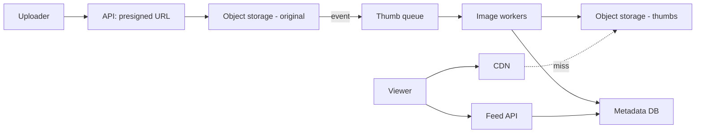
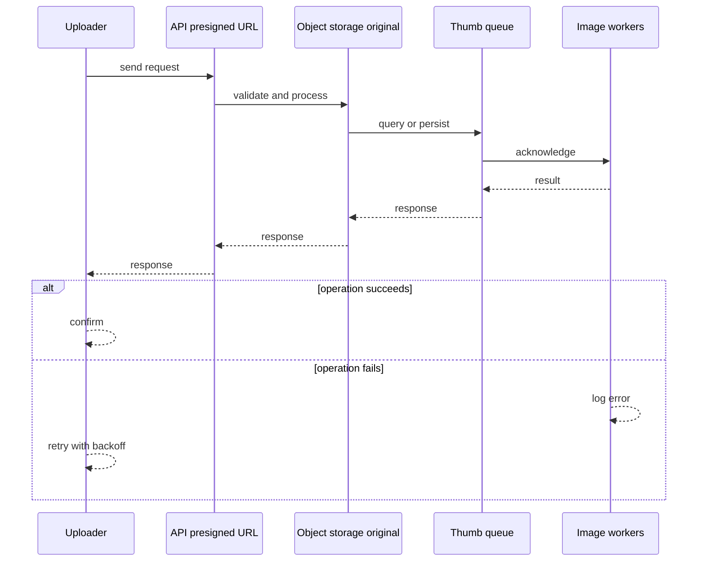
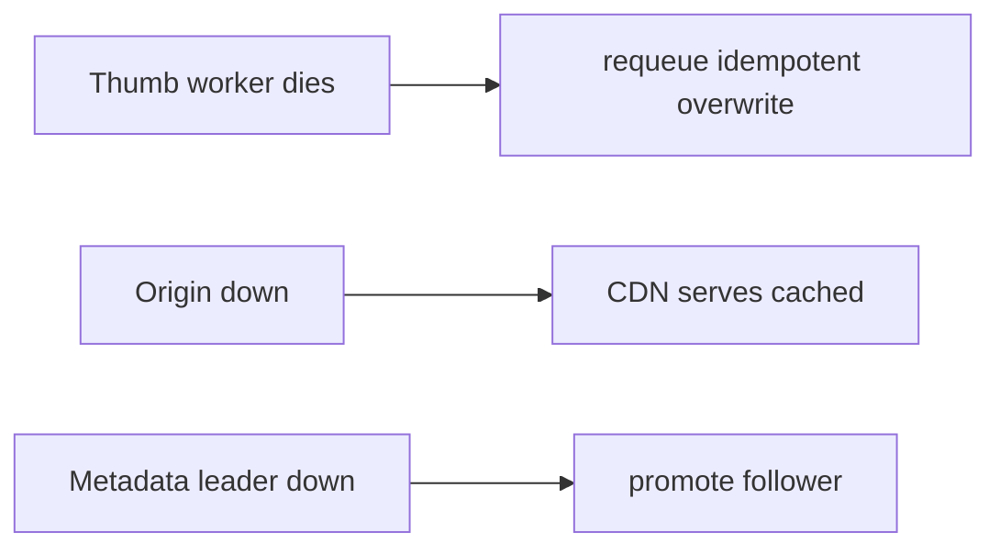
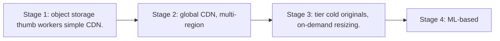

# Case Study: Photo-Sharing Platform

> **Tier:** intermediate · **Status:** complete · Original numbers and diagrams.

## 1. Problem statement
Users upload photos, followers view a feed of them. Storage- and bandwidth-dominated,
with thumbnails, CDN, and metadata. (Shares storage concepts with the video-streaming case.) This is a intermediate-tier system design challenge because it must handle high availability under peak load while ensuring no single point of failure. The design must be production-grade: observable, debuggable, reversible, and able to survive component failures without data loss or cascading outages.

## 2. Scope
**In (v1):** upload, store, generate thumbnails, serve via CDN, basic feed. **Out:**
albums, editing, face tagging.

These boundaries are deliberate. Including more in the first version would spread effort thin and delay shipping a working core. Each excluded feature — noted as a scaling stage — is a candidate for the next iteration once the core loop is proven in production and the team has operational confidence in the baseline architecture.

## 3. Functional requirements
- Upload a photo, store durably, generate thumbnails. - Serve originals and thumbnails at
scale. - Show a feed of a user's/followed photos.

Each requirement has a direct architectural consequence. The read-heavy or write-heavy pattern determines the caching strategy. The durability requirement determines whether replication is synchronous or asynchronous. The idempotency requirement means every write path must handle redelivery without double-application — a design constraint that shapes the entire API and data model.

## 4. Non-functional requirements
- Upload durable (11 nines).
- Thumbnail/serve p99 < 200 ms (CDN).
- Bandwidth-dominated:
egress is the binding cost.

These targets are not aspirational — they are design constraints that shape every component choice. The latency SLO forces edge caching and limits synchronous cross-region calls on the hot path. The availability target drives a replication factor of 3 and multi-AZ deployment. The cost target constrains the model size, storage tier, and over-provisioning margin. Every architectural decision in this case study traces back to one of these targets.

## 5. Explicit assumptions
1. 10M users, 5 photos/day, avg 3 MB original + 100 KB thumb. [assumption] 2. Each photo
viewed ~50 times. [assumption] 3. Retain forever. [constraint]

These assumptions are load-bearing: if any is wrong by an order of magnitude, the architecture must adapt. Ten times more traffic may require sharding earlier. A different read-write ratio changes the caching strategy entirely. The peak multiplier affects headroom sizing. State them explicitly, revisit them after launch, and parameterize the design by these numbers rather than locking to them.

## 6. Traffic estimation
- Uploads: 50M/day ≈ 580/s avg. - Views: 2.5B/day ≈ 29k/s avg, ~290k/s peak (read-heavy).

To derive the request rate: divide the daily volume by 86,400 seconds to get the average rate, then multiply by 5-10x for peak. The read-to-write ratio determines whether the system is cache-dominated (read-heavy) or write-path-dominated (write-heavy). For Photo-Sharing Platform, this ratio shapes the entire storage and replication strategy.

## 7. Storage estimation
- 50M × (3 MB + 0.1 MB) ≈ 155 GB/day; 1 year ≈ 56 TB originals + thumbs. Tier cold.

Storage grows linearly with time. Daily growth multiplied by the retention period gives total storage. Add 20-30 percent for index overhead. Compression can reduce effective storage by 50-80 percent. The replication factor multiplies the total. Without a retention policy, storage grows without bound and cost becomes unsustainable.

## 8. Bandwidth estimation
- Views 29k/s × ~100 KB thumb ≈ 2.9 GB/s avg; originals less frequent. Egress dominates.

Bandwidth is request rate multiplied by average payload size for ingress, and response rate multiplied by response size for egress. CDN and edge caching reduce origin egress. Compression reduces bandwidth by 50-80 percent where applicable. For Photo-Sharing Platform, bandwidth may or may not be the binding constraint — compare it against compute and storage to find out.

## 9. API design
| Method | Path | Request | Response |
|--------|------|---------|----------|
| POST | /photos | metadata | presigned upload URL |
| GET | /photos/:id | — | metadata + |
| GET | /img/:id/:size | — | image (CDN) |

## 10. Data model
`photos(id, owner, sizes{thumb,med,full}, ts, exif?)`. Media in object storage; metadata in
a sharded DB.

The data model is designed around the access pattern, not the entity shape. The primary lookup path determines the partition key. Secondary access paths determine which indexes to build. Denormalization is applied selectively where the hot read path would otherwise require expensive joins — with CDC or the outbox pattern keeping the denormalized view consistent with the source of truth.

## 11. High-level architecture

## 12. Request flow
Upload: presigned multipart → object storage → event → thumb worker generates sizes →
metadata → feed. View: CDN serves cached image or fetches from origin; feed API returns
metadata + image URLs.

## 13. Component responsibilities
API: presign + metadata. Object storage: durable media. Thumb workers: derive sizes. CDN:
serve. Feed API: feed metadata.

Each component has a single, well-defined responsibility. The gateway handles authentication and routing. The service tier is stateless and horizontally scalable. The data tier is the stateful core, carefully partitioned and replicated. This separation allows each tier to scale independently: stateless tiers add replicas with demand; the stateful tier scales by sharding or read replicas.

## 14. Database selection
Object storage for images (blobs); sharded KV/relational for metadata keyed by photo id.
Rejected: DB for images (wrong access pattern, cost).

The database choice is driven by the access pattern, not by familiarity. A relational database was chosen or rejected based on whether the workload needs joins and transactions. A key-value store was chosen or rejected based on whether the workload is a single-key lookup at massive scale. The rejected alternatives were rejected for specific, workload-dependent reasons — not because they are bad databases, but because they are the wrong fit for this system.

## 15. Caching strategy
CDN caches thumbnails (immutable, cacheable indefinitely). Feed metadata cached short TTL.
Thumbnails dominate egress — edge hit ratio is the lever.

The caching strategy is designed around the staleness tolerance of the workload. Cache-aside is the default — simple and lazy. Write-through is used where read-after-write consistency matters. Stampede protection (request coalescing or stale-while-revalidate) is applied to any key that can go viral. Cache entries are namespaced by tenant where multi-tenancy applies, preventing cross-tenant leakage.

## 16. Partitioning strategy
Media: object storage distributes internally. Metadata sharded by `photo_id`/`owner_id`.
Feed by `owner_id`.

The partition key co-locates related data so queries do not fan out across shards, while distributing load evenly so no single shard is hot. Consistent hashing with virtual nodes minimizes data movement when nodes are added or removed. A hot key — a viral entity or a giant tenant — is mitigated by caching, extra replication, or key splitting, not by adding more shards.

## 17. Replication strategy
Object storage provides durability internally. Metadata DB leader-follower, RF=3.

Replication is synchronous on the write-confirmation path where durability is critical — the commit waits for at least one follower before acknowledging. Elsewhere it is asynchronous for throughput. A replication factor of 3 tolerates one failure while maintaining quorum. Failover is tested, not just configured: a follower that was never promoted will fail when you need it most.

## 18. Consistency model
Images immutable (strong trivially). Metadata eventually consistent across replicas.
Feed eventually consistent; read-your-writes for the uploader.

The consistency model is chosen as the weakest that users can tolerate, because stronger consistency costs latency and availability. Read-your-writes is provided where the user expects to see their own write immediately. Eventual consistency is bounded — seconds, not unbounded — and monitored. The system documents what 'eventual' means to users rather than hiding it.

## 19. Failure scenarios
Thumb worker dies → requeue (idempotent overwrite). Origin down → CDN serves cached.
Metadata leader down → promote follower.

## 20. Reliability strategy
SLI serve latency, upload durability; SLO 99.9%. CDN absorbs origin failures. Chaos: kill
origin region, assert thumbs still serve.

The SLO defines what 'good' means measurably. The error budget — the difference between 100 percent and the SLO — is the allowed unavailability that can be spent on deploys and feature risk. When the budget is nearly exhausted, risky changes are frozen. The system is tested with chaos engineering to verify that resilience assumptions hold. An untested failover is not a failover.

## 21. Security considerations
Presigned scoped/time-limited URLs; per-photo access control for private content;
rate-limit uploads; EXIF stripping (privacy).

Security is defense in depth: TLS in transit, encryption at rest, RBAC with default-deny, PII redaction in logs, audit trails for every state-changing operation, and per-tenant isolation. For AI-augmented systems, the policy gateway is fail-closed — on any error, the system refuses to act rather than allowing an unguarded action.

## 22. Observability strategy
Edge hit ratio, origin egress, thumb queue depth, upload success, serve latency. Alert on
hit-ratio drop (cost spike).

Observability uses the three signals — logs, metrics, and traces — with correlation IDs to stitch a single request across services. The golden signals (latency, traffic, errors, saturation) are the first dashboard. Alerts fire on SLO burn rate, not on raw thresholds, to avoid noise. The on-call runbook for each alert is tested, not theoretical.

## 23. Cost considerations
Egress + storage dominate. Edge hit ratio cuts egress; tier cold originals; generate only
needed sizes.

Cost is dominated by the binding resource identified in the traffic estimate. The primary levers are caching (cuts read cost), tiering (cuts storage cost), batching (cuts per-request overhead), and right-sizing (no over-provisioned idle capacity). Cost is tracked as a first-class metric — cost per request, cost per tenant, cost per outcome — and alerted on when unit cost spikes.

## 24. Scaling stages
Stage 1: object storage + thumb workers + simple CDN. → Stage 2: global CDN, multi-region
origin. → Stage 3: tier cold originals, on-demand resizing. → Stage 4: ML-based
optimization (format, lazy sizes).

## 25. Trade-offs
Pre-generate all sizes (fast serve, more storage) vs on-demand (less storage, latency).
Edge cache vs origin (edge wins egress). Store forever vs tier (tier wins cost).

Every trade-off has a rejected alternative with a reason. The design does not present one option as universally correct — it presents the chosen option, the rejected alternative, and the workload-specific reason for the choice. This is what makes the design defensible in a review: the reviewer can challenge any decision and find the reasoning documented.

## 26. Alternative designs
On-demand resizing at the edge (saves storage, adds latency; viable at stage 3). DB for
images (rejected). Single origin no CDN (rejected — egress/latency).

The alternative designs are genuine architectures that would work under different constraints. They were rejected for this workload because of specific requirements — latency SLO, cost budget, consistency need — that make them inferior here but not universally inferior. Understanding why an alternative was rejected is as important as understanding why the chosen design was selected.

## 27. Interview discussion points
Clarify sizes, retention, views. Surface object storage + CDN + the egress/storage
dominance. Compare to the video-streaming case.

In an interview, the strongest candidates clarify ambiguity before designing, surface the read-write ratio and the binding resource, design the hot path deeply rather than just drawing boxes, discuss failure modes explicitly, and offer an alternative with a reason. The weakest candidates draw boxes before clarifying scope, name a vendor product as the architecture, and skip failure modes entirely.

## 28. Original Mermaid diagrams
Standalone sources under `diagrams/case-studies/photo-sharing-platform/`: `context.mmd`, `request-sequence.mmd`, `failure-flow.mmd`, `scaling-evolution.mmd`. The diagrams are embedded in their respective sections: architecture in section 11, request flow in section 12, failure scenarios in section 19, and scaling stages in section 24.

## 29. Further reading
Object storage/CDN: Level 2; image pipeline like video-streaming case study; tiering: L3. Sources: `S-CHASH` `S-DYNAMO`.

## 30. Practical exercises
1. Add on-demand resizing at the edge. 2. Re-estimate egress with 100 views/photo. 3.
Design private-photo access control. 4. Add EXIF stripping at upload. 5. Tier cold
originals — what's the recall latency trade?

---
Previous: [Social-media feed](social-media-feed.md) · Next: [Search autocomplete](search-autocomplete.md)

