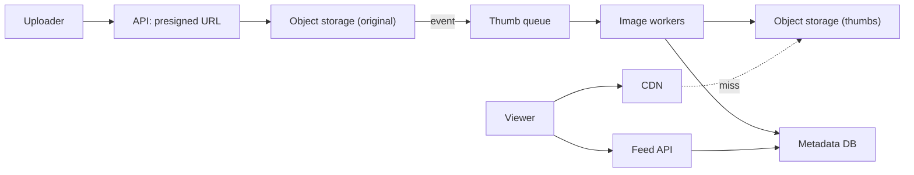
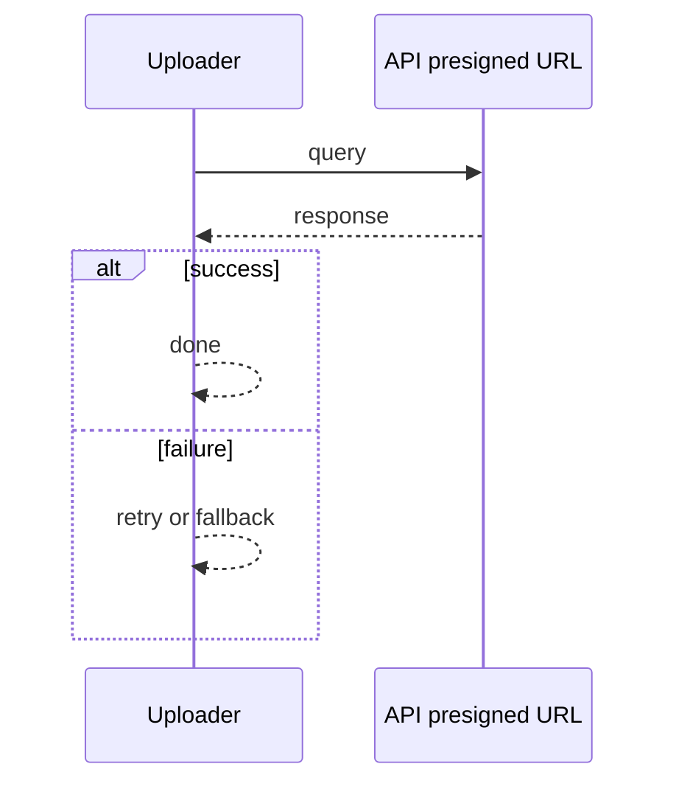
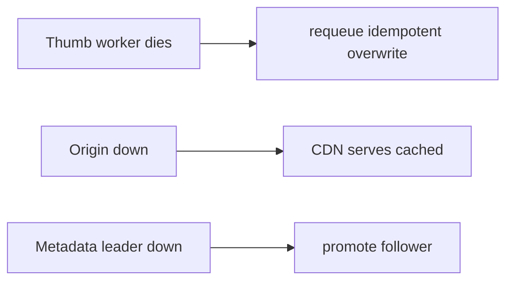

# Case Study: Photo-Sharing Platform

> **Tier:** intermediate · **Status:** complete · Original numbers and diagrams.

## 1. Problem statement
Users upload photos, followers view a feed of them. Storage- and bandwidth-dominated,
with thumbnails, CDN, and metadata. (Shares storage concepts with the video-streaming case.)

## 2. Scope
**In (v1):** upload, store, generate thumbnails, serve via CDN, basic feed. **Out:**
albums, editing, face tagging.

## 3. Functional requirements
- Upload a photo, store durably, generate thumbnails. - Serve originals and thumbnails at
scale. - Show a feed of a user's/followed photos.

## 4. Non-functional requirements
- Upload durable (11 nines).
- Thumbnail/serve p99 < 200 ms (CDN).
- Bandwidth-dominated:
egress is the binding cost.

## 5. Explicit assumptions
1. 10M users, 5 photos/day, avg 3 MB original + 100 KB thumb. [assumption] 2. Each photo
viewed ~50 times. [assumption] 3. Retain forever. [constraint]

## 6. Traffic estimation
- Uploads: 50M/day ≈ 580/s avg. - Views: 2.5B/day ≈ 29k/s avg, ~290k/s peak (read-heavy).

## 7. Storage estimation
- 50M × (3 MB + 0.1 MB) ≈ 155 GB/day; 1 year ≈ 56 TB originals + thumbs. Tier cold.

## 8. Bandwidth estimation
- Views 29k/s × ~100 KB thumb ≈ 2.9 GB/s avg; originals less frequent. Egress dominates.

## 9. API design
| POST | /photos | metadata | presigned upload URL | GET | /photos/:id | — | metadata +
URLs | GET | /img/:id/:size | — | image (CDN) |

## 10. Data model
`photos(id, owner, sizes{thumb,med,full}, ts, exif?)`. Media in object storage; metadata in
a sharded DB.

## 11. High-level architecture

## 12. Request flow
Upload: presigned multipart → object storage → event → thumb worker generates sizes →
metadata → feed. View: CDN serves cached image or fetches from origin; feed API returns
metadata + image URLs.

## 13. Component responsibilities
API: presign + metadata. Object storage: durable media. Thumb workers: derive sizes. CDN:
serve. Feed API: feed metadata.

## 14. Database selection
Object storage for images (blobs); sharded KV/relational for metadata keyed by photo id.
Rejected: DB for images (wrong access pattern, cost).

## 15. Caching strategy
CDN caches thumbnails (immutable, cacheable indefinitely). Feed metadata cached short TTL.
Thumbnails dominate egress — edge hit ratio is the lever.

## 16. Partitioning strategy
Media: object storage distributes internally. Metadata sharded by `photo_id`/`owner_id`.
Feed by `owner_id`.

## 17. Replication strategy
Object storage provides durability internally. Metadata DB leader-follower, RF=3.

## 18. Consistency model
Images immutable (strong trivially). Metadata eventually consistent across replicas.
Feed eventually consistent; read-your-writes for the uploader.

## 19. Failure scenarios
Thumb worker dies → requeue (idempotent overwrite). Origin down → CDN serves cached.
Metadata leader down → promote follower.

## 20. Reliability strategy
SLI serve latency, upload durability; SLO 99.9%. CDN absorbs origin failures. Chaos: kill
origin region, assert thumbs still serve.

## 21. Security considerations
Presigned scoped/time-limited URLs; per-photo access control for private content;
rate-limit uploads; EXIF stripping (privacy).

## 22. Observability strategy
Edge hit ratio, origin egress, thumb queue depth, upload success, serve latency. Alert on
hit-ratio drop (cost spike).

## 23. Cost considerations
Egress + storage dominate. Edge hit ratio cuts egress; tier cold originals; generate only
needed sizes.

## 24. Scaling stages
Stage 1: object storage + thumb workers + simple CDN. → Stage 2: global CDN, multi-region
origin. → Stage 3: tier cold originals, on-demand resizing. → Stage 4: ML-based
optimization (format, lazy sizes).

## 25. Trade-offs
Pre-generate all sizes (fast serve, more storage) vs on-demand (less storage, latency).
Edge cache vs origin (edge wins egress). Store forever vs tier (tier wins cost).

## 26. Alternative designs
On-demand resizing at the edge (saves storage, adds latency; viable at stage 3). DB for
images (rejected). Single origin no CDN (rejected — egress/latency).

## 27. Interview discussion points
Clarify sizes, retention, views. Surface object storage + CDN + the egress/storage
dominance. Compare to the video-streaming case.

## 28. Original Mermaid diagrams
Standalone sources under `diagrams/case-studies/photo-sharing-platform/`: `context.mmd`, `request-sequence.mmd`, `failure-flow.mmd`, `scaling-evolution.mmd`. The diagrams are embedded in their respective sections: architecture in section 11, request flow in section 12, failure scenarios in section 19, and scaling stages in section 24.

## 29. Further reading
Object storage/CDN: Level 2; image pipeline like video-streaming case study; tiering: L3.

## 30. Practical exercises
1. Add on-demand resizing at the edge. 2. Re-estimate egress with 100 views/photo. 3.
Design private-photo access control. 4. Add EXIF stripping at upload. 5. Tier cold
originals — what's the recall latency trade?

---
Previous: [Social-media feed](social-media-feed.md) · Next: [Search autocomplete](search-autocomplete.md)

