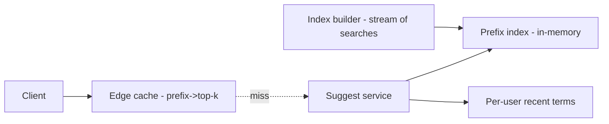
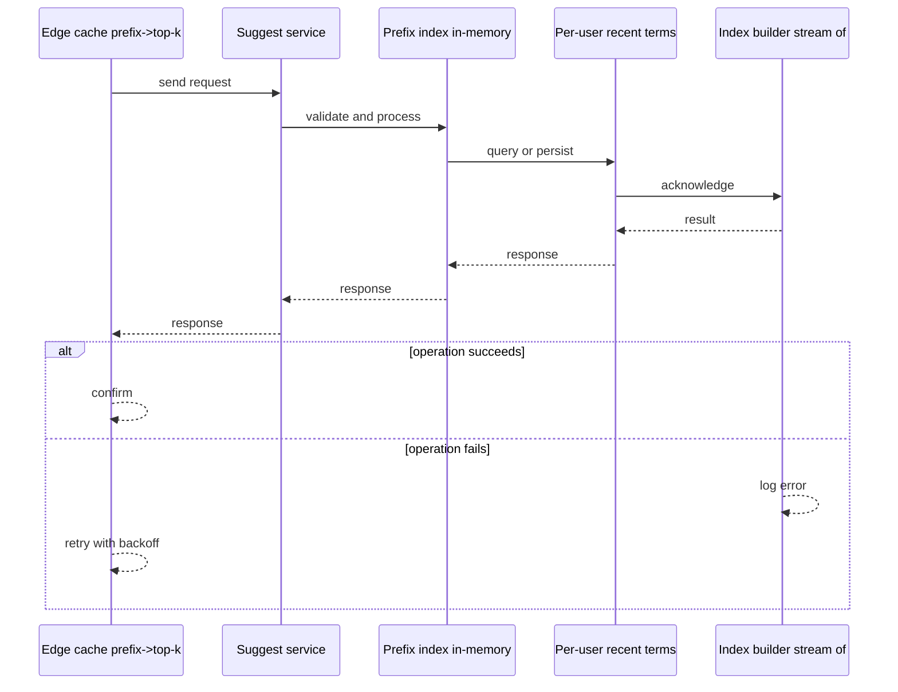
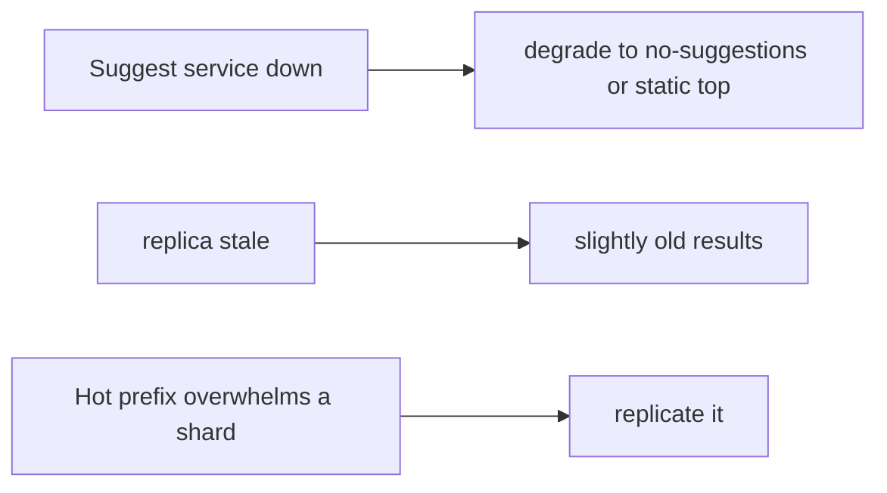
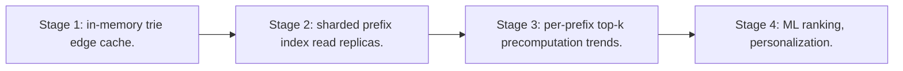

# Case Study: Search Autocomplete

> **Tier:** intermediate · **Status:** complete · Original numbers and diagrams.

## 1. Problem statement
As a user types a query, return ranked prefix completions within ~50 ms. Latency-critical,
high-QPS, and a classic trie/index problem. This is a intermediate-tier system design challenge because it must handle millions of reads per second while ensuring grounded, cited, and permission-aware answers. The design must be production-grade: observable, debuggable, reversible, and able to survive component failures without data loss or cascading outages.

## 2. Scope
**In (v1):** prefix-based completions ranked by popularity/recency, per-user personalization
optional. **Out:** semantic suggestions, spell correction.

These boundaries are deliberate. Including more in the first version would spread effort thin and delay shipping a working core. Each excluded feature — noted as a scaling stage — is a candidate for the next iteration once the core loop is proven in production and the team has operational confidence in the baseline architecture.

## 3. Functional requirements
- Return top-k completions for a prefix.
- Rank by popularity (and recency).
- Update
popular terms as trends change. - Per-user recent-history suggestions.

Each requirement has a direct architectural consequence. The read-heavy or write-heavy pattern determines the caching strategy. The durability requirement determines whether replication is synchronous or asynchronous. The idempotency requirement means every write path must handle redelivery without double-application — a design constraint that shapes the entire API and data model.

## 4. Non-functional requirements
- Latency p99 < 50 ms (per keystroke). - Availability 99.95% (degrade to no-suggestions, not
fail). - High QPS: one call per keystroke.

These targets are not aspirational — they are design constraints that shape every component choice. The latency SLO forces edge caching and limits synchronous cross-region calls on the hot path. The availability target drives a replication factor of 3 and multi-AZ deployment. The cost target constrains the model size, storage tier, and over-provisioning margin. Every architectural decision in this case study traces back to one of these targets.

## 5. Explicit assumptions
1. 100M users, ~10 suggestions/day? Re-estimate: 10M QPS peak (one per keystroke).
[assumption] 2. Top-k = 10. [constraint] 3. Suggestion corpus ~10M terms with scores.
[assumption]

These assumptions are load-bearing: if any is wrong by an order of magnitude, the architecture must adapt. Ten times more traffic may require sharding earlier. A different read-write ratio changes the caching strategy entirely. The peak multiplier affects headroom sizing. State them explicitly, revisit them after launch, and parameterize the design by these numbers rather than locking to them.

## 6. Traffic estimation
- 10M QPS peak; each call tiny. The challenge is per-keystroke latency at huge QPS, not
volume.

To derive the request rate: divide the daily volume by 86,400 seconds to get the average rate, then multiply by 5-10x for peak. The read-to-write ratio determines whether the system is cache-dominated (read-heavy) or write-path-dominated (write-heavy). For Search Autocomplete, this ratio shapes the entire storage and replication strategy.

## 7. Storage estimation
- Corpus 10M terms × (term + score + per-prefix index) → a few GB in memory per shard.
- Per-user recent terms: small, in a fast store.

Storage grows linearly with time. Daily growth multiplied by the retention period gives total storage. Add 20-30 percent for index overhead. Compression can reduce effective storage by 50-80 percent. The replication factor multiplies the total. Without a retention policy, storage grows without bound and cost becomes unsustainable.

## 8. Bandwidth estimation
- Tiny requests/responses (~100s of bytes); bandwidth trivial. Latency, not bandwidth.

Bandwidth is request rate multiplied by average payload size for ingress, and response rate multiplied by response size for egress. CDN and edge caching reduce origin egress. Compression reduces bandwidth by 50-80 percent where applicable. For Search Autocomplete, bandwidth may or may not be the binding constraint — compare it against compute and storage to find out.

## 9. API design
| Method | Path | Request | Response |
|--------|------|---------|----------|
| GET | /suggest?q=prefix&user=? | — | top-k completions | Cacheable by prefix (short TTL).

## 10. Data model
A prefix index (trie or sorted terms + per-prefix top-k lists). Scores per term;
per-prefix precomputed top-k to make lookup O(1)-ish. Per-user recent terms list.

The data model is designed around the access pattern, not the entity shape. The primary lookup path determines the partition key. Secondary access paths determine which indexes to build. Denormalization is applied selectively where the hot read path would otherwise require expensive joins — with CDC or the outbox pattern keeping the denormalized view consistent with the source of truth.

## 11. High-level architecture

## 12. Request flow
Client sends prefix → edge cache hit returns → else suggest service looks up the prefix
top-k list → merges per-user recent terms → returns top-k → caches at edge.

## 13. Component responsibilities
Edge cache: per-prefix caching. Suggest service: prefix lookup + merge. Index: in-memory
prefix→top-k. Builder: updates scores from search stream.

Each component has a single, well-defined responsibility. The gateway handles authentication and routing. The service tier is stateless and horizontally scalable. The data tier is the stateful core, carefully partitioned and replicated. This separation allows each tier to scale independently: stateless tiers add replicas with demand; the stateful tier scales by sharding or read replicas.

## 14. Database selection
In-memory prefix index (Redis trie / custom) for the hot path. A stream processing job
updates scores. Rejected: on-the-fly scoring from a DB (too slow per keystroke).

The database choice is driven by the access pattern, not by familiarity. A relational database was chosen or rejected based on whether the workload needs joins and transactions. A key-value store was chosen or rejected based on whether the workload is a single-key lookup at massive scale. The rejected alternatives were rejected for specific, workload-dependent reasons — not because they are bad databases, but because they are the wrong fit for this system.

## 15. Caching strategy
Edge caches prefix→top-k (short TTL); per-user recent terms cached. The prefix space is
bounded; high hit ratio at the edge.

The caching strategy is designed around the staleness tolerance of the workload. Cache-aside is the default — simple and lazy. Write-through is used where read-after-write consistency matters. Stampede protection (request coalescing or stale-while-revalidate) is applied to any key that can go viral. Cache entries are namespaced by tenant where multi-tenancy applies, preventing cross-tenant leakage.

## 16. Partitioning strategy
Prefix index sharded by prefix hash; high-QPS handled by many read replicas. Hot prefixes
(not, "new") — replicate top prefixes more.

The partition key co-locates related data so queries do not fan out across shards, while distributing load evenly so no single shard is hot. Consistent hashing with virtual nodes minimizes data movement when nodes are added or removed. A hot key — a viral entity or a giant tenant — is mitigated by caching, extra replication, or key splitting, not by adding more shards.

## 17. Replication strategy
In-memory index replicated to many read replicas (read-heavy); the builder updates and
publishes a new index version periodically (immutable snapshot swap).

Replication is synchronous on the write-confirmation path where durability is critical — the commit waits for at least one follower before acknowledging. Elsewhere it is asynchronous for throughput. A replication factor of 3 tolerates one failure while maintaining quorum. Failover is tested, not just configured: a follower that was never promoted will fail when you need it most.

## 18. Consistency model
Scores eventually consistent (a trend lags by the rebuild cadence — fine). Per-keystroke
results may be slightly stale; correctness not critical.

The consistency model is chosen as the weakest that users can tolerate, because stronger consistency costs latency and availability. Read-your-writes is provided where the user expects to see their own write immediately. Eventual consistency is bounded — seconds, not unbounded — and monitored. The system documents what 'eventual' means to users rather than hiding it.

## 19. Failure scenarios
Suggest service down → degrade to no-suggestions (or static top terms), not an error. Index
replica stale → slightly old results. Hot prefix overwhelms a shard → replicate it.

## 20. Reliability strategy
SLI latency p99 < 50 ms, availability 99.95%; degrade gracefully (no-suggestions). Chaos:
kill a suggest shard, assert graceful degradation.

The SLO defines what 'good' means measurably. The error budget — the difference between 100 percent and the SLO — is the allowed unavailability that can be spent on deploys and feature risk. When the budget is nearly exhausted, risky changes are frozen. The system is tested with chaos engineering to verify that resilience assumptions hold. An untested failover is not a failover.

## 21. Security considerations
Don't leak per-user recent terms cross-user; rate-limit per client to prevent scraping the
index; sanitize prefixes.

Security is defense in depth: TLS in transit, encryption at rest, RBAC with default-deny, PII redaction in logs, audit trails for every state-changing operation, and per-tenant isolation. For AI-augmented systems, the policy gateway is fail-closed — on any error, the system refuses to act rather than allowing an unguarded action.

## 22. Observability strategy
p99 latency per keystroke, cache hit ratio, suggest error/degrade rate, index freshness,
hot-prefix skew.

Observability uses the three signals — logs, metrics, and traces — with correlation IDs to stitch a single request across services. The golden signals (latency, traffic, errors, saturation) are the first dashboard. Alerts fire on SLO burn rate, not on raw thresholds, to avoid noise. The on-call runbook for each alert is tested, not theoretical.

## 23. Cost considerations
In-memory replicas × QPS; cost is RAM. Right-size replicas to hit-ratio + latency targets.

Cost is dominated by the binding resource identified in the traffic estimate. The primary levers are caching (cuts read cost), tiering (cuts storage cost), batching (cuts per-request overhead), and right-sizing (no over-provisioned idle capacity). Cost is tracked as a first-class metric — cost per request, cost per tenant, cost per outcome — and alerted on when unit cost spikes.

## 24. Scaling stages
Stage 1: in-memory trie + edge cache. → Stage 2: sharded prefix index + read replicas. →
Stage 3: per-prefix top-k precomputation + trends. → Stage 4: ML ranking, personalization.

## 25. Trade-offs
Precompute per-prefix top-k (fast reads, index build cost) vs compute on the fly (slow).
Degrade to no-suggestions vs fail. Replicate hot prefixes vs uniform sharding.

Every trade-off has a rejected alternative with a reason. The design does not present one option as universally correct — it presents the chosen option, the rejected alternative, and the workload-specific reason for the choice. This is what makes the design defensible in a review: the reviewer can challenge any decision and find the reasoning documented.

## 26. Alternative designs
Live DB scoring (too slow). Single trie unsharded (can't serve 10M QPS). Chosen: sharded
in-memory + edge cache + precomputed top-k.

The alternative designs are genuine architectures that would work under different constraints. They were rejected for this workload because of specific requirements — latency SLO, cost budget, consistency need — that make them inferior here but not universally inferior. Understanding why an alternative was rejected is as important as understanding why the chosen design was selected.

## 27. Interview discussion points
Clarify QPS, latency SLA, personalization. Surface the per-keystroke latency constraint,
in-memory index, and graceful degradation.

In an interview, the strongest candidates clarify ambiguity before designing, surface the read-write ratio and the binding resource, design the hot path deeply rather than just drawing boxes, discuss failure modes explicitly, and offer an alternative with a reason. The weakest candidates draw boxes before clarifying scope, name a vendor product as the architecture, and skip failure modes entirely.

## 28. Original Mermaid diagrams
Standalone sources under `diagrams/case-studies/search-autocomplete/`: `context.mmd`, `request-sequence.mmd`, `failure-flow.mmd`, `scaling-evolution.mmd`. The diagrams are embedded in their respective sections: architecture in section 11, request flow in section 12, failure scenarios in section 19, and scaling stages in section 24.

## 29. Further reading
Search/inverted index: Level 2/3; caching: Level 2; skew/hot keys: Level 3. Sources: `S-VECTORDB` `S-RAG`.

## 30. Practical exercises
1. Add trending boost (recent searches). 2. Design per-user personalization without
leakage. 3. Hot-prefix mitigation for "new". 4. Re-estimate at 100M QPS. 5. Add spell
correction — where does it fit?

---
Previous: [Photo-sharing platform](photo-sharing-platform.md) · Next: [Logging platform](logging-platform.md)

