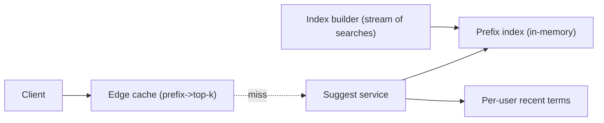
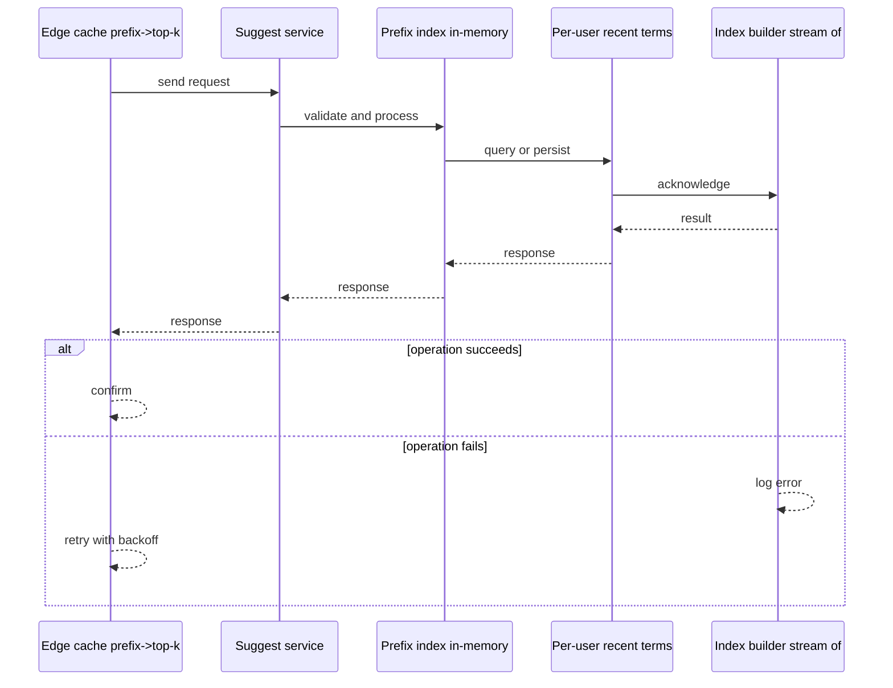
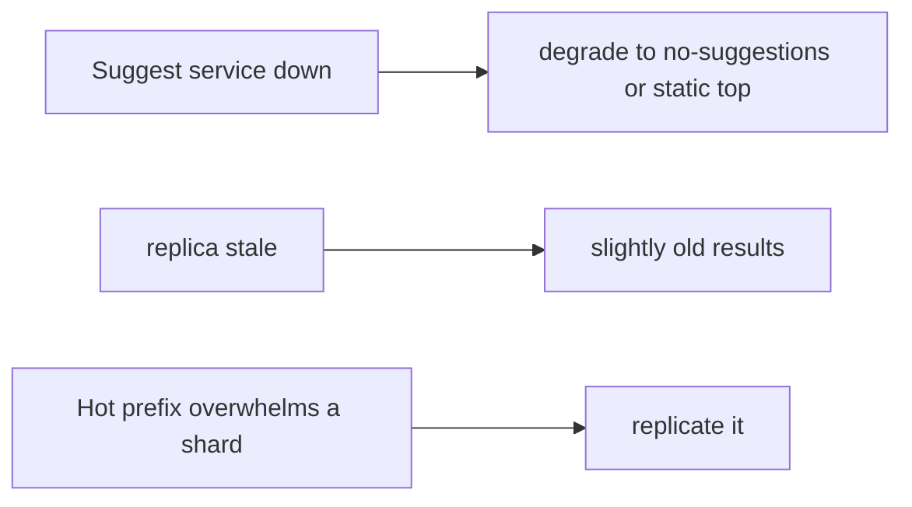
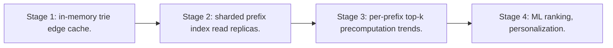

# Case Study: Search Autocomplete

> **Tier:** intermediate · **Status:** complete · Original numbers and diagrams.

## 1. Problem statement
As a user types a query, return ranked prefix completions within ~50 ms. Latency-critical,
high-QPS, and a classic trie/index problem.

## 2. Scope
**In (v1):** prefix-based completions ranked by popularity/recency, per-user personalization
optional. **Out:** semantic suggestions, spell correction.

## 3. Functional requirements
- Return top-k completions for a prefix.
- Rank by popularity (and recency).
- Update
popular terms as trends change. - Per-user recent-history suggestions.

## 4. Non-functional requirements
- Latency p99 < 50 ms (per keystroke). - Availability 99.95% (degrade to no-suggestions, not
fail). - High QPS: one call per keystroke.

## 5. Explicit assumptions
1. 100M users, ~10 suggestions/day? Re-estimate: 10M QPS peak (one per keystroke).
[assumption] 2. Top-k = 10. [constraint] 3. Suggestion corpus ~10M terms with scores.
[assumption]

## 6. Traffic estimation
- 10M QPS peak; each call tiny. The challenge is per-keystroke latency at huge QPS, not
volume.

## 7. Storage estimation
- Corpus 10M terms × (term + score + per-prefix index) → a few GB in memory per shard.
- Per-user recent terms: small, in a fast store.

## 8. Bandwidth estimation
- Tiny requests/responses (~100s of bytes); bandwidth trivial. Latency, not bandwidth.

## 9. API design
| Method | Path | Request | Response |
|--------|------|---------|----------|
| GET | /suggest?q=prefix&user=? | — | top-k completions | Cacheable by prefix (short TTL).

## 10. Data model
A prefix index (trie or sorted terms + per-prefix top-k lists). Scores per term;
per-prefix precomputed top-k to make lookup O(1)-ish. Per-user recent terms list.

## 11. High-level architecture

## 12. Request flow
Client sends prefix → edge cache hit returns → else suggest service looks up the prefix
top-k list → merges per-user recent terms → returns top-k → caches at edge.

## 13. Component responsibilities
Edge cache: per-prefix caching. Suggest service: prefix lookup + merge. Index: in-memory
prefix→top-k. Builder: updates scores from search stream.

## 14. Database selection
In-memory prefix index (Redis trie / custom) for the hot path. A stream processing job
updates scores. Rejected: on-the-fly scoring from a DB (too slow per keystroke).

## 15. Caching strategy
Edge caches prefix→top-k (short TTL); per-user recent terms cached. The prefix space is
bounded; high hit ratio at the edge.

## 16. Partitioning strategy
Prefix index sharded by prefix hash; high-QPS handled by many read replicas. Hot prefixes
(not, "new") — replicate top prefixes more.

## 17. Replication strategy
In-memory index replicated to many read replicas (read-heavy); the builder updates and
publishes a new index version periodically (immutable snapshot swap).

## 18. Consistency model
Scores eventually consistent (a trend lags by the rebuild cadence — fine). Per-keystroke
results may be slightly stale; correctness not critical.

## 19. Failure scenarios
Suggest service down → degrade to no-suggestions (or static top terms), not an error. Index
replica stale → slightly old results. Hot prefix overwhelms a shard → replicate it.

## 20. Reliability strategy
SLI latency p99 < 50 ms, availability 99.95%; degrade gracefully (no-suggestions). Chaos:
kill a suggest shard, assert graceful degradation.

## 21. Security considerations
Don't leak per-user recent terms cross-user; rate-limit per client to prevent scraping the
index; sanitize prefixes.

## 22. Observability strategy
p99 latency per keystroke, cache hit ratio, suggest error/degrade rate, index freshness,
hot-prefix skew.

## 23. Cost considerations
In-memory replicas × QPS; cost is RAM. Right-size replicas to hit-ratio + latency targets.

## 24. Scaling stages
Stage 1: in-memory trie + edge cache. → Stage 2: sharded prefix index + read replicas. →
Stage 3: per-prefix top-k precomputation + trends. → Stage 4: ML ranking, personalization.

## 25. Trade-offs
Precompute per-prefix top-k (fast reads, index build cost) vs compute on the fly (slow).
Degrade to no-suggestions vs fail. Replicate hot prefixes vs uniform sharding.

## 26. Alternative designs
Live DB scoring (too slow). Single trie unsharded (can't serve 10M QPS). Chosen: sharded
in-memory + edge cache + precomputed top-k.

## 27. Interview discussion points
Clarify QPS, latency SLA, personalization. Surface the per-keystroke latency constraint,
in-memory index, and graceful degradation.

## 28. Original Mermaid diagrams
Standalone sources under `diagrams/case-studies/search-autocomplete/`: `context.mmd`, `request-sequence.mmd`, `failure-flow.mmd`, `scaling-evolution.mmd`. The diagrams are embedded in their respective sections: architecture in section 11, request flow in section 12, failure scenarios in section 19, and scaling stages in section 24.

## 29. Further reading
Search/inverted index: Level 2/3; caching: Level 2; skew/hot keys: Level 3. Sources: `S-VECTORDB` `S-RAG`.

## 30. Practical exercises
1. Add trending boost (recent searches). 2. Design per-user personalization without
leakage. 3. Hot-prefix mitigation for "new". 4. Re-estimate at 100M QPS. 5. Add spell
correction — where does it fit?

---
Previous: [Photo-sharing platform](photo-sharing-platform.md) · Next: [Logging platform](logging-platform.md)

