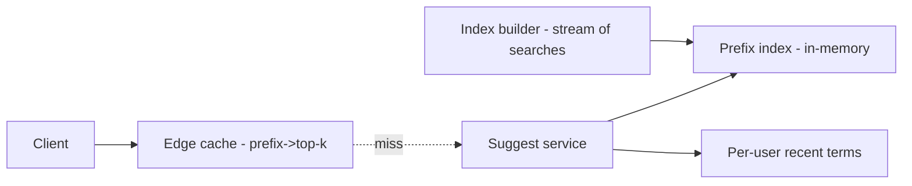
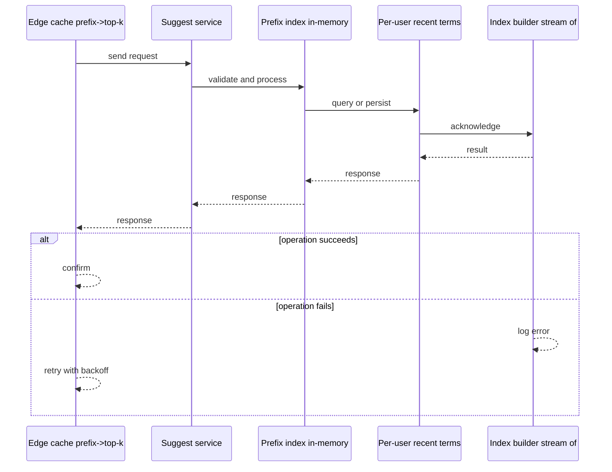
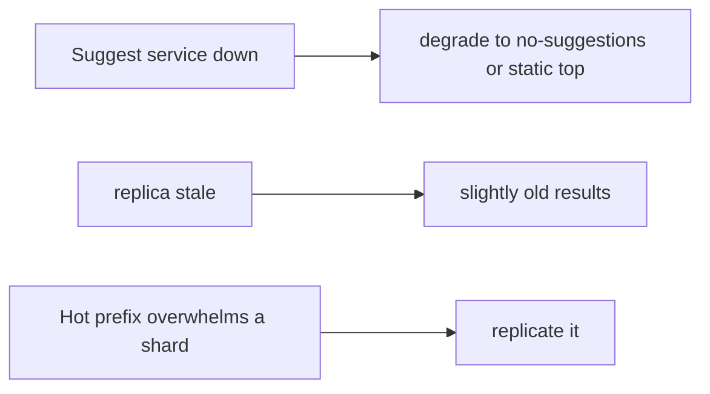
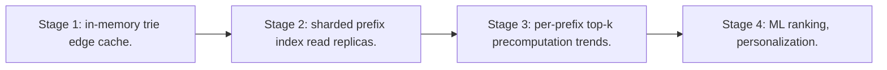

# Case Study: Search Autocomplete

> **Tier:** intermediate · **Status:** complete · Original numbers and diagrams.

## 1. Problem statement
As a user types a query, return ranked prefix completions within ~50 ms. Latency-critical,
high-QPS, and a classic trie/index problem. This is a intermediate-tier system design challenge because it must handle millions of reads per second while ensuring grounded, cited, and permission-aware answers. The design must be production-grade: observable, debuggable, reversible, and able to survive component failures without data loss or cascading outages.

## 2. Scope
**In (v1):** prefix-based completions ranked by popularity/recency, per-user personalization
optional. **Out:** semantic suggestions, spell correction.

For Search Autocomplete, these boundaries keep the first version focused on the core user value. Adding more features would dilute the design and delay shipping. Each excluded item is a scaling stage — a candidate for the next iteration once the baseline is proven.

## 3. Functional requirements
- Return top-k completions for a prefix.
- Rank by popularity (and recency).
- Update
popular terms as trends change. - Per-user recent-history suggestions.

For Search Autocomplete, these requirements drive specific architectural decisions: the read-write ratio determines the caching strategy, the durability target sets the replication mode, and the idempotency requirement shapes the API contract.

## 4. Non-functional requirements
- Latency p99 < 50 ms (per keystroke). - Availability 99.95% (degrade to no-suggestions, not
fail). - High QPS: one call per keystroke.

For Search Autocomplete, each non-functional target constrains a specific component: the latency SLO bounds the number of synchronous hops, the availability target forces redundancy across availability zones, and the cost ceiling limits the replication factor and storage tier.

## 5. Explicit assumptions
1. 100M users, ~10 suggestions/day? Re-estimate: 10M QPS peak (one per keystroke).
[assumption] 2. Top-k = 10. [constraint] 3. Suggestion corpus ~10M terms with scores.
[assumption]

For Search Autocomplete, if these assumptions are off by an order of magnitude, the architecture must adapt: 10x traffic may require earlier sharding, a different read-write ratio changes the caching strategy, and a higher peak multiplier demands more headroom.

## 6. Traffic estimation
- 10M QPS peak; each call tiny. The challenge is per-keystroke latency at huge QPS, not
volume.

To derive the request rate: divide the daily volume by 86,400 seconds to get the average rate, then multiply by 5-10x for peak. The read-to-write ratio determines whether the system is cache-dominated (read-heavy) or write-path-dominated (write-heavy). For Search Autocomplete, this ratio shapes the entire storage and replication strategy.

## 7. Storage estimation
- Corpus 10M terms × (term + score + per-prefix index) → a few GB in memory per shard.
- Per-user recent terms: small, in a fast store.

For Search Autocomplete, storage growth is projected from the daily write volume and retention policy. Index overhead and compression factors are accounted for in the total.

## 8. Bandwidth estimation
- Tiny requests/responses (~100s of bytes); bandwidth trivial. Latency, not bandwidth.

Bandwidth is request rate multiplied by average payload size for ingress, and response rate multiplied by response size for egress. CDN and edge caching reduce origin egress. Compression reduces bandwidth by 50-80 percent where applicable. For Search Autocomplete, bandwidth may or may not be the binding constraint — compare it against compute and storage to find out.

## 9. API design
| Method | Path | Request | Response |
|--------|------|---------|----------|
| GET | /suggest?q=prefix&user=? | — | top-k completions | Cacheable by prefix (short TTL).

## 10. Data model
A prefix index (trie or sorted terms + per-prefix top-k lists). Scores per term;
per-prefix precomputed top-k to make lookup O(1)-ish. Per-user recent terms list.

For Search Autocomplete, the data model follows the access pattern. The primary lookup determines the partition key; secondary lookups determine indexes. Denormalization is used selectively on hot read paths.

## 11. High-level architecture

## 12. Request flow
Client sends prefix → edge cache hit returns → else suggest service looks up the prefix
top-k list → merges per-user recent terms → returns top-k → caches at edge.

## 13. Component responsibilities
Edge cache: per-prefix caching. Suggest service: prefix lookup + merge. Index: in-memory
prefix→top-k. Builder: updates scores from search stream.

For Search Autocomplete, each component has one job. The gateway authenticates and routes. Services are stateless and scale horizontally. The data tier is the stateful core that scales by sharding.

## 14. Database selection
In-memory prefix index (Redis trie / custom) for the hot path. A stream processing job
updates scores. Rejected: on-the-fly scoring from a DB (too slow per keystroke).

For Search Autocomplete, the database was chosen by access pattern, not familiarity. The rejected alternatives were wrong for this workload, not bad in general.

## 15. Caching strategy
Edge caches prefix→top-k (short TTL); per-user recent terms cached. The prefix space is
bounded; high hit ratio at the edge.

For Search Autocomplete, the cache strategy matches the staleness tolerance. Cache-aside for most data, write-through where read-after-write matters, stampede protection on hot keys.

## 16. Partitioning strategy
Prefix index sharded by prefix hash; high-QPS handled by many read replicas. Hot prefixes
(not, "new") — replicate top prefixes more.

For Search Autocomplete, the partition key balances query locality with even load distribution. Sharding strategy matters because a poor key creates hot spots under real traffic patterns.

## 17. Replication strategy
In-memory index replicated to many read replicas (read-heavy); the builder updates and
publishes a new index version periodically (immutable snapshot swap).

For Search Autocomplete, replication mode is split: synchronous where durability is critical, asynchronous elsewhere for throughput. RF=3 tolerates one failure. Failover is tested regularly.

## 18. Consistency model
Scores eventually consistent (a trend lags by the rebuild cadence — fine). Per-keystroke
results may be slightly stale; correctness not critical.

For Search Autocomplete, the consistency level is the weakest users accept. Read-your-writes is provided where needed. Eventual consistency is bounded and monitored, not unbounded and silent.

## 19. Failure scenarios
Suggest service down → degrade to no-suggestions (or static top terms), not an error. Index
replica stale → slightly old results. Hot prefix overwhelms a shard → replicate it.

## 20. Reliability strategy
SLI latency p99 < 50 ms, availability 99.95%; degrade gracefully (no-suggestions). Chaos:
kill a suggest shard, assert graceful degradation.

For Search Autocomplete, the SLO makes reliability measurable. The error budget balances feature velocity with stability. Chaos testing validates that resilience claims hold under real failures.

## 21. Security considerations
Don't leak per-user recent terms cross-user; rate-limit per client to prevent scraping the
index; sanitize prefixes.

For Search Autocomplete, security layers TLS, encryption at rest, RBAC, PII redaction, and audit. The policy gateway is fail-closed for AI-augmented operations.

## 22. Observability strategy
p99 latency per keystroke, cache hit ratio, suggest error/degrade rate, index freshness,
hot-prefix skew.

For Search Autocomplete, observability combines logs, metrics, and traces with correlation IDs. Golden signals drive the first dashboard. Alerts fire on burn rate, not raw thresholds.

## 23. Cost considerations
In-memory replicas × QPS; cost is RAM. Right-size replicas to hit-ratio + latency targets.

For Search Autocomplete, cost is driven by the binding resource. Caching, tiering, batching, and right-sizing are the levers. Cost per request is tracked and alerted on.

## 24. Scaling stages
Stage 1: in-memory trie + edge cache. → Stage 2: sharded prefix index + read replicas. →
Stage 3: per-prefix top-k precomputation + trends. → Stage 4: ML ranking, personalization.

## 25. Trade-offs
Precompute per-prefix top-k (fast reads, index build cost) vs compute on the fly (slow).
Degrade to no-suggestions vs fail. Replicate hot prefixes vs uniform sharding.

For Search Autocomplete, each trade-off lists what was chosen, what was rejected, and why. This makes the design defensible in review — every decision has documented reasoning.

## 26. Alternative designs
Live DB scoring (too slow). Single trie unsharded (can't serve 10M QPS). Chosen: sharded
in-memory + edge cache + precomputed top-k.

For Search Autocomplete, the alternatives are real architectures that work under different constraints. They were rejected for this workload's specific requirements, not because they are bad designs.

## 27. Interview discussion points
Clarify QPS, latency SLA, personalization. Surface the per-keystroke latency constraint,
in-memory index, and graceful degradation.

For Search Autocomplete in an interview: clarify scope first, surface the read-write ratio, design the hot path deeply, discuss failures, and offer an alternative. Weak candidates skip failure modes.

## 28. Original Mermaid diagrams
Standalone sources under `diagrams/case-studies/search-autocomplete/`: `context.mmd`, `request-sequence.mmd`, `failure-flow.mmd`, `scaling-evolution.mmd`. The diagrams are embedded in their respective sections: architecture in section 11, request flow in section 12, failure scenarios in section 19, and scaling stages in section 24.

## 29. Further reading
Search/inverted index: Level 2/3; caching: Level 2; skew/hot keys: Level 3. Sources: `S-VECTORDB` `S-RAG`.

## 30. Practical exercises
1. Add trending boost (recent searches). 2. Design per-user personalization without
leakage. 3. Hot-prefix mitigation for "new". 4. Re-estimate at 100M QPS. 5. Add spell
correction — where does it fit?

---
Previous: [Photo-sharing platform](photo-sharing-platform.md) · Next: [Logging platform](logging-platform.md)

