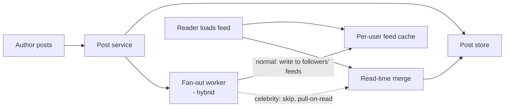
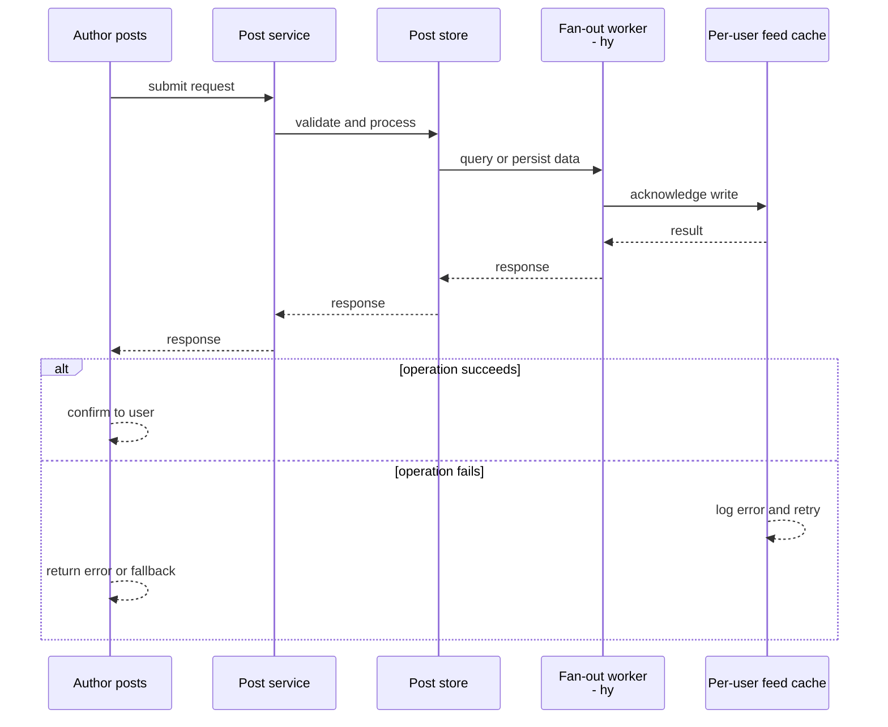
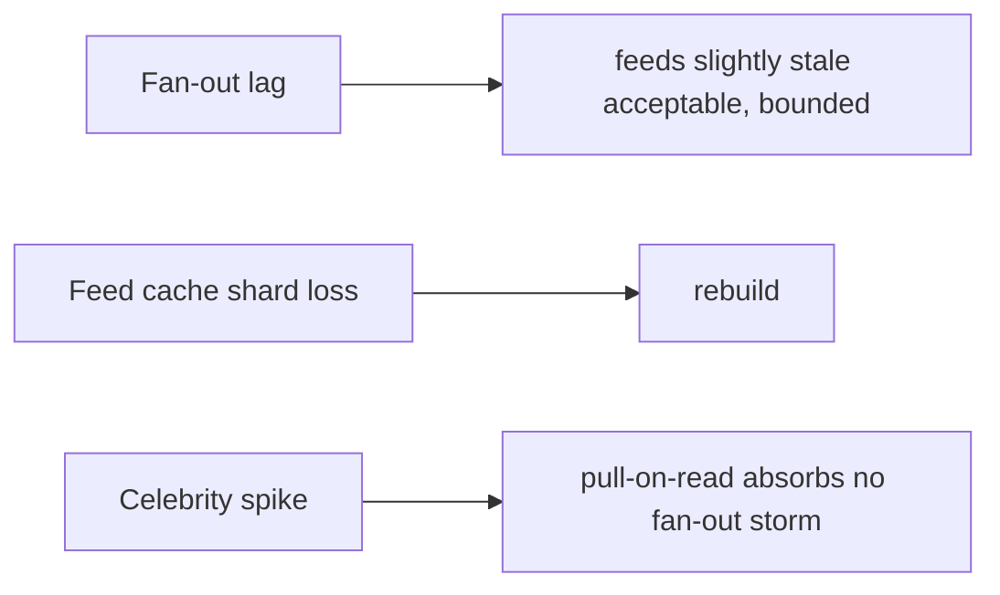
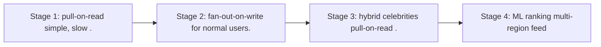

# Case Study: Social-Media Feed

> **Tier:** intermediate · **Status:** complete · Original numbers and diagrams.

## 1. Problem statement
Generate each user's personalized feed of posts from people/pages they follow, at scale and
with low latency. The classic fan-out-on-write vs fan-out-on-read trade. This is a intermediate-tier system design challenge because it must handle high availability under peak load while ensuring no single point of failure. The design must be production-grade: observable, debuggable, reversible, and able to survive component failures without data loss or cascading outages.

## 2. Scope
**In (v1):** a home feed of followed authors' posts; likes/reposts counts. **Out:**
ranking ML, ads, stories.

For Social-Media Feed, these boundaries keep the first version focused on the core user value. Adding more features would dilute the design and delay shipping. Each excluded item is a scaling stage — a candidate for the next iteration once the baseline is proven.

## 3. Functional requirements
- Build a user's feed from followed authors' posts. - Show recent posts, ranked by
recency/basic signals. - Update counts (likes/reposts).

For Social-Media Feed, these requirements drive specific architectural decisions: the read-write ratio determines the caching strategy, the durability target sets the replication mode, and the idempotency requirement shapes the API contract.

## 4. Non-functional requirements
- Feed load p99 < 300 ms.
- Availability 99.9%.
- Celebrities with millions of followers
(the fan-out problem).

For Social-Media Feed, each non-functional target constrains a specific component: the latency SLO bounds the number of synchronous hops, the availability target forces redundancy across availability zones, and the cost ceiling limits the replication factor and storage tier.

## 5. Explicit assumptions
1. 100M users, avg 200 follows, 5 posts/author/day = 100B posts/day to distribute.
[assumption] 2. 50 feed loads/user/day. [assumption] 3. Celebrities: top ~0.1% have >1M
followers. [constraint]

For Social-Media Feed, if these assumptions are off by an order of magnitude, the architecture must adapt: 10x traffic may require earlier sharding, a different read-write ratio changes the caching strategy, and a higher peak multiplier demands more headroom.

## 6. Traffic estimation
- Posts: 100M authors × 5/day? Re-estimate: 100M users post avg 0.5/day = 50M posts/day ≈
580/s. Feed loads: 100M × 50/day ≈ 58k/s.

To derive the request rate: divide the daily volume by 86,400 seconds to get the average rate, then multiply by 5-10x for peak. The read-to-write ratio determines whether the system is cache-dominated (read-heavy) or write-path-dominated (write-heavy). For Social-Media Feed, this ratio shapes the entire storage and replication strategy.

## 7. Storage estimation
- Posts ~1 KB; 50M/day = 50 GB/day; retain 1 year ≈ 18 TB. Feed caches (per-user prebuilt)
are larger and hotter.

For Social-Media Feed, storage growth is projected from the daily write volume and retention policy. Index overhead and compression factors are accounted for in the total.

## 8. Bandwidth estimation
- Feed loads 58k/s × ~50 KB (a page) ≈ 2.9 GB/s egress — significant; cache.

Bandwidth is request rate multiplied by average payload size for ingress, and response rate multiplied by response size for egress. CDN and edge caching reduce origin egress. Compression reduces bandwidth by 50-80 percent where applicable. For Social-Media Feed, bandwidth may or may not be the binding constraint — compare it against compute and storage to find out.

## 9. API design
| Method | Path | Request | Response |
|--------|------|---------|----------|
| GET | /feed | cursor | posts page |
| POST | /posts | content | post id |

## 10. Data model
`posts(id, author, body, ts, counts)`; `follows(follower, followee)`; `feed(user, [post
ids])` (prebuilt for fan-out-on-write).

For Social-Media Feed, the data model follows the access pattern. The primary lookup determines the partition key; secondary lookups determine indexes. Denormalization is used selectively on hot read paths.

## 11. High-level architecture

## 12. Request flow
Post: store → fanout to followers' prebuilt feeds (skip celebrities — too many). Read:
fetch the user's prebuilt feed, merge in recent posts from followed celebrities (pull-on
-read), rank, return.

## 13. Component responsibilities
Post service: store. Fan-out: write to per-user feeds. Feed cache: prebuilt feeds.
Pull-on-read: celebrity handling. Ranking: basic recency/signals.

For Social-Media Feed, each component has one job. The gateway authenticates and routes. Services are stateless and scale horizontally. The data tier is the stateful core that scales by sharding.

## 14. Database selection
Post store: sharded KV by author/id. Feed cache: a fast KV (Redis) per user. Rejected:
pull-on-read only (slow for normal users with many follows); fan-out-only (impossible for
celebrities).

For Social-Media Feed, the database was chosen by access pattern, not familiarity. The rejected alternatives were wrong for this workload, not bad in general.

## 15. Caching strategy
Per-user feed cache (the whole point of fan-out-on-write). Celebrity posts pulled and
cached with a short TTL. Hot posts cached.

For Social-Media Feed, the cache strategy matches the staleness tolerance. Cache-aside for most data, write-through where read-after-write matters, stampede protection on hot keys.

## 16. Partitioning strategy
Feed cache partitioned by user (each user's feed on one shard). Post store by post id.
Fan-out workers scaled by post rate.

For Social-Media Feed, the partition key balances query locality with even load distribution. Sharding strategy matters because a poor key creates hot spots under real traffic patterns.

## 17. Replication strategy
Post store RF=3; feed cache replicated for availability (a cache loss rebuilds from post
store). Fan-out is idempotent (a re-delivered post dedups by id).

For Social-Media Feed, replication mode is split: synchronous where durability is critical, asynchronous elsewhere for throughput. RF=3 tolerates one failure. Failover is tested regularly.

## 18. Consistency model
Feed eventually consistent (a post appears within seconds). Counts eventually consistent.
Read-your-writes: your own post appears immediately via a merge.

For Social-Media Feed, the consistency level is the weakest users accept. Read-your-writes is provided where needed. Eventual consistency is bounded and monitored, not unbounded and silent.

## 19. Failure scenarios
Fan-out lag → feeds slightly stale (acceptable, bounded). Feed cache shard loss → rebuild
from post store. Celebrity spike → pull-on-read absorbs (no fan-out storm).

## 20. Reliability strategy
SLI feed load latency, freshness; SLO 99.9%. Hybrid fan-out bounds celebrity load. Chaos:
kill fan-out workers, assert feeds (stale but serving).

For Social-Media Feed, the SLO makes reliability measurable. The error budget balances feature velocity with stability. Chaos testing validates that resilience claims hold under real failures.

## 21. Security considerations
Per-user auth; hide private accounts' posts from non-followers; rate-limit posting;
moderation hooks.

For Social-Media Feed, security layers TLS, encryption at rest, RBAC, PII redaction, and audit. The policy gateway is fail-closed for AI-augmented operations.

## 22. Observability strategy
Feed load latency, fan-out lag, feed cache hit ratio, fan-out queue depth, per-author post
rate (celebrity watch).

For Social-Media Feed, observability combines logs, metrics, and traces with correlation IDs. Golden signals drive the first dashboard. Alerts fire on burn rate, not raw thresholds.

## 23. Cost considerations
Fan-out storage (per-user feeds) is large; the hybrid model avoids celebrity explosion.
Cache hit ratio drives egress cost.

For Social-Media Feed, cost is driven by the binding resource. Caching, tiering, batching, and right-sizing are the levers. Cost per request is tracked and alerted on.

## 24. Scaling stages
Stage 1: pull-on-read (simple, slow). → Stage 2: fan-out-on-write for normal users. →
Stage 3: hybrid (celebrities pull-on-read). → Stage 4: ML ranking + multi-region feed
caches.

## 25. Trade-offs
Fan-out-on-write (fast reads, expensive writes + celebrity problem) vs pull-on-read (cheap
writes, slow reads). Hybrid: normal fan-out, celebrities pull. Feed cache size vs cost.

For Social-Media Feed, each trade-off lists what was chosen, what was rejected, and why. This makes the design defensible in review — every decision has documented reasoning.

## 26. Alternative designs
Pure fan-out-on-write (celebrity blow-up). Pure pull-on-read (slow at 200 follows each
load). Chosen: hybrid.

For Social-Media Feed, the alternatives are real architectures that work under different constraints. They were rejected for this workload's specific requirements, not because they are bad designs.

## 27. Interview discussion points
Clarify scale, celebrity ratio, latency, ranking. Surface the fan-out trade and the
hybrid celebrity handling — the core of this problem.

For Social-Media Feed in an interview: clarify scope first, surface the read-write ratio, design the hot path deeply, discuss failures, and offer an alternative. Weak candidates skip failure modes.

## 28. Original Mermaid diagrams
Standalone sources under `diagrams/case-studies/social-media-feed/`: `context.mmd`, `request-sequence.mmd`, `failure-flow.mmd`, `scaling-evolution.mmd`. The diagrams are embedded in their respective sections: architecture in section 11, request flow in section 12, failure scenarios in section 19, and scaling stages in section 24.

## 29. Further reading
Caching: Level 2; fan-out/queues: Level 2; ranking/ML: Level 10. Sources: `S-CHASH` `S-DYNAMO`.

## 30. Practical exercises
1. Add ML ranking — where does it run, at what latency? 2. Design celebrity pull-on-read
under a viral post. 3. Re-estimate feeds if avg follows = 2,000. 4. Add a "delete post"
that removes it from all feeds (hard). 5. Multi-region feed caches — consistency?

---
Previous: [Chat application](chat-application.md) · Next: [Photo-sharing platform](photo-sharing-platform.md)

