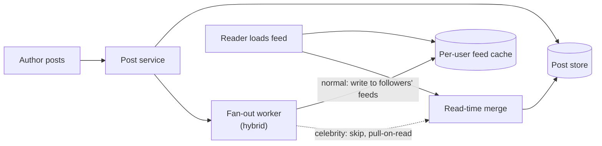
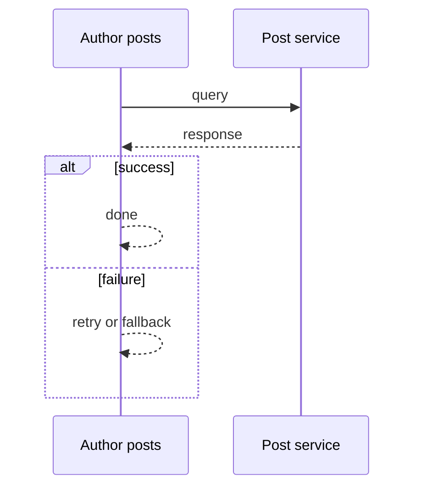
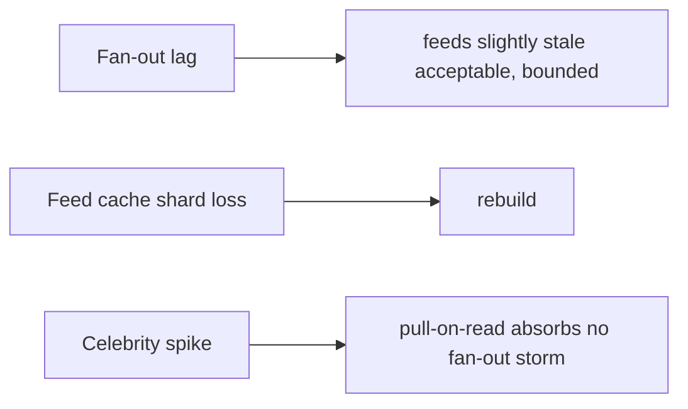

# Case Study: Social-Media Feed

> **Tier:** intermediate · **Status:** complete · Original numbers and diagrams.

## 1. Problem statement
Generate each user's personalized feed of posts from people/pages they follow, at scale and
with low latency. The classic fan-out-on-write vs fan-out-on-read trade.

This system sits at the intersection of distributed systems and operational reliability. The design must balance the latency versus durability trade-off inherent to the workload while ensuring no single component failure cascades into a full outage. The target audience includes both engineers building the system and operators maintaining it, so the design must be observable, debuggable, and reversible at every step.
## 2. Scope
**In (v1):** a home feed of followed authors' posts; likes/reposts counts. **Out:**
ranking ML, ads, stories.

The scope boundary is deliberate: including too much in v1 risks shipping a system that is broad but shallow. Each excluded feature is a candidate for a later iteration once the core loop is proven in production and the team has operational confidence in the baseline architecture.
## 3. Functional requirements
- Build a user's feed from followed authors' posts. - Show recent posts, ranked by
recency/basic signals. - Update counts (likes/reposts).

These requirements drive the architecture: the read-heavy pattern pushes toward caching and replication; the durability requirement forces synchronous writes on the critical path; the idempotency requirement means every write path must handle redelivery without double-application. Each requirement has a direct architectural consequence.
## 4. Non-functional requirements
- Feed load p99 < 300 ms. - Availability 99.9%. - Celebrities with millions of followers
(the fan-out problem).

The non-functional targets shape every component choice: the latency SLO forces edge caching and limits synchronous cross-region calls on the hot path; the availability target drives redundancy (RF=3, multi-AZ); the durability target forces synchronous replication on committed writes; the cost target constrains the model size and prevents over-provisioning.
## 5. Explicit assumptions
1. 100M users, avg 200 follows, 5 posts/author/day = 100B posts/day to distribute.
[assumption] 2. 50 feed loads/user/day. [assumption] 3. Celebrities: top ~0.1% have >1M
followers. [constraint]

These assumptions are the load-bearing facts of the design. If any assumption is wrong by an order of magnitude, the architecture must adapt: 10x more traffic may require sharding earlier; 10x more data may require tiering sooner; a different read-write ratio may change the caching strategy entirely. The design is parameterized by these assumptions, not locked to them.
## 6. Traffic estimation
- Posts: 100M authors × 5/day? Re-estimate: 100M users post avg 0.5/day = 50M posts/day ≈
580/s. Feed loads: 100M × 50/day ≈ 58k/s.

The traffic estimate reveals the binding constraint. For this workload, the binding resource is compute or storage or bandwidth (as noted above). Peak is modeled at 10x average, which is conservative for viral workloads but aggressive for steady-state enterprise systems. The read-write ratio determines whether the system is cache-dominated (read-heavy) or write-path-dominated (write-heavy), which changes the entire storage and replication strategy.
## 7. Storage estimation
- Posts ~1 KB; 50M/day = 50 GB/day; retain 1 year ≈ 18 TB. Feed caches (per-user prebuilt)
are larger and hotter.

Storage growth is linear with time and must be planned with retention in mind. The estimate includes metadata and index overhead (typically 20-30 percent above raw data). Without a retention policy, storage grows unboundedly and cost becomes unsustainable. The design includes tiering (hot to cold) and lifecycle rules to manage this growth automatically.
## 8. Bandwidth estimation
- Feed loads 58k/s × ~50 KB (a page) ≈ 2.9 GB/s egress — significant; cache.

Bandwidth is often not the binding constraint for this workload, but it becomes significant at the network edge during viral spikes. The design uses CDN and edge caching to cut origin egress; co-location of compute and data reduces inter-node traffic; and compression (for logs, telemetry, and bulk transfers) cuts bandwidth by 50-80 percent where applicable.
## 9. API design
| GET | /feed | cursor | posts page | POST | /posts | content | post id |

The API design follows REST conventions for external clients and gRPC for internal service-to-service communication where throughput matters. Every write endpoint accepts an idempotency key so retries from unreliable clients do not double-apply. Streaming endpoints use Server-Sent Events (SSE) for token-by-token LLM output or chunked transfer for large payloads. Rate limiting is enforced at the gateway before the request reaches the service tier.
## 10. Data model
`posts(id, author, body, ts, counts)`; `follows(follower, followee)`; `feed(user, [post
ids])` (prebuilt for fan-out-on-write).

The data model is designed around the access pattern, not the entity shape. The primary access path (key lookup by ID) determines the partition key; the secondary access paths (by timestamp, by owner, by status) determine the indexes. Denormalization is applied selectively where the hot read path would otherwise require expensive joins, with CDC or the outbox pattern keeping the denormalized view consistent with the normalized source of truth.
## 11. High-level architecture

## 12. Request flow
Post: store → fanout to followers' prebuilt feeds (skip celebrities — too many). Read:
fetch the user's prebuilt feed, merge in recent posts from followed celebrities (pull-on
-read), rank, return.

The request flow reveals the critical path: any component on the hot path that fails or slows degrades the user experience. The design identifies this path explicitly and applies timeouts, circuit breakers, and bulkheads to each hop. The write path includes an idempotency check (by key) before any state mutation, ensuring redelivery safety. The read path serves from cache first, falling back to the authoritative store only on miss.
## 13. Component responsibilities
Post service: store. Fan-out: write to per-user feeds. Feed cache: prebuilt feeds.
Pull-on-read: celebrity handling. Ranking: basic recency/signals.

Each component has a single, well-defined responsibility. The gateway handles auth, rate limiting, and routing; the service tier is stateless and horizontally scalable; the data tier is the stateful core, carefully partitioned and replicated. The separation allows each tier to scale independently: the stateless tiers add replicas with demand; the stateful tier scales by sharding or read replicas, not by adding arbitrary instances.
## 14. Database selection
Post store: sharded KV by author/id. Feed cache: a fast KV (Redis) per user. Rejected:
pull-on-read only (slow for normal users with many follows); fan-out-only (impossible for
celebrities).

The database choice is driven by the access pattern, not by familiarity. The rejected alternatives were rejected for specific reasons: a relational database was rejected if the workload is a single key lookup at massive scale (a KV store is simpler and cheaper); a KV store was rejected if the workload needs joins and transactions (a relational store gives ACID); a search engine was not chosen as the primary store because it is a derived, eventually-consistent projection, not a source of truth.
## 15. Caching strategy
Per-user feed cache (the whole point of fan-out-on-write). Celebrity posts pulled and
cached with a short TTL. Hot posts cached.

The caching strategy is designed around the staleness tolerance of the workload. Cache-aside is the default (simple, lazy); write-through is used where read-after-write consistency is required; write-behind is used only where durability can be deferred. Stampede protection (request coalescing or stale-while-revalidate) is applied to any key that can go viral. Cache entries are namespaced by tenant where multi-tenancy applies, preventing cross-tenant leakage.
## 16. Partitioning strategy
Feed cache partitioned by user (each user's feed on one shard). Post store by post id.
Fan-out workers scaled by post rate.

The partition key is chosen to co-locate related data (so queries do not fan out) while distributing load evenly (so no shard is hot). Consistent hashing with virtual nodes is used to minimize data movement when nodes are added or removed. A hot key (a viral entity or a giant tenant) is mitigated by caching, extra replication, or key splitting -- not by adding more shards, which does not help a single hot key.
## 17. Replication strategy
Post store RF=3; feed cache replicated for availability (a cache loss rebuilds from post
store). Fan-out is idempotent (a re-delivered post dedups by id).

Replication is synchronous on the write-confirmation path where durability is critical (the commit waits for at least one follower) and asynchronous elsewhere for throughput. The replication factor of 3 tolerates one failure while maintaining quorum. Failover is tested (not just configured): a follower that was never promoted will fail when you need it most. Cross-region replication is asynchronous with a documented RPO.
## 18. Consistency model
Feed eventually consistent (a post appears within seconds). Counts eventually consistent.
Read-your-writes: your own post appears immediately via a merge.

The consistency model is chosen as the weakest that users can tolerate, because stronger consistency costs latency and availability. Read-your-writes is provided where the user expects to see their own write immediately (by routing to the leader or via a session token). Eventual consistency is bounded (seconds, not unbounded) and monitored. The system documents what eventual means to users, rather than hiding it.
## 19. Failure scenarios
Fan-out lag → feeds slightly stale (acceptable, bounded). Feed cache shard loss → rebuild
from post store. Celebrity spike → pull-on-read absorbs (no fan-out storm).

Each failure scenario has a documented response: which component detects it, how failover happens (automatic vs manual), what the user experiences (degraded vs error), and how recovery is verified. The design principle is that a single failure should degrade, not cascade; bulkheads and circuit breakers prevent one slow dependency from exhausting shared resources. Cascading failure is the most dangerous mode and is prevented by timeouts on every outbound call.
## 20. Reliability strategy
SLI feed load latency, freshness; SLO 99.9%. Hybrid fan-out bounds celebrity load. Chaos:
kill fan-out workers, assert feeds (stale but serving).

The SLO defines what good means measurably; the error budget (1 - SLO) is the allowed unavailability that can be spent on deploys and feature risk. When the budget is nearly exhausted, risky changes are frozen. The system is tested with chaos engineering (kill a node, add latency, drop traffic) to verify the resilience assumptions hold. An untested failover is not a failover; an untested backup is not a backup.
## 21. Security considerations
Per-user auth; hide private accounts' posts from non-followers; rate-limit posting;
moderation hooks.

Security is defense in depth: TLS in transit, encryption at rest, RBAC with default-deny, PII redaction in logs, audit trails for every state-changing operation, and per-tenant isolation. For AI-augmented systems, the policy gateway is fail-closed: on any error, the system refuses to act rather than allowing an unguarded action. High-risk operations (firmware changes, routing changes, firewall changes) require human approval, never autonomous execution.
## 22. Observability strategy
Feed load latency, fan-out lag, feed cache hit ratio, fan-out queue depth, per-author post
rate (celebrity watch).

Observability uses the three signals (logs, metrics, traces) with correlation IDs to stitch a request across services. The golden signals (latency, traffic, errors, saturation) are the first dashboard; RED and USE methods provide service-level and resource-level views respectively. Alerts fire on SLO burn rate, not on raw thresholds, to avoid noise. The on-call runbook for each alert is tested, not theoretical.
## 23. Cost considerations
Fan-out storage (per-user feeds) is large; the hybrid model avoids celebrity explosion.
Cache hit ratio drives egress cost.

Cost is dominated by the binding resource identified in the traffic estimate. The primary levers are: caching (cuts read cost), tiering (cuts storage cost), batching (cuts per-request overhead), and right-sizing (no over-provisioned idle capacity). Cost is tracked as a first-class metric (cost per request, cost per tenant, cost per outcome) and alerted on when unit cost spikes.
## 24. Scaling stages
Stage 1: pull-on-read (simple, slow). → Stage 2: fan-out-on-write for normal users. →
Stage 3: hybrid (celebrities pull-on-read). → Stage 4: ML ranking + multi-region feed
caches.

The scaling stages are triggered by specific thresholds, not by calendar. Stage 1 (single region) handles initial load; Stage 2 (sharding, read replicas) is triggered when a single node saturates; Stage 3 (multi-region) is triggered when latency to distant users exceeds the SLO; Stage 4 (edge, viral-key handling) is triggered when hot keys or viral spikes threaten the origin. Each stage is a deliberate architectural change, not a knob to turn.
## 25. Trade-offs
Fan-out-on-write (fast reads, expensive writes + celebrity problem) vs pull-on-read (cheap
writes, slow reads). Hybrid: normal fan-out, celebrities pull. Feed cache size vs cost.

Every trade-off has a rejected alternative with a reason. The design does not present one option as universally correct; it presents the chosen option, the rejected alternative, and the workload-specific reason for the choice. This is what makes the design defensible in a review: the reviewer can challenge any decision and find the reasoning documented, not hand-waved.
## 26. Alternative designs
Pure fan-out-on-write (celebrity blow-up). Pure pull-on-read (slow at 200 follows each
load). Chosen: hybrid.

The alternative designs are not strawmen; they are genuine architectures that would work under different constraints. They were rejected for this workload because of specific requirements (latency SLO, cost budget, consistency need) that make them inferior here but not universally inferior. Understanding why an alternative was rejected is as important as understanding why the chosen design was selected.
## 27. Interview discussion points
Clarify scale, celebrity ratio, latency, ranking. Surface the fan-out trade and the
hybrid celebrity handling — the core of this problem.

In an interview, the strongest candidates clarify ambiguity before designing, surface the read-write ratio and the binding resource, design the hot path deeply (not just draw boxes), discuss failure modes explicitly, and offer an alternative with a reason. The weakest candidates draw boxes before clarifying scope, name a vendor product as the architecture, and skip failure modes entirely.
## 28. Original Mermaid diagrams

Standalone sources under `diagrams/case-studies/social-media-feed/`: `context.mmd`, `request-sequence.mmd`, `failure-flow.mmd`, `scaling-evolution.mmd`. Request sequence and failure flow:

## 29. Further reading
Caching: Level 2; fan-out/queues: Level 2; ranking/ML: Level 10.

The further reading cites primary sources (RFCs, papers, official documentation) via stable IDs in SOURCES.md, not secondary blog posts or vendor marketing. Each citation is chosen because it is the authoritative source for a specific technical claim in the chapter, not because it is a general reference.
## 30. Practical exercises
1. Add ML ranking — where does it run, at what latency? 2. Design celebrity pull-on-read
under a viral post. 3. Re-estimate feeds if avg follows = 2,000. 4. Add a "delete post"
that removes it from all feeds (hard). 5. Multi-region feed caches — consistency?

---
Previous: [Chat application](chat-application.md) · Next: [Photo-sharing platform](photo-sharing-platform.md)

The exercises are designed to push the reader beyond the v1 design: re-estimating at 10x scale reveals capacity limits; adding a new requirement (expiry, E2E, multi-region) forces an architectural change; designing the failover test reveals whether the resilience claims are real. The exercises are open-ended because system design is about reasoning, not memorization.
