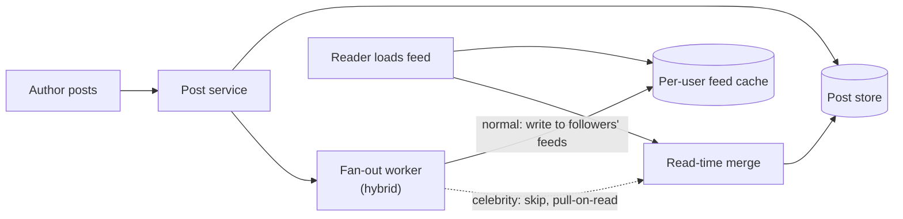

# Case Study: Social-Media Feed

> **Tier:** intermediate · **Status:** draft · Original numbers and diagrams.

## 1. Problem statement
Generate each user's personalized feed of posts from people/pages they follow, at scale and
with low latency. The classic fan-out-on-write vs fan-out-on-read trade.

## 2. Scope
**In (v1):** a home feed of followed authors' posts; likes/reposts counts. **Out:**
ranking ML, ads, stories.

## 3. Functional requirements
- Build a user's feed from followed authors' posts. - Show recent posts, ranked by
recency/basic signals. - Update counts (likes/reposts).

## 4. Non-functional requirements
- Feed load p99 < 300 ms. - Availability 99.9%. - Celebrities with millions of followers
(the fan-out problem).

## 5. Explicit assumptions
1. 100M users, avg 200 follows, 5 posts/author/day = 100B posts/day to distribute.
[assumption] 2. 50 feed loads/user/day. [assumption] 3. Celebrities: top ~0.1% have >1M
followers. [constraint]

## 6. Traffic estimation
- Posts: 100M authors × 5/day? Re-estimate: 100M users post avg 0.5/day = 50M posts/day ≈
580/s. Feed loads: 100M × 50/day ≈ 58k/s.

## 7. Storage estimation
- Posts ~1 KB; 50M/day = 50 GB/day; retain 1 year ≈ 18 TB. Feed caches (per-user prebuilt)
are larger and hotter.

## 8. Bandwidth estimation
- Feed loads 58k/s × ~50 KB (a page) ≈ 2.9 GB/s egress — significant; cache.

## 9. API design
| GET | /feed | cursor | posts page | POST | /posts | content | post id |

## 10. Data model
`posts(id, author, body, ts, counts)`; `follows(follower, followee)`; `feed(user, [post
ids])` (prebuilt for fan-out-on-write).

## 11. High-level architecture

## 12. Request flow
Post: store → fanout to followers' prebuilt feeds (skip celebrities — too many). Read:
fetch the user's prebuilt feed, merge in recent posts from followed celebrities (pull-on
-read), rank, return.

## 13. Component responsibilities
Post service: store. Fan-out: write to per-user feeds. Feed cache: prebuilt feeds.
Pull-on-read: celebrity handling. Ranking: basic recency/signals.

## 14. Database selection
Post store: sharded KV by author/id. Feed cache: a fast KV (Redis) per user. Rejected:
pull-on-read only (slow for normal users with many follows); fan-out-only (impossible for
celebrities).

## 15. Caching strategy
Per-user feed cache (the whole point of fan-out-on-write). Celebrity posts pulled and
cached with a short TTL. Hot posts cached.

## 16. Partitioning strategy
Feed cache partitioned by user (each user's feed on one shard). Post store by post id.
Fan-out workers scaled by post rate.

## 17. Replication strategy
Post store RF=3; feed cache replicated for availability (a cache loss rebuilds from post
store). Fan-out is idempotent (a re-delivered post dedups by id).

## 18. Consistency model
Feed eventually consistent (a post appears within seconds). Counts eventually consistent.
Read-your-writes: your own post appears immediately via a merge.

## 19. Failure scenarios
Fan-out lag → feeds slightly stale (acceptable, bounded). Feed cache shard loss → rebuild
from post store. Celebrity spike → pull-on-read absorbs (no fan-out storm).

## 20. Reliability strategy
SLI feed load latency, freshness; SLO 99.9%. Hybrid fan-out bounds celebrity load. Chaos:
kill fan-out workers, assert feeds (stale but serving).

## 21. Security considerations
Per-user auth; hide private accounts' posts from non-followers; rate-limit posting;
moderation hooks.

## 22. Observability strategy
Feed load latency, fan-out lag, feed cache hit ratio, fan-out queue depth, per-author post
rate (celebrity watch).

## 23. Cost considerations
Fan-out storage (per-user feeds) is large; the hybrid model avoids celebrity explosion.
Cache hit ratio drives egress cost.

## 24. Scaling stages
Stage 1: pull-on-read (simple, slow). → Stage 2: fan-out-on-write for normal users. →
Stage 3: hybrid (celebrities pull-on-read). → Stage 4: ML ranking + multi-region feed
caches.

## 25. Trade-offs
Fan-out-on-write (fast reads, expensive writes + celebrity problem) vs pull-on-read (cheap
writes, slow reads). Hybrid: normal fan-out, celebrities pull. Feed cache size vs cost.

## 26. Alternative designs
Pure fan-out-on-write (celebrity blow-up). Pure pull-on-read (slow at 200 follows each
load). Chosen: hybrid.

## 27. Interview discussion points
Clarify scale, celebrity ratio, latency, ranking. Surface the fan-out trade and the
hybrid celebrity handling — the core of this problem.

## 28. Original Mermaid diagrams
`diagrams/case-studies/social-media-feed/context.mmd`; key diagram inline above.

## 29. Further reading
Caching: Level 2; fan-out/queues: Level 2; ranking/ML: Level 10.

## 30. Practical exercises
1. Add ML ranking — where does it run, at what latency? 2. Design celebrity pull-on-read
under a viral post. 3. Re-estimate feeds if avg follows = 2,000. 4. Add a "delete post"
that removes it from all feeds (hard). 5. Multi-region feed caches — consistency?

---
Previous: [Chat application](chat-application.md) · Next: [Photo-sharing platform](photo-sharing-platform.md)
