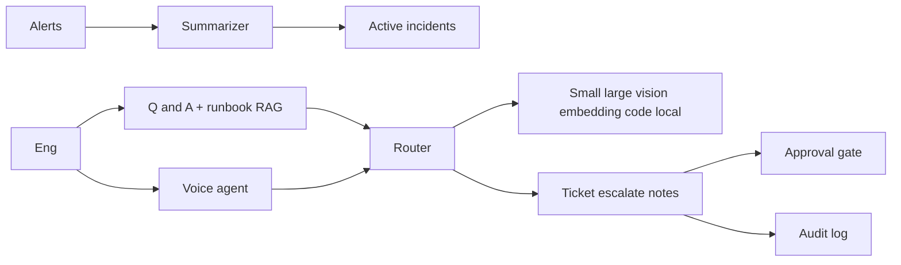
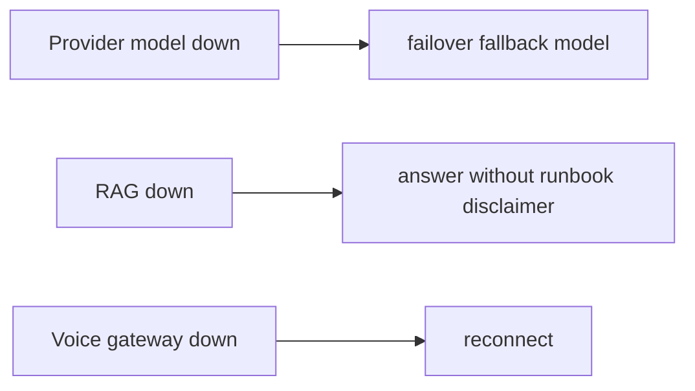
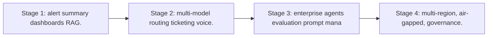

# Case Study: AI-Assisted NOC Platform

> **Tier:** network-ai-systems · **Status:** complete · Original numbers and diagrams.

## 1. Problem statement
A NOC copilot that reads critical alerts, summarizes active incidents, retrieves device status, creates incident tickets, guides engineers through runbooks, records spoken notes, and escalates, with multi-model routing and a real-time voice-agent, but never executes high-risk changes without approval. This is a network-ai-systems-tier system design challenge because it must handle high availability under peak load while ensuring no single point of failure. The design must be production-grade: observable, debuggable, reversible, and able to survive component failures without data loss or cascading outages.

## 2. Scope
In (v1): alert ingestion + summarization, incident list, device-status Q&A, ticket creation, runbook guidance (RAG), voice-agent for read/summarize/guide/escalate, multi-model routing, audit. Out: autonomous change execution (excluded).

For AI-Assisted NOC Platform, these boundaries keep the first version focused on the core user value. Adding more features would dilute the design and delay shipping. Each excluded item is a scaling stage — a candidate for the next iteration once the baseline is proven.

## 3. Functional requirements
- Read and summarize active incidents.
- Retrieve device status on request.
- Create incident tickets.
- Guide engineers through runbooks.
- Record spoken incident notes.
- Escalate.
- Route tasks to the right model.
- Never execute high-risk changes via voice/autonomous.

For AI-Assisted NOC Platform, these requirements drive specific architectural decisions: the read-write ratio determines the caching strategy, the durability target sets the replication mode, and the idempotency requirement shapes the API contract.

## 4. Non-functional requirements
- Alert-to-summary < 10 s.
- Voice interaction < 1.5 s turn latency.
- Availability 99.9 percent.
- No silent high-risk execution.

For AI-Assisted NOC Platform, each non-functional target constrains a specific component: the latency SLO bounds the number of synchronous hops, the availability target forces redundancy across availability zones, and the cost ceiling limits the replication factor and storage tier.

## 5. Explicit assumptions
1. ~200 concurrent incidents during a storm. 2. Mostly read/summarize/guide, few write actions. 3. Voice + text channels.

For AI-Assisted NOC Platform, if these assumptions are off by an order of magnitude, the architecture must adapt: 10x traffic may require earlier sharding, a different read-write ratio changes the caching strategy, and a higher peak multiplier demands more headroom.

## 6. Traffic estimation
Bursty during incidents; mostly reads + summarizations; voice sessions moderate concurrency.

To derive the request rate: divide the daily volume by 86,400 seconds to get the average rate, then multiply by 5-10x for peak. The read-to-write ratio determines whether the system is cache-dominated (read-heavy) or write-path-dominated (write-heavy). For AI-Assisted NOC Platform, this ratio shapes the entire storage and replication strategy.

## 7. Storage estimation
Incidents + runbooks (RAG vector DB) + transcripts + audit; modest, must be auditable.

For AI-Assisted NOC Platform, storage growth is projected from the daily write volume and retention policy. Index overhead and compression factors are accounted for in the total.

## 8. Bandwidth estimation
Voice streams (real-time) + text; moderate.

Bandwidth is request rate multiplied by average payload size for ingress, and response rate multiplied by response size for egress. CDN and edge caching reduce origin egress. Compression reduces bandwidth by 50-80 percent where applicable. For AI-Assisted NOC Platform, bandwidth may or may not be the binding constraint — compare it against compute and storage to find out.

## 9. API design

GET /incidents/active; POST /tickets; POST /ask; WS /voice; POST /escalate.

## 10. Data model
incidents(id, severity, status, summary); runbooks(chunks, embeddings); transcripts(session, turns); audit(actor, action, ts).

For AI-Assisted NOC Platform, the data model follows the access pattern. The primary lookup determines the partition key; secondary lookups determine indexes. Denormalization is used selectively on hot read paths.

## 11. High-level architecture

## 12. Request flow
Alerts summarized -> active incidents dashboard; engineer asks (text/voice) -> multi-model router picks model (small for classify, large for analysis, embedding for runbook RAG, vision for diagrams) -> actions (ticket/escalate/notes) -> high-risk actions require approval -> all audited; voice never executes changes.

## 13. Component responsibilities
Summarizer, incident dashboard, Q&A + runbook RAG, voice agent, multi-model router, ticket/escalate/notes, approval gate, audit.

For AI-Assisted NOC Platform, each component has one job. The gateway authenticates and routes. Services are stateless and scale horizontally. The data tier is the stateful core that scales by sharding.

## 14. Database selection
Incident/ticket store (relational); runbook RAG (vector DB); transcripts (object storage); audit (append-only). Rejected: one model for all tasks (cost/quality).

For AI-Assisted NOC Platform, the database was chosen by access pattern, not familiarity. The rejected alternatives were wrong for this workload, not bad in general.

## 15. Caching strategy
Active-incident summaries cached; common runbook queries cached (permission-aware).

For AI-Assisted NOC Platform, the cache strategy matches the staleness tolerance. Cache-aside for most data, write-through where read-after-write matters, stampede protection on hot keys.

## 16. Partitioning strategy
Incidents by site; RAG by runbook namespace; router stateless.

For AI-Assisted NOC Platform, the partition key balances query locality with even load distribution. Sharding strategy matters because a poor key creates hot spots under real traffic patterns.

## 17. Replication strategy
Incident store RF=3; RAG replicated; router stateless + provider failover; voice gateways replicated.

For AI-Assisted NOC Platform, replication mode is split: synchronous where durability is critical, asynchronous elsewhere for throughput. RF=3 tolerates one failure. Failover is tested regularly.

## 18. Consistency model
Incident status strongly tracked; RAG eventual with ingest; AI outputs advisory.

For AI-Assisted NOC Platform, the consistency level is the weakest users accept. Read-your-writes is provided where needed. Eventual consistency is bounded and monitored, not unbounded and silent.

## 19. Failure scenarios
Provider/model down -> failover/fallback model. RAG down -> answer without runbook (disclaimer). Voice gateway down -> reconnect. High-risk action blocked without approval.

## 20. Reliability strategy
SLI summary latency, voice turn latency; SLO 99.9 percent. Fallback models + approval gate. Chaos: kill a provider, assert fallback.

For AI-Assisted NOC Platform, the SLO makes reliability measurable. The error budget balances feature velocity with stability. Chaos testing validates that resilience claims hold under real failures.

## 21. Security considerations
RBAC; AI safety gateway (never expose passwords/keys, never auto-change, never send confidential configs to unapproved models); PII redaction; full audit; voice confirmation for escalations.

For AI-Assisted NOC Platform, security layers TLS, encryption at rest, RBAC, PII redaction, and audit. The policy gateway is fail-closed for AI-augmented operations.

## 22. Observability strategy
Summary latency, model routing mix, cost per incident, voice turn latency, escalation rate, approval/override rate, false-positive alerts.

For AI-Assisted NOC Platform, observability combines logs, metrics, and traces with correlation IDs. Golden signals drive the first dashboard. Alerts fire on burn rate, not raw thresholds.

## 23. Cost considerations
Model inference (tokens) dominates -> multi-model routing cuts cost (small models for cheap tasks); cache; local model for confidential configs.

For AI-Assisted NOC Platform, cost is driven by the binding resource. Caching, tiering, batching, and right-sizing are the levers. Cost per request is tracked and alerted on.

## 24. Scaling stages
Stage 1: alert summary + dashboards + RAG. -> Stage 2: multi-model routing + ticketing + voice. -> Stage 3: enterprise agents + evaluation + prompt management. -> Stage 4: multi-region, air-gapped, governance.

## 25. Trade-offs
Multi-model routing (cost/quality) vs one model (simple). Voice (hands-free) vs text (precise). Autonomy (speed) vs approval (safety). Cloud models (quality) vs local (privacy).

For AI-Assisted NOC Platform, each trade-off lists what was chosen, what was rejected, and why. This makes the design defensible in review — every decision has documented reasoning.

## 26. Alternative designs
Single model (cost/quality). Autonomous execution (unsafe). Text-only (no hands-free).

For AI-Assisted NOC Platform, the alternatives are real architectures that work under different constraints. They were rejected for this workload's specific requirements, not because they are bad designs.

## 27. Interview discussion points
Clarify channels, model mix, voice latency, autonomy limits. Surface multi-model routing, RAG, approval gate, audit, and the no-autonomous-high-risk principle.

For AI-Assisted NOC Platform in an interview: clarify scope first, surface the read-write ratio, design the hot path deeply, discuss failures, and offer an alternative. Weak candidates skip failure modes.

## 28. Original Mermaid diagrams
Standalone sources under `diagrams/case-studies/ai-assisted-noc/`: `context.mmd`, `request-sequence.mmd`, `failure-flow.mmd`, `scaling-evolution.mmd`. The diagrams are embedded in their respective sections: architecture in section 11, request flow in section 12, failure scenarios in section 19, and scaling stages in section 24.

## 29. Further reading
Multi-model routing: docs/ai-systems; RAG: docs/ai-systems; voice: video-conferencing case; AI safety gateway. Sources: `S-CHASH` `S-DYNAMO`.

## 30. Practical exercises

1. Multi-model routing policy. 2. Voice-agent high-risk guardrails. 3. Runbook RAG permission-aware. 4. Cost per incident budgeting. 5. Failover across model providers.

---
Previous: Configuration drift detection · Next: Network digital twin

