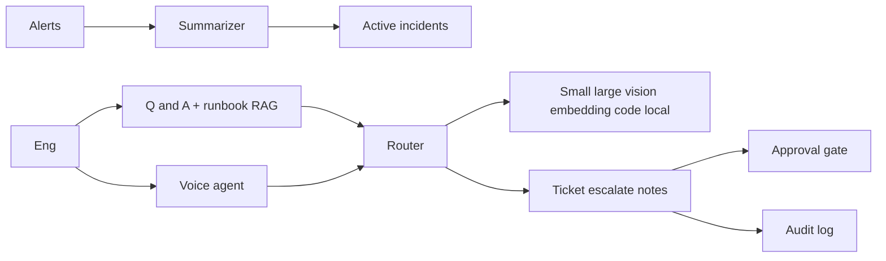
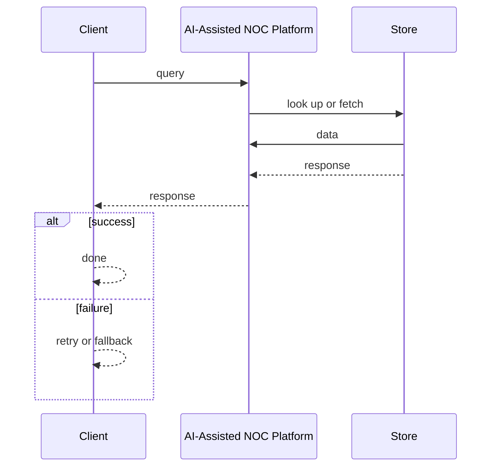
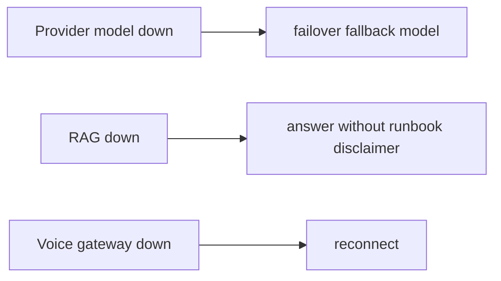

# Case Study: AI-Assisted NOC Platform

> **Tier:** network-ai-systems · **Status:** complete · Original numbers and diagrams.

## 11. High-level architecture

## 28. Original Mermaid diagrams

Standalone sources under `diagrams/case-studies/ai-assisted-noc/`: `context.mmd`, `request-sequence.mmd`, `failure-flow.mmd`, `scaling-evolution.mmd`. Request sequence and failure flow:

## 1. Problem statement

A NOC copilot that reads critical alerts, summarizes active incidents, retrieves device status, creates incident tickets, guides engineers through runbooks, records spoken notes, and escalates, with multi-model routing and a real-time voice-agent, but never executes high-risk changes without approval.

## 2. Scope

In (v1): alert ingestion + summarization, incident list, device-status Q&A, ticket creation, runbook guidance (RAG), voice-agent for read/summarize/guide/escalate, multi-model routing, audit. Out: autonomous change execution (excluded).

## 3. Functional requirements

- Read and summarize active incidents.
- Retrieve device status on request.
- Create incident tickets.
- Guide engineers through runbooks.
- Record spoken incident notes.
- Escalate.
- Route tasks to the right model.
- Never execute high-risk changes via voice/autonomous.

## 4. Non-functional requirements

- Alert-to-summary < 10 s.
- Voice interaction < 1.5 s turn latency.
- Availability 99.9 percent.
- No silent high-risk execution.

## 5. Explicit assumptions

1. ~200 concurrent incidents during a storm. 2. Mostly read/summarize/guide, few write actions. 3. Voice + text channels.

## 6. Traffic estimation

Bursty during incidents; mostly reads + summarizations; voice sessions moderate concurrency.

## 7. Storage estimation

Incidents + runbooks (RAG vector DB) + transcripts + audit; modest, must be auditable.

## 8. Bandwidth estimation

Voice streams (real-time) + text; moderate.

## 9. API design

GET /incidents/active; POST /tickets; POST /ask; WS /voice; POST /escalate.

## 10. Data model

incidents(id, severity, status, summary); runbooks(chunks, embeddings); transcripts(session, turns); audit(actor, action, ts).

## 12. Request flow

Alerts summarized -> active incidents dashboard; engineer asks (text/voice) -> multi-model router picks model (small for classify, large for analysis, embedding for runbook RAG, vision for diagrams) -> actions (ticket/escalate/notes) -> high-risk actions require approval -> all audited; voice never executes changes.

## 13. Component responsibilities

Summarizer, incident dashboard, Q&A + runbook RAG, voice agent, multi-model router, ticket/escalate/notes, approval gate, audit.

## 14. Database selection

Incident/ticket store (relational); runbook RAG (vector DB); transcripts (object storage); audit (append-only). Rejected: one model for all tasks (cost/quality).

## 15. Caching strategy

Active-incident summaries cached; common runbook queries cached (permission-aware).

## 16. Partitioning strategy

Incidents by site; RAG by runbook namespace; router stateless.

## 17. Replication strategy

Incident store RF=3; RAG replicated; router stateless + provider failover; voice gateways replicated.

## 18. Consistency model

Incident status strongly tracked; RAG eventual with ingest; AI outputs advisory.

## 19. Failure scenarios

Provider/model down -> failover/fallback model. RAG down -> answer without runbook (disclaimer). Voice gateway down -> reconnect. High-risk action blocked without approval.

## 20. Reliability strategy

SLI summary latency, voice turn latency; SLO 99.9 percent. Fallback models + approval gate. Chaos: kill a provider, assert fallback.

## 21. Security considerations

RBAC; AI safety gateway (never expose passwords/keys, never auto-change, never send confidential configs to unapproved models); PII redaction; full audit; voice confirmation for escalations.

## 22. Observability strategy

Summary latency, model routing mix, cost per incident, voice turn latency, escalation rate, approval/override rate, false-positive alerts.

## 23. Cost considerations

Model inference (tokens) dominates -> multi-model routing cuts cost (small models for cheap tasks); cache; local model for confidential configs.

## 24. Scaling stages

Stage 1: alert summary + dashboards + RAG. -> Stage 2: multi-model routing + ticketing + voice. -> Stage 3: enterprise agents + evaluation + prompt management. -> Stage 4: multi-region, air-gapped, governance.

## 25. Trade-offs

Multi-model routing (cost/quality) vs one model (simple). Voice (hands-free) vs text (precise). Autonomy (speed) vs approval (safety). Cloud models (quality) vs local (privacy).

## 26. Alternative designs

Single model (cost/quality). Autonomous execution (unsafe). Text-only (no hands-free).

## 27. Interview discussion points

Clarify channels, model mix, voice latency, autonomy limits. Surface multi-model routing, RAG, approval gate, audit, and the no-autonomous-high-risk principle.

## 29. Further reading

Multi-model routing: docs/ai-systems; RAG: docs/ai-systems; voice: video-conferencing case; AI safety gateway.

## 30. Practical exercises

1. Multi-model routing policy. 2. Voice-agent high-risk guardrails. 3. Runbook RAG permission-aware. 4. Cost per incident budgeting. 5. Failover across model providers.

---
Previous: Configuration drift detection · Next: Network digital twin

