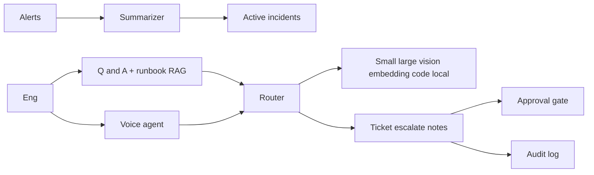
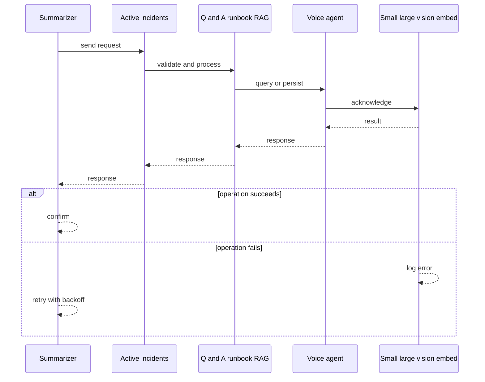
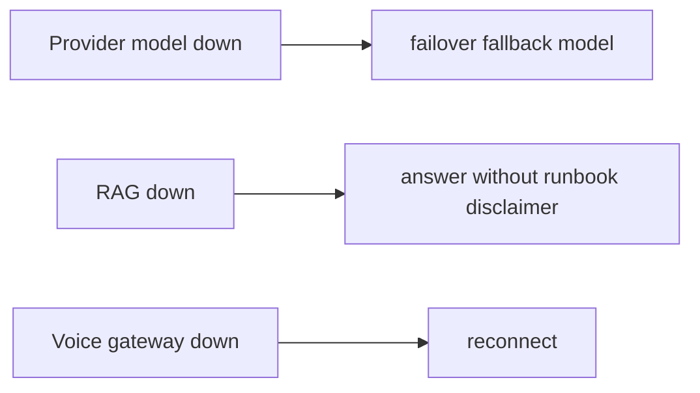
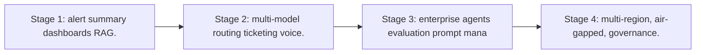

# Case Study: AI-Assisted NOC Platform

> **Tier:** network-ai-systems · **Status:** complete · Original numbers and diagrams.

## 1. Problem statement
A NOC copilot that reads critical alerts, summarizes active incidents, retrieves device status, creates incident tickets, guides engineers through runbooks, records spoken notes, and escalates, with multi-model routing and a real-time voice-agent, but never executes high-risk changes without approval. This is a network-ai-systems-tier system design challenge because it must handle high availability under peak load while ensuring no single point of failure. The design must be production-grade: observable, debuggable, reversible, and able to survive component failures without data loss or cascading outages.

## 2. Scope
In (v1): alert ingestion + summarization, incident list, device-status Q&A, ticket creation, runbook guidance (RAG), voice-agent for read/summarize/guide/escalate, multi-model routing, audit. Out: autonomous change execution (excluded).

These boundaries are deliberate. Including more in the first version would spread effort thin and delay shipping a working core. Each excluded feature — noted as a scaling stage — is a candidate for the next iteration once the core loop is proven in production and the team has operational confidence in the baseline architecture.

## 3. Functional requirements
- Read and summarize active incidents.
- Retrieve device status on request.
- Create incident tickets.
- Guide engineers through runbooks.
- Record spoken incident notes.
- Escalate.
- Route tasks to the right model.
- Never execute high-risk changes via voice/autonomous.

Each requirement has a direct architectural consequence. The read-heavy or write-heavy pattern determines the caching strategy. The durability requirement determines whether replication is synchronous or asynchronous. The idempotency requirement means every write path must handle redelivery without double-application — a design constraint that shapes the entire API and data model.

## 4. Non-functional requirements
- Alert-to-summary < 10 s.
- Voice interaction < 1.5 s turn latency.
- Availability 99.9 percent.
- No silent high-risk execution.

These targets are not aspirational — they are design constraints that shape every component choice. The latency SLO forces edge caching and limits synchronous cross-region calls on the hot path. The availability target drives a replication factor of 3 and multi-AZ deployment. The cost target constrains the model size, storage tier, and over-provisioning margin. Every architectural decision in this case study traces back to one of these targets.

## 5. Explicit assumptions
1. ~200 concurrent incidents during a storm. 2. Mostly read/summarize/guide, few write actions. 3. Voice + text channels.

These assumptions are load-bearing: if any is wrong by an order of magnitude, the architecture must adapt. Ten times more traffic may require sharding earlier. A different read-write ratio changes the caching strategy entirely. The peak multiplier affects headroom sizing. State them explicitly, revisit them after launch, and parameterize the design by these numbers rather than locking to them.

## 6. Traffic estimation
Bursty during incidents; mostly reads + summarizations; voice sessions moderate concurrency.

To derive the request rate: divide the daily volume by 86,400 seconds to get the average rate, then multiply by 5-10x for peak. The read-to-write ratio determines whether the system is cache-dominated (read-heavy) or write-path-dominated (write-heavy). For AI-Assisted NOC Platform, this ratio shapes the entire storage and replication strategy.

## 7. Storage estimation
Incidents + runbooks (RAG vector DB) + transcripts + audit; modest, must be auditable.

Storage grows linearly with time. Daily growth multiplied by the retention period gives total storage. Add 20-30 percent for index overhead. Compression can reduce effective storage by 50-80 percent. The replication factor multiplies the total. Without a retention policy, storage grows without bound and cost becomes unsustainable.

## 8. Bandwidth estimation
Voice streams (real-time) + text; moderate.

Bandwidth is request rate multiplied by average payload size for ingress, and response rate multiplied by response size for egress. CDN and edge caching reduce origin egress. Compression reduces bandwidth by 50-80 percent where applicable. For AI-Assisted NOC Platform, bandwidth may or may not be the binding constraint — compare it against compute and storage to find out.

## 9. API design

GET /incidents/active; POST /tickets; POST /ask; WS /voice; POST /escalate.

## 10. Data model
incidents(id, severity, status, summary); runbooks(chunks, embeddings); transcripts(session, turns); audit(actor, action, ts).

The data model is designed around the access pattern, not the entity shape. The primary lookup path determines the partition key. Secondary access paths determine which indexes to build. Denormalization is applied selectively where the hot read path would otherwise require expensive joins — with CDC or the outbox pattern keeping the denormalized view consistent with the source of truth.

## 11. High-level architecture

## 12. Request flow
Alerts summarized -> active incidents dashboard; engineer asks (text/voice) -> multi-model router picks model (small for classify, large for analysis, embedding for runbook RAG, vision for diagrams) -> actions (ticket/escalate/notes) -> high-risk actions require approval -> all audited; voice never executes changes.

## 13. Component responsibilities
Summarizer, incident dashboard, Q&A + runbook RAG, voice agent, multi-model router, ticket/escalate/notes, approval gate, audit.

Each component has a single, well-defined responsibility. The gateway handles authentication and routing. The service tier is stateless and horizontally scalable. The data tier is the stateful core, carefully partitioned and replicated. This separation allows each tier to scale independently: stateless tiers add replicas with demand; the stateful tier scales by sharding or read replicas.

## 14. Database selection
Incident/ticket store (relational); runbook RAG (vector DB); transcripts (object storage); audit (append-only). Rejected: one model for all tasks (cost/quality).

The database choice is driven by the access pattern, not by familiarity. A relational database was chosen or rejected based on whether the workload needs joins and transactions. A key-value store was chosen or rejected based on whether the workload is a single-key lookup at massive scale. The rejected alternatives were rejected for specific, workload-dependent reasons — not because they are bad databases, but because they are the wrong fit for this system.

## 15. Caching strategy
Active-incident summaries cached; common runbook queries cached (permission-aware).

The caching strategy is designed around the staleness tolerance of the workload. Cache-aside is the default — simple and lazy. Write-through is used where read-after-write consistency matters. Stampede protection (request coalescing or stale-while-revalidate) is applied to any key that can go viral. Cache entries are namespaced by tenant where multi-tenancy applies, preventing cross-tenant leakage.

## 16. Partitioning strategy
Incidents by site; RAG by runbook namespace; router stateless.

The partition key co-locates related data so queries do not fan out across shards, while distributing load evenly so no single shard is hot. Consistent hashing with virtual nodes minimizes data movement when nodes are added or removed. A hot key — a viral entity or a giant tenant — is mitigated by caching, extra replication, or key splitting, not by adding more shards.

## 17. Replication strategy
Incident store RF=3; RAG replicated; router stateless + provider failover; voice gateways replicated.

Replication is synchronous on the write-confirmation path where durability is critical — the commit waits for at least one follower before acknowledging. Elsewhere it is asynchronous for throughput. A replication factor of 3 tolerates one failure while maintaining quorum. Failover is tested, not just configured: a follower that was never promoted will fail when you need it most.

## 18. Consistency model
Incident status strongly tracked; RAG eventual with ingest; AI outputs advisory.

The consistency model is chosen as the weakest that users can tolerate, because stronger consistency costs latency and availability. Read-your-writes is provided where the user expects to see their own write immediately. Eventual consistency is bounded — seconds, not unbounded — and monitored. The system documents what 'eventual' means to users rather than hiding it.

## 19. Failure scenarios
Provider/model down -> failover/fallback model. RAG down -> answer without runbook (disclaimer). Voice gateway down -> reconnect. High-risk action blocked without approval.

## 20. Reliability strategy
SLI summary latency, voice turn latency; SLO 99.9 percent. Fallback models + approval gate. Chaos: kill a provider, assert fallback.

The SLO defines what 'good' means measurably. The error budget — the difference between 100 percent and the SLO — is the allowed unavailability that can be spent on deploys and feature risk. When the budget is nearly exhausted, risky changes are frozen. The system is tested with chaos engineering to verify that resilience assumptions hold. An untested failover is not a failover.

## 21. Security considerations
RBAC; AI safety gateway (never expose passwords/keys, never auto-change, never send confidential configs to unapproved models); PII redaction; full audit; voice confirmation for escalations.

Security is defense in depth: TLS in transit, encryption at rest, RBAC with default-deny, PII redaction in logs, audit trails for every state-changing operation, and per-tenant isolation. For AI-augmented systems, the policy gateway is fail-closed — on any error, the system refuses to act rather than allowing an unguarded action.

## 22. Observability strategy
Summary latency, model routing mix, cost per incident, voice turn latency, escalation rate, approval/override rate, false-positive alerts.

Observability uses the three signals — logs, metrics, and traces — with correlation IDs to stitch a single request across services. The golden signals (latency, traffic, errors, saturation) are the first dashboard. Alerts fire on SLO burn rate, not on raw thresholds, to avoid noise. The on-call runbook for each alert is tested, not theoretical.

## 23. Cost considerations
Model inference (tokens) dominates -> multi-model routing cuts cost (small models for cheap tasks); cache; local model for confidential configs.

Cost is dominated by the binding resource identified in the traffic estimate. The primary levers are caching (cuts read cost), tiering (cuts storage cost), batching (cuts per-request overhead), and right-sizing (no over-provisioned idle capacity). Cost is tracked as a first-class metric — cost per request, cost per tenant, cost per outcome — and alerted on when unit cost spikes.

## 24. Scaling stages
Stage 1: alert summary + dashboards + RAG. -> Stage 2: multi-model routing + ticketing + voice. -> Stage 3: enterprise agents + evaluation + prompt management. -> Stage 4: multi-region, air-gapped, governance.

## 25. Trade-offs
Multi-model routing (cost/quality) vs one model (simple). Voice (hands-free) vs text (precise). Autonomy (speed) vs approval (safety). Cloud models (quality) vs local (privacy).

Every trade-off has a rejected alternative with a reason. The design does not present one option as universally correct — it presents the chosen option, the rejected alternative, and the workload-specific reason for the choice. This is what makes the design defensible in a review: the reviewer can challenge any decision and find the reasoning documented.

## 26. Alternative designs
Single model (cost/quality). Autonomous execution (unsafe). Text-only (no hands-free).

The alternative designs are genuine architectures that would work under different constraints. They were rejected for this workload because of specific requirements — latency SLO, cost budget, consistency need — that make them inferior here but not universally inferior. Understanding why an alternative was rejected is as important as understanding why the chosen design was selected.

## 27. Interview discussion points
Clarify channels, model mix, voice latency, autonomy limits. Surface multi-model routing, RAG, approval gate, audit, and the no-autonomous-high-risk principle.

In an interview, the strongest candidates clarify ambiguity before designing, surface the read-write ratio and the binding resource, design the hot path deeply rather than just drawing boxes, discuss failure modes explicitly, and offer an alternative with a reason. The weakest candidates draw boxes before clarifying scope, name a vendor product as the architecture, and skip failure modes entirely.

## 28. Original Mermaid diagrams
Standalone sources under `diagrams/case-studies/ai-assisted-noc/`: `context.mmd`, `request-sequence.mmd`, `failure-flow.mmd`, `scaling-evolution.mmd`. The diagrams are embedded in their respective sections: architecture in section 11, request flow in section 12, failure scenarios in section 19, and scaling stages in section 24.

## 29. Further reading
Multi-model routing: docs/ai-systems; RAG: docs/ai-systems; voice: video-conferencing case; AI safety gateway. Sources: `S-CHASH` `S-DYNAMO`.

## 30. Practical exercises

1. Multi-model routing policy. 2. Voice-agent high-risk guardrails. 3. Runbook RAG permission-aware. 4. Cost per incident budgeting. 5. Failover across model providers.

---
Previous: Configuration drift detection · Next: Network digital twin

