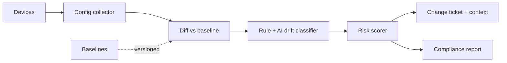
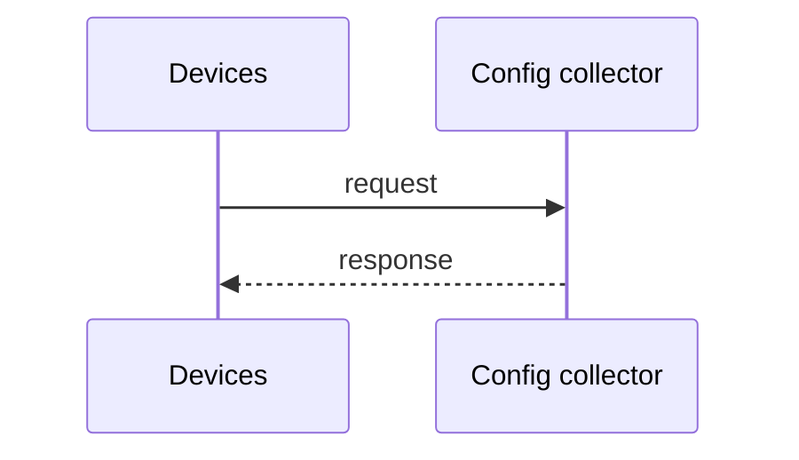
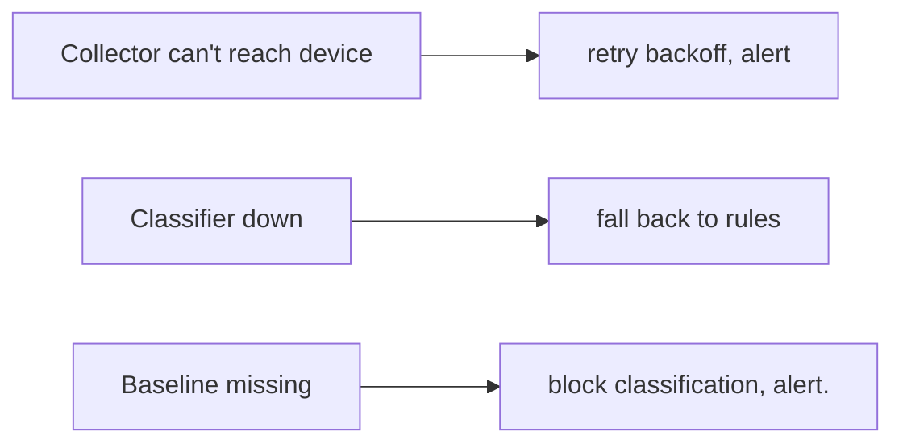
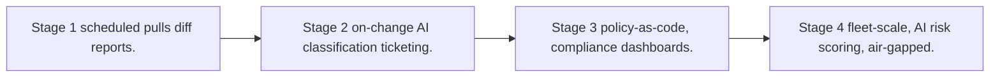

# Case Study: Configuration Drift Detection Platform

> **Tier:** network-ai-systems · **Status:** draft · Original numbers and diagrams.

## 11. High-level architecture

## 28. Original Mermaid diagrams

Standalone sources under `diagrams/case-studies/configuration-drift-detection/`: `context.mmd`, `request-sequence.mmd`, `failure-flow.mmd`, `scaling-evolution.mmd`. Additional diagrams:

## 1. Problem statement

Continuously compare live device configurations against approved baselines/policies, detect drift, classify intent (authorized change vs unauthorized/error), and route to change-management with risk scoring.

## 2. Scope

In (v1): baseline + policy definitions, periodic + on-change config collection, diff engine, drift classification (rule + AI), risk scoring, ticketing, compliance reporting. Out: auto-remediation (human approval).

## 3. Functional requirements

- Define baselines/policies per device class. - Collect current configs. - Diff vs baseline. - Classify drift (authorized/unauthorized/error/policy violation). - Score risk. - Open change ticket with context. - Report compliance.

## 4. Non-functional requirements

- Detect drift within 15 min of change. - No false auto-remediation. - Full audit. - Multi-vendor config parsing.

## 5. Explicit assumptions

1. 10k devices, configs pulled hourly + on-change traps. [assumption] 2. ~5 percent drift, most authorized. [assumption] 3. Baselines versioned. [constraint]

## 6. Traffic estimation

Config pulls hourly (bursts) + on-change; read-dominated analysis.

## 7. Storage estimation

Versioned configs (GBs, retained for audit) + baselines + diffs + tickets.

## 8. Bandwidth estimation

Config pull egress modest; small configs.

## 9. API design

GET /drift; POST /baselines; GET /compliance; POST /drift/:id/ack.

## 10. Data model

baselines(device_class, version, config); configs(device, version, config, hash); diffs(device, baseline, changes, class, risk); tickets(id, drift, status).

## 12. Request flow

Collector pulls configs (scheduled + on-change) -> diff vs versioned baseline -> rule+AI classifies drift (authorized/unauthorized/error/violation) -> risk score -> open change ticket with context + suggested review -> compliance report; human approves remediation.

## 13. Component responsibilities

Config collector, baseline store, diff engine, classifier (rule+AI), risk scorer, ticketing, compliance reporter.

## 14. Database selection

Versioned configs in object storage (append-only, auditable); baselines + diffs + tickets in a relational store. Rejected: in-place config overwrite (no audit).

## 15. Caching strategy

Baselines cached; recent diffs cached.

## 16. Partitioning strategy

Configs by device/site; diffs by date; baselines by device class.

## 17. Replication strategy

Config store durable RF/erasure; baselines RF=3; collector stateless, idempotent pulls.

## 18. Consistency model

Baselines strongly versioned; drift classification advisory; remediation requires human approval.

## 19. Failure scenarios

Collector can't reach device -> retry/backoff, alert. Classifier down -> fall back to rules. Baseline missing -> block classification, alert.

## 20. Reliability strategy

SLI drift-detection latency, coverage; SLO 99.9 percent. Rule fallback. Chaos: kill collector, assert resumable no missed devices.

## 21. Security considerations

Config encryption at rest; RBAC on baselines/configs; AI never auto-remediates; PII/secret redaction in configs; audit.

## 22. Observability strategy

Drift rate, classification distribution, risk distribution, ticket MTTR, compliance %, collector coverage.

## 23. Cost considerations

Config storage (versioned, grows) + compute (periodic). Retention policy cuts cost; tier old configs.

## 24. Scaling stages

Stage 1: scheduled pulls + diff + reports. -> Stage 2: on-change + AI classification + ticketing. -> Stage 3: policy-as-code, compliance dashboards. -> Stage 4: fleet-scale, AI risk scoring, air-gapped.

## 25. Trade-offs

Pull (simple) vs push/on-change (fresh). Rule (deterministic) vs AI (intent) classification. Auto-ticket (fast) vs noise. Retention (audit) vs cost.

## 26. Alternative designs

Manual diff (no scale). Auto-remediation (unsafe). Snapshot only without classification (noise).

## 27. Interview discussion points

Clarify cadence, vendor variety, auto-remediation tolerance. Surface diff/classify/risk/ticket pipeline and human-approval principle.

## 29. Further reading

Config compliance: Level 7; change management: Level 6; AI classifier.

## 30. Practical exercises

1. Policy-as-code baseline. 2. AI intent classification vs rules. 3. On-change vs hourly trade. 4. Secret redaction in stored configs. 5. Compliance reporting across sites.

---
Previous: Device upgrade management · Next: AI-assisted NOC
