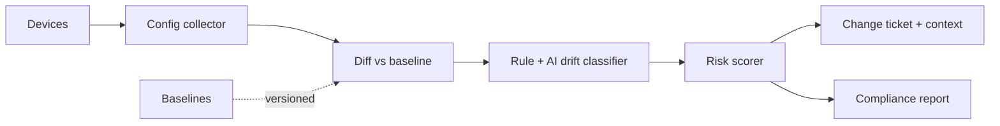
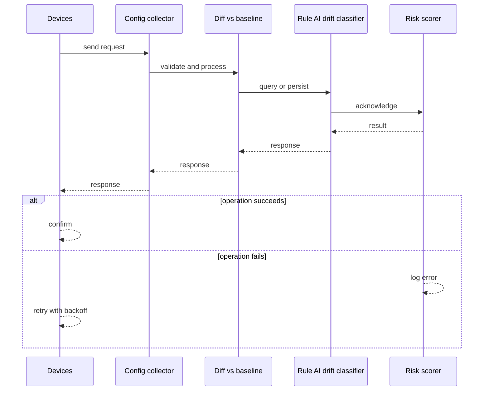
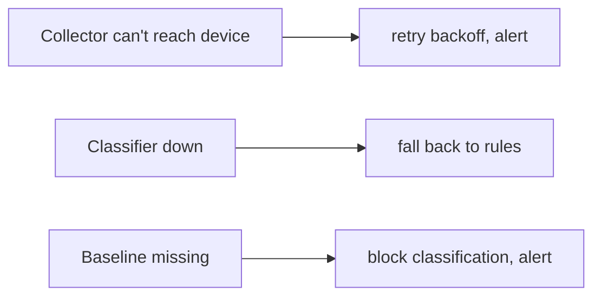
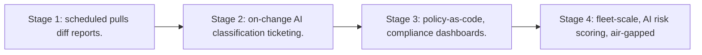

# Case Study: Configuration Drift Detection Platform

> **Tier:** network-ai-systems · **Status:** complete · Original numbers and diagrams.

## 1. Problem statement
Continuously compare live device configurations against approved baselines/policies, detect drift, classify intent (authorized change vs unauthorized/error), and route to change-management with risk scoring. This is a network-ai-systems-tier system design challenge because it must handle high availability under peak load while ensuring human approval for all high-risk changes. The design must be production-grade: observable, debuggable, reversible, and able to survive component failures without data loss or cascading outages.

## 2. Scope
In (v1): baseline + policy definitions, periodic + on-change config collection, diff engine, drift classification (rule + AI), risk scoring, ticketing, compliance reporting. Out: auto-remediation (human approval).

For Configuration Drift Detection Platform, these boundaries keep the first version focused on the core user value. Adding more features would dilute the design and delay shipping. Each excluded item is a scaling stage — a candidate for the next iteration once the baseline is proven.

## 3. Functional requirements
- Define baselines/policies per device class.
- Collect current configs.
- Diff vs baseline.
- Classify drift (authorized/unauthorized/error/policy violation).
- Score risk.
- Open change ticket with context.
- Report compliance.

For Configuration Drift Detection Platform, these requirements drive specific architectural decisions: the read-write ratio determines the caching strategy, the durability target sets the replication mode, and the idempotency requirement shapes the API contract.

## 4. Non-functional requirements
- Detect drift within 15 min of change.
- No false auto-remediation.
- Full audit.
- Multi-vendor config parsing.

For Configuration Drift Detection Platform, each non-functional target constrains a specific component: the latency SLO bounds the number of synchronous hops, the availability target forces redundancy across availability zones, and the cost ceiling limits the replication factor and storage tier.

## 5. Explicit assumptions
1. 10k devices, configs pulled hourly + on-change traps. [assumption] 2. ~5 percent drift, most authorized. [assumption] 3. Baselines versioned. [constraint]

For Configuration Drift Detection Platform, if these assumptions are off by an order of magnitude, the architecture must adapt: 10x traffic may require earlier sharding, a different read-write ratio changes the caching strategy, and a higher peak multiplier demands more headroom.

## 6. Traffic estimation
Config pulls hourly (bursts) + on-change; read-dominated analysis.

To derive the request rate: divide the daily volume by 86,400 seconds to get the average rate, then multiply by 5-10x for peak. The read-to-write ratio determines whether the system is cache-dominated (read-heavy) or write-path-dominated (write-heavy). For Configuration Drift Detection Platform, this ratio shapes the entire storage and replication strategy.

## 7. Storage estimation
Versioned configs (GBs, retained for audit) + baselines + diffs + tickets.

For Configuration Drift Detection Platform, storage growth is projected from the daily write volume and retention policy. Index overhead and compression factors are accounted for in the total.

## 8. Bandwidth estimation
Config pull egress modest; small configs.

Bandwidth is request rate multiplied by average payload size for ingress, and response rate multiplied by response size for egress. CDN and edge caching reduce origin egress. Compression reduces bandwidth by 50-80 percent where applicable. For Configuration Drift Detection Platform, bandwidth may or may not be the binding constraint — compare it against compute and storage to find out.

## 9. API design

GET /drift; POST /baselines; GET /compliance; POST /drift/:id/ack.

## 10. Data model
baselines(device_class, version, config); configs(device, version, config, hash); diffs(device, baseline, changes, class, risk); tickets(id, drift, status).

For Configuration Drift Detection Platform, the data model follows the access pattern. The primary lookup determines the partition key; secondary lookups determine indexes. Denormalization is used selectively on hot read paths.

## 11. High-level architecture

## 12. Request flow
Collector pulls configs (scheduled + on-change) -> diff vs versioned baseline -> rule+AI classifies drift (authorized/unauthorized/error/violation) -> risk score -> open change ticket with context + suggested review -> compliance report; human approves remediation.

## 13. Component responsibilities
Config collector, baseline store, diff engine, classifier (rule+AI), risk scorer, ticketing, compliance reporter.

For Configuration Drift Detection Platform, each component has one job. The gateway authenticates and routes. Services are stateless and scale horizontally. The data tier is the stateful core that scales by sharding.

## 14. Database selection
Versioned configs in object storage (append-only, auditable); baselines + diffs + tickets in a relational store. Rejected: in-place config overwrite (no audit).

For Configuration Drift Detection Platform, the database was chosen by access pattern, not familiarity. The rejected alternatives were wrong for this workload, not bad in general.

## 15. Caching strategy
Baselines cached; recent diffs cached.

For Configuration Drift Detection Platform, the cache strategy matches the staleness tolerance. Cache-aside for most data, write-through where read-after-write matters, stampede protection on hot keys.

## 16. Partitioning strategy
Configs by device/site; diffs by date; baselines by device class.

For Configuration Drift Detection Platform, the partition key balances query locality with even load distribution. Sharding strategy matters because a poor key creates hot spots under real traffic patterns.

## 17. Replication strategy
Config store durable RF/erasure; baselines RF=3; collector stateless, idempotent pulls.

For Configuration Drift Detection Platform, replication mode is split: synchronous where durability is critical, asynchronous elsewhere for throughput. RF=3 tolerates one failure. Failover is tested regularly.

## 18. Consistency model
Baselines strongly versioned; drift classification advisory; remediation requires human approval.

For Configuration Drift Detection Platform, the consistency level is the weakest users accept. Read-your-writes is provided where needed. Eventual consistency is bounded and monitored, not unbounded and silent.

## 19. Failure scenarios
Collector can't reach device -> retry/backoff, alert. Classifier down -> fall back to rules. Baseline missing -> block classification, alert.

## 20. Reliability strategy
SLI drift-detection latency, coverage; SLO 99.9 percent. Rule fallback. Chaos: kill collector, assert resumable no missed devices.

For Configuration Drift Detection Platform, the SLO makes reliability measurable. The error budget balances feature velocity with stability. Chaos testing validates that resilience claims hold under real failures.

## 21. Security considerations
Config encryption at rest; RBAC on baselines/configs; AI never auto-remediates; PII/secret redaction in configs; audit.

For Configuration Drift Detection Platform, security layers TLS, encryption at rest, RBAC, PII redaction, and audit. The policy gateway is fail-closed for AI-augmented operations.

## 22. Observability strategy
Drift rate, classification distribution, risk distribution, ticket MTTR, compliance %, collector coverage.

For Configuration Drift Detection Platform, observability combines logs, metrics, and traces with correlation IDs. Golden signals drive the first dashboard. Alerts fire on burn rate, not raw thresholds.

## 23. Cost considerations
Config storage (versioned, grows) + compute (periodic). Retention policy cuts cost; tier old configs.

For Configuration Drift Detection Platform, cost is driven by the binding resource. Caching, tiering, batching, and right-sizing are the levers. Cost per request is tracked and alerted on.

## 24. Scaling stages
Stage 1: scheduled pulls + diff + reports. -> Stage 2: on-change + AI classification + ticketing. -> Stage 3: policy-as-code, compliance dashboards. -> Stage 4: fleet-scale, AI risk scoring, air-gapped.

## 25. Trade-offs
Pull (simple) vs push/on-change (fresh). Rule (deterministic) vs AI (intent) classification. Auto-ticket (fast) vs noise. Retention (audit) vs cost.

For Configuration Drift Detection Platform, each trade-off lists what was chosen, what was rejected, and why. This makes the design defensible in review — every decision has documented reasoning.

## 26. Alternative designs
Manual diff (no scale). Auto-remediation (unsafe). Snapshot only without classification (noise).

For Configuration Drift Detection Platform, the alternatives are real architectures that work under different constraints. They were rejected for this workload's specific requirements, not because they are bad designs.

## 27. Interview discussion points
Clarify cadence, vendor variety, auto-remediation tolerance. Surface diff/classify/risk/ticket pipeline and human-approval principle.

For Configuration Drift Detection Platform in an interview: clarify scope first, surface the read-write ratio, design the hot path deeply, discuss failures, and offer an alternative. Weak candidates skip failure modes.

## 28. Original Mermaid diagrams
Standalone sources under `diagrams/case-studies/configuration-drift-detection/`: `context.mmd`, `request-sequence.mmd`, `failure-flow.mmd`, `scaling-evolution.mmd`. The diagrams are embedded in their respective sections: architecture in section 11, request flow in section 12, failure scenarios in section 19, and scaling stages in section 24.

## 29. Further reading
Config compliance: Level 7; change management: Level 6; AI classifier. Sources: `S-OTEL` `S-SLO`.

## 30. Practical exercises

1. Policy-as-code baseline. 2. AI intent classification vs rules. 3. On-change vs hourly trade. 4. Secret redaction in stored configs. 5. Compliance reporting across sites.

---
Previous: Device upgrade management · Next: AI-assisted NOC

