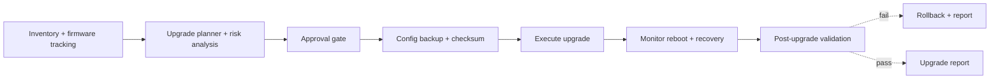
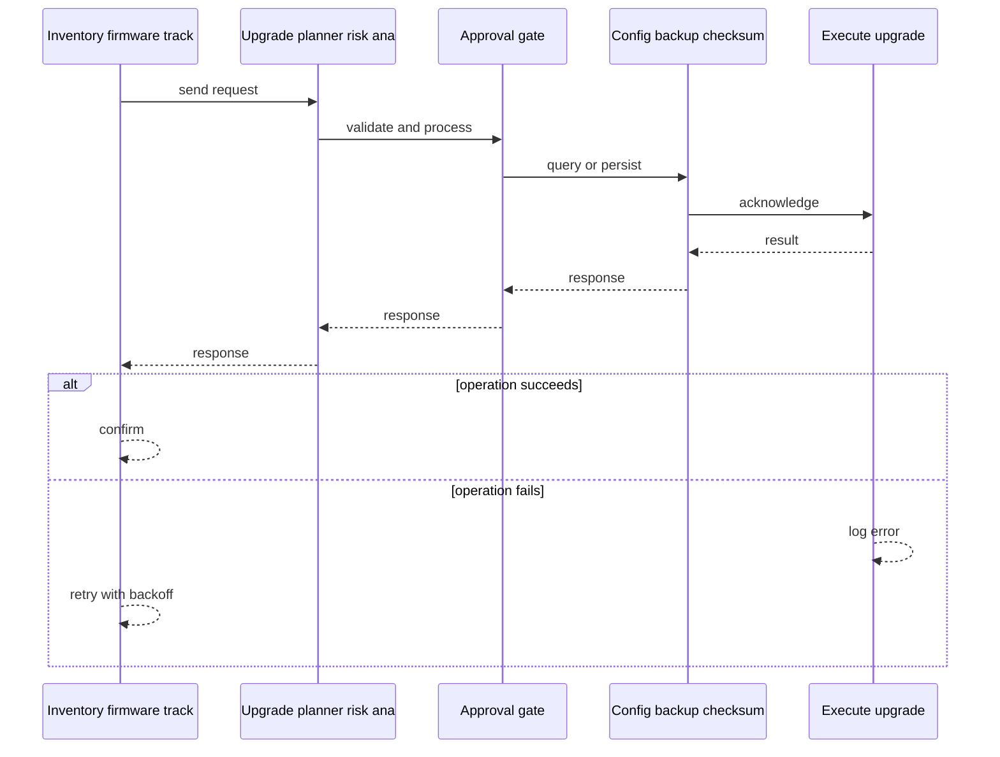
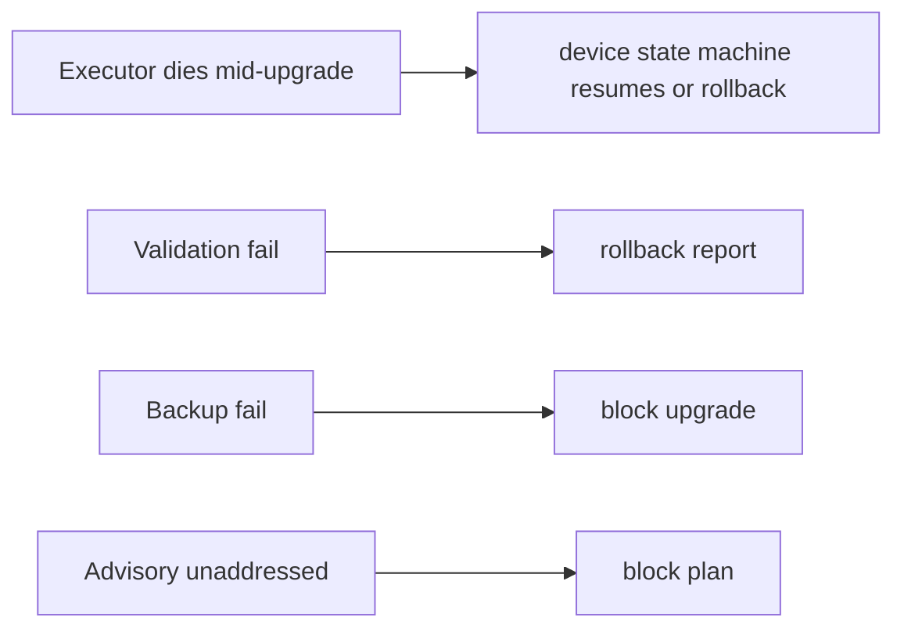
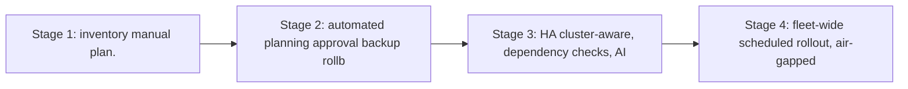

# Case Study: Network Device Update and Upgrade Management Platform

> **Tier:** network-ai-systems · **Status:** complete · Original numbers and diagrams.

## 1. Problem statement
Centrally plan, test, schedule, deploy, and verify firmware/software upgrades across network devices (firewalls, routers, switches, WLCs, APs, VPN, LB, DNS/DHCP, proxy, NAS) safely, with backups, HA-pair/cluster awareness, rollback, and audit. This is a network-ai-systems-tier system design challenge because it must handle multi-vendor device management while ensuring human approval for all high-risk changes. The design must be production-grade: observable, debuggable, reversible, and able to survive component failures without data loss or cascading outages.

## 2. Scope
In (v1): inventory + firmware tracking, target-version checks, release-note/advisory retrieval, compatibility + config-risk analysis, upgrade plan, config backup+checksum, maintenance window, approval, pre-checks, execute, monitor reboot, post-validation, rollback, report. Out: full zero-touch autonomous rollout (human approval required).

For Network Device Update and Upgrade Management Platform, these boundaries keep the first version focused on the core user value. Adding more features would dilute the design and delay shipping. Each excluded item is a scaling stage — a candidate for the next iteration once the baseline is proven.

## 3. Functional requirements

- Discover inventory and current firmware/config.
- Check approved targets + advisories + compatibility.
- Analyze config risk.
- Generate an upgrade plan.
- Back up config + checksum.
- Schedule maintenance window + get approval.
- Pre-upgrade health checks.
- Execute upgrade.
- Monitor reboot/service recovery.
- Post-upgrade validation.
- Roll back on failure.
- Generate upgrade report.

## 4. Non-functional requirements
- No device left bricked; rollback always possible.
- HA-pair/cluster-aware (upgrade one at a time, maintain service).
- Full audit + approval chain.
- Scheduled, rate-limited rollout.

For Network Device Update and Upgrade Management Platform, each non-functional target constrains a specific component: the latency SLO bounds the number of synchronous hops, the availability target forces redundancy across availability zones, and the cost ceiling limits the replication factor and storage tier.

## 5. Explicit assumptions
1. 20k devices, ~1 upgrade/device/year avg, batches of 50. [assumption] 2. Each upgrade 5-30 min. [assumption] 3. Approvals required. [constraint]

For Network Device Update and Upgrade Management Platform, if these assumptions are off by an order of magnitude, the architecture must adapt: 10x traffic may require earlier sharding, a different read-write ratio changes the caching strategy, and a higher peak multiplier demands more headroom.

## 6. Traffic estimation
Low request rate; the load is scheduled batches at maintenance windows, not a hot path.

To derive the request rate: divide the daily volume by 86,400 seconds to get the average rate, then multiply by 5-10x for peak. The read-to-write ratio determines whether the system is cache-dominated (read-heavy) or write-path-dominated (write-heavy). For Network Device Update and Upgrade Management Platform, this ratio shapes the entire storage and replication strategy.

## 7. Storage estimation
Inventory + firmware catalog + configs (versioned) + backups + reports; modest (GBs) but must be durable/auditable.

For Network Device Update and Upgrade Management Platform, storage growth is projected from the daily write volume and retention policy. Index overhead and compression factors are accounted for in the total.

## 8. Bandwidth estimation
Pushing firmware images to devices (MBs-GBs each) during windows; bandwidth moderate, scheduled.

Bandwidth is request rate multiplied by average payload size for ingress, and response rate multiplied by response size for egress. CDN and edge caching reduce origin egress. Compression reduces bandwidth by 50-80 percent where applicable. For Network Device Update and Upgrade Management Platform, bandwidth may or may not be the binding constraint — compare it against compute and storage to find out.

## 9. API design

GET /inventory; POST /upgrade-plans; POST /upgrade-plans/:id/approve; POST /upgrade-plans/:id/execute; POST /rollback; GET /reports/:id.

## 10. Data model
devices(id, type, vendor, model, firmware, config_hash, ha_pair, site); firmware_catalog(vendor, model, target, advisories, release_notes, compatible); upgrade_plans(id, devices[], steps, window, status, approvals[]); backups(plan, device, config, checksum); reports(plan, results, rollback?).

For Network Device Update and Upgrade Management Platform, the data model follows the access pattern. The primary lookup determines the partition key; secondary lookups determine indexes. Denormalization is used selectively on hot read paths.

## 11. High-level architecture

## 12. Request flow
Inventory + firmware tracking -> planner checks targets/advisories/compatibility/config-risk -> approval gate -> config backup+checksum -> execute (HA-pair/cluster aware, one at a time) -> monitor reboot/recovery -> post-validation -> on fail rollback, on pass report; all steps audited.

## 13. Component responsibilities
Inventory service, firmware/advisory catalog, planner/risk engine, approval workflow, backup service, executor, monitor/validator, rollback, report.

For Network Device Update and Upgrade Management Platform, each component has one job. The gateway authenticates and routes. Services are stateless and scale horizontally. The data tier is the stateful core that scales by sharding.

## 14. Database selection
Inventory/catalog/plan relational (transactional, audited); config backups in object storage (versioned, checksummed); execution logs append-only. Rejected: in-place config without backup.

For Network Device Update and Upgrade Management Platform, the database was chosen by access pattern, not familiarity. The rejected alternatives were wrong for this workload, not bad in general.

## 15. Caching strategy
Firmware catalog + release notes cached; inventory cached.

For Network Device Update and Upgrade Management Platform, the cache strategy matches the staleness tolerance. Cache-aside for most data, write-through where read-after-write matters, stampede protection on hot keys.

## 16. Partitioning strategy
Inventory by site; upgrades batched by site/HA-group; executor capacity per region.

For Network Device Update and Upgrade Management Platform, the partition key balances query locality with even load distribution. Sharding strategy matters because a poor key creates hot spots under real traffic patterns.

## 17. Replication strategy
Inventory/catalog RF=3; backups durable (object storage, cross-region); executor stateless, idempotent per device step.

For Network Device Update and Upgrade Management Platform, replication mode is split: synchronous where durability is critical, asynchronous elsewhere for throughput. RF=3 tolerates one failure. Failover is tested regularly.

## 18. Consistency model
Plan/approval strongly consistent (audit). Firmware version tracking per device authoritative. Rollback decision per device.

For Network Device Update and Upgrade Management Platform, the consistency level is the weakest users accept. Read-your-writes is provided where needed. Eventual consistency is bounded and monitored, not unbounded and silent.

## 19. Failure scenarios
Executor dies mid-upgrade -> device state machine resumes (or rollback). Validation fail -> rollback + report. Backup fail -> block upgrade. Advisory unaddressed -> block plan.

## 20. Reliability strategy
SLI rollback success, no-brick rate; SLO 99.9 percent. Backup + rollback always. Chaos: fail validation, assert rollback + report.

For Network Device Update and Upgrade Management Platform, the SLO makes reliability measurable. The error budget balances feature velocity with stability. Chaos testing validates that resilience claims hold under real failures.

## 21. Security considerations
Approval chain + RBAC; secrets in secret manager; config backups encrypted; no unapproved changes; AI safety gateway (no auto-upgrade outside windows).

For Network Device Update and Upgrade Management Platform, security layers TLS, encryption at rest, RBAC, PII redaction, and audit. The policy gateway is fail-closed for AI-augmented operations.

## 22. Observability strategy
Active upgrades, validation pass/fail, rollback rate, per-device stage, window adherence, advisory coverage.

For Network Device Update and Upgrade Management Platform, observability combines logs, metrics, and traces with correlation IDs. Golden signals drive the first dashboard. Alerts fire on burn rate, not raw thresholds.

## 23. Cost considerations
Executor compute (scheduled, bursty at windows) + firmware storage + backup storage. Right-size executors; store firmware once per catalog.

For Network Device Update and Upgrade Management Platform, cost is driven by the binding resource. Caching, tiering, batching, and right-sizing are the levers. Cost per request is tracked and alerted on.

## 24. Scaling stages
Stage 1: inventory + manual plan. -> Stage 2: automated planning + approval + backup/rollback. -> Stage 3: HA/cluster-aware, dependency checks, AI risk scoring. -> Stage 4: fleet-wide scheduled rollout, air-gapped firmware repo.

## 25. Trade-offs
Automation (speed) vs human approval (safety). Backup (safety) vs time. HA-aware (safety) vs parallel speed. AI risk scoring (assist) vs deterministic checks (trust).

For Network Device Update and Upgrade Management Platform, each trade-off lists what was chosen, what was rejected, and why. This makes the design defensible in review — every decision has documented reasoning.

## 26. Alternative designs
Manual per-device (no scale, no audit). Zero-touch autonomous (unsafe). No rollback (bricked devices).

For Network Device Update and Upgrade Management Platform, the alternatives are real architectures that work under different constraints. They were rejected for this workload's specific requirements, not because they are bad designs.

## 27. Interview discussion points
Clarify device count, HA/cluster model, rollback requirement, approval. Surface the plan/approve/backup/execute/validate/rollback pipeline and AI-as-assist principle.

For Network Device Update and Upgrade Management Platform in an interview: clarify scope first, surface the read-write ratio, design the hot path deeply, discuss failures, and offer an alternative. Weak candidates skip failure modes.

## 28. Original Mermaid diagrams
Standalone sources under `diagrams/case-studies/device-upgrade-management/`: `context.mmd`, `request-sequence.mmd`, `failure-flow.mmd`, `scaling-evolution.mmd`. The diagrams are embedded in their respective sections: architecture in section 11, request flow in section 12, failure scenarios in section 19, and scaling stages in section 24.

## 29. Further reading
Firmware lifecycle: docs/firmware-lifecycle; change management: Level 6; AI safety gateway. Sources: `S-OTEL` `S-SLO`.

## 30. Practical exercises

1. HA-pair upgrade ordering. 2. Rollback after partial batch. 3. AI config-risk scoring inputs. 4. Air-gapped firmware repository. 5. End-of-support tracking at fleet scale.

---
Previous: Intelligent syslog monitoring · Next: Configuration drift detection

