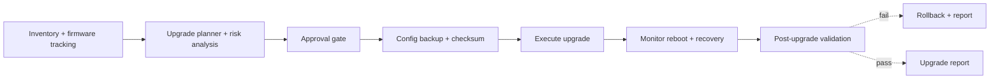
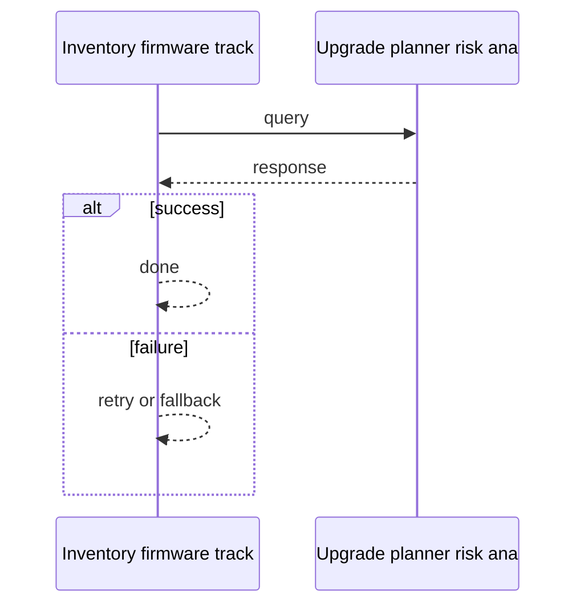
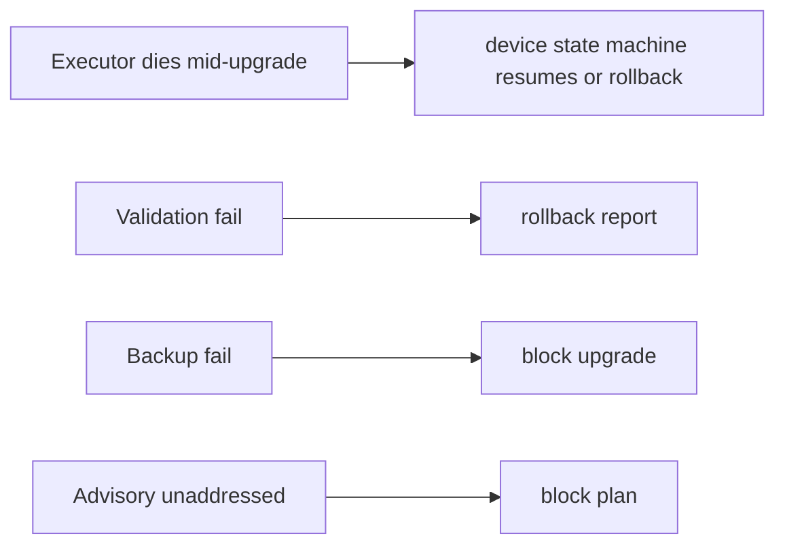

# Case Study: Network Device Update and Upgrade Management Platform

> **Tier:** network-ai-systems · **Status:** complete · Original numbers and diagrams.

## 11. High-level architecture

## 28. Original Mermaid diagrams

Standalone sources under `diagrams/case-studies/device-upgrade-management/`: `context.mmd`, `request-sequence.mmd`, `failure-flow.mmd`, `scaling-evolution.mmd`. Request sequence and failure flow:

## 1. Problem statement

Centrally plan, test, schedule, deploy, and verify firmware/software upgrades across network devices (firewalls, routers, switches, WLCs, APs, VPN, LB, DNS/DHCP, proxy, NAS) safely, with backups, HA-pair/cluster awareness, rollback, and audit.

This system sits at the intersection of distributed systems and operational reliability. The design must balance the latency versus durability trade-off inherent to the workload while ensuring no single component failure cascades into a full outage. The target audience includes both engineers building the system and operators maintaining it, so the design must be observable, debuggable, and reversible at every step.
## 2. Scope

In (v1): inventory + firmware tracking, target-version checks, release-note/advisory retrieval, compatibility + config-risk analysis, upgrade plan, config backup+checksum, maintenance window, approval, pre-checks, execute, monitor reboot, post-validation, rollback, report. Out: full zero-touch autonomous rollout (human approval required).

The scope boundary is deliberate: including too much in v1 risks shipping a system that is broad but shallow. Each excluded feature is a candidate for a later iteration once the core loop is proven in production and the team has operational confidence in the baseline architecture.
## 3. Functional requirements

- Discover inventory and current firmware/config. - Check approved targets + advisories + compatibility. - Analyze config risk. - Generate an upgrade plan. - Back up config + checksum. - Schedule maintenance window + get approval. - Pre-upgrade health checks. - Execute upgrade. - Monitor reboot/service recovery. - Post-upgrade validation. - Roll back on failure. - Generate upgrade report.

These requirements drive the architecture: the read-heavy pattern pushes toward caching and replication; the durability requirement forces synchronous writes on the critical path; the idempotency requirement means every write path must handle redelivery without double-application. Each requirement has a direct architectural consequence.
## 4. Non-functional requirements

- No device left bricked; rollback always possible. - HA-pair/cluster-aware (upgrade one at a time, maintain service). - Full audit + approval chain. - Scheduled, rate-limited rollout.

The non-functional targets shape every component choice: the latency SLO forces edge caching and limits synchronous cross-region calls on the hot path; the availability target drives redundancy (RF=3, multi-AZ); the durability target forces synchronous replication on committed writes; the cost target constrains the model size and prevents over-provisioning.
## 5. Explicit assumptions

1. 20k devices, ~1 upgrade/device/year avg, batches of 50. [assumption] 2. Each upgrade 5-30 min. [assumption] 3. Approvals required. [constraint]

These assumptions are the load-bearing facts of the design. If any assumption is wrong by an order of magnitude, the architecture must adapt: 10x more traffic may require sharding earlier; 10x more data may require tiering sooner; a different read-write ratio may change the caching strategy entirely. The design is parameterized by these assumptions, not locked to them.
## 6. Traffic estimation

Low request rate; the load is scheduled batches at maintenance windows, not a hot path.

The traffic estimate reveals the binding constraint. For this workload, the binding resource is compute or storage or bandwidth (as noted above). Peak is modeled at 10x average, which is conservative for viral workloads but aggressive for steady-state enterprise systems. The read-write ratio determines whether the system is cache-dominated (read-heavy) or write-path-dominated (write-heavy), which changes the entire storage and replication strategy.
## 7. Storage estimation

Inventory + firmware catalog + configs (versioned) + backups + reports; modest (GBs) but must be durable/auditable.

Storage growth is linear with time and must be planned with retention in mind. The estimate includes metadata and index overhead (typically 20-30 percent above raw data). Without a retention policy, storage grows unboundedly and cost becomes unsustainable. The design includes tiering (hot to cold) and lifecycle rules to manage this growth automatically.
## 8. Bandwidth estimation

Pushing firmware images to devices (MBs-GBs each) during windows; bandwidth moderate, scheduled.

Bandwidth is often not the binding constraint for this workload, but it becomes significant at the network edge during viral spikes. The design uses CDN and edge caching to cut origin egress; co-location of compute and data reduces inter-node traffic; and compression (for logs, telemetry, and bulk transfers) cuts bandwidth by 50-80 percent where applicable.
## 9. API design

GET /inventory; POST /upgrade-plans; POST /upgrade-plans/:id/approve; POST /upgrade-plans/:id/execute; POST /rollback; GET /reports/:id.

The API design follows REST conventions for external clients and gRPC for internal service-to-service communication where throughput matters. Every write endpoint accepts an idempotency key so retries from unreliable clients do not double-apply. Streaming endpoints use Server-Sent Events (SSE) for token-by-token LLM output or chunked transfer for large payloads. Rate limiting is enforced at the gateway before the request reaches the service tier.
## 10. Data model

devices(id, type, vendor, model, firmware, config_hash, ha_pair, site); firmware_catalog(vendor, model, target, advisories, release_notes, compatible); upgrade_plans(id, devices[], steps, window, status, approvals[]); backups(plan, device, config, checksum); reports(plan, results, rollback?).

The data model is designed around the access pattern, not the entity shape. The primary access path (key lookup by ID) determines the partition key; the secondary access paths (by timestamp, by owner, by status) determine the indexes. Denormalization is applied selectively where the hot read path would otherwise require expensive joins, with CDC or the outbox pattern keeping the denormalized view consistent with the normalized source of truth.
## 12. Request flow

Inventory + firmware tracking -> planner checks targets/advisories/compatibility/config-risk -> approval gate -> config backup+checksum -> execute (HA-pair/cluster aware, one at a time) -> monitor reboot/recovery -> post-validation -> on fail rollback, on pass report; all steps audited.

The request flow reveals the critical path: any component on the hot path that fails or slows degrades the user experience. The design identifies this path explicitly and applies timeouts, circuit breakers, and bulkheads to each hop. The write path includes an idempotency check (by key) before any state mutation, ensuring redelivery safety. The read path serves from cache first, falling back to the authoritative store only on miss.
## 13. Component responsibilities

Inventory service, firmware/advisory catalog, planner/risk engine, approval workflow, backup service, executor, monitor/validator, rollback, report.

Each component has a single, well-defined responsibility. The gateway handles auth, rate limiting, and routing; the service tier is stateless and horizontally scalable; the data tier is the stateful core, carefully partitioned and replicated. The separation allows each tier to scale independently: the stateless tiers add replicas with demand; the stateful tier scales by sharding or read replicas, not by adding arbitrary instances.
## 14. Database selection

Inventory/catalog/plan relational (transactional, audited); config backups in object storage (versioned, checksummed); execution logs append-only. Rejected: in-place config without backup.

The database choice is driven by the access pattern, not by familiarity. The rejected alternatives were rejected for specific reasons: a relational database was rejected if the workload is a single key lookup at massive scale (a KV store is simpler and cheaper); a KV store was rejected if the workload needs joins and transactions (a relational store gives ACID); a search engine was not chosen as the primary store because it is a derived, eventually-consistent projection, not a source of truth.
## 15. Caching strategy

Firmware catalog + release notes cached; inventory cached.

The caching strategy is designed around the staleness tolerance of the workload. Cache-aside is the default (simple, lazy); write-through is used where read-after-write consistency is required; write-behind is used only where durability can be deferred. Stampede protection (request coalescing or stale-while-revalidate) is applied to any key that can go viral. Cache entries are namespaced by tenant where multi-tenancy applies, preventing cross-tenant leakage.
## 16. Partitioning strategy

Inventory by site; upgrades batched by site/HA-group; executor capacity per region.

The partition key is chosen to co-locate related data (so queries do not fan out) while distributing load evenly (so no shard is hot). Consistent hashing with virtual nodes is used to minimize data movement when nodes are added or removed. A hot key (a viral entity or a giant tenant) is mitigated by caching, extra replication, or key splitting -- not by adding more shards, which does not help a single hot key.
## 17. Replication strategy

Inventory/catalog RF=3; backups durable (object storage, cross-region); executor stateless, idempotent per device step.

Replication is synchronous on the write-confirmation path where durability is critical (the commit waits for at least one follower) and asynchronous elsewhere for throughput. The replication factor of 3 tolerates one failure while maintaining quorum. Failover is tested (not just configured): a follower that was never promoted will fail when you need it most. Cross-region replication is asynchronous with a documented RPO.
## 18. Consistency model

Plan/approval strongly consistent (audit). Firmware version tracking per device authoritative. Rollback decision per device.

The consistency model is chosen as the weakest that users can tolerate, because stronger consistency costs latency and availability. Read-your-writes is provided where the user expects to see their own write immediately (by routing to the leader or via a session token). Eventual consistency is bounded (seconds, not unbounded) and monitored. The system documents what eventual means to users, rather than hiding it.
## 19. Failure scenarios

Executor dies mid-upgrade -> device state machine resumes (or rollback). Validation fail -> rollback + report. Backup fail -> block upgrade. Advisory unaddressed -> block plan.

Each failure scenario has a documented response: which component detects it, how failover happens (automatic vs manual), what the user experiences (degraded vs error), and how recovery is verified. The design principle is that a single failure should degrade, not cascade; bulkheads and circuit breakers prevent one slow dependency from exhausting shared resources. Cascading failure is the most dangerous mode and is prevented by timeouts on every outbound call.
## 20. Reliability strategy

SLI rollback success, no-brick rate; SLO 99.9 percent. Backup + rollback always. Chaos: fail validation, assert rollback + report.

The SLO defines what good means measurably; the error budget (1 - SLO) is the allowed unavailability that can be spent on deploys and feature risk. When the budget is nearly exhausted, risky changes are frozen. The system is tested with chaos engineering (kill a node, add latency, drop traffic) to verify the resilience assumptions hold. An untested failover is not a failover; an untested backup is not a backup.
## 21. Security considerations

Approval chain + RBAC; secrets in secret manager; config backups encrypted; no unapproved changes; AI safety gateway (no auto-upgrade outside windows).

Security is defense in depth: TLS in transit, encryption at rest, RBAC with default-deny, PII redaction in logs, audit trails for every state-changing operation, and per-tenant isolation. For AI-augmented systems, the policy gateway is fail-closed: on any error, the system refuses to act rather than allowing an unguarded action. High-risk operations (firmware changes, routing changes, firewall changes) require human approval, never autonomous execution.
## 22. Observability strategy

Active upgrades, validation pass/fail, rollback rate, per-device stage, window adherence, advisory coverage.

Observability uses the three signals (logs, metrics, traces) with correlation IDs to stitch a request across services. The golden signals (latency, traffic, errors, saturation) are the first dashboard; RED and USE methods provide service-level and resource-level views respectively. Alerts fire on SLO burn rate, not on raw thresholds, to avoid noise. The on-call runbook for each alert is tested, not theoretical.
## 23. Cost considerations

Executor compute (scheduled, bursty at windows) + firmware storage + backup storage. Right-size executors; store firmware once per catalog.

Cost is dominated by the binding resource identified in the traffic estimate. The primary levers are: caching (cuts read cost), tiering (cuts storage cost), batching (cuts per-request overhead), and right-sizing (no over-provisioned idle capacity). Cost is tracked as a first-class metric (cost per request, cost per tenant, cost per outcome) and alerted on when unit cost spikes.
## 24. Scaling stages

Stage 1: inventory + manual plan. -> Stage 2: automated planning + approval + backup/rollback. -> Stage 3: HA/cluster-aware, dependency checks, AI risk scoring. -> Stage 4: fleet-wide scheduled rollout, air-gapped firmware repo.

The scaling stages are triggered by specific thresholds, not by calendar. Stage 1 (single region) handles initial load; Stage 2 (sharding, read replicas) is triggered when a single node saturates; Stage 3 (multi-region) is triggered when latency to distant users exceeds the SLO; Stage 4 (edge, viral-key handling) is triggered when hot keys or viral spikes threaten the origin. Each stage is a deliberate architectural change, not a knob to turn.
## 25. Trade-offs

Automation (speed) vs human approval (safety). Backup (safety) vs time. HA-aware (safety) vs parallel speed. AI risk scoring (assist) vs deterministic checks (trust).

Every trade-off has a rejected alternative with a reason. The design does not present one option as universally correct; it presents the chosen option, the rejected alternative, and the workload-specific reason for the choice. This is what makes the design defensible in a review: the reviewer can challenge any decision and find the reasoning documented, not hand-waved.
## 26. Alternative designs

Manual per-device (no scale, no audit). Zero-touch autonomous (unsafe). No rollback (bricked devices).

The alternative designs are not strawmen; they are genuine architectures that would work under different constraints. They were rejected for this workload because of specific requirements (latency SLO, cost budget, consistency need) that make them inferior here but not universally inferior. Understanding why an alternative was rejected is as important as understanding why the chosen design was selected.
## 27. Interview discussion points

Clarify device count, HA/cluster model, rollback requirement, approval. Surface the plan/approve/backup/execute/validate/rollback pipeline and AI-as-assist principle.

In an interview, the strongest candidates clarify ambiguity before designing, surface the read-write ratio and the binding resource, design the hot path deeply (not just draw boxes), discuss failure modes explicitly, and offer an alternative with a reason. The weakest candidates draw boxes before clarifying scope, name a vendor product as the architecture, and skip failure modes entirely.
## 29. Further reading

Firmware lifecycle: docs/firmware-lifecycle; change management: Level 6; AI safety gateway.

The further reading cites primary sources (RFCs, papers, official documentation) via stable IDs in SOURCES.md, not secondary blog posts or vendor marketing. Each citation is chosen because it is the authoritative source for a specific technical claim in the chapter, not because it is a general reference.
## 30. Practical exercises

1. HA-pair upgrade ordering. 2. Rollback after partial batch. 3. AI config-risk scoring inputs. 4. Air-gapped firmware repository. 5. End-of-support tracking at fleet scale.

---
Previous: Intelligent syslog monitoring · Next: Configuration drift detection

The exercises are designed to push the reader beyond the v1 design: re-estimating at 10x scale reveals capacity limits; adding a new requirement (expiry, E2E, multi-region) forces an architectural change; designing the failover test reveals whether the resilience claims are real. The exercises are open-ended because system design is about reasoning, not memorization.
