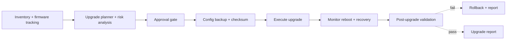
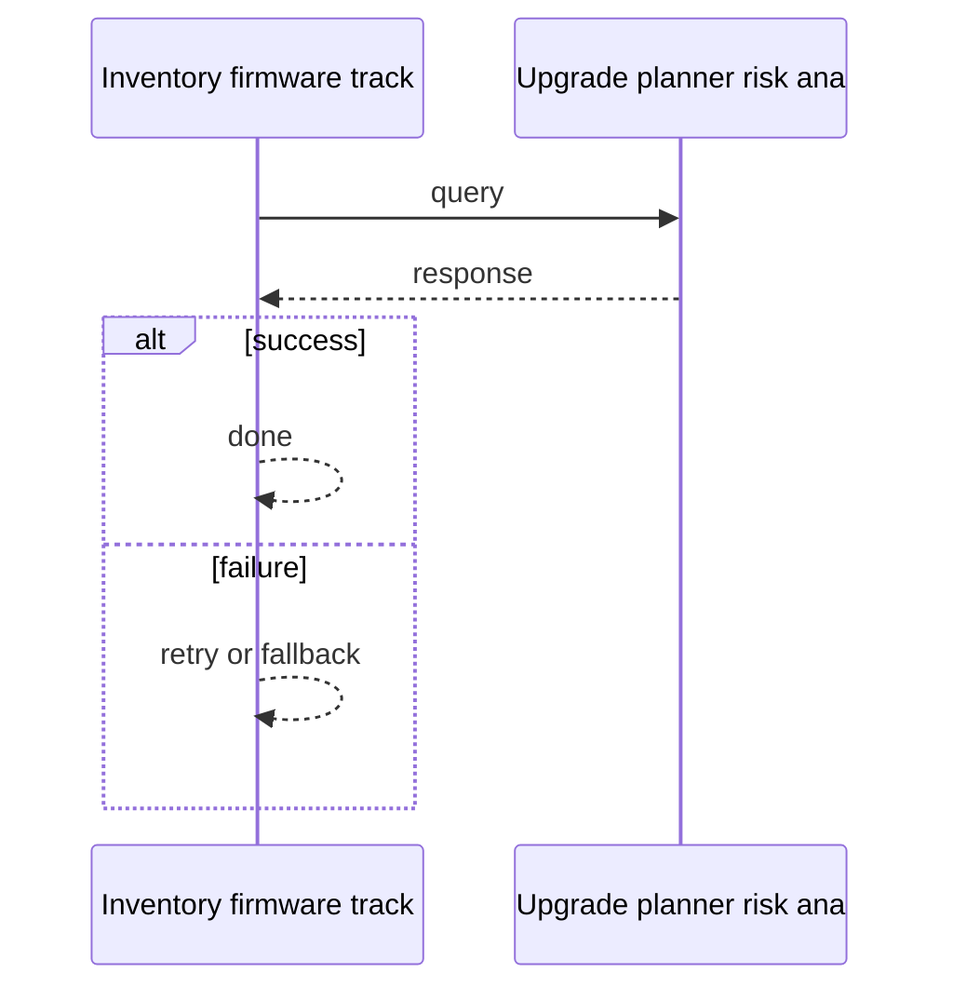
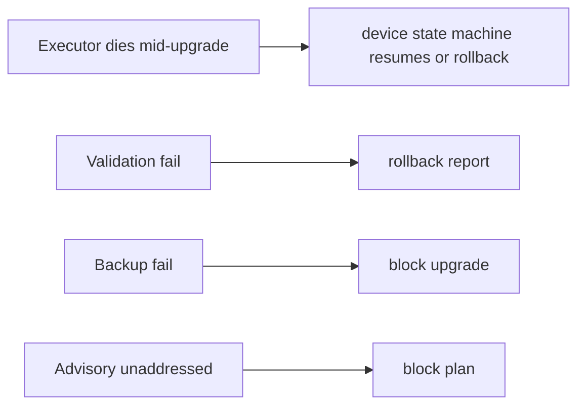

# Case Study: Network Device Update and Upgrade Management Platform

> **Tier:** network-ai-systems · **Status:** complete · Original numbers and diagrams.

## 1. Problem statement

Centrally plan, test, schedule, deploy, and verify firmware/software upgrades across network devices (firewalls, routers, switches, WLCs, APs, VPN, LB, DNS/DHCP, proxy, NAS) safely, with backups, HA-pair/cluster awareness, rollback, and audit.

## 2. Scope

In (v1): inventory + firmware tracking, target-version checks, release-note/advisory retrieval, compatibility + config-risk analysis, upgrade plan, config backup+checksum, maintenance window, approval, pre-checks, execute, monitor reboot, post-validation, rollback, report. Out: full zero-touch autonomous rollout (human approval required).

## 3. Functional requirements

- Discover inventory and current firmware/config.
- Check approved targets + advisories + compatibility.
- Analyze config risk.
- Generate an upgrade plan.
- Back up config + checksum.
- Schedule maintenance window + get approval.
- Pre-upgrade health checks.
- Execute upgrade.
- Monitor reboot/service recovery.
- Post-upgrade validation.
- Roll back on failure.
- Generate upgrade report.

## 4. Non-functional requirements

- No device left bricked; rollback always possible.
- HA-pair/cluster-aware (upgrade one at a time, maintain service).
- Full audit + approval chain.
- Scheduled, rate-limited rollout.

## 5. Explicit assumptions

1. 20k devices, ~1 upgrade/device/year avg, batches of 50. [assumption] 2. Each upgrade 5-30 min. [assumption] 3. Approvals required. [constraint]

## 6. Traffic estimation

Low request rate; the load is scheduled batches at maintenance windows, not a hot path.

## 7. Storage estimation

Inventory + firmware catalog + configs (versioned) + backups + reports; modest (GBs) but must be durable/auditable.

## 8. Bandwidth estimation

Pushing firmware images to devices (MBs-GBs each) during windows; bandwidth moderate, scheduled.

## 9. API design

GET /inventory; POST /upgrade-plans; POST /upgrade-plans/:id/approve; POST /upgrade-plans/:id/execute; POST /rollback; GET /reports/:id.

## 10. Data model

devices(id, type, vendor, model, firmware, config_hash, ha_pair, site); firmware_catalog(vendor, model, target, advisories, release_notes, compatible); upgrade_plans(id, devices[], steps, window, status, approvals[]); backups(plan, device, config, checksum); reports(plan, results, rollback?).

## 11. High-level architecture

## 12. Request flow
Inventory + firmware tracking -> planner checks targets/advisories/compatibility/config-risk -> approval gate -> config backup+checksum -> execute (HA-pair/cluster aware, one at a time) -> monitor reboot/recovery -> post-validation -> on fail rollback, on pass report; all steps audited.

## 13. Component responsibilities

Inventory service, firmware/advisory catalog, planner/risk engine, approval workflow, backup service, executor, monitor/validator, rollback, report.

## 14. Database selection

Inventory/catalog/plan relational (transactional, audited); config backups in object storage (versioned, checksummed); execution logs append-only. Rejected: in-place config without backup.

## 15. Caching strategy

Firmware catalog + release notes cached; inventory cached.

## 16. Partitioning strategy

Inventory by site; upgrades batched by site/HA-group; executor capacity per region.

## 17. Replication strategy

Inventory/catalog RF=3; backups durable (object storage, cross-region); executor stateless, idempotent per device step.

## 18. Consistency model

Plan/approval strongly consistent (audit). Firmware version tracking per device authoritative. Rollback decision per device.

## 19. Failure scenarios
Executor dies mid-upgrade -> device state machine resumes (or rollback). Validation fail -> rollback + report. Backup fail -> block upgrade. Advisory unaddressed -> block plan.

## 20. Reliability strategy

SLI rollback success, no-brick rate; SLO 99.9 percent. Backup + rollback always. Chaos: fail validation, assert rollback + report.

## 21. Security considerations

Approval chain + RBAC; secrets in secret manager; config backups encrypted; no unapproved changes; AI safety gateway (no auto-upgrade outside windows).

## 22. Observability strategy

Active upgrades, validation pass/fail, rollback rate, per-device stage, window adherence, advisory coverage.

## 23. Cost considerations

Executor compute (scheduled, bursty at windows) + firmware storage + backup storage. Right-size executors; store firmware once per catalog.

## 24. Scaling stages

Stage 1: inventory + manual plan. -> Stage 2: automated planning + approval + backup/rollback. -> Stage 3: HA/cluster-aware, dependency checks, AI risk scoring. -> Stage 4: fleet-wide scheduled rollout, air-gapped firmware repo.

## 25. Trade-offs

Automation (speed) vs human approval (safety). Backup (safety) vs time. HA-aware (safety) vs parallel speed. AI risk scoring (assist) vs deterministic checks (trust).

## 26. Alternative designs

Manual per-device (no scale, no audit). Zero-touch autonomous (unsafe). No rollback (bricked devices).

## 27. Interview discussion points

Clarify device count, HA/cluster model, rollback requirement, approval. Surface the plan/approve/backup/execute/validate/rollback pipeline and AI-as-assist principle.

## 28. Original Mermaid diagrams
Standalone sources under `diagrams/case-studies/device-upgrade-management/`: `context.mmd`, `request-sequence.mmd`, `failure-flow.mmd`, `scaling-evolution.mmd`. The diagrams are embedded in their respective sections: architecture in section 11, request flow in section 12, failure scenarios in section 19, and scaling stages in section 24.

## 29. Further reading

Firmware lifecycle: docs/firmware-lifecycle; change management: Level 6; AI safety gateway.

## 30. Practical exercises

1. HA-pair upgrade ordering. 2. Rollback after partial batch. 3. AI config-risk scoring inputs. 4. Air-gapped firmware repository. 5. End-of-support tracking at fleet scale.

---
Previous: Intelligent syslog monitoring · Next: Configuration drift detection

