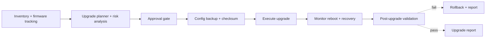
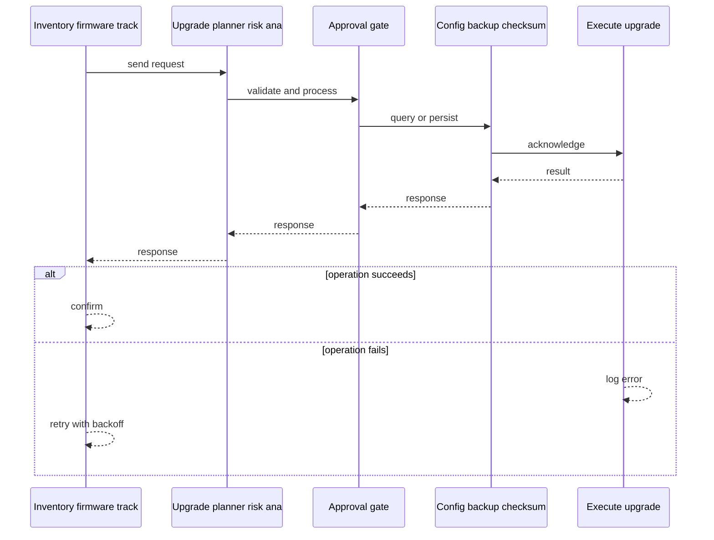
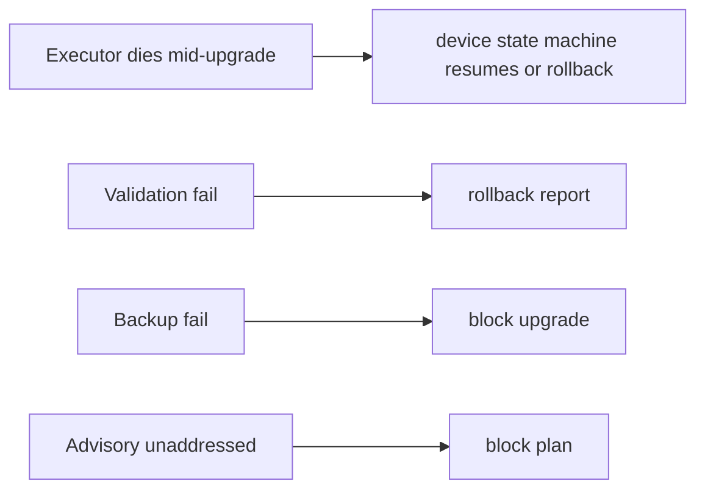
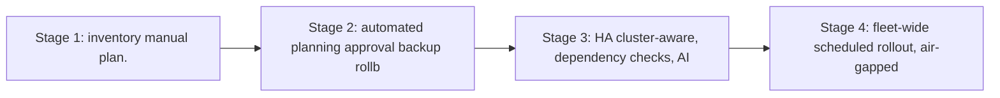

# Case Study: Network Device Update and Upgrade Management Platform

> **Tier:** network-ai-systems · **Status:** complete · Original numbers and diagrams.

## 1. Problem statement
Centrally plan, test, schedule, deploy, and verify firmware/software upgrades across network devices (firewalls, routers, switches, WLCs, APs, VPN, LB, DNS/DHCP, proxy, NAS) safely, with backups, HA-pair/cluster awareness, rollback, and audit. This is a network-ai-systems-tier system design challenge because it must handle multi-vendor device management while ensuring human approval for all high-risk changes. The design must be production-grade: observable, debuggable, reversible, and able to survive component failures without data loss or cascading outages.

## 2. Scope
In (v1): inventory + firmware tracking, target-version checks, release-note/advisory retrieval, compatibility + config-risk analysis, upgrade plan, config backup+checksum, maintenance window, approval, pre-checks, execute, monitor reboot, post-validation, rollback, report. Out: full zero-touch autonomous rollout (human approval required).

These boundaries are deliberate. Including more in the first version would spread effort thin and delay shipping a working core. Each excluded feature — noted as a scaling stage — is a candidate for the next iteration once the core loop is proven in production and the team has operational confidence in the baseline architecture.

## 3. Functional requirements

- Discover inventory and current firmware/config.
- Check approved targets + advisories + compatibility.
- Analyze config risk.
- Generate an upgrade plan.
- Back up config + checksum.
- Schedule maintenance window + get approval.
- Pre-upgrade health checks.
- Execute upgrade.
- Monitor reboot/service recovery.
- Post-upgrade validation.
- Roll back on failure.
- Generate upgrade report.

## 4. Non-functional requirements
- No device left bricked; rollback always possible.
- HA-pair/cluster-aware (upgrade one at a time, maintain service).
- Full audit + approval chain.
- Scheduled, rate-limited rollout.

These targets are not aspirational — they are design constraints that shape every component choice. The latency SLO forces edge caching and limits synchronous cross-region calls on the hot path. The availability target drives a replication factor of 3 and multi-AZ deployment. The cost target constrains the model size, storage tier, and over-provisioning margin. Every architectural decision in this case study traces back to one of these targets.

## 5. Explicit assumptions
1. 20k devices, ~1 upgrade/device/year avg, batches of 50. [assumption] 2. Each upgrade 5-30 min. [assumption] 3. Approvals required. [constraint]

These assumptions are load-bearing: if any is wrong by an order of magnitude, the architecture must adapt. Ten times more traffic may require sharding earlier. A different read-write ratio changes the caching strategy entirely. The peak multiplier affects headroom sizing. State them explicitly, revisit them after launch, and parameterize the design by these numbers rather than locking to them.

## 6. Traffic estimation
Low request rate; the load is scheduled batches at maintenance windows, not a hot path.

To derive the request rate: divide the daily volume by 86,400 seconds to get the average rate, then multiply by 5-10x for peak. The read-to-write ratio determines whether the system is cache-dominated (read-heavy) or write-path-dominated (write-heavy). For Network Device Update and Upgrade Management Platform, this ratio shapes the entire storage and replication strategy.

## 7. Storage estimation
Inventory + firmware catalog + configs (versioned) + backups + reports; modest (GBs) but must be durable/auditable.

Storage grows linearly with time. Daily growth multiplied by the retention period gives total storage. Add 20-30 percent for index overhead. Compression can reduce effective storage by 50-80 percent. The replication factor multiplies the total. Without a retention policy, storage grows without bound and cost becomes unsustainable.

## 8. Bandwidth estimation
Pushing firmware images to devices (MBs-GBs each) during windows; bandwidth moderate, scheduled.

Bandwidth is request rate multiplied by average payload size for ingress, and response rate multiplied by response size for egress. CDN and edge caching reduce origin egress. Compression reduces bandwidth by 50-80 percent where applicable. For Network Device Update and Upgrade Management Platform, bandwidth may or may not be the binding constraint — compare it against compute and storage to find out.

## 9. API design

GET /inventory; POST /upgrade-plans; POST /upgrade-plans/:id/approve; POST /upgrade-plans/:id/execute; POST /rollback; GET /reports/:id.

## 10. Data model
devices(id, type, vendor, model, firmware, config_hash, ha_pair, site); firmware_catalog(vendor, model, target, advisories, release_notes, compatible); upgrade_plans(id, devices[], steps, window, status, approvals[]); backups(plan, device, config, checksum); reports(plan, results, rollback?).

The data model is designed around the access pattern, not the entity shape. The primary lookup path determines the partition key. Secondary access paths determine which indexes to build. Denormalization is applied selectively where the hot read path would otherwise require expensive joins — with CDC or the outbox pattern keeping the denormalized view consistent with the source of truth.

## 11. High-level architecture

## 12. Request flow
Inventory + firmware tracking -> planner checks targets/advisories/compatibility/config-risk -> approval gate -> config backup+checksum -> execute (HA-pair/cluster aware, one at a time) -> monitor reboot/recovery -> post-validation -> on fail rollback, on pass report; all steps audited.

## 13. Component responsibilities
Inventory service, firmware/advisory catalog, planner/risk engine, approval workflow, backup service, executor, monitor/validator, rollback, report.

Each component has a single, well-defined responsibility. The gateway handles authentication and routing. The service tier is stateless and horizontally scalable. The data tier is the stateful core, carefully partitioned and replicated. This separation allows each tier to scale independently: stateless tiers add replicas with demand; the stateful tier scales by sharding or read replicas.

## 14. Database selection
Inventory/catalog/plan relational (transactional, audited); config backups in object storage (versioned, checksummed); execution logs append-only. Rejected: in-place config without backup.

The database choice is driven by the access pattern, not by familiarity. A relational database was chosen or rejected based on whether the workload needs joins and transactions. A key-value store was chosen or rejected based on whether the workload is a single-key lookup at massive scale. The rejected alternatives were rejected for specific, workload-dependent reasons — not because they are bad databases, but because they are the wrong fit for this system.

## 15. Caching strategy
Firmware catalog + release notes cached; inventory cached.

The caching strategy is designed around the staleness tolerance of the workload. Cache-aside is the default — simple and lazy. Write-through is used where read-after-write consistency matters. Stampede protection (request coalescing or stale-while-revalidate) is applied to any key that can go viral. Cache entries are namespaced by tenant where multi-tenancy applies, preventing cross-tenant leakage.

## 16. Partitioning strategy
Inventory by site; upgrades batched by site/HA-group; executor capacity per region.

The partition key co-locates related data so queries do not fan out across shards, while distributing load evenly so no single shard is hot. Consistent hashing with virtual nodes minimizes data movement when nodes are added or removed. A hot key — a viral entity or a giant tenant — is mitigated by caching, extra replication, or key splitting, not by adding more shards.

## 17. Replication strategy
Inventory/catalog RF=3; backups durable (object storage, cross-region); executor stateless, idempotent per device step.

Replication is synchronous on the write-confirmation path where durability is critical — the commit waits for at least one follower before acknowledging. Elsewhere it is asynchronous for throughput. A replication factor of 3 tolerates one failure while maintaining quorum. Failover is tested, not just configured: a follower that was never promoted will fail when you need it most.

## 18. Consistency model
Plan/approval strongly consistent (audit). Firmware version tracking per device authoritative. Rollback decision per device.

The consistency model is chosen as the weakest that users can tolerate, because stronger consistency costs latency and availability. Read-your-writes is provided where the user expects to see their own write immediately. Eventual consistency is bounded — seconds, not unbounded — and monitored. The system documents what 'eventual' means to users rather than hiding it.

## 19. Failure scenarios
Executor dies mid-upgrade -> device state machine resumes (or rollback). Validation fail -> rollback + report. Backup fail -> block upgrade. Advisory unaddressed -> block plan.

## 20. Reliability strategy
SLI rollback success, no-brick rate; SLO 99.9 percent. Backup + rollback always. Chaos: fail validation, assert rollback + report.

The SLO defines what 'good' means measurably. The error budget — the difference between 100 percent and the SLO — is the allowed unavailability that can be spent on deploys and feature risk. When the budget is nearly exhausted, risky changes are frozen. The system is tested with chaos engineering to verify that resilience assumptions hold. An untested failover is not a failover.

## 21. Security considerations
Approval chain + RBAC; secrets in secret manager; config backups encrypted; no unapproved changes; AI safety gateway (no auto-upgrade outside windows).

Security is defense in depth: TLS in transit, encryption at rest, RBAC with default-deny, PII redaction in logs, audit trails for every state-changing operation, and per-tenant isolation. For AI-augmented systems, the policy gateway is fail-closed — on any error, the system refuses to act rather than allowing an unguarded action.

## 22. Observability strategy
Active upgrades, validation pass/fail, rollback rate, per-device stage, window adherence, advisory coverage.

Observability uses the three signals — logs, metrics, and traces — with correlation IDs to stitch a single request across services. The golden signals (latency, traffic, errors, saturation) are the first dashboard. Alerts fire on SLO burn rate, not on raw thresholds, to avoid noise. The on-call runbook for each alert is tested, not theoretical.

## 23. Cost considerations
Executor compute (scheduled, bursty at windows) + firmware storage + backup storage. Right-size executors; store firmware once per catalog.

Cost is dominated by the binding resource identified in the traffic estimate. The primary levers are caching (cuts read cost), tiering (cuts storage cost), batching (cuts per-request overhead), and right-sizing (no over-provisioned idle capacity). Cost is tracked as a first-class metric — cost per request, cost per tenant, cost per outcome — and alerted on when unit cost spikes.

## 24. Scaling stages
Stage 1: inventory + manual plan. -> Stage 2: automated planning + approval + backup/rollback. -> Stage 3: HA/cluster-aware, dependency checks, AI risk scoring. -> Stage 4: fleet-wide scheduled rollout, air-gapped firmware repo.

## 25. Trade-offs
Automation (speed) vs human approval (safety). Backup (safety) vs time. HA-aware (safety) vs parallel speed. AI risk scoring (assist) vs deterministic checks (trust).

Every trade-off has a rejected alternative with a reason. The design does not present one option as universally correct — it presents the chosen option, the rejected alternative, and the workload-specific reason for the choice. This is what makes the design defensible in a review: the reviewer can challenge any decision and find the reasoning documented.

## 26. Alternative designs
Manual per-device (no scale, no audit). Zero-touch autonomous (unsafe). No rollback (bricked devices).

The alternative designs are genuine architectures that would work under different constraints. They were rejected for this workload because of specific requirements — latency SLO, cost budget, consistency need — that make them inferior here but not universally inferior. Understanding why an alternative was rejected is as important as understanding why the chosen design was selected.

## 27. Interview discussion points
Clarify device count, HA/cluster model, rollback requirement, approval. Surface the plan/approve/backup/execute/validate/rollback pipeline and AI-as-assist principle.

In an interview, the strongest candidates clarify ambiguity before designing, surface the read-write ratio and the binding resource, design the hot path deeply rather than just drawing boxes, discuss failure modes explicitly, and offer an alternative with a reason. The weakest candidates draw boxes before clarifying scope, name a vendor product as the architecture, and skip failure modes entirely.

## 28. Original Mermaid diagrams
Standalone sources under `diagrams/case-studies/device-upgrade-management/`: `context.mmd`, `request-sequence.mmd`, `failure-flow.mmd`, `scaling-evolution.mmd`. The diagrams are embedded in their respective sections: architecture in section 11, request flow in section 12, failure scenarios in section 19, and scaling stages in section 24.

## 29. Further reading
Firmware lifecycle: docs/firmware-lifecycle; change management: Level 6; AI safety gateway. Sources: `S-OTEL` `S-SLO`.

## 30. Practical exercises

1. HA-pair upgrade ordering. 2. Rollback after partial batch. 3. AI config-risk scoring inputs. 4. Air-gapped firmware repository. 5. End-of-support tracking at fleet scale.

---
Previous: Intelligent syslog monitoring · Next: Configuration drift detection

