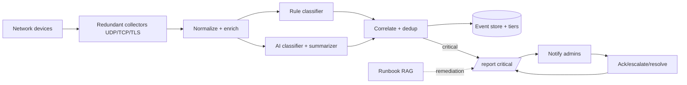
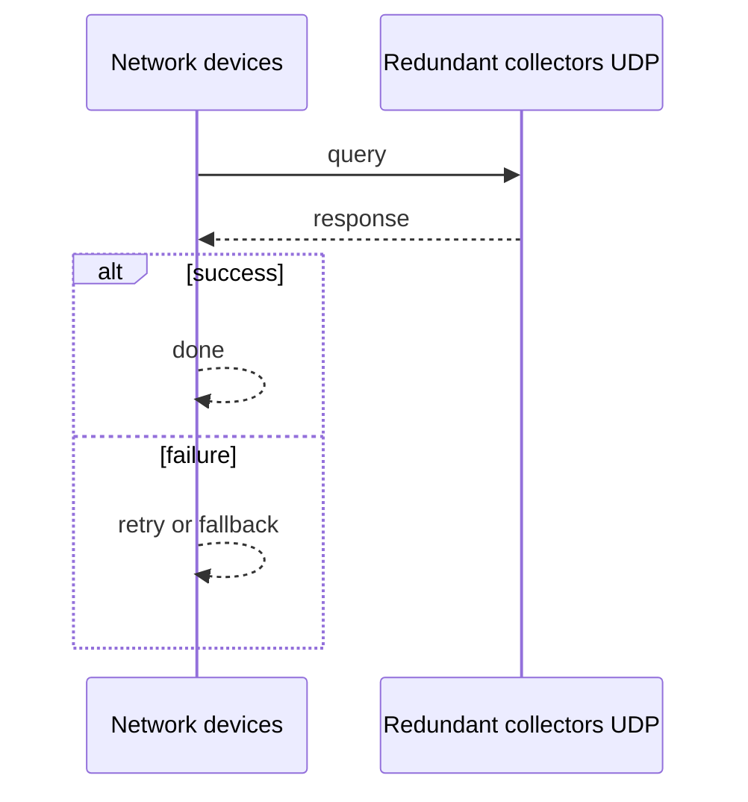
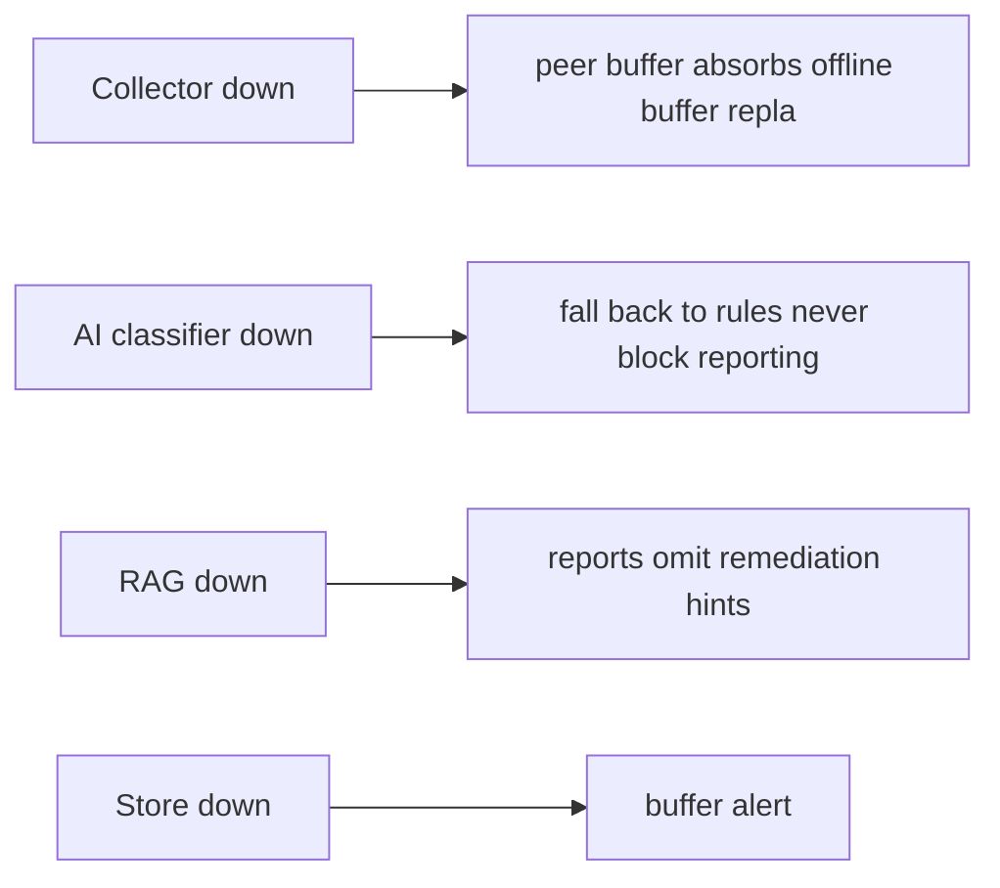

# Case Study: Intelligent Syslog Monitoring and Critical Incident Reporting Platform

> **Tier:** network-ai-systems · **Status:** complete · Original numbers and diagrams.

## 11. High-level architecture

## 28. Original Mermaid diagrams

Standalone sources under `diagrams/case-studies/intelligent-syslog-monitoring/`: `context.mmd`, `request-sequence.mmd`, `failure-flow.mmd`, `scaling-evolution.mmd`. Request sequence and failure flow:

## 1. Problem statement

Collect syslog from heterogeneous enterprise network devices (FortiGate, Cisco, Aruba, Yamaha, Linux/Windows servers, VPN, load balancers, APs, DNS/DHCP, proxy, NAS, cloud network services), normalize and enrich it, classify severity with rules plus AI, correlate duplicates, write critical incidents to a structured /report tree, notify administrators with recommended troubleshooting, and record resolution.

## 2. Scope

In (v1): multi-vendor syslog ingest (UDP/TCP/TLS), normalization, rule+AI severity classification, dedup/correlation, /report output by severity, notification, ack/escalate, resolution recording, runbook RAG for remediation hints. Out: auto-remediation execution (intentionally excluded; AI assists only).

## 3. Functional requirements

- Ingest syslog from listed device types. - Normalize and enrich messages (CEF/structured). - Classify severity via rules + AI. - Correlate duplicates and suppress. - Write critical incidents to /report/critical with full fields. - Notify admins (email/Slack/Teams/ticket). - Attach recommended checks and remediation. - Acknowledge or escalate. - Record final resolution.

## 4. Non-functional requirements

- Ingest 50k msgs/s peak with buffering. - Critical-to-report latency < 30 s. - No silent drop (buffer on collector loss). - Log integrity + access control. - AI never auto-executes high-risk remediation.

## 5. Explicit assumptions

1. 5k devices, ~10 msgs/device/s avg, 50k/s peak. [assumption] 2. ~0.1 percent critical. [assumption] 3. Retain 90 days hot, 1 year cold. [constraint] 4. Multi-site, some offline sites. [constraint]

## 6. Traffic estimation

50k syslog msgs/s peak ingest; read load is incident queries + daily summaries; write-dominated ingest.

## 7. Storage estimation

50k/s x ~300 B x 86400 = ~1.3 TB/day raw; 90d hot ~117 TB (compressed/tiered); 1y cold to object storage. Incident reports tiny.

## 8. Bandwidth estimation

Syslog ingress ~15 MB/s peak; queries small. Bandwidth modest; collector redundancy + buffering matter more.

## 9. API design

UDP/TCP/TLS syslog ingestion; REST: GET /incidents, POST /incidents/:id/ack, /escalate, /resolve; GET /report/critical.

## 10. Data model

Raw events(timestamp, device, ip, type, vendor, site, facility, msg); parsed events + error_category + severity; incidents(id, severity, fields[]). /report tree: critical/, high/, medium/, resolved/, daily-summary/. Critical report fields: timestamp, device name, device IP, device type, vendor, site, severity, facility, syslog message, parsed error category, possible root cause, related events, impacted services, recommended checks, suggested remediation, confidence, escalation status, admin response, resolution notes.

## 12. Request flow

Devices send syslog -> redundant collectors (UDP/TCP/TLS) buffer on loss -> normalize/enrich (CEF/structured, vendor parsers) -> rule + AI severity classification -> correlate/dedup/suppress (maintenance windows) -> critical incidents written to /report/critical with all fields -> runbook RAG attaches recommended checks/remediation -> notify admins -> admin ack/escalate/resolve recorded back into the report.

## 13. Component responsibilities

Collectors, normalizer/enricher, rule engine, AI classifier+summarizer, correlation/dedup, event store+tiers, report writer, runbook RAG, notification, ack/escalate/resolve service.

## 14. Database selection

Event store: hot search index (recent) + object/cold tier partitioned by date; incident store (KV/relational). RAG: vector DB of runbooks. Rejected: one hot index for a year (cost); AI as sole classifier (hallucination risk).

## 15. Caching strategy

Hot recent events in memory; common incident queries cached; runbook RAG results cached. Permission-aware caching (no cross-tenant).

## 16. Partitioning strategy

Events partitioned by (site, date) for lifecycle and query locality; collectors by site; RAG by runbook namespace.

## 17. Replication strategy

Collectors RF=2+ per site for no-loss; event store RF=3; multi-site replication with offline-operation buffer for disconnected sites.

## 18. Consistency model

Reports eventually consistent with ingest (seconds); resolution status strongly tracked per incident; AI suggestions are advisory only.

## 19. Failure scenarios

Collector down -> peer/buffer absorbs (offline buffer replays). AI classifier down -> fall back to rules (never block reporting). RAG down -> reports omit remediation hints. Store down -> buffer + alert.

## 20. Reliability strategy

SLI critical-to-report latency, no-drop rate; SLO 99.9 percent. Buffering + rule fallback. Chaos: kill a collector and the AI service, assert incidents still reported via rules.

## 21. Security considerations

TLS syslog; per-tenant/site access control; log integrity (tamper-evident, append-only); PII redaction; AI safety gateway (never expose passwords/keys, never auto-execute changes); audit.

## 22. Observability strategy

Ingest rate, drop rate, buffer depth, classification latency, AI vs rule agreement, critical-incident count, MTTR, daily/weekly summaries, false-positive rate.

## 23. Cost considerations

Hot storage + compute (collectors + AI inference) dominate; tier cold aggressively; use small model for classification, larger for analysis (multi-model routing).

## 24. Scaling stages

Stage 1: collectors + rules + /report. -> Stage 2: AI classification + runbook RAG + correlation. -> Stage 3: multi-site, offline operation, DR. -> Stage 4: multi-model routing, voice-agent, air-gapped RAG.

## 25. Trade-offs

Rules (deterministic, fast) vs AI (adaptive, hallucination) -> combine. Hot (fast) vs cold (cost). Auto-notify (fast) vs suppression (noise). AI assist vs human approval for remediation.

## 26. Alternative designs

Pure SIEM without AI (less adaptive). Full auto-remediation (unsafe, rejected). Single collector (SPOF). Rules-only (misses novel patterns).

## 27. Interview discussion points

Clarify vendors, volume, latency, offline sites, auto-remediation tolerance (should be none). Surface collector redundancy, rule+AI hybrid, /report structure, and the human-approval principle.

## 29. Further reading

Syslog RFC 5424; CEF; Level 8 observability; RAG: docs/ai-systems; AI safety gateway.

## 30. Practical exercises

1. Design the /report daily-summary generator. 2. Add maintenance-window suppression. 3. Rule+AI disagreement handling. 4. Air-gapped/offline site reporting. 5. Prevent AI from auto-disabling a firewall.

---
Previous: (network-AI track start) · Next: Device upgrade management

