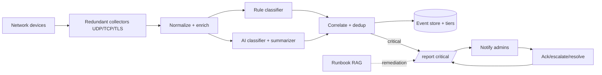
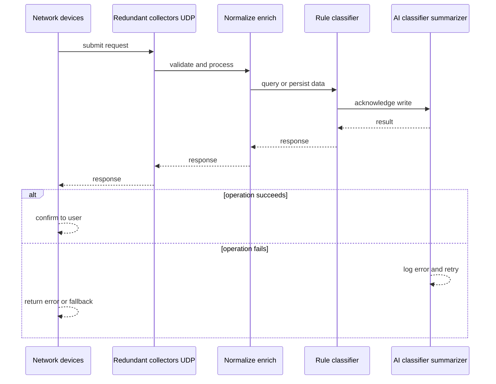
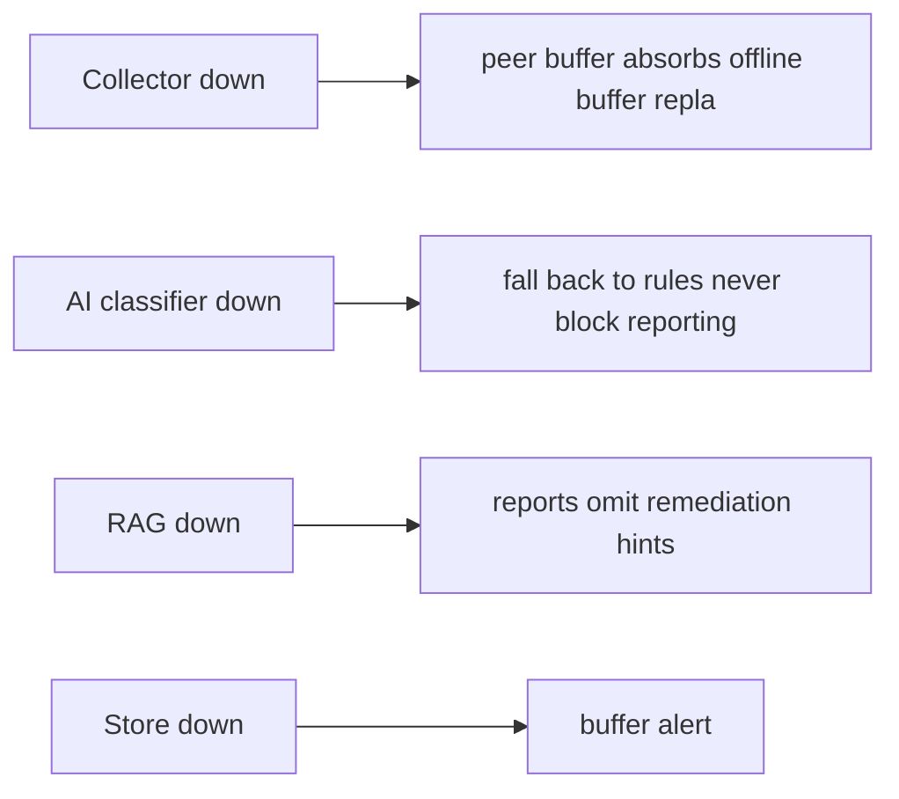
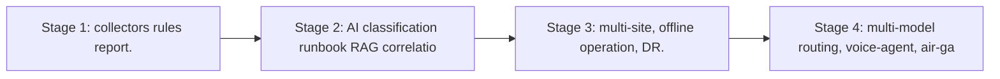

# Case Study: Intelligent Syslog Monitoring and Critical Incident Reporting Platform

> **Tier:** network-ai-systems · **Status:** complete · Original numbers and diagrams.

## 1. Problem statement

Collect syslog from heterogeneous enterprise network devices (FortiGate, Cisco, Aruba, Yamaha, Linux/Windows servers, VPN, load balancers, APs, DNS/DHCP, proxy, NAS, cloud network services), normalize and enrich it, classify severity with rules plus AI, correlate duplicates, write critical incidents to a structured /report tree, notify administrators with recommended troubleshooting, and record resolution.

## 2. Scope
In (v1): multi-vendor syslog ingest (UDP/TCP/TLS), normalization, rule+AI severity classification, dedup/correlation, /report output by severity, notification, ack/escalate, resolution recording, runbook RAG for remediation hints. Out: auto-remediation execution (intentionally excluded; AI assists only).

For Intelligent Syslog Monitoring and Critical Incident Reporting Platform, these boundaries keep the first version focused on the core user value. Adding more features would dilute the design and delay shipping. Each excluded item is a scaling stage — a candidate for the next iteration once the baseline is proven.

## 3. Functional requirements

- Ingest syslog from listed device types.
- Normalize and enrich messages (CEF/structured).
- Classify severity via rules + AI.
- Correlate duplicates and suppress.
- Write critical incidents to /report/critical with full fields.
- Notify admins (email/Slack/Teams/ticket).
- Attach recommended checks and remediation.
- Acknowledge or escalate.
- Record final resolution.

## 4. Non-functional requirements
- Ingest 50k msgs/s peak with buffering.
- Critical-to-report latency < 30 s.
- No silent drop (buffer on collector loss).
- Log integrity + access control.
- AI never auto-executes high-risk remediation.

For Intelligent Syslog Monitoring and Critical Incident Reporting Platform, each non-functional target constrains a specific component: the latency SLO bounds the number of synchronous hops, the availability target forces redundancy across availability zones, and the cost ceiling limits the replication factor and storage tier.

## 5. Explicit assumptions
1. 5k devices, ~10 msgs/device/s avg, 50k/s peak. [assumption] 2. ~0.1 percent critical. [assumption] 3. Retain 90 days hot, 1 year cold. [constraint] 4. Multi-site, some offline sites. [constraint]

For Intelligent Syslog Monitoring and Critical Incident Reporting Platform, if these assumptions are off by an order of magnitude, the architecture must adapt: 10x traffic may require earlier sharding, a different read-write ratio changes the caching strategy, and a higher peak multiplier demands more headroom.

## 6. Traffic estimation
50k syslog msgs/s peak ingest; read load is incident queries + daily summaries; write-dominated ingest.

To derive the request rate: divide the daily volume by 86,400 seconds to get the average rate, then multiply by 5-10x for peak. The read-to-write ratio determines whether the system is cache-dominated (read-heavy) or write-path-dominated (write-heavy). For Intelligent Syslog Monitoring and Critical Incident Reporting Platform, this ratio shapes the entire storage and replication strategy.

## 7. Storage estimation
50k/s x ~300 B x 86400 = ~1.3 TB/day raw; 90d hot ~117 TB (compressed/tiered); 1y cold to object storage. Incident reports tiny.

For Intelligent Syslog Monitoring and Critical Incident Reporting Platform, storage growth is projected from the daily write volume and retention policy. Index overhead and compression factors are accounted for in the total.

## 8. Bandwidth estimation
Syslog ingress ~15 MB/s peak; queries small. Bandwidth modest; collector redundancy + buffering matter more.

Bandwidth is request rate multiplied by average payload size for ingress, and response rate multiplied by response size for egress. CDN and edge caching reduce origin egress. Compression reduces bandwidth by 50-80 percent where applicable. For Intelligent Syslog Monitoring and Critical Incident Reporting Platform, bandwidth may or may not be the binding constraint — compare it against compute and storage to find out.

## 9. API design

UDP/TCP/TLS syslog ingestion; REST: GET /incidents, POST /incidents/:id/ack, /escalate, /resolve; GET /report/critical.

## 10. Data model

Raw events(timestamp, device, ip, type, vendor, site, facility, msg); parsed events + error_category + severity; incidents(id, severity, fields[]). /report tree: critical/, high/, medium/, resolved/, daily-summary/. Critical report fields: timestamp, device name, device IP, device type, vendor, site, severity, facility, syslog message, parsed error category, possible root cause, related events, impacted services, recommended checks, suggested remediation, confidence, escalation status, admin response, resolution notes.

## 11. High-level architecture

## 12. Request flow
Devices send syslog -> redundant collectors (UDP/TCP/TLS) buffer on loss -> normalize/enrich (CEF/structured, vendor parsers) -> rule + AI severity classification -> correlate/dedup/suppress (maintenance windows) -> critical incidents written to /report/critical with all fields -> runbook RAG attaches recommended checks/remediation -> notify admins -> admin ack/escalate/resolve recorded back into the report.

## 13. Component responsibilities
Collectors, normalizer/enricher, rule engine, AI classifier+summarizer, correlation/dedup, event store+tiers, report writer, runbook RAG, notification, ack/escalate/resolve service.

For Intelligent Syslog Monitoring and Critical Incident Reporting Platform, each component has one job. The gateway authenticates and routes. Services are stateless and scale horizontally. The data tier is the stateful core that scales by sharding.

## 14. Database selection
Event store: hot search index (recent) + object/cold tier partitioned by date; incident store (KV/relational). RAG: vector DB of runbooks. Rejected: one hot index for a year (cost); AI as sole classifier (hallucination risk).

For Intelligent Syslog Monitoring and Critical Incident Reporting Platform, the database was chosen by access pattern, not familiarity. The rejected alternatives were wrong for this workload, not bad in general.

## 15. Caching strategy
Hot recent events in memory; common incident queries cached; runbook RAG results cached. Permission-aware caching (no cross-tenant).

For Intelligent Syslog Monitoring and Critical Incident Reporting Platform, the cache strategy matches the staleness tolerance. Cache-aside for most data, write-through where read-after-write matters, stampede protection on hot keys.

## 16. Partitioning strategy
Events partitioned by (site, date) for lifecycle and query locality; collectors by site; RAG by runbook namespace.

For Intelligent Syslog Monitoring and Critical Incident Reporting Platform, the partition key balances query locality with even load distribution. Sharding strategy matters because a poor key creates hot spots under real traffic patterns.

## 17. Replication strategy
Collectors RF=2+ per site for no-loss; event store RF=3; multi-site replication with offline-operation buffer for disconnected sites.

For Intelligent Syslog Monitoring and Critical Incident Reporting Platform, replication mode is split: synchronous where durability is critical, asynchronous elsewhere for throughput. RF=3 tolerates one failure. Failover is tested regularly.

## 18. Consistency model
Reports eventually consistent with ingest (seconds); resolution status strongly tracked per incident; AI suggestions are advisory only.

For Intelligent Syslog Monitoring and Critical Incident Reporting Platform, the consistency level is the weakest users accept. Read-your-writes is provided where needed. Eventual consistency is bounded and monitored, not unbounded and silent.

## 19. Failure scenarios
Collector down -> peer/buffer absorbs (offline buffer replays). AI classifier down -> fall back to rules (never block reporting). RAG down -> reports omit remediation hints. Store down -> buffer + alert.

## 20. Reliability strategy
SLI critical-to-report latency, no-drop rate; SLO 99.9 percent. Buffering + rule fallback. Chaos: kill a collector and the AI service, assert incidents still reported via rules.

For Intelligent Syslog Monitoring and Critical Incident Reporting Platform, the SLO makes reliability measurable. The error budget balances feature velocity with stability. Chaos testing validates that resilience claims hold under real failures.

## 21. Security considerations
TLS syslog; per-tenant/site access control; log integrity (tamper-evident, append-only); PII redaction; AI safety gateway (never expose passwords/keys, never auto-execute changes); audit.

For Intelligent Syslog Monitoring and Critical Incident Reporting Platform, security layers TLS, encryption at rest, RBAC, PII redaction, and audit. The policy gateway is fail-closed for AI-augmented operations.

## 22. Observability strategy
Ingest rate, drop rate, buffer depth, classification latency, AI vs rule agreement, critical-incident count, MTTR, daily/weekly summaries, false-positive rate.

For Intelligent Syslog Monitoring and Critical Incident Reporting Platform, observability combines logs, metrics, and traces with correlation IDs. Golden signals drive the first dashboard. Alerts fire on burn rate, not raw thresholds.

## 23. Cost considerations
Hot storage + compute (collectors + AI inference) dominate; tier cold aggressively; use small model for classification, larger for analysis (multi-model routing).

For Intelligent Syslog Monitoring and Critical Incident Reporting Platform, cost is driven by the binding resource. Caching, tiering, batching, and right-sizing are the levers. Cost per request is tracked and alerted on.

## 24. Scaling stages
Stage 1: collectors + rules + /report. -> Stage 2: AI classification + runbook RAG + correlation. -> Stage 3: multi-site, offline operation, DR. -> Stage 4: multi-model routing, voice-agent, air-gapped RAG.

## 25. Trade-offs
Rules (deterministic, fast) vs AI (adaptive, hallucination) -> combine. Hot (fast) vs cold (cost). Auto-notify (fast) vs suppression (noise). AI assist vs human approval for remediation.

For Intelligent Syslog Monitoring and Critical Incident Reporting Platform, each trade-off lists what was chosen, what was rejected, and why. This makes the design defensible in review — every decision has documented reasoning.

## 26. Alternative designs
Pure SIEM without AI (less adaptive). Full auto-remediation (unsafe, rejected). Single collector (SPOF). Rules-only (misses novel patterns).

For Intelligent Syslog Monitoring and Critical Incident Reporting Platform, the alternatives are real architectures that work under different constraints. They were rejected for this workload's specific requirements, not because they are bad designs.

## 27. Interview discussion points
Clarify vendors, volume, latency, offline sites, auto-remediation tolerance (should be none). Surface collector redundancy, rule+AI hybrid, /report structure, and the human-approval principle.

For Intelligent Syslog Monitoring and Critical Incident Reporting Platform in an interview: clarify scope first, surface the read-write ratio, design the hot path deeply, discuss failures, and offer an alternative. Weak candidates skip failure modes.

## 28. Original Mermaid diagrams
Standalone sources under `diagrams/case-studies/intelligent-syslog-monitoring/`: `context.mmd`, `request-sequence.mmd`, `failure-flow.mmd`, `scaling-evolution.mmd`. The diagrams are embedded in their respective sections: architecture in section 11, request flow in section 12, failure scenarios in section 19, and scaling stages in section 24.

## 29. Further reading
Syslog RFC 5424; CEF; Level 8 observability; RAG: docs/ai-systems; AI safety gateway. Sources: `S-OTEL` `S-SLO`.

## 30. Practical exercises

1. Design the /report daily-summary generator. 2. Add maintenance-window suppression. 3. Rule+AI disagreement handling. 4. Air-gapped/offline site reporting. 5. Prevent AI from auto-disabling a firewall.

---
Previous: (network-AI track start) · Next: Device upgrade management

