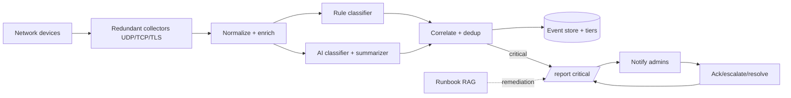
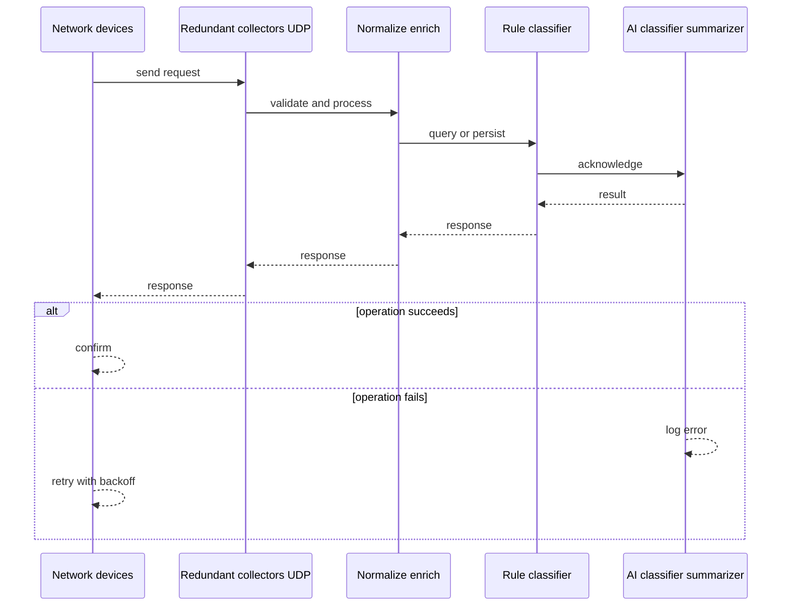
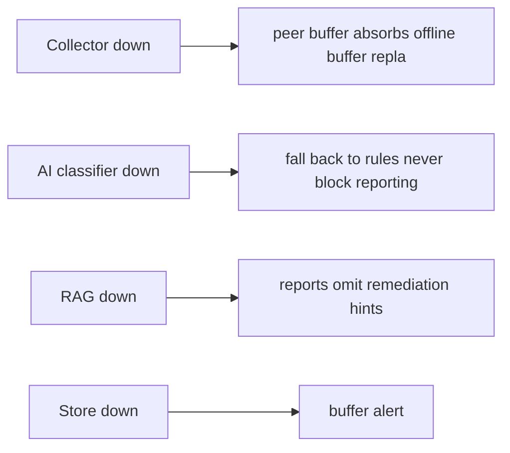
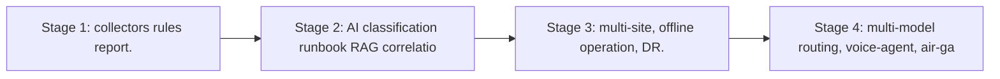

# Case Study: Intelligent Syslog Monitoring and Critical Incident Reporting Platform

> **Tier:** network-ai-systems · **Status:** complete · Original numbers and diagrams.

## 1. Problem statement

Collect syslog from heterogeneous enterprise network devices (FortiGate, Cisco, Aruba, Yamaha, Linux/Windows servers, VPN, load balancers, APs, DNS/DHCP, proxy, NAS, cloud network services), normalize and enrich it, classify severity with rules plus AI, correlate duplicates, write critical incidents to a structured /report tree, notify administrators with recommended troubleshooting, and record resolution.

## 2. Scope
In (v1): multi-vendor syslog ingest (UDP/TCP/TLS), normalization, rule+AI severity classification, dedup/correlation, /report output by severity, notification, ack/escalate, resolution recording, runbook RAG for remediation hints. Out: auto-remediation execution (intentionally excluded; AI assists only).

These boundaries are deliberate. Including more in the first version would spread effort thin and delay shipping a working core. Each excluded feature — noted as a scaling stage — is a candidate for the next iteration once the core loop is proven in production and the team has operational confidence in the baseline architecture.

## 3. Functional requirements

- Ingest syslog from listed device types.
- Normalize and enrich messages (CEF/structured).
- Classify severity via rules + AI.
- Correlate duplicates and suppress.
- Write critical incidents to /report/critical with full fields.
- Notify admins (email/Slack/Teams/ticket).
- Attach recommended checks and remediation.
- Acknowledge or escalate.
- Record final resolution.

## 4. Non-functional requirements
- Ingest 50k msgs/s peak with buffering.
- Critical-to-report latency < 30 s.
- No silent drop (buffer on collector loss).
- Log integrity + access control.
- AI never auto-executes high-risk remediation.

These targets are not aspirational — they are design constraints that shape every component choice. The latency SLO forces edge caching and limits synchronous cross-region calls on the hot path. The availability target drives a replication factor of 3 and multi-AZ deployment. The cost target constrains the model size, storage tier, and over-provisioning margin. Every architectural decision in this case study traces back to one of these targets.

## 5. Explicit assumptions
1. 5k devices, ~10 msgs/device/s avg, 50k/s peak. [assumption] 2. ~0.1 percent critical. [assumption] 3. Retain 90 days hot, 1 year cold. [constraint] 4. Multi-site, some offline sites. [constraint]

These assumptions are load-bearing: if any is wrong by an order of magnitude, the architecture must adapt. Ten times more traffic may require sharding earlier. A different read-write ratio changes the caching strategy entirely. The peak multiplier affects headroom sizing. State them explicitly, revisit them after launch, and parameterize the design by these numbers rather than locking to them.

## 6. Traffic estimation
50k syslog msgs/s peak ingest; read load is incident queries + daily summaries; write-dominated ingest.

To derive the request rate: divide the daily volume by 86,400 seconds to get the average rate, then multiply by 5-10x for peak. The read-to-write ratio determines whether the system is cache-dominated (read-heavy) or write-path-dominated (write-heavy). For Intelligent Syslog Monitoring and Critical Incident Reporting Platform, this ratio shapes the entire storage and replication strategy.

## 7. Storage estimation
50k/s x ~300 B x 86400 = ~1.3 TB/day raw; 90d hot ~117 TB (compressed/tiered); 1y cold to object storage. Incident reports tiny.

Storage grows linearly with time. Daily growth multiplied by the retention period gives total storage. Add 20-30 percent for index overhead. Compression can reduce effective storage by 50-80 percent. The replication factor multiplies the total. Without a retention policy, storage grows without bound and cost becomes unsustainable.

## 8. Bandwidth estimation
Syslog ingress ~15 MB/s peak; queries small. Bandwidth modest; collector redundancy + buffering matter more.

Bandwidth is request rate multiplied by average payload size for ingress, and response rate multiplied by response size for egress. CDN and edge caching reduce origin egress. Compression reduces bandwidth by 50-80 percent where applicable. For Intelligent Syslog Monitoring and Critical Incident Reporting Platform, bandwidth may or may not be the binding constraint — compare it against compute and storage to find out.

## 9. API design

UDP/TCP/TLS syslog ingestion; REST: GET /incidents, POST /incidents/:id/ack, /escalate, /resolve; GET /report/critical.

## 10. Data model

Raw events(timestamp, device, ip, type, vendor, site, facility, msg); parsed events + error_category + severity; incidents(id, severity, fields[]). /report tree: critical/, high/, medium/, resolved/, daily-summary/. Critical report fields: timestamp, device name, device IP, device type, vendor, site, severity, facility, syslog message, parsed error category, possible root cause, related events, impacted services, recommended checks, suggested remediation, confidence, escalation status, admin response, resolution notes.

## 11. High-level architecture

## 12. Request flow
Devices send syslog -> redundant collectors (UDP/TCP/TLS) buffer on loss -> normalize/enrich (CEF/structured, vendor parsers) -> rule + AI severity classification -> correlate/dedup/suppress (maintenance windows) -> critical incidents written to /report/critical with all fields -> runbook RAG attaches recommended checks/remediation -> notify admins -> admin ack/escalate/resolve recorded back into the report.

## 13. Component responsibilities
Collectors, normalizer/enricher, rule engine, AI classifier+summarizer, correlation/dedup, event store+tiers, report writer, runbook RAG, notification, ack/escalate/resolve service.

Each component has a single, well-defined responsibility. The gateway handles authentication and routing. The service tier is stateless and horizontally scalable. The data tier is the stateful core, carefully partitioned and replicated. This separation allows each tier to scale independently: stateless tiers add replicas with demand; the stateful tier scales by sharding or read replicas.

## 14. Database selection
Event store: hot search index (recent) + object/cold tier partitioned by date; incident store (KV/relational). RAG: vector DB of runbooks. Rejected: one hot index for a year (cost); AI as sole classifier (hallucination risk).

The database choice is driven by the access pattern, not by familiarity. A relational database was chosen or rejected based on whether the workload needs joins and transactions. A key-value store was chosen or rejected based on whether the workload is a single-key lookup at massive scale. The rejected alternatives were rejected for specific, workload-dependent reasons — not because they are bad databases, but because they are the wrong fit for this system.

## 15. Caching strategy
Hot recent events in memory; common incident queries cached; runbook RAG results cached. Permission-aware caching (no cross-tenant).

The caching strategy is designed around the staleness tolerance of the workload. Cache-aside is the default — simple and lazy. Write-through is used where read-after-write consistency matters. Stampede protection (request coalescing or stale-while-revalidate) is applied to any key that can go viral. Cache entries are namespaced by tenant where multi-tenancy applies, preventing cross-tenant leakage.

## 16. Partitioning strategy
Events partitioned by (site, date) for lifecycle and query locality; collectors by site; RAG by runbook namespace.

The partition key co-locates related data so queries do not fan out across shards, while distributing load evenly so no single shard is hot. Consistent hashing with virtual nodes minimizes data movement when nodes are added or removed. A hot key — a viral entity or a giant tenant — is mitigated by caching, extra replication, or key splitting, not by adding more shards.

## 17. Replication strategy
Collectors RF=2+ per site for no-loss; event store RF=3; multi-site replication with offline-operation buffer for disconnected sites.

Replication is synchronous on the write-confirmation path where durability is critical — the commit waits for at least one follower before acknowledging. Elsewhere it is asynchronous for throughput. A replication factor of 3 tolerates one failure while maintaining quorum. Failover is tested, not just configured: a follower that was never promoted will fail when you need it most.

## 18. Consistency model
Reports eventually consistent with ingest (seconds); resolution status strongly tracked per incident; AI suggestions are advisory only.

The consistency model is chosen as the weakest that users can tolerate, because stronger consistency costs latency and availability. Read-your-writes is provided where the user expects to see their own write immediately. Eventual consistency is bounded — seconds, not unbounded — and monitored. The system documents what 'eventual' means to users rather than hiding it.

## 19. Failure scenarios
Collector down -> peer/buffer absorbs (offline buffer replays). AI classifier down -> fall back to rules (never block reporting). RAG down -> reports omit remediation hints. Store down -> buffer + alert.

## 20. Reliability strategy
SLI critical-to-report latency, no-drop rate; SLO 99.9 percent. Buffering + rule fallback. Chaos: kill a collector and the AI service, assert incidents still reported via rules.

The SLO defines what 'good' means measurably. The error budget — the difference between 100 percent and the SLO — is the allowed unavailability that can be spent on deploys and feature risk. When the budget is nearly exhausted, risky changes are frozen. The system is tested with chaos engineering to verify that resilience assumptions hold. An untested failover is not a failover.

## 21. Security considerations
TLS syslog; per-tenant/site access control; log integrity (tamper-evident, append-only); PII redaction; AI safety gateway (never expose passwords/keys, never auto-execute changes); audit.

Security is defense in depth: TLS in transit, encryption at rest, RBAC with default-deny, PII redaction in logs, audit trails for every state-changing operation, and per-tenant isolation. For AI-augmented systems, the policy gateway is fail-closed — on any error, the system refuses to act rather than allowing an unguarded action.

## 22. Observability strategy
Ingest rate, drop rate, buffer depth, classification latency, AI vs rule agreement, critical-incident count, MTTR, daily/weekly summaries, false-positive rate.

Observability uses the three signals — logs, metrics, and traces — with correlation IDs to stitch a single request across services. The golden signals (latency, traffic, errors, saturation) are the first dashboard. Alerts fire on SLO burn rate, not on raw thresholds, to avoid noise. The on-call runbook for each alert is tested, not theoretical.

## 23. Cost considerations
Hot storage + compute (collectors + AI inference) dominate; tier cold aggressively; use small model for classification, larger for analysis (multi-model routing).

Cost is dominated by the binding resource identified in the traffic estimate. The primary levers are caching (cuts read cost), tiering (cuts storage cost), batching (cuts per-request overhead), and right-sizing (no over-provisioned idle capacity). Cost is tracked as a first-class metric — cost per request, cost per tenant, cost per outcome — and alerted on when unit cost spikes.

## 24. Scaling stages
Stage 1: collectors + rules + /report. -> Stage 2: AI classification + runbook RAG + correlation. -> Stage 3: multi-site, offline operation, DR. -> Stage 4: multi-model routing, voice-agent, air-gapped RAG.

## 25. Trade-offs
Rules (deterministic, fast) vs AI (adaptive, hallucination) -> combine. Hot (fast) vs cold (cost). Auto-notify (fast) vs suppression (noise). AI assist vs human approval for remediation.

Every trade-off has a rejected alternative with a reason. The design does not present one option as universally correct — it presents the chosen option, the rejected alternative, and the workload-specific reason for the choice. This is what makes the design defensible in a review: the reviewer can challenge any decision and find the reasoning documented.

## 26. Alternative designs
Pure SIEM without AI (less adaptive). Full auto-remediation (unsafe, rejected). Single collector (SPOF). Rules-only (misses novel patterns).

The alternative designs are genuine architectures that would work under different constraints. They were rejected for this workload because of specific requirements — latency SLO, cost budget, consistency need — that make them inferior here but not universally inferior. Understanding why an alternative was rejected is as important as understanding why the chosen design was selected.

## 27. Interview discussion points
Clarify vendors, volume, latency, offline sites, auto-remediation tolerance (should be none). Surface collector redundancy, rule+AI hybrid, /report structure, and the human-approval principle.

In an interview, the strongest candidates clarify ambiguity before designing, surface the read-write ratio and the binding resource, design the hot path deeply rather than just drawing boxes, discuss failure modes explicitly, and offer an alternative with a reason. The weakest candidates draw boxes before clarifying scope, name a vendor product as the architecture, and skip failure modes entirely.

## 28. Original Mermaid diagrams
Standalone sources under `diagrams/case-studies/intelligent-syslog-monitoring/`: `context.mmd`, `request-sequence.mmd`, `failure-flow.mmd`, `scaling-evolution.mmd`. The diagrams are embedded in their respective sections: architecture in section 11, request flow in section 12, failure scenarios in section 19, and scaling stages in section 24.

## 29. Further reading
Syslog RFC 5424; CEF; Level 8 observability; RAG: docs/ai-systems; AI safety gateway. Sources: `S-OTEL` `S-SLO`.

## 30. Practical exercises

1. Design the /report daily-summary generator. 2. Add maintenance-window suppression. 3. Rule+AI disagreement handling. 4. Air-gapped/offline site reporting. 5. Prevent AI from auto-disabling a firewall.

---
Previous: (network-AI track start) · Next: Device upgrade management

