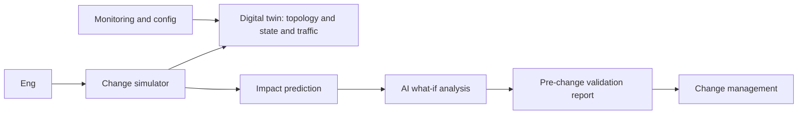
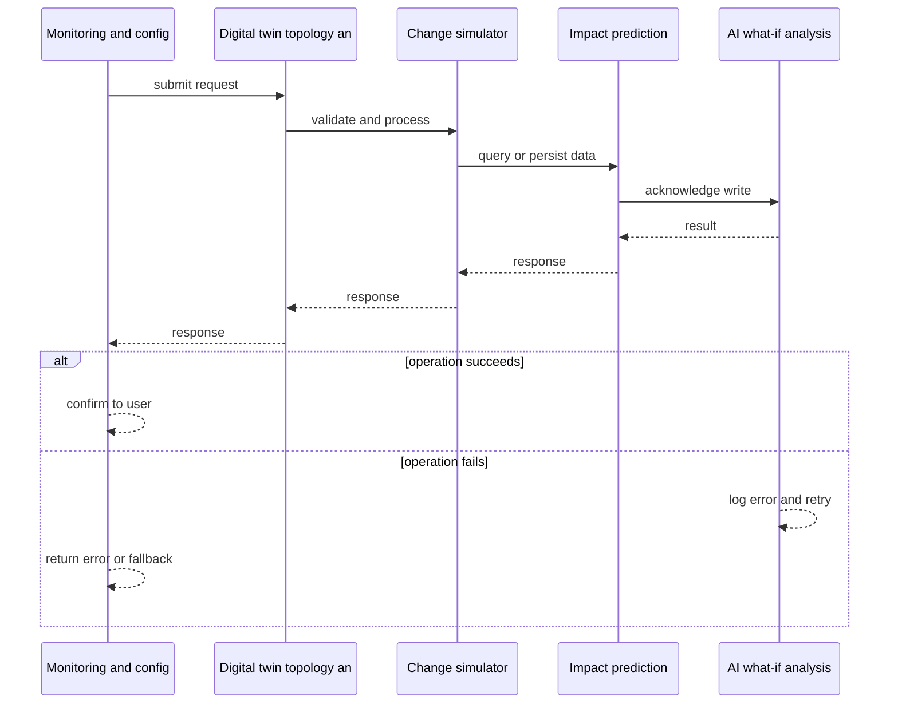
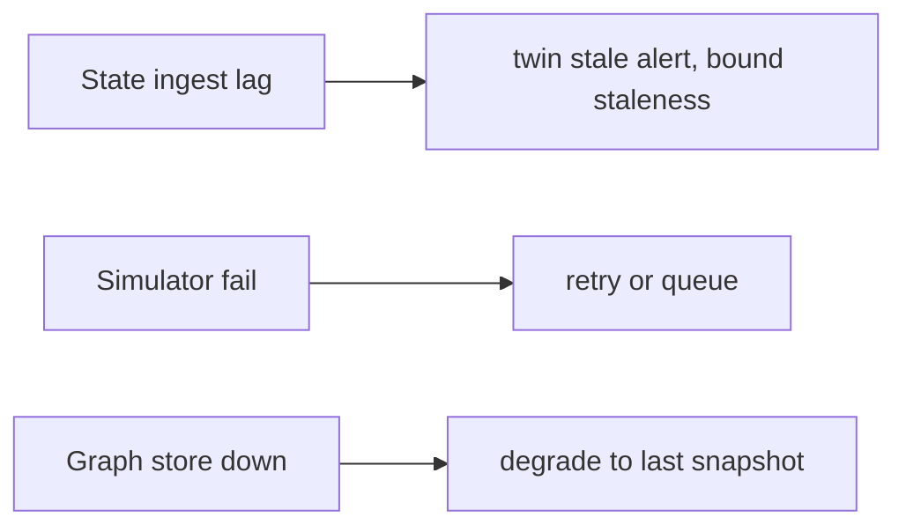
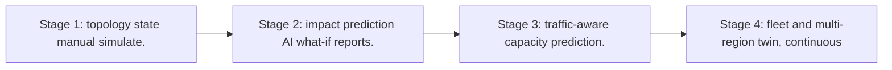

# Case Study: Network Digital Twin

> **Tier:** network-ai-systems · **Status:** complete · Original numbers and diagrams.

## 1. Problem statement
Maintain a live model of network topology, device state, and traffic so engineers can simulate changes (upgrades, routing, policy), predict impact, and validate before deploying, with AI-assisted what-if analysis. This is a network-ai-systems-tier system design challenge because it must handle multi-vendor device management while ensuring human approval for all high-risk changes. The design must be production-grade: observable, debuggable, reversible, and able to survive component failures without data loss or cascading outages.

## 2. Scope
In (v1): topology + state ingestion, change simulation, impact prediction (reachability and capacity), what-if Q and A, pre-change validation report. Out: auto-deployment of simulated changes (approval required).

For Network Digital Twin, these boundaries keep the first version focused on the core user value. Adding more features would dilute the design and delay shipping. Each excluded item is a scaling stage — a candidate for the next iteration once the baseline is proven.

## 3. Functional requirements
- Ingest topology, device state, and traffic metrics.
- Simulate a proposed change.
- Predict impact (reachability, capacity, failures).
- Q and A what-if with AI.
- Generate a pre-change validation report.
- Never auto-deploy.

For Network Digital Twin, these requirements drive specific architectural decisions: the read-write ratio determines the caching strategy, the durability target sets the replication mode, and the idempotency requirement shapes the API contract.

## 4. Non-functional requirements
- Twin freshness < 5 min.
- Simulation latency < 30 s for a change.
- Availability 99.9 percent.

For Network Digital Twin, each non-functional target constrains a specific component: the latency SLO bounds the number of synchronous hops, the availability target forces redundancy across availability zones, and the cost ceiling limits the replication factor and storage tier.

## 5. Explicit assumptions
1. 10k devices, topology graph ~100k edges. 2. Simulations on demand plus pre-change. 3. State from monitoring and config.

For Network Digital Twin, if these assumptions are off by an order of magnitude, the architecture must adapt: 10x traffic may require earlier sharding, a different read-write ratio changes the caching strategy, and a higher peak multiplier demands more headroom.

## 6. Traffic estimation
State ingest continuous (metrics and config); simulations on demand (bursts during change windows).

To derive the request rate: divide the daily volume by 86,400 seconds to get the average rate, then multiply by 5-10x for peak. The read-to-write ratio determines whether the system is cache-dominated (read-heavy) or write-path-dominated (write-heavy). For Network Digital Twin, this ratio shapes the entire storage and replication strategy.

## 7. Storage estimation
Topology graph, state history, traffic matrices, simulation results; grows, retain for audit.

For Network Digital Twin, storage growth is projected from the daily write volume and retention policy. Index overhead and compression factors are accounted for in the total.

## 8. Bandwidth estimation
State ingest moderate; simulation results small.

Bandwidth is request rate multiplied by average payload size for ingress, and response rate multiplied by response size for egress. CDN and edge caching reduce origin egress. Compression reduces bandwidth by 50-80 percent where applicable. For Network Digital Twin, bandwidth may or may not be the binding constraint — compare it against compute and storage to find out.

## 9. API design

GET /topology; POST /simulate; GET /what-if; GET /validation-report.

## 10. Data model
topology(nodes, links, capacities); device_state(device, status, config_hash); traffic_matrix(src,dst,bytes); simulations(id, change, impact, result).

For Network Digital Twin, the data model follows the access pattern. The primary lookup determines the partition key; secondary lookups determine indexes. Denormalization is used selectively on hot read paths.

## 11. High-level architecture

## 12. Request flow
Monitoring and config feed the twin -> engineer proposes a change -> simulator applies it to the twin -> impact prediction (reachability, capacity, failure) -> AI what-if analysis and report -> approval gate before real deployment; twin never auto-deploys.

## 13. Component responsibilities
Topology and state ingest, twin store, simulator, impact predictor, AI what-if, validation report, approval gate.

For Network Digital Twin, each component has one job. The gateway authenticates and routes. Services are stateless and scale horizontally. The data tier is the stateful core that scales by sharding.

## 14. Database selection
Graph store for topology; time-series for state and traffic; simulation results in object or relational. Rejected: scanning raw configs per simulation (slow).

For Network Digital Twin, the database was chosen by access pattern, not familiarity. The rejected alternatives were wrong for this workload, not bad in general.

## 15. Caching strategy
Hot topology cached; common simulation templates cached; what-if answers cached (versioned to topology).

For Network Digital Twin, the cache strategy matches the staleness tolerance. Cache-aside for most data, write-through where read-after-write matters, stampede protection on hot keys.

## 16. Partitioning strategy
Twin by site or region; simulations by change id; graph sharded by subtopology.

For Network Digital Twin, the partition key balances query locality with even load distribution. Sharding strategy matters because a poor key creates hot spots under real traffic patterns.

## 17. Replication strategy
Twin replicated for availability; state durable; simulations idempotent and replayable.

For Network Digital Twin, replication mode is split: synchronous where durability is critical, asynchronous elsewhere for throughput. RF=3 tolerates one failure. Failover is tested regularly.

## 18. Consistency model
Twin eventually consistent with network (minutes); simulation is deterministic on a topology snapshot; predictions advisory.

For Network Digital Twin, the consistency level is the weakest users accept. Read-your-writes is provided where needed. Eventual consistency is bounded and monitored, not unbounded and silent.

## 19. Failure scenarios
State ingest lag -> twin stale (alert, bound staleness). Simulator fail -> retry or queue. Graph store down -> degrade to last snapshot.

## 20. Reliability strategy
SLI twin freshness, simulation latency; SLO 99.9 percent. Snapshot-based simulation (deterministic). Chaos: kill simulator, assert resumable.

For Network Digital Twin, the SLO makes reliability measurable. The error budget balances feature velocity with stability. Chaos testing validates that resilience claims hold under real failures.

## 21. Security considerations
Topology is sensitive -> RBAC; PII and secret redaction; AI never auto-deploys; audit simulations; do not expose configs to unauthorized models.

For Network Digital Twin, security layers TLS, encryption at rest, RBAC, PII redaction, and audit. The policy gateway is fail-closed for AI-augmented operations.

## 22. Observability strategy
Twin freshness, simulation latency, prediction accuracy (post-deploy vs predicted), what-if usage, validation pass or fail.

For Network Digital Twin, observability combines logs, metrics, and traces with correlation IDs. Golden signals drive the first dashboard. Alerts fire on burn rate, not raw thresholds.

## 23. Cost considerations
Graph store plus state retention plus simulation compute (bursty). Retention policy; cache simulations.

For Network Digital Twin, cost is driven by the binding resource. Caching, tiering, batching, and right-sizing are the levers. Cost per request is tracked and alerted on.

## 24. Scaling stages
Stage 1: topology + state + manual simulate. -> Stage 2: impact prediction + AI what-if + reports. -> Stage 3: traffic-aware capacity prediction. -> Stage 4: fleet and multi-region twin, continuous validation.

## 25. Trade-offs
Twin freshness vs ingest cost. Simulation fidelity vs latency. AI what-if (assist) vs deterministic checks (trust). Retain state (audit) vs cost.

For Network Digital Twin, each trade-off lists what was chosen, what was rejected, and why. This makes the design defensible in review — every decision has documented reasoning.

## 26. Alternative designs
No twin (blind changes). Full auto-deploy from twin (unsafe). Config-only model (no traffic or state).

For Network Digital Twin, the alternatives are real architectures that work under different constraints. They were rejected for this workload's specific requirements, not because they are bad designs.

## 27. Interview discussion points
Clarify topology scale, freshness, simulation fidelity, auto-deploy tolerance (none). Surface twin, simulate, predict, what-if, approval.

For Network Digital Twin in an interview: clarify scope first, surface the read-write ratio, design the hot path deeply, discuss failures, and offer an alternative. Weak candidates skip failure modes.

## 28. Original Mermaid diagrams
Standalone sources under `diagrams/case-studies/network-digital-twin/`: `context.mmd`, `request-sequence.mmd`, `failure-flow.mmd`, `scaling-evolution.mmd`. The diagrams are embedded in their respective sections: architecture in section 11, request flow in section 12, failure scenarios in section 19, and scaling stages in section 24.

## 29. Further reading
Digital twins: Level 10 IoT; graph: Level 10; AI what-if: docs/ai-systems. Sources: `S-OTEL` `S-SLO`.

## 30. Practical exercises

1. Simulate an HA-pair failover. 2. Capacity impact of a link upgrade. 3. Predict reachability after a policy change. 4. Topology-staleness budget. 5. Validate AI what-if vs post-deploy reality.

---
Previous: AI-assisted NOC · Next: Secure network agent

