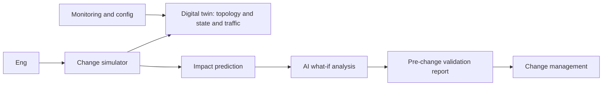
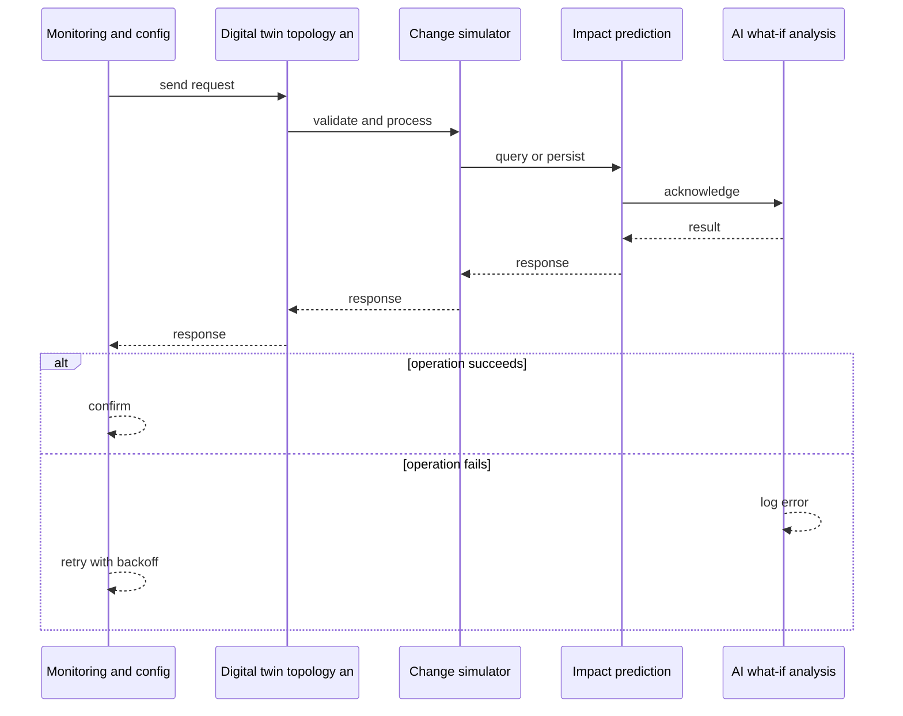
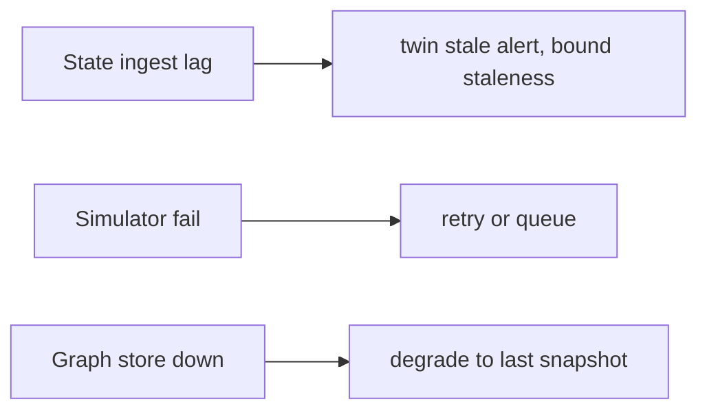
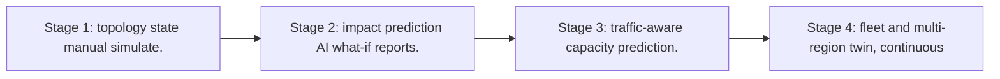

# Case Study: Network Digital Twin

> **Tier:** network-ai-systems · **Status:** complete · Original numbers and diagrams.

## 1. Problem statement

Maintain a live model of network topology, device state, and traffic so engineers can simulate changes (upgrades, routing, policy), predict impact, and validate before deploying, with AI-assisted what-if analysis.

## 2. Scope

In (v1): topology + state ingestion, change simulation, impact prediction (reachability and capacity), what-if Q and A, pre-change validation report. Out: auto-deployment of simulated changes (approval required).

## 3. Functional requirements

- Ingest topology, device state, and traffic metrics.
- Simulate a proposed change.
- Predict impact (reachability, capacity, failures).
- Q and A what-if with AI.
- Generate a pre-change validation report.
- Never auto-deploy.

## 4. Non-functional requirements

- Twin freshness < 5 min.
- Simulation latency < 30 s for a change.
- Availability 99.9 percent.

## 5. Explicit assumptions

1. 10k devices, topology graph ~100k edges. 2. Simulations on demand plus pre-change. 3. State from monitoring and config.

## 6. Traffic estimation

State ingest continuous (metrics and config); simulations on demand (bursts during change windows).

## 7. Storage estimation

Topology graph, state history, traffic matrices, simulation results; grows, retain for audit.

## 8. Bandwidth estimation
State ingest moderate; simulation results small.

## 9. API design

GET /topology; POST /simulate; GET /what-if; GET /validation-report.

## 10. Data model

topology(nodes, links, capacities); device_state(device, status, config_hash); traffic_matrix(src,dst,bytes); simulations(id, change, impact, result).

## 11. High-level architecture

## 12. Request flow
Monitoring and config feed the twin -> engineer proposes a change -> simulator applies it to the twin -> impact prediction (reachability, capacity, failure) -> AI what-if analysis and report -> approval gate before real deployment; twin never auto-deploys.

## 13. Component responsibilities

Topology and state ingest, twin store, simulator, impact predictor, AI what-if, validation report, approval gate.

## 14. Database selection

Graph store for topology; time-series for state and traffic; simulation results in object or relational. Rejected: scanning raw configs per simulation (slow).

## 15. Caching strategy

Hot topology cached; common simulation templates cached; what-if answers cached (versioned to topology).

## 16. Partitioning strategy

Twin by site or region; simulations by change id; graph sharded by subtopology.

## 17. Replication strategy

Twin replicated for availability; state durable; simulations idempotent and replayable.

## 18. Consistency model

Twin eventually consistent with network (minutes); simulation is deterministic on a topology snapshot; predictions advisory.

## 19. Failure scenarios
State ingest lag -> twin stale (alert, bound staleness). Simulator fail -> retry or queue. Graph store down -> degrade to last snapshot.

## 20. Reliability strategy

SLI twin freshness, simulation latency; SLO 99.9 percent. Snapshot-based simulation (deterministic). Chaos: kill simulator, assert resumable.

## 21. Security considerations

Topology is sensitive -> RBAC; PII and secret redaction; AI never auto-deploys; audit simulations; do not expose configs to unauthorized models.

## 22. Observability strategy

Twin freshness, simulation latency, prediction accuracy (post-deploy vs predicted), what-if usage, validation pass or fail.

## 23. Cost considerations

Graph store plus state retention plus simulation compute (bursty). Retention policy; cache simulations.

## 24. Scaling stages
Stage 1: topology + state + manual simulate. -> Stage 2: impact prediction + AI what-if + reports. -> Stage 3: traffic-aware capacity prediction. -> Stage 4: fleet and multi-region twin, continuous validation.

## 25. Trade-offs

Twin freshness vs ingest cost. Simulation fidelity vs latency. AI what-if (assist) vs deterministic checks (trust). Retain state (audit) vs cost.

## 26. Alternative designs

No twin (blind changes). Full auto-deploy from twin (unsafe). Config-only model (no traffic or state).

## 27. Interview discussion points

Clarify topology scale, freshness, simulation fidelity, auto-deploy tolerance (none). Surface twin, simulate, predict, what-if, approval.

## 28. Original Mermaid diagrams
Standalone sources under `diagrams/case-studies/network-digital-twin/`: `context.mmd`, `request-sequence.mmd`, `failure-flow.mmd`, `scaling-evolution.mmd`. The diagrams are embedded in their respective sections: architecture in section 11, request flow in section 12, failure scenarios in section 19, and scaling stages in section 24.

## 29. Further reading
Digital twins: Level 10 IoT; graph: Level 10; AI what-if: docs/ai-systems. Sources: `S-OTEL` `S-SLO`.

## 30. Practical exercises

1. Simulate an HA-pair failover. 2. Capacity impact of a link upgrade. 3. Predict reachability after a policy change. 4. Topology-staleness budget. 5. Validate AI what-if vs post-deploy reality.

---
Previous: AI-assisted NOC · Next: Secure network agent

