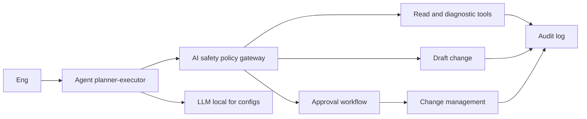
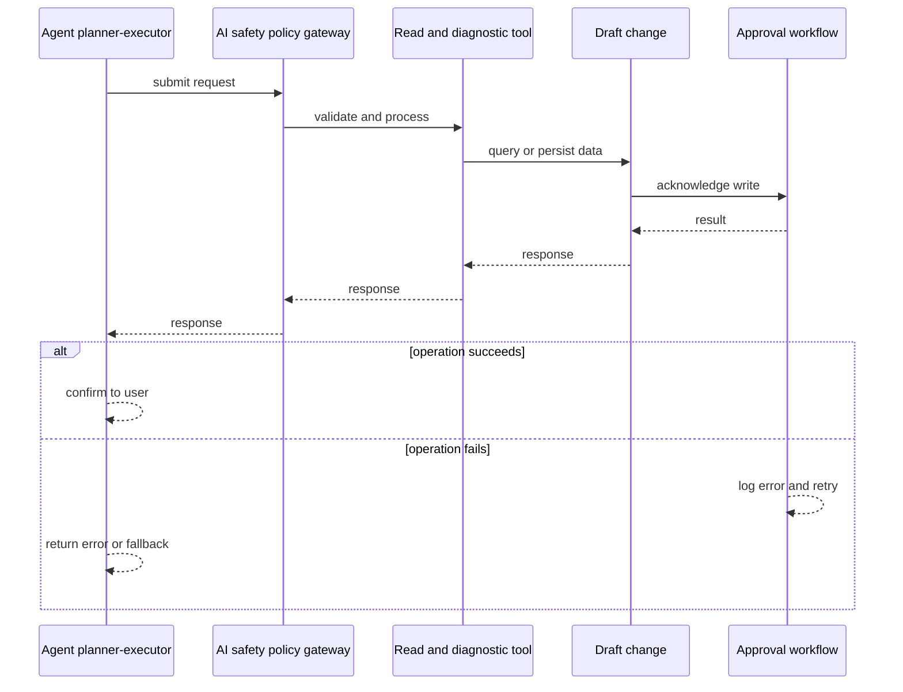
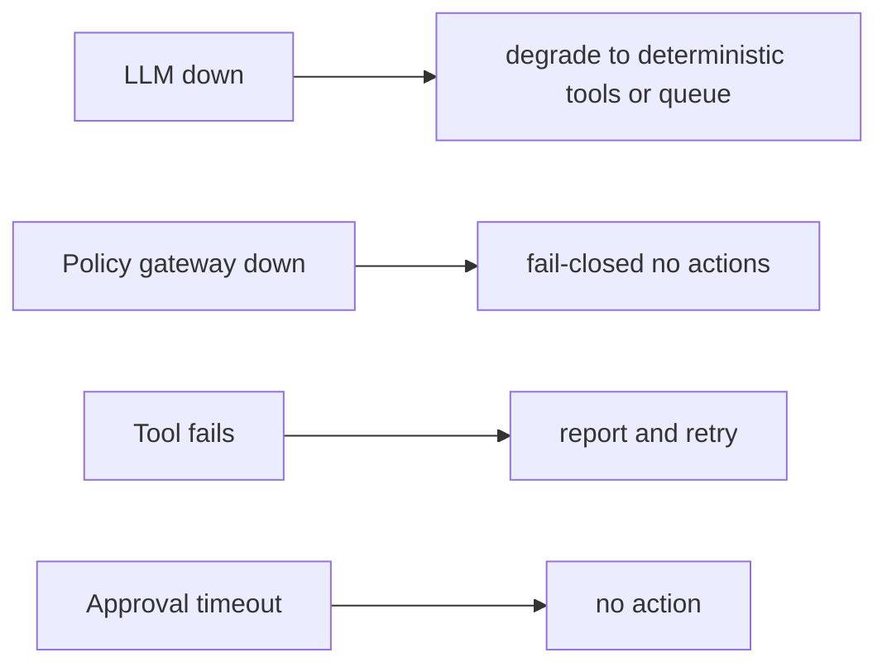
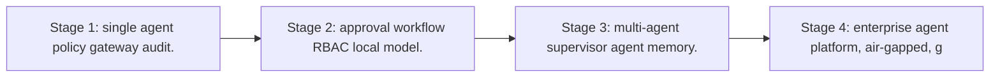

# Case Study: Secure Network Agent

> **Tier:** network-ai-systems · **Status:** complete · Original numbers and diagrams.

## 1. Problem statement
An enterprise agent that performs allowed network operations (read status, run diagnostics, draft changes, generate reports) under strict policies, approvals, RBAC, and an AI safety gateway, never executing high-risk or destructive actions autonomously. This is a network-ai-systems-tier system design challenge because it must handle multi-vendor device management while ensuring human approval for all high-risk changes. The design must be production-grade: observable, debuggable, reversible, and able to survive component failures without data loss or cascading outages.

## 2. Scope
In (v1): tool-calling agent for network ops, policy gateway, approval workflow, full audit, RBAC, local-model option for confidential configs. Out: autonomous high-risk execution (excluded by design).

For Secure Network Agent, these boundaries keep the first version focused on the core user value. Adding more features would dilute the design and delay shipping. Each excluded item is a scaling stage — a candidate for the next iteration once the baseline is proven.

## 3. Functional requirements
- Run allowed read and diagnostic tools.
- Draft (not execute) changes.
- Generate reports.
- Request approval for write actions.
- Enforce policies (no password or key exposure, no unapproved changes, no firewall or routing or VPN changes without approval).
- Full audit.

For Secure Network Agent, these requirements drive specific architectural decisions: the read-write ratio determines the caching strategy, the durability target sets the replication mode, and the idempotency requirement shapes the API contract.

## 4. Non-functional requirements
- Never execute high-risk action without approval.
- Tool latency bounded.
- Availability 99.9 percent.
- Confidential configs stay local or air-gapped.

For Secure Network Agent, each non-functional target constrains a specific component: the latency SLO bounds the number of synchronous hops, the availability target forces redundancy across availability zones, and the cost ceiling limits the replication factor and storage tier.

## 5. Explicit assumptions
1. ~50 tool calls per incident. 2. Most actions read or draft. 3. Air-gapped option for configs.

For Secure Network Agent, if these assumptions are off by an order of magnitude, the architecture must adapt: 10x traffic may require earlier sharding, a different read-write ratio changes the caching strategy, and a higher peak multiplier demands more headroom.

## 6. Traffic estimation
On-demand agent sessions (bursts during incidents); mostly tool calls and LLM inference.

To derive the request rate: divide the daily volume by 86,400 seconds to get the average rate, then multiply by 5-10x for peak. The read-to-write ratio determines whether the system is cache-dominated (read-heavy) or write-path-dominated (write-heavy). For Secure Network Agent, this ratio shapes the entire storage and replication strategy.

## 7. Storage estimation
Agent session state, tool results, approvals, audit; modest, must be tamper-evident.

For Secure Network Agent, storage growth is projected from the daily write volume and retention policy. Index overhead and compression factors are accounted for in the total.

## 8. Bandwidth estimation
Tool calls to devices plus LLM; moderate.

Bandwidth is request rate multiplied by average payload size for ingress, and response rate multiplied by response size for egress. CDN and edge caching reduce origin egress. Compression reduces bandwidth by 50-80 percent where applicable. For Secure Network Agent, bandwidth may or may not be the binding constraint — compare it against compute and storage to find out.

## 9. API design

POST /agent/sessions; POST /agent/sessions/:id/messages; POST /approvals; GET /audit.

## 10. Data model
sessions(id, user, goal, state, steps); tools(name, spec, risk_level); approvals(id, action, status, approver); audit(actor, action, ts, result).

For Secure Network Agent, the data model follows the access pattern. The primary lookup determines the partition key; secondary lookups determine indexes. Denormalization is used selectively on hot read paths.

## 11. High-level architecture

## 12. Request flow
Engineer goals the agent -> planner-executor picks tools -> every action passes the policy gateway -> read and diagnostic allowed; write actions only draft; high-risk routed to approval workflow -> approved actions go to change management; confidential configs use local LLM; everything audited.

## 13. Component responsibilities
Planner-executor agent, tool registry (with risk levels), policy gateway, approval workflow, change management, local or external LLM, audit.

For Secure Network Agent, each component has one job. The gateway authenticates and routes. Services are stateless and scale horizontally. The data tier is the stateful core that scales by sharding.

## 14. Database selection
Session and state store; tool registry; approvals (relational, audited); audit (append-only, tamper-evident). Rejected: agent with direct unguarded tool execution.

For Secure Network Agent, the database was chosen by access pattern, not familiarity. The rejected alternatives were wrong for this workload, not bad in general.

## 15. Caching strategy
Session state cached; common tool results cached (permission-aware).

For Secure Network Agent, the cache strategy matches the staleness tolerance. Cache-aside for most data, write-through where read-after-write matters, stampede protection on hot keys.

## 16. Partitioning strategy
Sessions by user; audit by date; tools central registry.

For Secure Network Agent, the partition key balances query locality with even load distribution. Sharding strategy matters because a poor key creates hot spots under real traffic patterns.

## 17. Replication strategy
Session store RF=3; audit append-only replicated; agent stateless-ish (state externalized).

For Secure Network Agent, replication mode is split: synchronous where durability is critical, asynchronous elsewhere for throughput. RF=3 tolerates one failure. Failover is tested regularly.

## 18. Consistency model
Approvals strongly consistent (audit). Agent state per session. Tool results advisory except committed changes.

For Secure Network Agent, the consistency level is the weakest users accept. Read-your-writes is provided where needed. Eventual consistency is bounded and monitored, not unbounded and silent.

## 19. Failure scenarios
LLM down -> degrade to deterministic tools or queue. Policy gateway down -> fail-closed (no actions). Tool fails -> report and retry. Approval timeout -> no action.

## 20. Reliability strategy
SLI tool success, approval correctness, zero-unauthorized-action; SLO 99.9 percent. Fail-closed policy gateway. Chaos: kill policy gateway, assert no actions executed.

For Secure Network Agent, the SLO makes reliability measurable. The error budget balances feature velocity with stability. Chaos testing validates that resilience claims hold under real failures.

## 21. Security considerations

RBAC; policy gateway (never passwords or keys, never unapproved changes, never firewall or routing or VPN changes, never outside maintenance windows, never configs to unauthorized users or models); audit; local model for confidential configs; air-gapped option.

## 22. Observability strategy
Tool call rate, approval rate, policy denials, unauthorized-action attempts (0), agent latency, cost, audit completeness.

For Secure Network Agent, observability combines logs, metrics, and traces with correlation IDs. Golden signals drive the first dashboard. Alerts fire on burn rate, not raw thresholds.

## 23. Cost considerations
LLM inference (tokens) plus tool execution. Multi-model routing plus local model for configs cut cost and risk.

For Secure Network Agent, cost is driven by the binding resource. Caching, tiering, batching, and right-sizing are the levers. Cost per request is tracked and alerted on.

## 24. Scaling stages
Stage 1: single agent + policy gateway + audit. -> Stage 2: approval workflow + RBAC + local model. -> Stage 3: multi-agent + supervisor agent + memory. -> Stage 4: enterprise agent platform, air-gapped, governance.

## 25. Trade-offs
Autonomy (speed) vs approval (safety) -> approval for risk. Local model (privacy and air-gap) vs external (quality). Draft (safe) vs execute (fast).

For Secure Network Agent, each trade-off lists what was chosen, what was rejected, and why. This makes the design defensible in review — every decision has documented reasoning.

## 26. Alternative designs
Full autonomy (unsafe). No policy gateway (no guardrails). No audit (no accountability).

For Secure Network Agent, the alternatives are real architectures that work under different constraints. They were rejected for this workload's specific requirements, not because they are bad designs.

## 27. Interview discussion points
Clarify allowed tools, risk tiers, approval workflow, air-gap need. Surface planner-executor, policy gateway, approval, audit, and the no-autonomous-high-risk principle.

For Secure Network Agent in an interview: clarify scope first, surface the read-write ratio, design the hot path deeply, discuss failures, and offer an alternative. Weak candidates skip failure modes.

## 28. Original Mermaid diagrams
Standalone sources under `diagrams/case-studies/secure-network-agent/`: `context.mmd`, `request-sequence.mmd`, `failure-flow.mmd`, `scaling-evolution.mmd`. The diagrams are embedded in their respective sections: architecture in section 11, request flow in section 12, failure scenarios in section 19, and scaling stages in section 24.

## 29. Further reading
Agentic systems: docs/ai-systems; AI safety gateway; change management: Level 6; RBAC: Level 7. Sources: `S-RAG` `S-VECTORDB`.

## 30. Practical exercises

1. Define tool risk tiers. 2. Policy gateway fail-closed design. 3. Local-model-only mode for configs. 4. Approval workflow with quorum. 5. Audit replay for an incident.

---
Previous: Network digital twin · Next: Enterprise RAG platform

