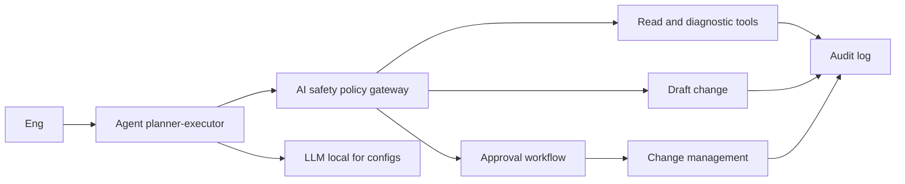
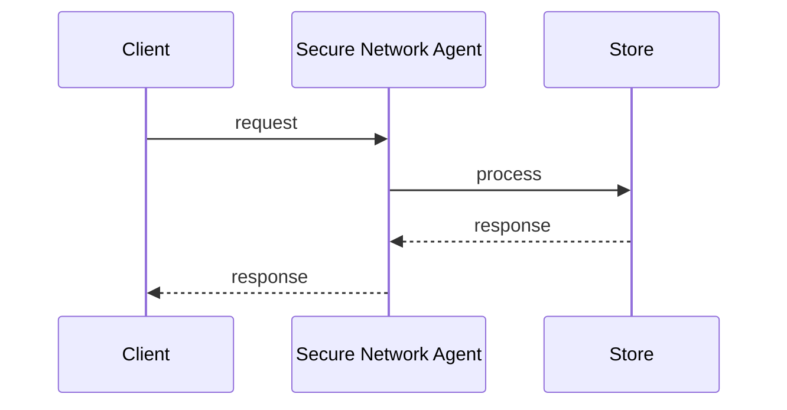
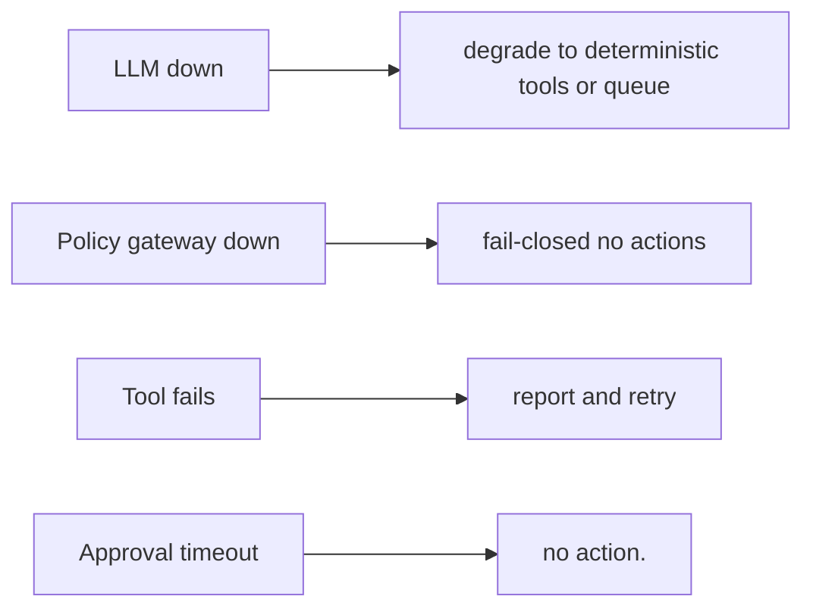
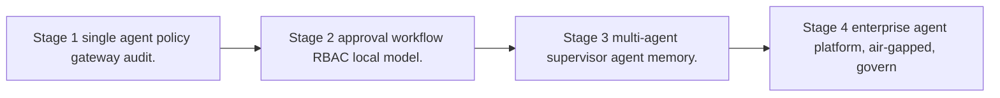

# Case Study: Secure Network Agent

> **Tier:** network-ai-systems · **Status:** beta · Original numbers and diagrams.

## 11. High-level architecture

## 28. Original Mermaid diagrams

Standalone sources under `diagrams/case-studies/secure-network-agent/`: `context.mmd`, `request-sequence.mmd`, `failure-flow.mmd`, `scaling-evolution.mmd`. Additional diagrams:

## 1. Problem statement

An enterprise agent that performs allowed network operations (read status, run diagnostics, draft changes, generate reports) under strict policies, approvals, RBAC, and an AI safety gateway, never executing high-risk or destructive actions autonomously.

## 2. Scope

In (v1): tool-calling agent for network ops, policy gateway, approval workflow, full audit, RBAC, local-model option for confidential configs. Out: autonomous high-risk execution (excluded by design).

## 3. Functional requirements

- Run allowed read and diagnostic tools. - Draft (not execute) changes. - Generate reports. - Request approval for write actions. - Enforce policies (no password or key exposure, no unapproved changes, no firewall or routing or VPN changes without approval). - Full audit.

## 4. Non-functional requirements

- Never execute high-risk action without approval. - Tool latency bounded. - Availability 99.9 percent. - Confidential configs stay local or air-gapped.

## 5. Explicit assumptions

1. ~50 tool calls per incident. 2. Most actions read or draft. 3. Air-gapped option for configs.

## 6. Traffic estimation

On-demand agent sessions (bursts during incidents); mostly tool calls and LLM inference.

## 7. Storage estimation

Agent session state, tool results, approvals, audit; modest, must be tamper-evident.

## 8. Bandwidth estimation

Tool calls to devices plus LLM; moderate.

## 9. API design

POST /agent/sessions; POST /agent/sessions/:id/messages; POST /approvals; GET /audit.

## 10. Data model

sessions(id, user, goal, state, steps); tools(name, spec, risk_level); approvals(id, action, status, approver); audit(actor, action, ts, result).

## 12. Request flow

Engineer goals the agent -> planner-executor picks tools -> every action passes the policy gateway -> read and diagnostic allowed; write actions only draft; high-risk routed to approval workflow -> approved actions go to change management; confidential configs use local LLM; everything audited.

## 13. Component responsibilities

Planner-executor agent, tool registry (with risk levels), policy gateway, approval workflow, change management, local or external LLM, audit.

## 14. Database selection

Session and state store; tool registry; approvals (relational, audited); audit (append-only, tamper-evident). Rejected: agent with direct unguarded tool execution.

## 15. Caching strategy

Session state cached; common tool results cached (permission-aware).

## 16. Partitioning strategy

Sessions by user; audit by date; tools central registry.

## 17. Replication strategy

Session store RF=3; audit append-only replicated; agent stateless-ish (state externalized).

## 18. Consistency model

Approvals strongly consistent (audit). Agent state per session. Tool results advisory except committed changes.

## 19. Failure scenarios

LLM down -> degrade to deterministic tools or queue. Policy gateway down -> fail-closed (no actions). Tool fails -> report and retry. Approval timeout -> no action.

## 20. Reliability strategy

SLI tool success, approval correctness, zero-unauthorized-action; SLO 99.9 percent. Fail-closed policy gateway. Chaos: kill policy gateway, assert no actions executed.

## 21. Security considerations

RBAC; policy gateway (never passwords or keys, never unapproved changes, never firewall or routing or VPN changes, never outside maintenance windows, never configs to unauthorized users or models); audit; local model for confidential configs; air-gapped option.

## 22. Observability strategy

Tool call rate, approval rate, policy denials, unauthorized-action attempts (0), agent latency, cost, audit completeness.

## 23. Cost considerations

LLM inference (tokens) plus tool execution. Multi-model routing plus local model for configs cut cost and risk.

## 24. Scaling stages

Stage 1: single agent + policy gateway + audit. -> Stage 2: approval workflow + RBAC + local model. -> Stage 3: multi-agent + supervisor agent + memory. -> Stage 4: enterprise agent platform, air-gapped, governance.

## 25. Trade-offs

Autonomy (speed) vs approval (safety) -> approval for risk. Local model (privacy and air-gap) vs external (quality). Draft (safe) vs execute (fast).

## 26. Alternative designs

Full autonomy (unsafe). No policy gateway (no guardrails). No audit (no accountability).

## 27. Interview discussion points

Clarify allowed tools, risk tiers, approval workflow, air-gap need. Surface planner-executor, policy gateway, approval, audit, and the no-autonomous-high-risk principle.

## 29. Further reading

Agentic systems: docs/ai-systems; AI safety gateway; change management: Level 6; RBAC: Level 7.

## 30. Practical exercises

1. Define tool risk tiers. 2. Policy gateway fail-closed design. 3. Local-model-only mode for configs. 4. Approval workflow with quorum. 5. Audit replay for an incident.

---
Previous: Network digital twin · Next: Enterprise RAG platform
