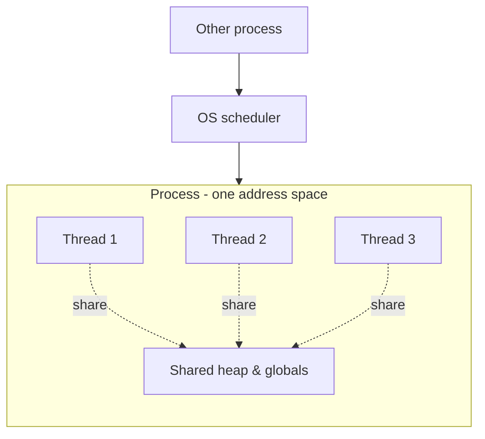
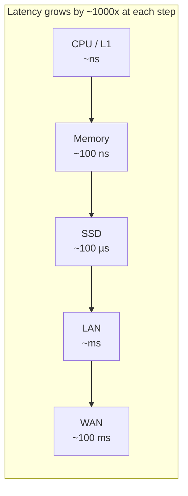

# Computing Fundamentals

> **Level:** 0 (Prerequisites) · **Prerequisites:** none
> **Navigation:** ← Start of Level 0 · [Next → Networking & HTTP](01-networking-http.md)

## Learning objectives

After this chapter you can:

- Describe, at a level useful for system design, how a program becomes a running process.
- Explain the difference between a process and a thread and why that matters for services.
- Reason about CPU, memory, disk, and network as resources with distinct latency profiles.
- Connect these fundamentals to later decisions about concurrency, blocking, and scaling.

This chapter is deliberately non-academic. It gives you just enough mental model to read the
rest of the curriculum without hand-waving about ""why blocking I/O is expensive"" or
""why stateful services are hard to scale"".

## How computers execute applications

Source code does not run directly. It is translated — ahead of time or just in time — into
machine instructions the CPU understands. A program on disk is a passive set of bytes; it
becomes live only when the operating system creates a **process** for it: an address space,
a set of registers, an execution context, and at least one thread of control.

The CPU fetches instructions, decodes them, and executes them against data in registers and
memory. When a process needs something outside the CPU — disk, network, another process —
it performs an I/O operation and typically **waits** until the data is ready. How that
waiting is managed (blocking the thread, suspending it, or using asynchronous completion) is
the root of many concurrency and scaling decisions later in the curriculum.

## Processes and threads

A **process** is an isolated execution environment with its own virtual address space. The
OS prevents one process from clobbering another's memory (barring explicit shared memory).

A **thread** is a unit of execution *within* a process. Threads in the same process share
the address space and can see each other's memory, which makes communication fast but
requires synchronization to avoid data races.

Why this matters for system design:

- **Concurrency** in a single host usually starts with threads or an event loop.
- **Shared state** between threads is the source of most correctness bugs (locking, races,
  deadlocks); this pain scales up to *distributed* shared state later.
- **A thread blocked on I/O** occupies a scheduler slot. Servers handling thousands of
  concurrent connections therefore prefer asynchronous I/O or many small processes rather
  than one thread per connection.
- **Context switching** between threads/processes has a cost. Throwing more threads at a
  CPU-bound problem eventually makes it slower, not faster.

## CPU, memory, disk, and network

These four resources have wildly different latency profiles, and almost every performance
problem is a mismatch between a workload and one of them. A widely cited rough ordering,
using nanoseconds as the unit and a few ""human"" analogies:

| Operation | Approx. latency | Scaled analogy (1 CPU op ≈ 1 second) |
|-----------|-----------------|--------------------------------------|
| L1 cache reference | ~0.5 ns | 1 second |
| Main memory reference | ~100 ns | ~3 minutes |
| SSD random read (4 KB) | ~150 µs | ~4 days |
| Datacenter round trip (LAN) | ~0.5 ms | ~2 months |
| WAN round trip (intercontinental) | ~100–300 ms | ~3–8 years |

The analogy is deliberately absurd to make the point stick: from a CPU's perspective,
touching the network is measured in *years*. This is why batching, caching, and
co-locating compute with data are not optimizations — they are necessities.

**CPU-bound** work is limited by instruction throughput. **I/O-bound** work spends most of
its time waiting on disk or network. Identifying which one a workload is determines whether
you should add cores, add machines, or reduce I/O (caching, batching, async).

## Operating-system fundamentals (what you need to retain here)

Later chapters assume you know that the OS provides:

- **Virtual memory**: each process sees a contiguous private address space backed by physical
  RAM and, when memory pressure rises, by swap on disk (which is slow).
- **Scheduling**: the OS time-slices threads across cores and can preempt them.
- **System calls**: the boundary where user code asks the kernel to do I/O, allocate memory,
  or talk to the network — crossing it has overhead.
- **File descriptors / handles**: how a process refers to open files, sockets, and pipes.
  A process has a limited number by default, which becomes relevant for high-connection
  servers.
- **Synchronization primitives**: mutexes, condition variables, semaphores used to coordinate
  threads.

We go deeper on Linux specifically in the planned `02-os-linux.md` chapter.

## Why this matters for system design

Almost every architectural choice is a reaction to these fundamentals:

- **Stateless services scale horizontally** because they hold no per-client state in memory,
  so any instance can handle any request. Stateful services force affinity or replication.
- **Async I/O and event loops** exist because threads are expensive to block at scale.
- **Caching** exists because the latency gap between memory and disk/network is enormous.
- **Co-locating compute with data** exists because moving petabytes over the network is
  prohibitive — hence MapReduce, stored procedures, and edge compute later on.

## Examples

- A web server spawning one thread per connection works fine at hundreds of connections but
  collapses at tens of thousands because thread memory and context-switch overhead dominate.
- A batch job reading one row at a time from a database over the network is ~10,000x slower
  than the same job reading the rows in batches, because each round trip ""costs years"".
- A CPU-bound video transcoder on a 4-core machine runs ~4× faster with 4 threads and *slower*
  with 64 threads due to contention.

## Trade-offs

- **More threads** = more concurrency but more memory, context-switch, and synchronization
  cost. There is an optimum, not a maximum.
- **Caching** trades memory for latency. Memory is finite and costs money; large caches
  compete with other in-memory needs (connections, buffers).
- **Asynchronous I/O** improves throughput but makes code harder to reason about
  (callbacks, futures, cancellation, backpressure).

## When NOT to apply a concept here

- Don't reach for threads when the workload is I/O-bound; reach for async or batching first.
- Don't assume ""more cores fixes it"" for latency-bound paths; latency is dominated by the
  slowest resource, often the network.
- Don't optimize CPU when profiling shows you are waiting on disk.

## Common mistakes

- Treating the network as if it were as fast as a function call.
- Using a synchronous one-thread-per-connection model for high fan-out services.
- Ignoring context-switch overhead when sizing thread/connection pools.
- Assuming adding machines fixes a single slow dependency (it just adds more waiters).

## Failure modes and operational concerns

- **Thread leaks**: threads that never finish exhaust the scheduler and memory.
- **Connection exhaustion**: too many open file descriptors prevents accepting new clients.
- **Memory pressure → swap**: sudden latency spikes when the OS pages to disk.
- **CPU starvation** under heavy scheduling contention manifests as erratic latency.

## Review questions

1. Why is a process safer than a thread for isolating untrusted code?
2. A service handles 50k concurrent connections. Argue for or against one thread per
   connection.
3. Put L1 cache, SSD, LAN, and WAN in latency order and explain the implication for caching.
4. A latency-sensitive endpoint is slow. How do you decide whether to optimize CPU, memory,
   disk, or network?
5. Why does co-locating compute with data matter at petabyte scale?

## Further reading

- General OS concepts: any standard operating-systems textbook.
- The latency numbers that informed the table above are widely reproduced from Jeff Dean's
  ""Latency Numbers Every Programmer Should Know""; cite the original distribution, not a
  copy.
- Networking and HTTP are covered next: see [01-networking-http.md](01-networking-http.md).

---
← Start of Level 0 · [Next → Networking & HTTP](01-networking-http.md)
