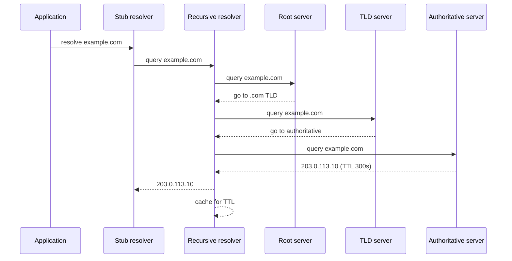
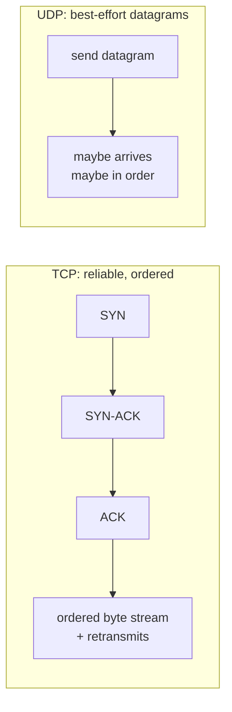
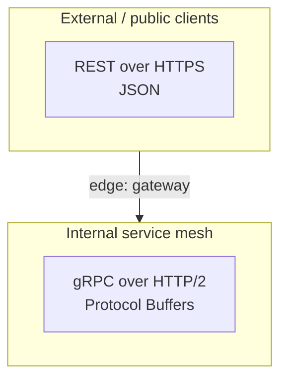

# Networking & HTTP

> **Level:** 0 (Prerequisites) · **Prerequisites:** [Computing Fundamentals](00-computing-fundamentals.md)
> **Navigation:** [← Previous: Computing Fundamentals](00-computing-fundamentals.md) · [Next → OS & Linux](02-os-linux.md)

## Learning objectives

After this chapter you can:

- Explain DNS resolution and why it is more than a one-time lookup.
- Distinguish TCP from UDP and choose between them with reasons.
- Describe how HTTP works over TCP/TLS and what HTTPS actually protects.
- Compare REST, RPC, and gRPC and their serialization formats (JSON, Protobuf, Avro).

## DNS

The Domain Name System maps human names (`example.com`) to IP addresses. It is a
hierarchical, cached, eventually-consistent distributed database. A resolution typically
walks from a stub resolver to a recursive resolver, which queries root, top-level domain, and
authoritative servers, and the result is cached at every layer by time-to-live (TTL).

DNS matters in system design because:

- **TTLs control how fast a failover can happen.** A long TTL means clients keep hitting a
  dead IP until the cache expires; a short TTL enables traffic steering but increases load.
- **DNS is a load-balancing and global-routing primitive** (round-robin, weighted,
  geo-steering) used at extreme scale (see Level 10).
- **DNS itself can fail.** Recursive resolvers are a dependency; misconfigured TTLs or
  caching across failovers cause partial outages.

## TCP and UDP

TCP provides a reliable, ordered, connection-oriented byte stream; UDP is a fire-and-forget
datagram service. The choice is fundamental:

- **TCP** when you need every byte, in order: file transfer, databases, HTTP, RPC.
- **UDP** when you prefer timeliness over completeness: DNS, some media, QUIC, telemetry.

TCP's reliability comes with a cost: connection setup (handshake), acknowledgements,
retransmission, congestion control, and head-of-line blocking. QUIC (S-QUIC) runs a
modernized version of these mechanisms over UDP, enabling HTTP/3 to avoid some TCP
head-of-line blocking.

## HTTP and HTTPS

HTTP is a request/response protocol layered on TCP (or QUIC for HTTP/3). A request has a
method, path, headers, and optional body; a response has a status code, headers, and body.
Status codes carry semantics: `2xx` success, `3xx` redirection, `4xx` client error,
`5xx` server error (S-RFC9110).

HTTPS is HTTP inside TLS (S-RFC8446). TLS provides:

- **Confidentiality** — the contents are encrypted between client and server.
- **Integrity** — tampering is detectable.
- **Authentication** — the server proves its identity via a certificate chain (and optionally
  the client does too, with mTLS).

TLS adds a handshake and per-record encryption cost, but modern hardware makes this small
relative to the latency of the work the request triggers.

## REST, RPC, and gRPC

- **REST** (S-RFC9110) models resources as URLs and uses HTTP methods (`GET`, `POST`,
  `PUT`, `PATCH`, `DELETE`) to act on them. It is stateless, cacheable, and human-readable,
  which makes it the default for public APIs. Its weakness is chatty interactions and a loose
  contract.
- **RPC** makes a remote call look like a local function call. It is efficient for internal
  service-to-service communication where you control both ends and want a strong contract.
- **gRPC** (S-RFC9113, S-PROTOBUF) is modern RPC over HTTP/2 using Protocol Buffers. It
  supports streaming (client, server, bidi), multiplexing, and compact binary payloads, and
  is the usual choice for high-throughput internal APIs.

## Serialization: JSON, Protocol Buffers, Avro

| Format | Human-readable | Compact | Schema | Typical use |
|--------|:-------------:|:-------:|:------:|------------|
| JSON (S-JSON) | yes | no | optional | Public APIs, config, debugging |
| Protobuf (S-PROTOBUF) | no | yes | required, compiled | gRPC, internal RPC |
| Avro (S-AVRO) | no | yes | required, runtime | Streaming/event pipelines (Kafka) |

Schema-free formats are easy to adopt but hard to evolve safely; schema-required formats
force versioning discipline and compress better, which matters at high throughput.

## Trade-offs

- **REST vs gRPC**: REST optimizes for generality and discoverability; gRPC optimizes for
  throughput and contract. Many systems expose REST externally and gRPC internally.
- **TCP vs UDP**: reliability costs latency and head-of-line blocking; choose UDP/QUIC when
  freshness beats completeness.
- **TLS everywhere** adds latency and CPU but is non-negotiable for security; terminate it at
  the edge or in a service mesh sidecar to centralize policy.

## When NOT to apply a concept here

- Don't force REST onto high-frequency internal chatty calls; gRPC is usually better.
- Don't use JSON for multi-GB internal streams; binary formats are cheaper.
- Don't assume ""HTTP/2 fixes everything"" — head-of-line blocking still exists at TCP until
  you move to HTTP/3 over QUIC.

## Common mistakes

- Treating DNS as instant — ignoring TTL during failover planning.
- Opening a new TCP+TLS connection per request instead of reusing keep-alive connections.
- Putting unbounded trust in `X-Forwarded-*` headers without validating the proxy chain.
- Using GET with side effects, or relying on client-supplied IDs without validation.

## Failure modes and operational concerns

- **DNS outage / misconfigured TTL** → global partial outage.
- **Connection churn** → TIME_WAIT exhaustion, TLS handshake CPU spikes.
- **TLS misconfiguration** → expired certs cause hard outages; automate rotation.
- **Protocol mismatch** → clients and servers deserializing different schema versions.

## Review questions

1. Why does a short DNS TTL help failover but hurt resolver load?
2. Choose TCP or UDP for live telemetry and justify it.
3. What does TLS authenticate, and what does it not?
4. When would you pick gRPC over REST for an internal API?
5. Why does Avro suit streaming pipelines better than JSON?

## Further reading

- HTTP semantics: S-RFC9110 · HTTP/1.1 messaging: S-RFC9112 · HTTP/2: S-RFC9113 ·
  HTTP/3: S-RFC9114 · TLS 1.3: S-RFC8446 · OAuth 2.0: S-RFC6749 · JWT: S-RFC7519.
- Protocol Buffers: S-PROTOBUF · Avro: S-AVRO · JSON: S-JSON · QUIC: S-QUIC.

---
[← Previous: Computing Fundamentals](00-computing-fundamentals.md) · [Next → OS & Linux](02-os-linux.md)
