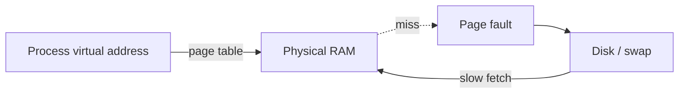
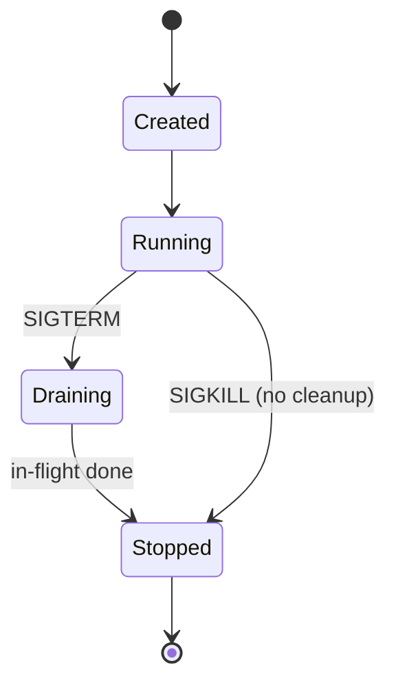

# Operating-System & Linux Fundamentals

> **Level:** 0 (Prerequisites) · **Prerequisites:** [Computing Fundamentals](00-computing-fundamentals.md)
> **Navigation:** [← Previous: Networking & HTTP](01-networking-http.md) · [Next → Complexity & Data Structures](03-complexity-data-structures.md)

## Learning objectives

After this chapter you can:

- Explain virtual memory, paging, and why swap causes latency spikes.
- Reason about file descriptors and their limits under high-connection servers.
- Describe the Linux process lifecycle and signals relevant to graceful shutdown.
- Use basic Linux tooling (process, I/O, network) to diagnose a misbehaving service.

This chapter is purposefully narrow: only the OS mechanics that recur in later design
discussions. We deliberately skip kernel internals not relevant to distributed systems.

## Virtual memory and paging

Each process gets a private **virtual address space** that the OS maps to physical RAM in
fixed-size pages (commonly 4 KB). When a process accesses memory not currently resident, the
CPU raises a page fault and the OS fetches it from disk. If physical RAM is exhausted, the OS
swaps least-recently-used pages to disk; since disk is ~100,000× slower than RAM (see the
latency table in [Computing Fundamentals](00-computing-fundamentals.md)), a swapping server
exhibits sudden, dramatic latency spikes.

Implication for design: a service whose working set exceeds RAM will be unpredictable. Size
memory headroom so hot data stays resident, and prefer offloading cold data to cheaper
storage rather than letting the OS swap it.

## File descriptors and limits

On Linux, an open socket, file, or pipe is a **file descriptor (fd)**. Each process has a
soft and hard limit (`ulimit -n`). A server accepting tens of thousands of connections can
exhaust its fd limit and start refusing connections with `EMFILE`. Tuning `ulimit` and
`sysctl` (e.g., `net.core.somaxconn`, `fs.file-max`) is a routine operational step for
high-fan-out services, but it is downstream of a better fix: asynchronous I/O so you do not
hold one fd-sized thread per connection.

## The process lifecycle and signals

A process is created (`fork`/`exec`), runs, and terminates, yielding an exit code. Signals
interrupt it. The two that matter most for graceful shutdown are:

- `SIGTERM` — polite request to terminate; the process should finish in-flight work and exit.
- `SIGINT` — interrupt (Ctrl-C); similar handling.
- `SIGKILL` — immediate, un-catchable kill; the process cannot clean up. Use only as a last
  resort after a timeout, because it abandons in-flight requests and can corrupt stateful
  components.

A well-designed service registers a `SIGTERM` handler, stops accepting new work, drains
in-flight requests up to a deadline, closes resources, and exits 0. Orchestrators
(Kubernetes) send `SIGTERM` then `SIGKILL` after a grace period, so this handler is what makes
zero-downtime deploys possible (see Level 9).

## Scheduling and the CFS

Linux schedules threads with the Completely Fair Scheduler, time-slicing them across cores.
CPU-bound threads compete for CPU time; I/O-bound threads spend most time blocked and
consume little CPU. **Context switches** are not free: a machine with far more runnable
threads than cores spends measurable time switching rather than computing. This is why
sizing thread pools to roughly the core count for CPU-bound work, and using async I/O for
I/O-bound work, beats naive thread-per-task.

## I/O models (blocking, non-blocking, async)

- **Blocking I/O**: the thread waits until the operation completes. Simple, but wastes the
  thread while waiting.
- **Non-blocking I/O** with multiplexing (`epoll`/`kqueue`/`io_uring`): one thread watches
  many fds and is notified when work is ready. This is how high-connection servers scale to
  hundreds of thousands of connections.
- **Asynchronous I/O** (`io_uring`, Windows IOCP): the kernel completes the operation and
  notifies the application, avoiding the readiness-to-actual-read gap.

The recurring lesson: at scale, the bottleneck is usually *waiting on I/O efficiently*, not
raw computation.

## Essential Linux diagnostic tooling

| Symptom | First tool | What to look for |
|---------|-----------|------------------|
| Service slow / unresponsive | `top`, `htop`, `vmstat` | CPU saturation, run queue, `si` (swap-in) |
| Memory pressure | `free -h`, `vmstat`, `sar` | low available RAM, swap usage |
| Disk latency | `iostat -x`, `iotop` | high `%util`, await |
| Network/fds | `ss -s`, `lsof`, `ulimit -n` | fd count near limit, connection states |
| Tracing | `strace`, `perf`, eBPF tools | syscalls, on-CPU/off-CPU |

## Examples

- A node suddenly p99-spiking under load: `vmstat` shows non-zero `si`/`so` → swap; the
  working set outgrew RAM. Fix: more RAM or evict cold data.
- A server refusing new connections: `lsof` shows fds at `ulimit -n`. Fix: raise limit and
  move to async I/O.
- A deploy dropping in-flight requests: the process never handled `SIGTERM`; orchestrator
  `SIGKILL`ed it after grace. Fix: implement a drain handler.

## Trade-offs

- **More threads** help I/O concurrency but cost memory and context switches; the optimum
  is workload-dependent.
- **async I/O** raises throughput but complicates code (cancellation, backpressure, debugging).
- **Caching in process** is fastest but cannot be shared across instances without coherence.

## When NOT to apply a concept here

- Don't tune `ulimit` to paper over a one-thread-per-connection design; fix the I/O model.
- Don't disable swap and call it solved — OOM kills are worse than slow swap in some cases.
- Don't reach for kernel tracing for an app-level bug; start with app logs and metrics.

## Common mistakes

- Ignoring `SIGTERM` handling, causing deploys to drop traffic.
- Treating `ulimit` as the fix for fd exhaustion instead of fixing the connection model.
- Assuming more CPU cores help an I/O-bound, single-threaded event loop (they don't unless
  you run more loops).
- Leaving swap enabled on latency-critical nodes without memory headroom.

## Failure modes and operational concerns

- **OOM killer**: when RAM is exhausted, Linux kills a process (often the largest); tune
  `oom_score_adj` for stateful workloads.
- **FD leak**: a bug that forgets to close fds slowly exhausts the limit.
- **Swap storms**: correlated page faults thrash the disk.
- **Zombie processes**: parents not reaping children accumulate entries.

## Review questions

1. Why does swapping cause *spikes* rather than a uniform slowdown?
2. A server hits `EMFILE`. Give both an immediate fix and a better long-term fix.
3. Why is `SIGKILL` harmful for a stateful service during deploy?
4. Compare blocking vs `epoll`-based models for a 50k-connection server.
5. Which `vmstat` column tells you the machine is swapping?

## Further reading

- General OS concepts: a standard operating-systems text (e.g., the Linux kernel docs).
- Graceful shutdown in orchestrators is covered in Level 9 cloud-platform chapters.

---
[← Previous: Networking & HTTP](01-networking-http.md) · [Next → Complexity & Data Structures](03-complexity-data-structures.md)
