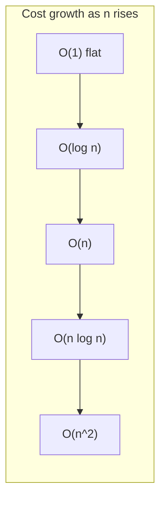
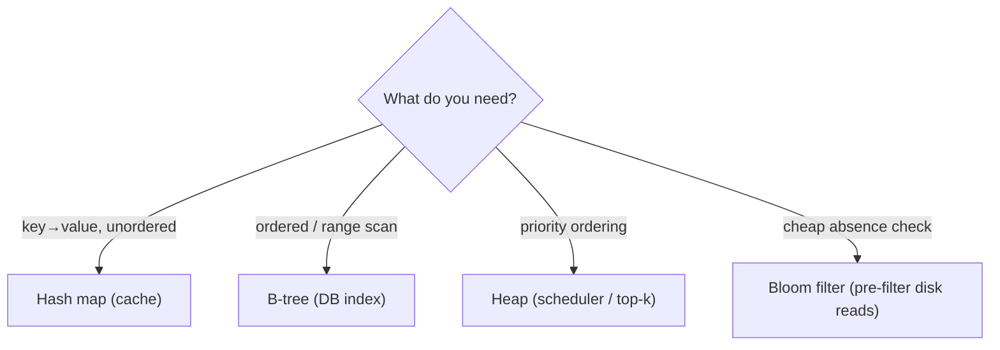

# Complexity & Basic Data Structures

> **Level:** 0 (Prerequisites) · **Prerequisites:** [Computing Fundamentals](00-computing-fundamentals.md)
> **Navigation:** [← Previous: OS & Linux](02-os-linux.md) · [Next → DB Basics](05-db-basics.md)

## Learning objectives

After this chapter you can:

- Use big-O to compare algorithms by how they behave as input grows.
- Choose appropriate basic data structures for common needs and justify the choice.
- Connect data-structure choice to system-design decisions (hash maps in caches, trees in
  indexes, heaps in schedulers).

## Time and space complexity

Big-O describes how an algorithm's cost scales with input size `n`, ignoring constants. It
predicts whether a design *holds up* as data grows, which matters far more than microsecond
gains on small inputs.

| Notation | Name | Feel |
|----------|------|------|
| O(1) | constant | best case; e.g., hash map lookup (amortized) |
| O(log n) | logarithmic | halves work each step; balanced-tree lookup, binary search |
| O(n) | linear | one pass; scanning a list |
| O(n log n) | linearithmic | good sorts; MapReduce shuffle |
| O(n²) | quadratic | nested loops over all pairs — beware at scale |

The crucial skill is **recognizing when a hidden O(n²) or O(n) scan becomes the bottleneck**.
A 1 ms O(n²) operation at n=1,000 becomes minutes at n=1,000,000. At system scale, an
algorithm that worked in a unit test quietly becomes an outage.

## Amortized and worst case

Big-O can hide a worst case. A hash map is O(1) *amortized*, but a rehash is O(n) and a
hash-collision pathological input can degrade lookups. For latency-critical paths, ask about
the *worst* case, not just the average. This is exactly the lesson that recurs in
distributed systems: design for the tail, not the mean.

## Basic data structures and when they fit

| Structure | Lookup | Insert | Use at scale |
|-----------|:------:|:------:|--------------|
| Array / slice | O(n) | O(1) append | buffers, batch payloads |
| Hash map | O(1) avg | O(1) avg | caches, dedup tables, configs |
| Balanced tree (BST/B-tree) | O(log n) | O(log n) | ordered indexes, range scans |
| Heap | O(n) | O(log n) | priority queues, schedulers, top-k |
| Linked list | O(n) | O(1) at ends | LRU caches (with a hash map) |
| Bloom filter | ~O(k) | ~O(k) | cheap "definitely not present" pre-check |

## Why this matters for system design

- **Caches are hash maps with eviction policies**: an LRU cache is a hash map + doubly-linked
  list; capacity and eviction are the design knobs.
- **Database indexes are B-trees (or LSMs)**: understanding O(log n) lookup vs O(n) scan is
  why an index turns a minutes-long table scan into milliseconds (see Level 3).
- **Rate limiters and dedup** use hash maps keyed by client/idempotency key; an O(1) check
  keeps the hot path cheap.
- **Schedulers and top-k** use heaps; a global rate limiter computing the top-k busiest keys
  uses a min-heap of size k.
- **Bloom filters** save expensive disk/network lookups by ruling out absent keys — used in
  Cassandra and CDNs to avoid disk reads for non-existent content.

## Examples

- A leaderboard needs the top 100 scores of millions: a heap of size 100 keeps inserts
  O(log 100) instead of sorting all millions every query.
- A URL shortener's idempotency check: a hash map of recent short-codes is O(1) per request.
- A feed ranking: an O(n log n) sort per user is fine for n=1000 but not for n=10^7; move to
  precomputed or approximate ranking.

## Trade-offs

- **Hash maps**: fast but unordered and memory-hungry; resizing spikes latency.
- **Trees**: ordered and range-friendly, but O(log n) and more pointer chasing (cache misses).
- **Bloom filters**: save lookups but have false positives and cannot delete (counting
  Bloom filters can).

## When NOT to apply a concept here

- Don't reach for a hash map when you need range scans; use a tree/sorted index.
- Don't optimize an O(n) scan that runs once a day on small data; it's fine.
- Don't add a Bloom filter before measuring that absent-key lookups are the actual cost.

## Common mistakes

- Assuming O(1) hash-map operations have no worst case (rehash/collision spikes).
- Using an O(n²) algorithm in a hot path because it was "fast enough" in tests.
- Forgetting eviction policy turns a "cache" into an unbounded memory leak.

## Failure modes and operational concerns

- Hash-collision attacks (adversarial keys) degrade a hash map to O(n); use randomized
  hashing where keys are untrusted.
- Unbounded structures grow until OOM; cap and evict.
- Index choice that helps reads can slow writes (index maintenance cost) — the recurring
  read/write trade-off.

## Review questions

1. An operation is O(n²) and takes 1 ms at n=1,000. Estimate its cost at n=1,000,000.
2. You need ordered iteration with range scans. Array or B-tree? Why?
3. How does an LRU cache combine two data structures, and why?
4. Where would a Bloom filter help a cache layer, and what is its failure mode?
5. Why does "design for the tail" connect to amortized vs worst-case analysis?

## Further reading

- Database indexing builds on B-trees/LSMs: see [DB Basics](05-db-basics.md) and Level 3.

---
[← Previous: OS & Linux](02-os-linux.md) · [Next → DB Basics](05-db-basics.md)
