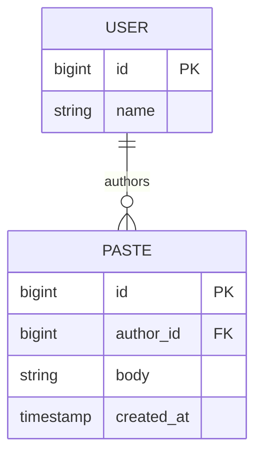
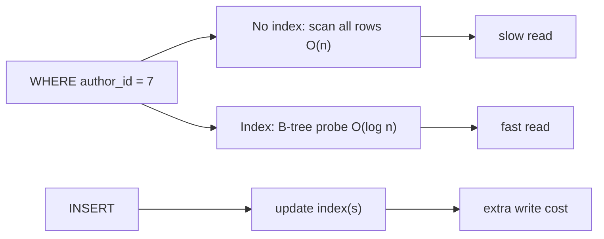

# Basic Database Concepts

> **Level:** 0 (Prerequisites) · **Prerequisites:** [Complexity & Data Structures](03-complexity-data-structures.md)
> **Navigation:** [← Previous: Complexity & Data Structures](03-complexity-data-structures.md) · [Next → Level 1: Requirements](../01-foundations/00-requirements-and-quality-attributes.md)

## Learning objectives

After this chapter you can:

- Describe tables, rows, keys, and relationships at the level needed for design.
- Explain what an index is and why it changes read vs write cost.
- Distinguish a transaction and the ACID guarantees.
- Give a first-pass reason for choosing a database for a workload, deferring deep choice to
  Level 3.

## The relational mental model

A **relational database** stores data in **tables** of **rows** (records) with **columns**
(fields). Each row is identifiable by a **primary key**. Rows in different tables are related
by **foreign keys**. This model is intuitive and keeps data structured, at the cost of
needing joins and schemas.

## Indexes: the read/write dial

An **index** is an auxiliary structure (often a B-tree) that lets the database find rows
matching a column without scanning the whole table. An index turns an O(n) scan into an
O(log n) lookup (see [Complexity & Data Structures](03-complexity-data-structures.md)). The
cost: every write must also update the index, so more indexes speed reads and slow writes —
the central read/write trade-off of storage.

A **query plan** (e.g., via `EXPLAIN`) shows whether a query uses an index or scans. The
single most common performance bug is a missing index on a filtered column; the second is too
many indexes on a write-heavy table.

## Transactions and ACID

A **transaction** groups operations so they either all succeed or none do. **ACID**:

- **Atomicity** — all-or-nothing.
- **Consistency** — moves the database from one valid state to another.
- **Isolation** — concurrent transactions don't interfere as if run serially (in practice,
  levels vary: read-committed, repeatable-read, serializable).
- **Durability** — once committed, the change survives crashes.

ACID is the strong-guarantee end of the consistency spectrum. Many distributed databases
relax isolation or durability-per-ack to gain availability or throughput (Level 4).

## SQL vs NoSQL (first pass)

- **SQL (relational)** — structured, schema-enforced, ACID, joins, great for complex
  relationships and strong consistency.
- **NoSQL** families (key-value, document, column-family, graph) — trade joins/strict
  schemas/ACID for horizontal scaling and flexible schemas.

We defer the detailed comparison to Level 3. For now: don't assume SQL is the default; the
access pattern decides the family.

## Why this matters for system design

Most systems are, at their core, organized around how data is read and written. Picking
the storage and its indexes is often the single most consequential architectural decision.
Later levels build on this: sharding splits a table across nodes; replication copies it;
CDC streams its changes.

## Examples

- A paste service: a table `pastes(id, author_id, body, created_at)` with an index on a
  short-code column for fast resolution; body stored separately if large.
- A leaderboard: a heap or a sorted-set structure (Redis ZSET) rather than a relational table,
  because the access pattern is "top-k by score".
- An audit log: append-only, write-heavy — favoring an LSM or append-optimized store over a
  B-tree that rewrites pages.

## Trade-offs

- **More indexes** = faster reads, slower writes, more storage.
- **Normalization** reduces duplication but requires joins (slower reads at scale); denormalization is the inverse.
- **Stronger isolation** = safer but lower concurrency/throughput.

## When NOT to apply a concept here

- Don't add an index for every column "just in case"; index write cost adds up.
- Don't normalize a high-throughput read path that needs joins; denormalize for reads.
- Don't reach for SQL when the access pattern is a single key→blob lookup; a key-value store
  is simpler and scales further.

## Common mistakes

- Filtering on an unindexed column in a hot query.
- Treating "ACID" as a binary rather than graduated (isolation levels matter).
- Designing the schema before knowing the access pattern.

## Failure modes and operational concerns

- A missing index turns a fast endpoint slow as data grows (the silent scaling killer).
- A long transaction holds locks and blocks other writers.
- Index bloat increases storage and slows writes.

## Review questions

1. Why does adding an index speed a read but slow a write?
2. Restate ACID in your own words and name which property a network partition threatens.
3. When would you prefer a key-value store over a relational table?
4. A query is slow; what is the first thing to check?
5. Why is "design the schema" premature if you don't know the access pattern?

## Further reading

- Storage families, indexing depth, replication, and sharding: Level 3 (`docs/03-data-storage/`).

---
[← Previous: Complexity & Data Structures](03-complexity-data-structures.md) · [Next → Level 1: Requirements](../01-foundations/00-requirements-and-quality-attributes.md)
