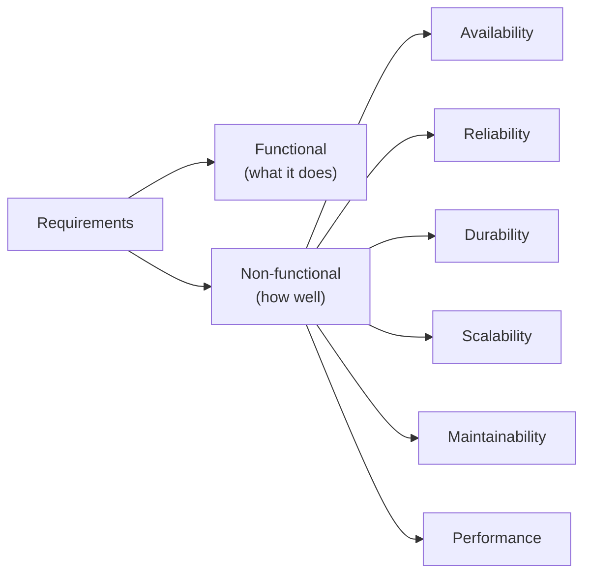
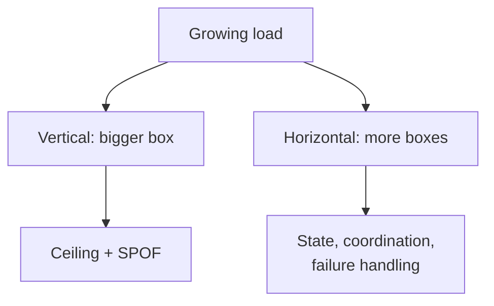
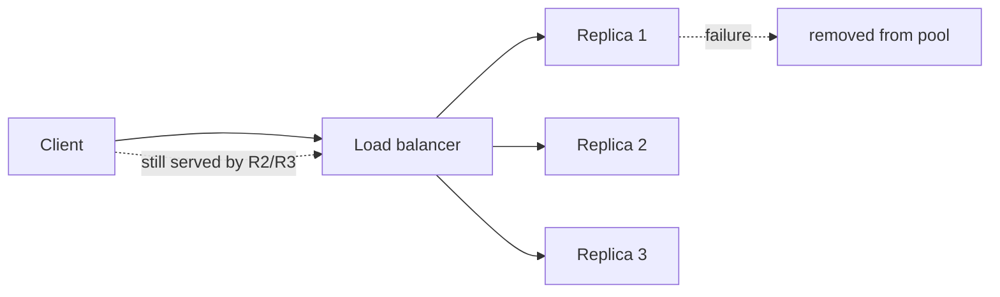

# Requirements & Quality Attributes

> **Level:** 1 (Foundations) · **Prerequisites:** [Level 0](../00-prerequisites/README.md)
> **Navigation:** ← Start of Level 1 · [Next → Capacity Planning](01-capacity-planning.md)

## Learning objectives

After this chapter you can:

- Separate *functional* requirements from *non-functional* requirements and explain why
  confusing them leads to bad designs.
- Translate vague quality words (""fast"", ""reliable"") into measurable quality attributes.
- Identify constraints and assumptions explicitly, instead of letting them hide in
  requirements.
- Reason about availability, reliability, durability, scalability, maintainability, and
  performance as first-class design forces, not adjectives.

## Functional vs non-functional requirements

**Functional requirements** describe what the system *does*: the behaviors, inputs,
outputs, and transformations. ""A user can upload a photo and receive a public URL"" is
functional.

**Non-functional requirements** (often called *quality attributes*) describe *how well* the
system does those things while operating: how fast, how available, how durable, how
observable, how secure. ""The upload URL is returned within 800 ms at p99"" is
non-functional.

The single most common interview and real-world mistake is to gather only functional
requirements and then ""bolt on"" quality attributes late. Quality attributes shape the
architecture; if you decide them after building, you will rebuild.

## A working vocabulary of quality attributes

| Attribute | One-line definition | Example target |
|-----------|--------------------|----------------|
| **Availability** | Fraction of time the system serves correctly | 99.9% (three nines) |
| **Reliability** | Probability the system behaves correctly over time | MTBF; mean time between failures |
| **Durability** | Probability data is not lost once acknowledged | 99.999999999% (11 nines) for object storage |
| **Scalability** | Ability to handle growing load by adding resources | 10x RPS in a year |
| **Maintainability** | Ease of changing and operating the system | Median change ships in <1 day |
| **Performance** | How fast work completes, expressed as latency/throughput | p99 < 300 ms |
| **Latency** | Time for a single operation | p50 / p95 / p99 |
| **Throughput** | Operations per unit time | 20k requests/sec |

## Constraints and assumptions

**Constraints** are non-negotiable facts you must design within: a fixed budget, a region you
cannot leave (data sovereignty), a protocol a partner requires, a deadline. **Assumptions**
are things you believe are true but could be wrong; they should be made explicit and
revisited. A design built on a hidden assumption fails when the assumption breaks.

Example, original to this chapter: designing a paste service.

- *Constraint:* text pastes are plain UTF-8, max 1 MB.
- *Assumption:* 90% of pastes are read fewer than 10 times; writes dominate only during
  spikes. If that assumption is wrong (e.g., a viral paste), the cache strategy must adapt.

## Availability, reliability, durability — they are not the same

- **Availability** is about *serving*. A system can be available but lose data, or be
  unavailable yet keep your data safe.
- **Reliability** is about *correctness over time* — does it produce correct results?
- **Durability** is about *not losing data*. Object-storage services advertise
  ""11 nines"" durability precisely because durability and availability are independent:
  your file may be unreadable for hours (low availability) yet never lost (high durability).

This distinction drives architecture. A banking ledger trades latency to maximize
durability; a real-time ad server trades durability guarantees for latency and availability
of the serving path (with downstream reconciliation).

## Scalability: vertical vs horizontal

- **Vertical scaling** (scale up): bigger machine. Simple, until you hit a ceiling or a
  single point of failure.
- **Horizontal scaling** (scale out): more machines. Requires handling distribution:
  state, coordination, failure. This is where most of the curriculum's difficulty lives.

A common progression: start vertical (fast, simple), then extract the stateless parts and
scale *those* horizontally, leaving a smaller stateful core to handle carefully.

## Stateless vs stateful services

A **stateless service** carries no per-client state in its own memory; any instance can
handle any request. This is what makes horizontal scaling easy and what makes load balancing
trivial. A **stateful service** holds per-client or per-partition state (a database, a
session store, a sharded cache, a websocket gateway) and forces affinity or replication.

Almost all hard distributed-systems problems are about stateful services. Whenever you can
push state out of a service (into a cache, a database, a token), you gain scalability.

## Single points of failure, redundancy, fault tolerance, graceful degradation

- A **single point of failure (SPOF)** is any component whose failure stops the system.
  Eliminate them by **redundancy** — running replicas of the component — and by ensuring
  failover works.
- **Fault tolerance** is the system's ability to keep providing service (possibly reduced)
  despite component failures.
- **Graceful degradation** is deliberately reducing functionality under load instead of
  failing hard: e.g., hide a recommendation panel when its service is slow, but still render
  the page. (We expand this in Level 6.)

## Examples

- A URL shortener: functional requirement = ""shorten a URL and resolve it""; non-functional
  = ""resolve in <50 ms p99, 99.95% availability"". The non-functional target forces a
  cache-heavy, read-optimized design.
- A banking ledger: durability outranks latency, so writes are synchronous and replicated.
- A real-time game leaderboard: latency outranks durability of individual writes, so the
  path is in-memory with periodic snapshots.

## Trade-offs

- Availability vs cost: each ""nine"" roughly multiplies redundancy cost.
- Latency vs durability: synchronous replication buys durability at latency cost.
- Generality vs performance: a generic API gateway costs latency a specialized path avoids.

## When NOT to apply a concept here

- Don't chase ""five nines"" for a feature with low business value; align SLOs to user impact.
- Don't go horizontal before you need to; the operational cost of distribution is real.
- Don't make everything stateful for convenience; it permanently caps horizontal scaling.

## Common mistakes

- Stating ""the system must be fast"" with no percentile or workload definition.
- Forgetting to define the read/write ratio, which changes the entire storage choice.
- Treating availability and durability as synonyms.
- Listing constraints only after the design is done.

## Failure modes and operational concerns

- An unstated assumption becomes wrong under growth (the ""viral paste"" problem).
- Redundancy without failover testing means replicas exist but traffic still dies on the
  primary.
- A stateful service silently becomes the SPOF because no one moved its state out.

## Review questions

1. Give an example where availability and durability pull in opposite directions.
2. Why does horizontal scaling force you to confront state?
3. Name three quality attributes that would change the storage choice for a paste service.
4. Restate ""the system should be reliable"" as a measurable SLO.
5. Why is graceful degradation preferable to a hard failure for a content-heavy page?

## Further reading

- Service-level objectives: S-SLO · Well-Architected reliability: S-WA, S-GCPSRE.

---
← Start of Level 1 · [Next → Capacity Planning](01-capacity-planning.md)
