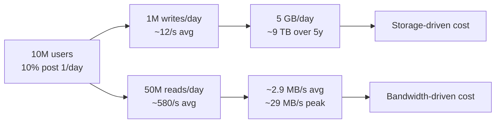

# Capacity Planning

> **Level:** 1 (Foundations) · **Prerequisites:** [Requirements & Quality Attributes](00-requirements-and-quality-attributes.md)
> **Navigation:** [← Previous: Requirements](00-requirements-and-quality-attributes.md) · [Next → Scalability](02-scalability.md)

## Learning objectives

After this chapter you can:

- Estimate requests per second (RPS), storage, and bandwidth from a usage scenario.
- Distinguish read-heavy from write-heavy workloads and predict what they imply.
- Carry a back-of-envelope estimate through to its consequences (cost, machines, headroom).
- Explain why capacity planning is iterative and how headroom/buffers are chosen.

Capacity planning is the skill that turns a vague product idea into a concrete architecture.
The numbers do not need to be exact; they need to be the *right order of magnitude* so the
shape of the system is correct.

## The four estimates

A capacity estimate usually computes four things:

1. **Requests per second (RPS)** — how much work per unit time.
2. **Storage** — how much durable data accumulates.
3. **Bandwidth** — how much data moves in and out per second.
4. **Compute** — how much CPU/memory/machines that implies (rough).

Each estimate feeds the next. Storage × retention gives growth; growth + access patterns
gives bandwidth; bandwidth + RPS gives compute.

## A worked example (original to this chapter)

Imagine a paste service: users create text pastes and read them via short URLs.

**Assumptions (stated explicitly):**
- 10 million users; 10% create one paste per day → **1 million writes/day**.
- Each new paste is read, on average, 50 times (assume viral-ish) → **50 million reads/day**.
- Average paste size 5 KB (plain text, occasional code snippet).
- Pastes are retained for 5 years.

**RPS:**
- Writes: 1,000,000 / 86,400 ≈ **12 writes/s** (≈ **120/s peak** at 10× daily average).
- Reads: 50,000,000 / 86,400 ≈ **580 reads/s** (≈ **5,800/s peak**).
- Total ≈ **~600/s average, ~6,000/s peak**. A read-heavy workload (~50:1 read:write).

**Storage:**
- New data/day = 1,000,000 × 5 KB = 5,000,000 KB = **~5 GB/day**.
- Over 5 years (≈ 1,826 days) ≈ **~9.1 TB** of paste content, plus indexes/metadata.
- Metadata (author, timestamp, visibility, short code) ~200 bytes/paste → ~183 GB over 5
  years — small relative to content but stored separately for indexing.

**Bandwidth:**
- Write bandwidth = 12/s × 5 KB = **~60 KB/s** (trivial).
- Read bandwidth = 580/s × 5 KB = **~2.9 MB/s** average, **~29 MB/s peak**.
- Still modest; the dominant cost is storage growth, not bandwidth, *until* a paste goes
  viral and a single paste drives millions of reads in an hour.

**Compute (rough):**
- If one read-optimized server handles ~5,000 reads/s, peak ~6,000/s needs ~2 servers + 1
  for failover. Writes are light. The cache layer matters far more than raw compute.

The point of this exercise is not the exact number; it is that this workload is **storage-
and-cache bound, not compute-bound**, and **read-heavy**, which points toward a CDN + cache
design rather than a write-heavy sharded-database design.

## Read-heavy vs write-heavy

| Trait | Read-heavy | Write-heavy |
|-------|-----------|-------------|
| Example | Paste service, news feed, search | Telemetry, logging, payments |
| Optimization | Caching, replicas, CDN | Partitioning, append-only storage, batching |
| Risk | Cache stampede on hot keys | Hot shard, write amplification |
| Scaling move | Add read replicas + cache | Shard writes, use leaderless/LSM stores |

Mis-identifying the read/write ratio is a classic error: people build for the rare write
path and under-provision the cheap, common read path (or vice versa).

## Vertical vs horizontal, revisited with numbers

Capacity estimates tell you *when* horizontal scaling becomes necessary:

- If a single database node handles 5k writes/s and you project 12k writes/s in a year, you
  must shard (or partition) before then — ideally with headroom.
- If a single cache node serves 50k reads/s and you project 60k, you add replicas, not
  re-architect.

**Headroom / buffers**: operate below capacity. A common rule of thumb is to size for ~70%
utilization at peak so spikes and a single-node failure (which redistributes load ~33%
higher with 3 nodes) do not tip into overload. The exact buffer is a reliability/cost
trade-off (see Level 6).

## Storage growth and lifecycle

Not all data needs the same storage tier:

- **Hot** — recent, frequently accessed; on fast SSD or in-memory cache.
- **Warm** — older, occasionally accessed; on standard storage.
- **Cold** — rarely accessed; on cheap object storage, possibly compressed.

For the paste service, a paste's first hour after creation is hot (drives most reads); after
a week it is cold. Moving cold pastes to cheaper storage dramatically cuts cost at scale.
This is **data lifecycle management** (covered fully in Level 3).

## Latency, throughput, and the difference

- **Throughput** is work per second; **latency** is the time for one operation.
- A system can have high throughput and terrible latency (batch everything, respond slowly
  per item) or low throughput and great latency (one at a time, fast).
- Users feel *latency percentiles* (p50, p95, p99), not averages. Tail latency dominates
  perceived performance, and p99 grows faster than p50 as load rises.

## Trade-offs

- Estimating high (over-provisioning) costs money; estimating low causes outages. Bias
  toward headroom on the user-facing path and toward cost optimization on cold paths.
- Caching reduces read cost but introduces consistency and invalidation complexity.
- Choosing object storage over a database cuts cost but loses queryability and indexing.

## When NOT to apply a concept here

- Don't shard for capacity before you've estimated — you may not need it yet, and sharding
  is expensive to undo.
- Don't cache everything; cold data in a cache wastes the very resource caches are for.
- Don't average latency to users; design for the tail.

## Common mistakes

- Estimating peak as 2× average; real products see 10–50× spikes on viral events.
- Forgetting metadata/index size, which can exceed the data it indexes.
- Computing storage without retention — ""9 TB today"" is meaningless without the horizon.
- Sizing for steady state and forgetting the failure mode (one node down → others overload).

## Failure modes and operational concerns

- A single viral key causes a cache stampede even when aggregate RPS is fine.
- Storage growth surprises teams that never set a retention policy.
- Bandwidth egress becomes a dominant cloud cost; co-locating compute with data and using
  CDN/edge reduces it.

## Review questions

1. Re-estimate the paste example assuming 100 reads/paste and a 10-year retention. What
   changes?
2. Identify the read/write ratio for a logging platform and name the storage class it
   implies.
3. Why does p99 matter more than average for a user-facing API?
4. You project 8k writes/s next year and one node handles 5k. What do you do, and when?
5. Why does moving cold data to object storage help both cost *and* hot-path latency?

## Further reading

- Storage tiers and lifecycle: S-WA, S-AZUREWA · SLOs and error budgets: S-SLO.
- The calculations worksheet for this chapter: [calculations/capacity-estimation-worksheet.md](../../calculations/capacity-estimation-worksheet.md).

---
[← Previous: Requirements](00-requirements-and-quality-attributes.md) · [Next → Scalability](02-scalability.md)
