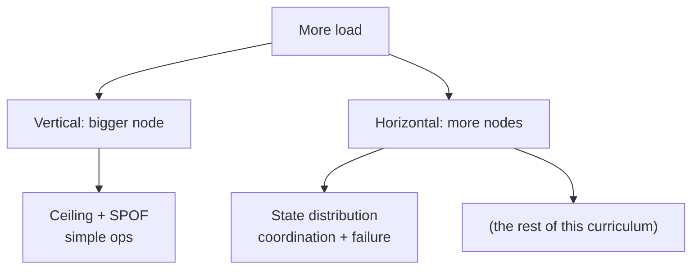
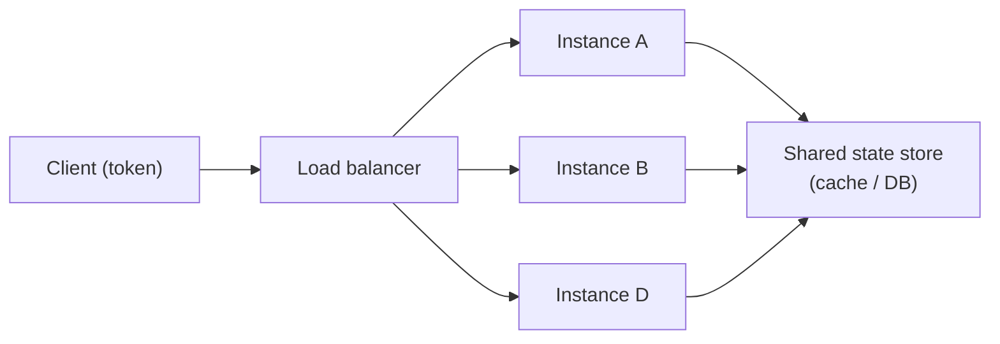
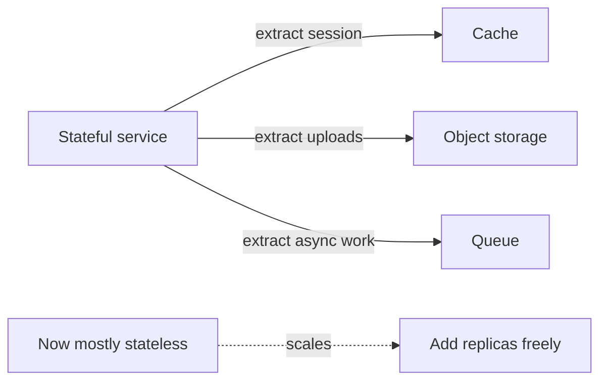

# Scalability: Stateless vs Stateful

> **Level:** 1 (Foundations) · **Prerequisites:** [Capacity Planning](01-capacity-planning.md)
> **Navigation:** [← Previous: Capacity Planning](01-capacity-planning.md) · [Next → Redundancy & Fault Tolerance](03-redundancy-fault-tolerance.md)

## Learning objectives

After this chapter you can:

- Distinguish vertical from horizontal scaling and the operational cost of each.
- Explain why stateless services scale horizontally "for free" and stateful ones do not.
- Move state out of a service to unlock horizontal scaling, naming the trade-offs.

## Vertical vs horizontal scaling (recap with consequences)

- **Vertical (scale up)**: a bigger machine. Simple, but bounded by the largest available
  box and by the single point of failure it creates. Cost grows super-linearly with size.
- **Horizontal (scale out)**: more machines. Unbounded in principle, but forces you to solve
  distribution: where does state live, how do requests reach the right data, how do parts
  that fail independently stay consistent.

A common evolution: start vertical to ship fast, then extract the stateless parts and scale
*those* horizontally, leaving a small stateful core to handle deliberately.

## Stateless services

A **stateless service** keeps no per-client state in its own memory. Any instance can serve
any request, so a load balancer can round-robin freely and autoscaling is trivial: add
instances when load rises, remove when it falls. Session data, if needed, is stored
externally (a cache or database) and referenced by a token.

This is why the industry default for service tiers (APIs, gateways, renderers) is
stateless + external store: it is the cheapest path to horizontal scaling.

## Stateful services

A **stateful service** holds per-client or per-partition state in process or on local disk:
a database, a session store, a sharded cache, a websocket gateway maintaining connections.
Scaling it horizontally is hard because:

- Requests for a given piece of data must reach the node that owns it (**affinity** /
  partitioning), or the data must be **replicated** to all nodes.
- Failure of one node loses its data unless replicated, so stateful tiers need replication
  and failover.
- Adding/removing nodes requires **rebalancing** (moving data between nodes).

Almost every difficult distributed-systems problem in this curriculum is about a stateful
tier. The pragmatic move is to *minimize* how much of your system is stateful.

## Pushing state out of a service

To make a service stateless, externalize its state:

| State type | Externalize to |
|-----------|---------------|
| User session | cache (Redis) or token + store |
| Per-connection | websocket gateway (unavoidably stateful) |
| In-progress uploads | object storage with multipart handles |
| Per-request work | queue, not in-process memory |

Each externalization buys scalability but adds a dependency and a network hop. The trade is
usually worth it on the hot path.

## When a service *must* be stateful

Some functions are intrinsically stateful: databases, caches that own their keys, websocket/
long-poll gateways, stream processors with keyed state. Don't fight it; instead partition the
state (shard by key) and replicate each shard. The rest of the curriculum (Levels 3–4) is
largely about doing this well.

## Examples

- A stateless API tier behind a load balancer scales by adding pods; a stateful websocket
  gateway must either sticky-route by connection or replicate presence data.
- Moving user sessions from in-process memory to Redis converts a stateful API into a
  stateless one (with a Redis dependency).
- A photo service: the upload API is stateless; the metadata DB and object storage are the
  stateful core, scaled via sharding/replication rather than more stateless instances.

## Trade-offs

- **Externalizing state** trades in-process speed for a network hop and a new dependency
  (availability of the store now bounds the service).
- **More replicas** add availability but also coordination and consistency cost.
- **Partitioning** removes a node's bottleneck but introduces hot-shard and rebalancing
  problems.

## When NOT to apply a concept here

- Don't externalize state before you need to scale; a single in-process cache is fine and
  fast for a small service.
- Don't make everything stateless at the cost of correctness; some operations genuinely need
  local state (transactions, keyed stream processing).
- Don't horizontally scale a service that is bottlenecked on a single shared database — you
  just add waiters to the same bottleneck.

## Common mistakes

- Storing session state in process and then being unable to scale or drain.
- Adding replicas of a stateless service while the stateful DB behind it stays the SPOF.
- Forgetting that externalizing state makes the new store a critical dependency to SLO.

## Failure modes and operational concerns

- A ""stateless"" service that secretly caches data per instance causes inconsistent views
  across replicas (split-brain of the cache).
- Stateful tier failure without tested failover = data loss or downtime.
- Rebalancing a sharded stateful tier can saturate the network if not throttled.

## Review questions

1. Why does a stateless tier autoscale trivially while a stateful one does not?
2. Name three kinds of state you would externalize and where each goes.
3. What hidden dependency do you accept when you move sessions to Redis?
4. Why does adding stateless replicas not fix a single-sharded-database bottleneck?
5. Give an example of a service that *should* stay stateful.

## Further reading

- Stateful scaling mechanics: sharding/replication in Level 3; consistency/failover in
  Level 4; autoscaling in Level 9.

---
[← Previous: Capacity Planning](01-capacity-planning.md) · [Next → Redundancy & Fault Tolerance](03-redundancy-fault-tolerance.md)
